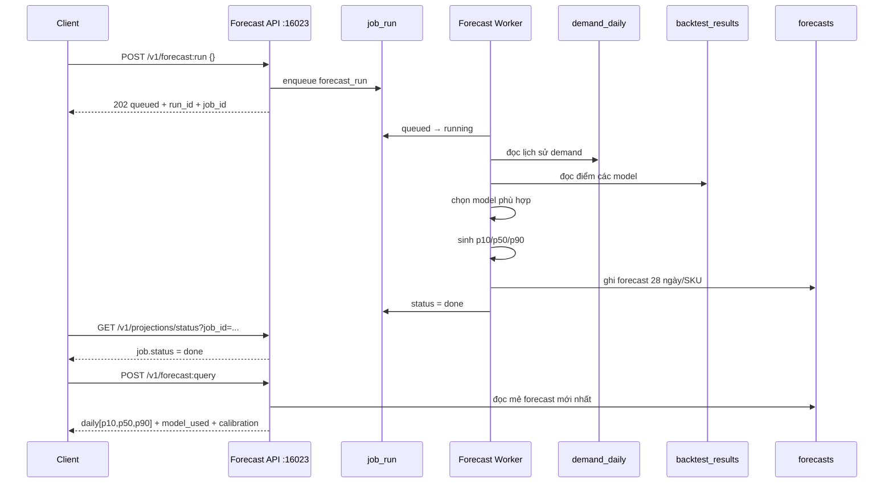
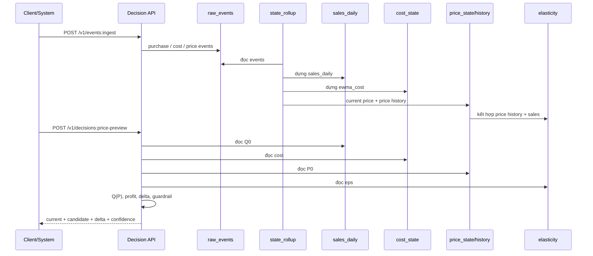
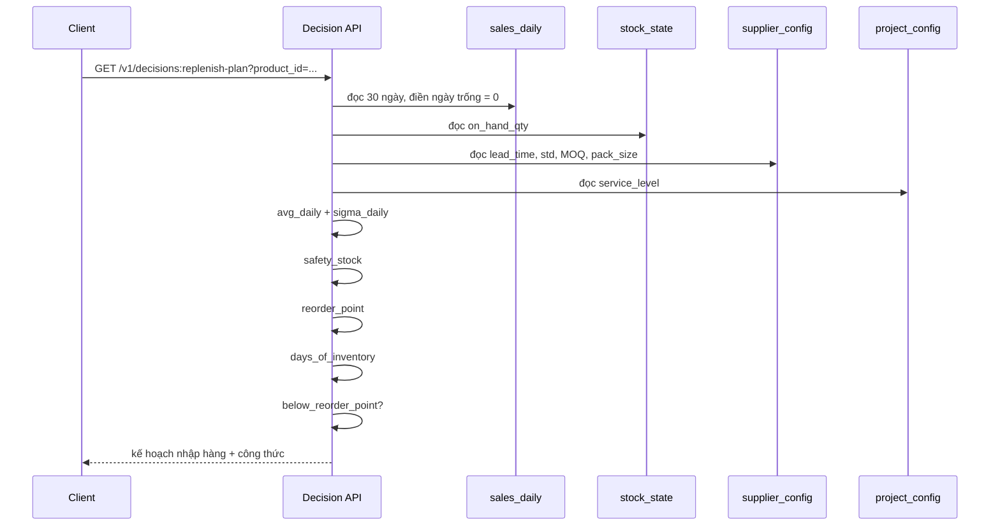
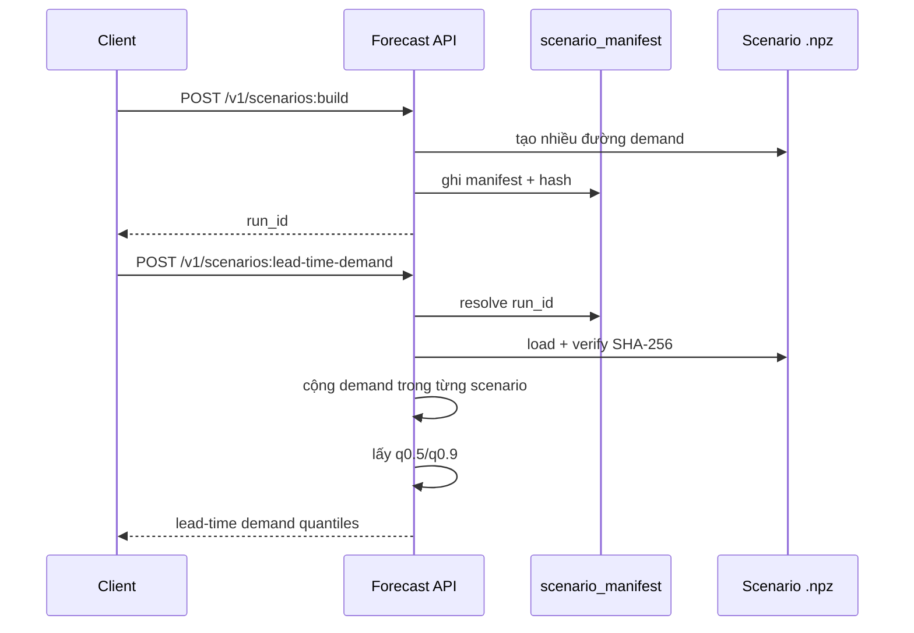
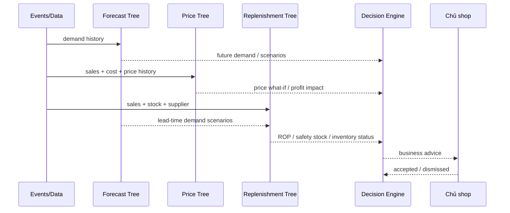

# HƯỚNG DẪN 3 CÂY NGHIỆP VỤ: FORECAST — PRICE — REPLENISHMENT

> Tài liệu học theo **mạch nghiệp vụ**, dựa trên `DEMO-2-SAN-PHAM-CU-2026-08-07.md`.
>
> Mục tiêu: không học API như các JSON rời rạc. Luôn đi theo mạch:
>
> **Dữ liệu nào đi vào? → thuật toán làm gì? → API trả gì? → con số đó giúp quyết định gì?**

---

# 0. BẢN ĐỒ TỔNG THỂ

Ba cây giải ba câu hỏi khác nhau:

```text
CÂY 1 — FORECAST
"TƯƠNG LAI SẼ BÁN BAO NHIÊU?"
        ↓
demand history
        ↓
forecast model
        ↓
p10 / p50 / p90
```

```text
CÂY 2 — PRICE
"NẾU ĐỔI GIÁ THÌ CHUYỆN GÌ XẢY RA?"
        ↓
sales + cost + current price + elasticity
        ↓
thử candidate_price
        ↓
demand mới + profit mới
```

```text
CÂY 3 — REPLENISHMENT
"KHI NÀO NHẬP? NHẬP BAO NHIÊU?"
        ↓
sales + stock + supplier lead time + service level
        ↓
safety stock + reorder point
        ↓
so với tồn hiện tại
```

Cuối cùng ba cây có thể cung cấp dữ liệu cho **Decision Engine**:

```text
FORECAST
   +
PRICE
   +
REPLENISHMENT
   ↓
DECISION ENGINE
   ↓
"VẬY BÂY GIỜ NÊN LÀM GÌ?"
```

---

# PHẦN I — CÂY 1: FORECAST

# 1. Câu hỏi nghiệp vụ

> **"Tương lai SKU này / nhóm SKU này có thể bán bao nhiêu?"**

Forecast không nên trả một con số duy nhất vì tương lai có bất định.

Nó trả một **dải nhu cầu**:

```text
thấp             trung tâm                cao
 │                   │                     │
p10                 p50                   p90
```

Cách nhớ:

- `p10`: kịch bản nhu cầu thấp.
- `p50`: **trung vị / mức trung tâm**, không nhất thiết là trung bình số học.
- `p90`: kịch bản nhu cầu cao.

Ví dụ:

```text
Ngày 13/08
p10 = 1.65
p50 = 3.93
p90 = 7.69
```

Đọc:

> "Ngày 13/08, nhu cầu thấp khoảng 1,65; mức trung tâm khoảng 3,93; kịch bản cao khoảng 7,69 đơn vị."

Không được đọc `p90 = model chính xác 90%`.

---

# 2. Cây Forecast

```text
                         FORECAST SERVICE
                              16023
                                 │
                                 ▼
                     DỮ LIỆU BÁN LỊCH SỬ
                       purchase.completed
                                 │
                                 ▼
                           demand_daily
                                 │
                                 ▼
                     [11] POST forecast:run
                                 │
                                 ▼
                          MODEL ENGINE
                                 │
                    backtest + model routing
                                 │
                                 ▼
                            forecasts
                      p10 / p50 / p90
                                 │
              ┌──────────────────┼──────────────────┐
              ▼                  ▼                  ▼
            [13]               [14]               [15]
       forecast:query     forecast:aggregate   forecast:accuracy
              │
              ├──────────────► [16] forecast:insights
              │
              ├──────────────► [17] promo-preview
              │
              └──────────────► [18] scenarios:build
                                      │
                              ┌───────┼───────┐
                              ▼       ▼       ▼
                            [19]    [20]    [21]
                         lead-time  aggregate probability
                          demand
```

---

# 3. Sequence diagram — Forecast cơ bản



---

# 4. [11] POST `/v1/forecast:run`

## Dùng để làm gì?

> **Ra lệnh tính lại forecast cho toàn bộ shop.**

Đây là API **kích job bất đồng bộ**, không phải API trả forecast ngay.

## Input

```json
{}
```

Không chọn từng SKU.

## Output ví dụ

```json
{
  "status": "queued",
  "run_id": "r_2026-08-13",
  "job_id": "fr-demoshop-r_2026-08-13"
}
```

HTTP:

```text
202 Accepted
```

## Cách đọc

```text
status = queued
→ hệ đã nhận việc
→ CHƯA có nghĩa forecast đã xong

run_id
→ tên mẻ forecast

job_id
→ mã công việc để theo dõi ở [12]
```

Mental model:

```text
[11]
"hãy tính forecast"
      ↓
202
"đã nhận việc"
      ↓
[12]
"đã xong chưa?"
```

---

# 5. Model Engine làm gì?

```text
demand_daily
    ↓
đánh giá lượng dữ liệu / loại demand
    ↓
đọc backtest
    ↓
chọn model phù hợp
    ↓
sinh forecast
    ↓
ép bất biến:
0 ≤ p10 ≤ p50 ≤ p90
    ↓
ghi forecasts
```

Bậc thang dễ nhớ trong tài liệu:

```text
0 ngày data
→ cold_start_analog

21 ngày
→ seasonal_naive

~132 ngày
→ lgbm_global
```

Ý nghĩa:

> **Dữ liệu ít thì không dùng model quá phức tạp; đủ dữ liệu mới nâng model.**

DEMO-2 Hảo Hảo có hơn 4 tháng lịch sử nên dùng:

```text
model_used = lgbm_global
```

---

# 6. [12] GET `/v1/projections/status`

## Dùng để làm gì?

Có hai câu hỏi khác nhau:

```text
1. Job tôi đặt chạy xong chưa?
2. Projection đã theo kịp ledger chưa?
```

## Input

```text
GET /v1/projections/status?job_id=fr-demoshop-r_2026-08-13
```

## Output quan trọng

```text
job.status:
queued
running
done
failed
```

và:

```text
is_caught_up
projection_watermark
ledger_head
```

## Cách đọc

```text
job.status = done
→ job forecast đã xong

is_caught_up = true
→ projection hiện tại đã bắt kịp sổ cái chung
```

---

# 7. [13] POST `/v1/forecast:query`

## Đây là API forecast chính

Câu hỏi:

> **"14 ngày tới Hảo Hảo có thể bán bao nhiêu mỗi ngày?"**

## Input

```json
{
  "product_id": "bh-mi-haohao",
  "horizon_days": 14
}
```

Các input tài liệu hỗ trợ:

```text
product_id      bắt buộc
horizon_days    1..56, mặc định 14
quantiles       chỉ nhận thêm 0.95 / 0.99
granularity     daily / weekly / monthly
```

## Output ví dụ DEMO-2

```text
run_id      = r_2026-08-12
model_used  = lgbm_global
data_window = 2026-04-01..2026-08-11

calibration:
width_factor       = 1.2004
empirical_coverage = 0.7143

13/08:
p10 = 1.65
p50 = 3.93
p90 = 7.69

14/08:
p10 = 1.59
p50 = 4.19
p90 = 7.59

15/08:
p10 = 1.42
p50 = 5.09
p90 = 8.25
```

## Đọc thành tiếng Việt

> "Hảo Hảo có lịch sử đủ dài nên hệ dùng `lgbm_global`. Mô hình học từ dữ liệu đã chốt từ 01/04 tới 11/08. Ngày 13/08 mức trung tâm khoảng 3,93; kịch bản thấp khoảng 1,65; kịch bản cao khoảng 7,69."

## `calibration` nghĩa là gì?

```text
empirical_coverage = 0.7143
```

Khoảng `[p10,p90]` khi kiểm lại lịch sử chỉ bao được khoảng 71,43% thực tế, trong khi mục tiêu của dải P10-P90 gần 80%.

Vì vậy:

```text
width_factor ≈ 1.20
```

→ hệ tự nới khoảng khoảng 20%.

---

# 8. [14] POST `/v1/forecast:aggregate`

## Câu hỏi

> **"Cả ngành Bách hóa 7 ngày tới bán bao nhiêu?"**

```text
[13] → 1 SKU
[14] → nhiều SKU / ngành
```

## Input ví dụ

```json
{
  "category_l1": "Bách hóa",
  "horizon_days": 7
}
```

Có thể chọn phạm vi theo đúng một cách:

```text
product_ids
hoặc category_l1
hoặc categories_prefix
```

## Response quan trọng

```text
scope.product_ids_count
scope.resolved_product_ids
sku_count
skipped_no_forecast

totals:
  p10
  p50
  p90

method = triangular_mc_2000
```

## Tại sao không cộng p90 từng SKU?

Sai:

```text
SKU A p90 = 10
SKU B p90 = 10
SKU C p90 = 10

=> p90 tổng = 30   ❌
```

Cách đúng:

```text
mô phỏng thế giới #1
A + B + C → total_1

mô phỏng thế giới #2
A + B + C → total_2

...

2000 thế giới
→ 2000 tổng
→ sort
→ lấy p10/p50/p90
```

---

# 9. [15] GET `/v1/forecast:accuracy`

## Câu hỏi

> **"Forecast của máy có thực sự tốt không?"**

## Input

```text
window=7d | 30d | 90d
```

Ví dụ:

```text
GET /v1/forecast:accuracy?window=90d
```

## Output mẫu

```text
lgbm_global
segment = intermittent
sku_count = 74
mase_avg = 0.782
coverage_p10_p90 = 0.844
```

## MASE

```text
MASE = 1  → ngang naive baseline
MASE < 1  → tốt hơn baseline
MASE > 1  → tệ hơn baseline
```

`MASE = 0.782` có thể hiểu đơn giản là sai số thấp hơn baseline khoảng 21,8%.

## Coverage

```text
coverage P10-P90
mục tiêu ≈ 0.80
```

`0.844` khá gần đích.

`0.943` không nhất thiết tốt hơn; có thể nghĩa khoảng dự báo quá rộng.

---

# 10. [16] POST `/v1/forecast:insights`

Một cửa cho 6 câu hỏi:

```text
accuracy_sku
→ SKU này forecast trúng không?

top_movers
→ SKU nào sắp bán mạnh?

group_breakdown
→ SKU nào đóng góp lớn trong nhóm?

seasonality
→ thứ/ngày/tháng nào cao?

sell_through_prob
→ xác suất bán hết N cái?

promo_uplift_learned
→ promo trước đây tăng demand bao nhiêu?
```

Đây là **analytics trên dữ liệu forecast**.

---

# 11. [17] POST `/v1/forecast:promo-preview`

## Câu hỏi

> **"Nếu giảm giá 30% trong tương lai thì demand tăng bao nhiêu?"**

## Input

```json
{
  "product_id": "bh-mi-haohao",
  "discount_pct": 30,
  "start": "2026-08-16",
  "end": "2026-08-23"
}
```

## Algorithm

```text
uplift_factor
=
1 + k × discount
```

DEMO-2:

```text
k ≈ 0.947
discount = 0.30

factor
= 1 + 0.947 × 0.30
≈ 1.2841
```

→ demand trong ngày promo tăng khoảng 28,4% so với baseline.

## Output quan trọng

```text
baseline_daily[]
daily[]
uplift_k
uplift_factor
model_used
persisted = false
```

`persisted=false` nghĩa là:

> **Đây là kịch bản giả định, không ghi đè forecast chính thức.**

---

# 12. [18] POST `/v1/scenarios:build`

## Tại sao cần Scenario?

P10/P50/P90 chỉ là ba điểm trên phân phối.

Một số câu hỏi cần nhiều thế giới có thể xảy ra:

```text
"xác suất bán >= 30 là bao nhiêu?"
"q90 tổng demand trong lead time là bao nhiêu?"
```

## Input

```json
{
  "product_ids": ["bh-mi-haohao"],
  "horizon_days": 7,
  "scenario_count": 128
}
```

## Output khái quát

```text
run_id = sc_...

manifest:
  scenario_count = 128
  horizon_days = 7
  rng_algorithm = philox
  demand_class = intermittent
  files + SHA-256
```

Hảo Hảo trong DEMO-2 được phân loại `intermittent`.

Mental model:

```text
Forecast distribution
       ↓
Scenario #1: 4, 0, 6, 3, 8, ...
Scenario #2: 1, 2, 1, 9, 3, ...
Scenario #3: ...
       ↓
128 thế giới
```

---

# 13. [19] POST `/v1/scenarios:lead-time-demand`

## Câu hỏi

> **"Trong lúc chờ hàng về, cộng thời gian tới lần kiểm kho tiếp theo, tôi phải chịu được bao nhiêu demand?"**

## Input

```json
{
  "product_ids": ["bh-mi-haohao"],
  "run_id": "sc_...",
  "lead_time_days": 3,
  "review_period_days": 2,
  "required_quantiles": [0.5, 0.9]
}
```

Cửa sổ:

```text
3 ngày lead time
+
2 ngày review period
=
5 ngày
```

## Algorithm

```text
scenario #1 → tổng demand 5 ngày = LTD_1
scenario #2 → tổng demand 5 ngày = LTD_2
...
scenario #128 → LTD_128

sort
↓
q0.5
q0.9
```

## Output

```text
quantiles:
  "0.5": ...
  "0.9": ...

mean
scenario_count
sku_count
run_id
```

Cách đọc:

```text
q0.5 → nhu cầu trung tâm trong cửa sổ bảo vệ
q0.9 → mức bảo vệ cao hơn
```

---

# 14. [20] POST `/v1/scenarios:aggregate`

Câu hỏi:

> **"Trong 7 ngày, tổng demand nhóm SKU là bao nhiêu theo scenario?"**

Output:

```text
totals:
  p10
  p50
  p90
  mean

method = scenario_mc_128
```

Khác `[14]`:

```text
[14]
→ dùng 3 quantile/ngày + mô phỏng tam giác

[20]
→ dùng scenario artifact đầy đủ
```

---

# 15. [21] POST `/v1/scenarios:probability`

## Câu hỏi

> **"Nếu tôi nhập 30 thùng, xác suất bán được ít nhất 30 trong 7 ngày là bao nhiêu?"**

## Input

```json
{
  "product_id": "bh-mi-haohao",
  "threshold_units": 30,
  "horizon_days": 7,
  "run_id": "sc_..."
}
```

## Algorithm

```text
for each scenario:
    total = sum(demand 7 ngày)

probability
=
count(total >= 30) / scenario_count
```

Ví dụ minh họa trong tài liệu:

```text
54 scenario đạt >= 30
trên 128 scenario

probability ≈ 0.42
```

---

# 16. Tóm tắt cây Forecast

```text
purchase history
      ↓
demand_daily
      ↓
[11] chạy model
      ↓
forecasts
      ↓
[13] một SKU bán bao nhiêu?
[14] cả nhóm bán bao nhiêu?
[15] model có tốt không?
      ↓
[16] business insights
[17] promo what-if
      ↓
[18] dựng nhiều thế giới
      ↓
[19] demand trong lead time?
[20] tổng demand?
[21] xác suất vượt ngưỡng?
```

---

# PHẦN II — CÂY 2: PRICE

# 17. Câu hỏi nghiệp vụ

> **"Nếu tôi đổi giá bán, lượng bán và lợi nhuận sẽ thay đổi thế nào?"**

Đây không phải bài toán "tại sao bán chậm".

Nó là bài toán **what-if**:

```text
Giá hiện tại = P0
↓
thử giá mới = P1
↓
demand phản ứng thế nào?
↓
profit phản ứng thế nào?
```

---

# 18. Cây Price

```text
                            PRICE TREE
                   "Nếu đổi giá thì sao?"
                              │
        ┌─────────────────────┼─────────────────────┐
        ▼                     ▼                     ▼
    sales_daily           cost_state           price_history
        │                 ewma_cost                 │
        │                                           ▼
        │                                      elasticity
        │                                  eps / n / r² / method
        │                     │                     │
        └─────────────────────┼─────────────────────┘
                              ▼
              [28] POST /v1/decisions:price-preview
                              │
                       candidate_price
                              │
                              ▼
                  Q(P)=Q0×(P/P0)^eps
                              │
                 ┌────────────┴────────────┐
                 ▼                         ▼
           est_units_30d             est_profit_30d
                 │                         │
                 └────────────┬────────────┘
                              ▼
                     delta_profit_30d
                              │
                              ▼
                         guardrails
                              │
                    BELOW_COST PASS/FAIL
```

---

# 19. Sequence diagram — Price



---

# 20. [23] `events:ingest` — dữ liệu đầu vào cho Price

Các nguồn:

```text
purchase.completed
→ sales_daily

cost.recorded
→ cost_state.ewma_cost

price.changed
→ price_state.current_price
→ price_history
```

Ví dụ cost event:

```json
{
  "event_type": "cost.recorded",
  "payload": {
    "product_id": "bh-mi-haohao",
    "unit_cost": 69500,
    "qty": 50
  }
}
```

Tại sao cần `price_history`?

```text
giá từng thay đổi
↓
sales phản ứng
↓
ước lượng elasticity
```

---

# 21. Elasticity — độ co giãn theo giá

DEMO-2:

```text
eps = -0.4641
n_points = 132
r² ≈ 0.417
method = ols_daily
```

## `eps < 0`

Hiểu đơn giản:

```text
giá giảm → demand có xu hướng tăng
giá tăng → demand có xu hướng giảm
```

## `n_points = 132`

Số điểm dữ liệu dùng để ước lượng.

## `r²`

Là chỉ số độ khớp của hồi quy; **không phải % chính xác**.

## `method = ols_daily`

Elasticity được ước lượng riêng cho SKU này.

Khác hàng mới:

```text
pooled_prior
→ mượn elasticity trung bình shop
```

---

# 22. [28] POST `/v1/decisions:price-preview`

## Input

```json
{
  "product_id": "bh-mi-haohao",
  "candidate_price": 99000
}
```

`candidate_price` phải > 0.

API tính trên cửa sổ 30 ngày cố định.

---

# 23. Algorithm của Price Preview

```text
Q(P)
=
Q0 × (P / P0)^eps
```

Trong đó:

```text
P0  = giá hiện tại
P   = giá thử
Q0  = lượng bán baseline 30 ngày
eps = elasticity
```

Lợi nhuận:

```text
profit(P)
=
(P - cost) × Q(P)
```

Chênh lệch:

```text
delta_profit
=
profit(candidate)
-
profit(current)
```

---

# 24. Ví dụ DEMO-2 — Hảo Hảo

```text
P0 = 112.000
P1 = 99.000
cost ≈ 70.145
Q0 = 171 / 30 ngày
eps = -0.4641
```

### Demand mới

```text
Q1
=
171 × (99.000 / 112.000)^(-0.4641)
≈ 181.08
```

### Profit hiện tại

```text
(112.000 - 70.145) × 171
≈ 7.157.261
```

### Profit giá mới

```text
(99.000 - 70.145) × 181.08
≈ 5.225.041
```

### Delta

```text
5.225.041 - 7.157.261
≈ -1.932.220
```

Kết luận:

> **Giảm giá giúp bán thêm, nhưng lợi nhuận tháng giảm khoảng 1,93 triệu.**

---

# 25. Response thực tế của Price Preview

```json
{
  "current": {
    "price": 112000.0,
    "est_units_30d": 171.0,
    "est_profit_30d": 7157260.66
  },
  "candidate": {
    "price": 99000,
    "est_units_30d": 181.08,
    "est_profit_30d": 5225040.83
  },
  "delta_profit_30d": -1932220,
  "elasticity_used": {
    "eps": -0.4641,
    "method": "ols_daily",
    "n_points": 132,
    "r2": 0.4172
  },
  "guardrails": [
    {"code": "BELOW_COST", "status": "PASS"}
  ],
  "confidence": 0.9,
  "explanation": "Q(P)=Q0·(P/P0)^eps; profit=(P-c)·Q"
}
```

---

# 26. Cách đọc response Price

```text
current
→ nếu giữ giá hiện tại thì sao?

candidate
→ nếu dùng giá thử thì sao?

delta_profit_30d
→ lời tăng hay giảm bao nhiêu?

elasticity_used
→ dùng elasticity từ đâu?

guardrails
→ có vi phạm chốt an toàn không?

confidence
→ mức tin theo nguồn/method elasticity
```

`confidence=0.9` **không có nghĩa 90% xác suất recommendation đúng**.

---

# 27. Case giá dưới vốn

Thử:

```text
candidate_price = 50.000
cost ≈ 70.145
```

Response:

```text
HTTP 200
BELOW_COST = FAIL
```

Đọc:

> "Tôi đủ dữ liệu để tính. Giá 50.000 thấp hơn vốn, nên kết quả là đừng làm."

Phân biệt:

```text
412
→ KHÔNG ĐỦ dữ liệu để trả lời

200 + FAIL
→ ĐỦ dữ liệu, và câu trả lời là ĐỪNG
```

---

# 28. Price Preview và Decision Engine khác nhau

```text
[28] price-preview
→ what-if calculator
→ KHÔNG ghi decision
```

```text
[24] decisions:run
→ bộ não ra lời khuyên thật
→ xét nhiều nguồn + guardrails + conflict
→ ghi decisions
```

Mental model:

```text
[28]
"Nếu giá = X thì sao?"
       ↓
tính

[24]
"Sau khi cân nhắc toàn shop,
có nên thật sự khuyên đổi giá không?"
       ↓
decision
```

---

# 29. Tóm tắt cây Price

```text
sales history
+
cost
+
current price
+
price history
      ↓
elasticity
      ↓
candidate price
      ↓
Q(P)
      ↓
new demand
      ↓
new profit
      ↓
delta_profit
      ↓
guardrail
      ↓
"có đáng đổi giá không?"
```

---

# PHẦN III — CÂY 3: REPLENISHMENT

# 30. Câu hỏi nghiệp vụ

> **"Khi nào phải đặt lại hàng?"**

và:

> **"Khi cần đặt, cần bảo vệ bao nhiêu demand / đặt theo MOQ, pack size thế nào?"**

---

# 31. Cây Replenishment

```text
                          REPLENISHMENT TREE
                    "Khi nào nhập? Nhập bao nhiêu?"
                                │
             ┌──────────────────┼──────────────────┐
             ▼                  ▼                  ▼
         sales_daily       stock_state       supplier_config
             │             on_hand_qty        lead_time_days
             │                                lead_time_std
             │                                    MOQ
             │                                  pack_size
             │
        ┌────┴────┐
        ▼         ▼
 avg_daily_units sigma_daily
        │         │
        └────┬────┘
             │
             │        project_config
             │             │
             │       service_level
             │             │
             └──────┬──────┘
                    ▼
               SAFETY STOCK
                    │
                    ▼
              REORDER POINT
                    │
                    ▼
       [29] decisions:replenish-plan
                    │
             compare on_hand
                    │
            ┌───────┴────────┐
            ▼                ▼
       on_hand > ROP     on_hand <= ROP
            │                │
            ▼                ▼
        CHƯA NHẬP         CẦN NHẬP
                             │
                             ▼
                        MOQ / pack size
```

---

# 32. Sequence diagram — Replenishment formula-based



---

# 33. [29] GET `/v1/decisions:replenish-plan`

## Input

Một SKU:

```text
GET /v1/decisions:replenish-plan?product_id=bh-mi-haohao
```

Không truyền `product_id`:

```text
→ kế hoạch cho toàn shop
→ tài liệu ghi cắt ở 100 SKU
```

---

# 34. Bốn nguồn dữ liệu

## `sales_daily`

Dùng chuỗi 30 ngày.

Điểm rất quan trọng:

> **Ngày không có row phải điền 0, không được bỏ qua.**

Nếu bỏ ngày 0 và chỉ lấy AVG các ngày có row:

```text
avg bị thổi phồng
→ tưởng hàng bán nhanh hơn
→ ROP quá cao
→ nhập dư
```

Từ chuỗi 30 ngày tính:

```text
avg_daily_units
sigma_daily
```

## `stock_state`

```text
on_hand_qty
```

= tồn hiện tại.

## `supplier_config`

```text
lead_time_days
lead_time_std
moq
pack_size
```

DEMO-2 có supplier config thực, ví dụ lead time 3 ngày, MOQ 10.

Default tài liệu nêu khi không có dòng:

```text
lead_time_days = 7
lead_time_std = 2
moq = 0
pack_size = 1
```

## `project_config.service_level`

Ví dụ:

```text
service_level = 0.9
z ≈ 1.28
```

Service level càng cao:

```text
z ↑
→ safety_stock ↑
→ ROP ↑
→ stockout risk ↓
→ vốn tồn kho ↑
```

---

# 35. Algorithm Safety Stock

```text
SafetyStock
=
z × sqrt(
    LT × sigma_d²
    +
    avg_d² × sigma_LT²
)
```

Trong đó:

```text
z         = hệ số từ service level
LT        = lead time trung bình
sigma_d   = độ lệch chuẩn demand/ngày
avg_d     = demand trung bình/ngày
sigma_LT  = độ lệch chuẩn lead time
```

Có hai nguồn bất định:

```text
1. demand dao động
2. supplier giao sớm/muộn
```

---

# 36. Reorder Point — ROP

```text
ROP
=
avg_daily × lead_time
+
safety_stock
```

Đọc:

```text
nhu cầu bình thường trong lúc chờ hàng
+
đệm an toàn
```

Khi:

```text
on_hand <= ROP
```

→ tới điểm đặt lại hàng.

---

# 37. Days of Inventory

```text
DOI
=
on_hand / avg_daily_units
```

Ví dụ:

```text
120 / 5.433 ≈ 22.1 ngày
```

→ tồn hiện tại đủ khoảng 22 ngày nếu tốc độ bán giữ tương tự.

---

# 38. Ví dụ DEMO-2 — Hảo Hảo

Dữ liệu tài liệu đã đo:

```text
avg_daily_units ≈ 5.433
sigma_daily ≈ 3.35

lead_time_days = 3
service_level = 0.9
z ≈ 1.28

on_hand = 120
moq = 10
```

Kết quả:

```text
safety_stock ≈ 7.43
ROP ≈ 23.73
DOI ≈ 22.1 ngày
```

Đọc:

> "Hảo Hảo bán trung bình khoảng 5,4 thùng/ngày. Nhà cung cấp mất khoảng 3 ngày giao. Để giữ service level 90%, cần khoảng 7,4 thùng safety stock. Khi tồn giảm còn khoảng 24 thùng thì nên đặt lại. Hiện còn 120 nên chưa cần đặt."

---

# 39. Khi nào nhập?

```text
on_hand > ROP
→ chưa cần nhập

on_hand <= ROP
→ cần nhập
```

Ví dụ:

```text
on_hand = 120
ROP ≈ 24

120 > 24
→ CHƯA NHẬP
```

Nếu:

```text
on_hand = 20
ROP ≈ 24

20 <= 24
→ CẦN NHẬP
```

---

# 40. Nhập bao nhiêu?

Theo mạch mô tả trong tài liệu:

```text
shortage
=
max(0, ROP - on_hand)
```

Sau đó làm tròn lên theo:

```text
MOQ
pack_size
```

Ví dụ khái niệm:

```text
hệ cần thêm 7
MOQ = 10
↓
không thể đặt 7
↓
làm tròn lên theo rule supplier
```

---

# 41. Nhánh Replenishment nâng cao bằng Scenario

Ngoài `[29]`, Forecast Service có:

```text
[18] scenarios:build
        ↓
[19] scenarios:lead-time-demand
```

Câu hỏi:

> **"Trong lead time + review period, phân phối tổng demand là gì?"**

Đây là đường xác suất mạnh hơn vì dùng scenario đầy đủ.

---

# 42. Sequence diagram — Scenario-based Replenishment



---

# 43. [19] và [29] khác nhau thế nào?

```text
[19] SCENARIO-BASED
───────────────────
đầu vào:
nhiều đường demand mô phỏng

cách tính:
cộng trong từng scenario
→ lấy quantile

output:
q0.5 / q0.9 / mean

mạnh ở:
phân phối đầy đủ, xác suất, tương quan
```

```text
[29] FORMULA-BASED
──────────────────
đầu vào:
avg + sigma + lead time + service level

cách tính:
closed-form safety stock / ROP

output:
safety_stock / ROP / DOI

mạnh ở:
nhanh, dễ giải thích, bấm tay kiểm được
```

Hai API giải **hai góc của cùng bài toán nhập hàng**.

---

# 44. Ghép [19] và [29] trong tư duy

```text
[19]
"Nếu nhìn theo nhiều thế giới,
demand trong lúc chờ hàng là bao nhiêu?"
          ↓
q0.5 / q0.9


[29]
"Nếu dùng thống kê 30 ngày + supplier config,
điểm đặt lại là bao nhiêu?"
          ↓
ROP + safety stock
```

Nếu hai kết quả lệch mạnh:

```text
→ kiểm demand distribution
→ kiểm lead time
→ kiểm stock
→ kiểm service level
→ kiểm scenario horizon
```

---

# 45. Tóm tắt cây Replenishment

```text
sales 30d
    ↓
avg + sigma

stock
    ↓
on_hand

supplier
    ↓
lead time + variation + MOQ

service level
    ↓
z

TẤT CẢ
    ↓
safety stock
    ↓
ROP
    ↓
compare on_hand
    ↓
nhập / chưa nhập
```

Nhánh nâng cao:

```text
forecast
  ↓
scenario
  ↓
lead-time demand quantiles
  ↓
đối chiếu với ROP
```

---

# PHẦN IV — BA CÂY NỐI VỚI NHAU

# 46. Sequence diagram toàn bộ



---

# 47. Câu hỏi của từng tầng

```text
FORECAST
→ "Tương lai có thể bán bao nhiêu?"

PRICE
→ "Nếu đổi giá, demand và profit thay đổi thế nào?"

REPLENISHMENT
→ "Với tốc độ bán và lead time này, khi nào phải nhập?"

DECISION ENGINE
→ "Vậy ngay bây giờ nên làm gì?"
```

---

# 48. Case study xuyên ba cây

Giả sử Hảo Hảo:

```text
Forecast:
p50 ngày mai ≈ 4
p90 ngày mai ≈ 8

Price:
giá hiện tại = 112k
thử 99k
→ sales tăng
→ profit giảm ~1,93 triệu / 30d

Inventory:
on_hand = 120
ROP ≈ 24
DOI ≈ 22 ngày
```

Đọc theo từng cây:

### Forecast

> "Nhu cầu tương lai vẫn có thể lên cao; ngày cao có thể quanh 8."

### Price

> "Không nên giảm 112k → 99k chỉ để tăng sales, vì lợi nhuận giảm."

### Replenishment

> "Chưa cần nhập vì tồn 120 cao hơn nhiều so với ROP ~24."

### Kết luận ở tầng Decision

```text
không cần giảm giá
+
chưa cần nhập
+
tiếp tục theo dõi forecast
```

---

# 49. Checklist học từng API

```text
API
↓
1. Câu hỏi nghiệp vụ là gì?
↓
2. Input cụ thể nghĩa là gì?
↓
3. Output thật đọc thành tiếng Việt thế nào?
↓
4. Field nào là kết quả business?
↓
5. Field nào là provenance / self-disclosure?
↓
6. Nó đọc bảng nào?
↓
7. Bảng đó do event/job nào sinh?
↓
8. Algorithm / formula là gì?
↓
9. Vì sao dùng algorithm đó?
↓
10. Thiếu data thì fail hay fallback?
↓
11. API có ghi DB không?
↓
12. Output được API/tầng nào dùng tiếp?
```

---

# 50. Cheat sheet cuối cùng

```text
FORECAST
========
purchase history
→ demand_daily
→ [11] forecast:run
→ model
→ forecasts
→ [13] SKU p10/p50/p90
→ [14] group forecast
→ [15] accuracy
→ [17] promo what-if
→ [18] scenarios
→ [19]/[20]/[21] probabilistic questions
```

```text
PRICE
=====
sales_daily
+
cost_state
+
price_state/history
+
elasticity
→ [28] price-preview
→ Q(P)
→ profit(P)
→ delta_profit
→ guardrails
```

```text
REPLENISHMENT
=============
sales_daily
+
stock_state
+
supplier_config
+
service_level
→ avg + sigma
→ safety stock
→ ROP
→ [29] replenish-plan

nâng cao:
[18] scenarios
→ [19] lead-time-demand
```

---

# 51. Một câu để nhớ mỗi cây

> **FORECAST:** "Tương lai bán bao nhiêu?"

> **PRICE:** "Đổi giá thì bán và lời thay đổi ra sao?"

> **REPLENISHMENT:** "Khi nào cần nhập và cần bảo vệ bao nhiêu hàng?"

> **DECISION:** "Từ ba câu trả lời trên, bây giờ nên làm gì?"
