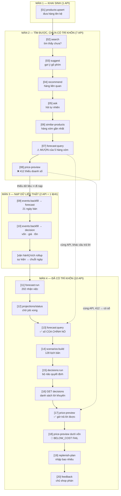
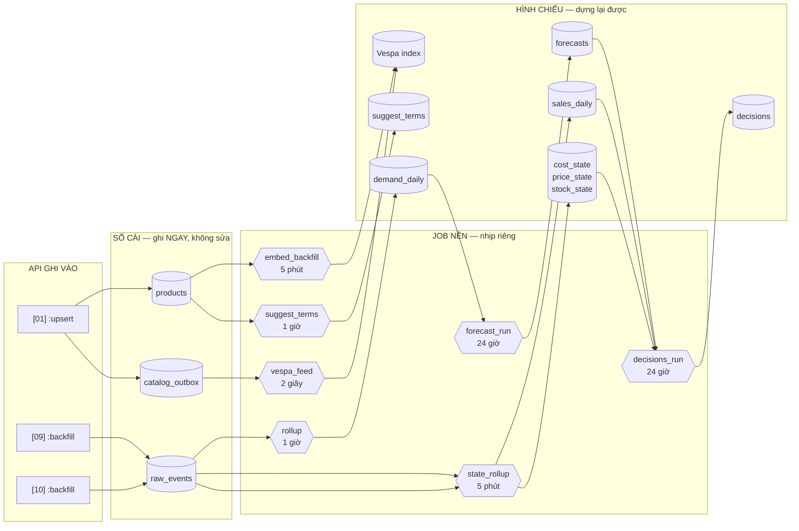

# DEMO 1 — SẢN PHẨM MỚI TINH: từ 0 dữ liệu đến ra quyết định
> Kịch bản 20 API, chạy trọn 1 vòng: **smart search → recommend → forecast → decision → phản hồi**.
> **Số liệu đo lại 2026-08-12, rà và vá lại 2026-08-13** trên demoshop sau một lượt chạy trọn 20/20 API —
> xem mục **"VÁ NGÀY 13/08"** (15 lỗi tài liệu) và "ĐÃ ĐỔI SO VỚI BẢN 07/08" ở cuối file.
>
> ⚠ **LUẬT ĐỌC SỐ:** mọi con số in trong file là **ảnh chụp của một lần đo**, không phải hằng số.
> Các bảng chỉ-ghi-thêm (`reco_exposure`, `raw_events`, `suggest_terms.weight`, số `job_run`) **lớn dần
> mỗi ngày. LUÔN ĐỌC TỪ MÀN HÌNH**, chỉ đối chiếu **hiệu số** và **hình dạng** kết quả.
>
> ⭐ **MỖI API ĐỀU CÓ 4 BƯỚC:** ① **ĐO TRƯỚC** (chụp trạng thái) → ② **GỌI API** → ③ **ĐO SAU**
> (chứng minh dữ liệu đã đổi) → ④ **LUỒNG** (dữ liệu chảy qua bảng nào, job nào).
> Đây là thứ biến buổi demo từ *"tin tôi đi"* thành *"anh chị tự nhìn số"*.

---
## ⛔⛔ LUẬT NGHIỆM THU (human chốt 2026-08-12) — ĐỌC TRƯỚC KHI NÓI "XONG"
**Hai kịch bản này chỉ được coi là HOÀN THIỆN khi chạy end-to-end đủ 4 LƯỢT LIÊN TIẾP không ra lỗi,
trên CÙNG MỘT BẢN CODE.** Deploy bất kỳ thay đổi nào ở giữa ⇒ 4 lượt trước đó mất giá trị, **đếm lại từ 1**.

*Vì sao:* một lượt không đủ để lộ lỗi phụ thuộc trạng thái. Đo 12/08: lượt 1 xanh, **lượt 2 mới lộ** việc
`reset1` xoá sản phẩm là xoá luôn vector ⇒ `[06]` rỗng ⇒ `[07]` ra 404 thay vì `cold_start_analog`.
Lượt 1 chỉ xanh vì vector còn sót từ lần chạy trước.

**Log mỗi lượt lưu ở `icpp/demo-e2e-runs/`** (ngoài repo) — để mất ngữ cảnh phiên vẫn còn bằng chứng.

## THÔNG ĐIỆP BÁN HÀNG CỦA MÀN NÀY
Hàng mới lên kệ **tìm được sau vài giây**. Khi chưa có lịch sử bán, hệ **không bịa số** — nó nói rõ đang
**mượn lịch sử của 5 mặt hàng tương tự nào**, và **từ chối thẳng** việc khuyên giá vì thiếu doanh số. Sau khi
nạp 21 ngày dữ liệu thật, cũng những API đó trả lời đầy đủ và **tự khai đang dùng phương pháp nào, tin tới đâu**.

---
# 🗺️ BẢN ĐỒ 20 API — ĐỌC TRƯỚC KHI CHẠY

## 1. Câu chuyện tổng: một thùng mì đi qua 4 màn



⭐ **Hai đường nét đứt là toàn bộ thông điệp của buổi demo:** cùng một API, gọi trước và sau khi có dữ liệu,
cho hai câu trả lời khác hẳn — **và hệ tự khai mình đang ở đâu**.

## 2. Bảng chức năng 20 API

| # | API | Cổng | Trả lời câu hỏi gì | Ghi/Đọc |
|---|---|---|---|---|
| **[01]** | `POST /v1/products:upsert` | 16021 | *"Đưa hàng mới lên kệ"* | **GHI** `products` + xếp hàng `catalog_outbox` |
| **[02]** | `POST /v1/search` | 16021 | *"Khách gõ 'omachi' có ra hàng không?"* | đọc Vespa · **GHI** `query_log` |
| **[03]** | `GET /v1/suggest` | 16021 | *"Gõ 2 chữ, gợi ý gì?"* | đọc `suggest_terms` |
| **[04]** | `POST /v1/recommend` | 16021 | *"Trang sản phẩm nên gợi thêm gì?"* | **GHI** `reco_exposure` (kèm vị trí) |
| **[05]** | `POST /v1/ask` | 16021 | *"Shop có bán mì ăn liền không?"* | đọc · **GHI** `query_log` |
| **[06]** | `GET /internal/similar-products` | 16021 | *"Món nào giống món này nhất?"* — **API nội bộ** | đọc vector Vespa |
| **[07]** | `POST /v1/forecast:query` | 16023 | *"Tháng tới bán bao nhiêu?"* → **mượn hàng xóm** | chỉ đọc, **không ghi** |
| **[08]** | `POST /v1/decisions:price-preview` | 16022 | *"Giảm giá xuống 129k được không?"* → **412** | chỉ đọc |
| **[09]** | `POST /v1/events:backfill` | 16023 | *"Đây là 21 ngày tôi đã bán"* | **GHI** `raw_events` |
| **[10]** | `POST /v1/events:backfill` | 16022 | *"Đây là vốn, giá, tồn kho của tôi"* | **GHI** `raw_events` |
| **[11]** | `POST /v1/forecast:run` | 16023 | *"Tính lại dự báo đi"* → **202 nhận việc** | **GHI** `job_run` |
| **[12]** | `GET /v1/projections/status` | 16023 | *"Việc chạy xong chưa?"* | đọc `job_run` |
| **[13]** | `POST /v1/forecast:query` | 16023 | như `[07]` → **giờ có số của chính nó** | chỉ đọc `forecasts` |
| **[14]** | `POST /v1/scenarios:build` | 16023 | *"Dựng 128 thế giới có thể xảy ra"* | **GHI** `scenario_manifest` + 2 tệp `.npz` |
| **[15]** | `POST /v1/decisions:run` | 16022 | *"Quét cả shop, có gì cần khuyên không?"* | **GHI** `decisions` |
| **[16]** | `GET /v1/decisions` | 16022 | *"Cho tôi xem các lời khuyên"* | đọc `decisions` |
| **[17]** | `POST /v1/decisions:price-preview` | 16022 | như `[08]` → **giờ trả lời được** | chỉ đọc |
| **[18]** | `POST /v1/decisions:price-preview` | 16022 | *"Bán 80k được không?"* → **FAIL dưới vốn** | chỉ đọc |
| **[19]** | `GET /v1/decisions:replenish-plan` | 16022 | *"Khi nào đặt hàng, đặt bao nhiêu?"* | đọc + in **công thức** |
| **[20]** | `POST /v1/decisions/{id}:feedback` | 16022 | *"Tôi đồng ý với lời khuyên này"* | **GHI** `feedback` |

⚠ **Nhìn cổng là biết service.** Dùng nhầm khoá sang service khác ⇒ **401**.
`16021` smartsearch (`$SKEY`) · `16022` decision (`$DKEY`) · `16023` forecast (`$FKEY`) · `/internal/*` dùng `$ITOK`.

## 3. Dữ liệu chảy đi đâu — bảng nào ai ghi



⭐⭐ **Đây là mẫu hình cốt lõi của cả hệ — hiểu nó là hiểu 90% buổi demo:**

| | **SỔ CÁI** | **HÌNH CHIẾU** |
|---|---|---|
| Ghi lúc nào | **ngay lập tức** khi API nhận | theo **nhịp job nền** |
| Sửa được không | **KHÔNG BAO GIỜ** — chỉ ghi thêm | dựng lại được, xoá đi không mất gì |
| Ví dụ | `raw_events` · `products` | `demand_daily` · `forecasts` · `decisions` |

> **"Ghi nhanh, tính chậm."** Đó là lý do bước `[09]` cho `raw_events = 21` nhưng `demand_daily = 0` — và
> là lý do cửa vào chịu được giờ cao điểm: nó chỉ làm mỗi việc ghi thêm, mọi phép tính nặng đẩy sang nền.

## 4. Bốn cổng chờ BẮT BUỘC — bỏ qua là hỏng

| Sau bước | Phải làm gì | Bỏ qua thì sao |
|---|---|---|
| `[01]` | chờ đánh chỉ mục (`until ... /v1/ask`) | `[02]` ra hàng lung tung |
| `[01]` | ⛔ **kích `embed_backfill`** | `[06]` rỗng ⇒ `[07]` ra **404** thay vì `cold_start_analog` |
| `[03]` | ⛔ **kích `suggest_terms`** | bảng rỗng trước mặt khách |
| `[10]` | ⛔ **kích `state_rollup`** | `ton=—` mãi ⇒ `[19]` không tính được |
| `[11]` | chờ `[12]` báo `done` | `[13]` đọc phải số cũ |

## 5. Ba cặp API "trước — sau" là xương sống buổi demo

| Cặp | Trước (chưa có dữ liệu) | Sau (có 21 ngày) |
|---|---|---|
| `[07]` ↔ `[13]` | `cold_start_analog`, mượn 5 SKU, `data_window=null`, **p50 = 1,69** | `seasonal_naive`, `data_window` có giá trị, **p50 = 6,0** |
| `[08]` ↔ `[17]` | **412** — "no sales in last 30d" | bảng tính đầy đủ, `confidence 0.7`, lãi **−30%** |
| `[06]` ↔ `[19]` | chỉ có hàng xóm để mượn | ROP tính từ dữ liệu thật, **khách tự bấm máy kiểm** |

---
## CHUẨN BỊ (chạy 1 lần, trước khi khách vào phòng)

```bash
cd /home/hai-soft/projects/icpp/mecom/project
SKEY=$(.venv/bin/python -c "import json;print(json.load(open('data/seed_keys_demoshop.json'))['search'])")
DKEY=$(.venv/bin/python -c "import json;print(json.load(open('data/seed_keys_demoshop.json'))['decision'])")
FKEY=$(.venv/bin/python -c "import json;print(json.load(open('data/seed_keys_demoshop.json'))['forecast'])")
ITOK=$(docker exec miniai-smartsearch printenv MINIAI_INTERNAL_TOKEN)
SKU=demo-mi-omachi
echo "keys ${SKEY:0:6}/${DKEY:0:6}/${FKEY:0:6} | internal ${ITOK:0:4}"
```

### ⭐ BỘ ĐO — dán 1 lần, dùng cho cả buổi
```bash
# chạy một câu SQL trên 1 trong 4 kho: miniai_search | miniai_decision | miniai_forecast | miniai_ledger
# (kho thứ 4 = sổ cái chung, `reset1` có dùng — xem giải thích `conflicted` ở [09])
q(){ docker exec miniai-postgres psql -U miniai -d "$1" -tAc "$2"; }

# ⭐ RESET — gõ MỘT CHỮ là sân sạch, chạy lại kịch bản từ đầu bao nhiêu lần cũng được.
# (Đã chạy kiểm chứng 12/08: mọi bảng về 0, KỂ CẢ sổ cái chung — xem giải thích `conflicted` ở [09].)
reset1(){ P=demo-mi-omachi
  curl -s -X DELETE "localhost:16021/v1/products/$P" -H "Authorization: Bearer $SKEY" -H "X-Project-Id: demoshop" -o /dev/null
  for db in miniai_forecast miniai_decision miniai_search; do docker exec miniai-postgres psql -U miniai -d $db -tAc "DO \$\$ DECLARE t text; BEGIN FOR t IN SELECT table_name FROM information_schema.columns WHERE table_schema='public' AND column_name='product_id' LOOP EXECUTE format('DELETE FROM %I WHERE product_id=%L', t, '$P'); END LOOP; END \$\$;" >/dev/null 2>&1; done
  q miniai_decision "DELETE FROM feedback  WHERE project_id='demoshop' AND decision_id IN (SELECT decision_id FROM decisions WHERE subject_id='$P');" >/dev/null 2>&1
  q miniai_decision "DELETE FROM decisions WHERE project_id='demoshop' AND (subject_id='$P' OR trace LIKE '%$P%');" >/dev/null
  for db in miniai_forecast miniai_decision; do q $db "DELETE FROM raw_events WHERE project_id='demoshop' AND payload::text LIKE '%$P%';" >/dev/null; done
  q miniai_search "DELETE FROM query_log     WHERE project_id='demoshop' AND query_norm LIKE '%omachi%';" >/dev/null
  q miniai_search "DELETE FROM suggest_terms WHERE project_id='demoshop' AND term       LIKE '%omachi%';" >/dev/null
  q miniai_ledger "DELETE FROM event_ledger  WHERE project_id='demoshop' AND payload::text LIKE '%$P%';" >/dev/null
  rm -f /tmp/ev.json /tmp/fq.json
  echo "  RESET xong: products=$(q miniai_search "SELECT count(*) FROM products WHERE project_id='demoshop' AND product_id='$P'") demand=$(q miniai_forecast "SELECT count(*) FROM demand_daily WHERE project_id='demoshop' AND product_id='$P'") forecasts=$(q miniai_forecast "SELECT count(*) FROM forecasts WHERE project_id='demoshop' AND product_id='$P'") sales=$(q miniai_decision "SELECT count(*) FROM sales_daily WHERE project_id='demoshop' AND product_id='$P'") decisions=$(q miniai_decision "SELECT count(*) FROM decisions WHERE project_id='demoshop' AND subject_id='$P'") ledger=$(q miniai_ledger "SELECT count(*) FROM event_ledger WHERE project_id='demoshop' AND payload::text LIKE '%$P%'") query_log=$(q miniai_search "SELECT count(*) FROM query_log WHERE project_id='demoshop' AND query_norm LIKE '%omachi%'") suggest=$(q miniai_search "SELECT count(*) FROM suggest_terms WHERE project_id='demoshop' AND term LIKE '%omachi%'")"
}

# ảnh chụp toàn cảnh 1 SKU — gõ trước và sau mỗi API để thấy cái gì đã đổi
snap(){ P="${1:-$SKU}"
 echo "── ẢNH CHỤP [$P] lúc $(date +%H:%M:%S)"
 echo "  search  : products=$(q miniai_search "SELECT count(*) FROM products WHERE project_id='demoshop' AND product_id='$P'")  outbox_đang_chờ=$(q miniai_search "SELECT count(*) FROM catalog_outbox WHERE project_id='demoshop'")  reco_exposure=$(q miniai_search "SELECT count(*) FROM reco_exposure WHERE project_id='demoshop'")"
 echo "  forecast: raw_events=$(q miniai_forecast "SELECT count(*) FROM raw_events WHERE project_id='demoshop'")  demand_daily=$(q miniai_forecast "SELECT count(*) FROM demand_daily WHERE project_id='demoshop' AND product_id='$P'")  forecasts=$(q miniai_forecast "SELECT count(*) FROM forecasts WHERE project_id='demoshop' AND product_id='$P'")"
 echo "  decision: raw_events=$(q miniai_decision "SELECT count(*) FROM raw_events WHERE project_id='demoshop'")  sales_daily=$(q miniai_decision "SELECT count(*) FROM sales_daily WHERE project_id='demoshop' AND product_id='$P'")  decisions=$(q miniai_decision "SELECT count(*) FROM decisions WHERE project_id='demoshop'")  tồn=$(q miniai_decision "SELECT coalesce(max(on_hand_qty)::text,'—') FROM stock_state WHERE project_id='demoshop' AND product_id='$P'")  vốn=$(q miniai_decision "SELECT coalesce(round(max(ewma_cost))::text,'—') FROM cost_state WHERE project_id='demoshop' AND product_id='$P'")"
}
```

### ⛔ CỔNG BẮT BUỘC — kiểm sân sạch trước khi khách vào
Cả kịch bản dựa trên việc SKU demo **chưa tồn tại**. Lần demo trước quên dọn ⇒ màn 2 sẽ ra số thay vì ra
"chưa có dữ liệu" và **hỏng toàn bộ mạch kể**. (Đo 12/08: đúng lỗi này đã xảy ra — còn tồn 27 ngày bán,
98 dòng dự báo.)
```bash
snap $SKU          # PHẢI thấy: products=0 · demand_daily=0 · forecasts=0 · sales_daily=0 · tồn=— · vốn=—
```
**Nếu chưa sạch → gõ đúng một chữ:**
```bash
reset1
```
> 💡 `reset1` chạy được **bao nhiêu lần cũng được** — cứ thực hành xong lại gõ, sân về đúng vạch xuất phát.

**Header cho MỌI API nghiệp vụ:** `Authorization: Bearer <key đúng service>` + `X-Project-Id: demoshop`.
API nội bộ (`/internal/...`) dùng `X-Internal-Token`.
Cổng: smartsearch **16021** · decision **16022** · forecast **16023**.

---
# MÀN 1 — KHAI SINH SẢN PHẨM (1 API)

## [01] POST /v1/products:upsert — đưa hàng mới lên kệ
**Ý nghĩa:** cửa duy nhất để sản phẩm vào hệ. Ghi Postgres **ngay**, rồi đẩy sang Vespa **qua hàng đợi**
(nhất quán cuối). Đây là API cho thấy rõ nhất "dữ liệu chảy đi đâu".

### ① ĐO TRƯỚC
```bash
echo "products = $(q miniai_search "SELECT count(*) FROM products WHERE project_id='demoshop' AND product_id='$SKU'")"
echo "outbox   = $(q miniai_search "SELECT count(*) FROM catalog_outbox WHERE project_id='demoshop'")"
```
**Đo thật 12/08:** `products = 0` · `outbox = 0`

### ② GỌI API

#### 📥 INPUT — thân yêu cầu là `{"products": [ ... ]}`
Bọc ngoài: **`products` là một MẢNG**, tối đa **500 sản phẩm/lần gọi** (`main.py:715`, vượt ⇒ `400`).
Mỗi phần tử theo hợp đồng `Product` (`libs/common/contracts/product.py:35`):

| Trường | Bắt buộc | Kiểu & ràng buộc | Mặc định | Ý nghĩa nghiệp vụ |
|---|:---:|---|---|---|
| `id` | **✔** | chuỗi, **chỉ nhận `A-Za-z0-9_.-`**, 1–128 ký tự | — | mã SKU, khoá chính **trong phạm vi tenant**. Có dấu cách hay tiếng Việt ⇒ `400` |
| `title` | **✔** | chuỗi 1–500, tự chuẩn hoá **NFC** | — | tên hiển thị — **nguồn chính để tìm kiếm** (BM25 + vector + cắt cụm gợi ý) |
| `price_info` | **✔** | đối tượng (xem dưới) | — | khối giá |
| `price_info.currency_code` | **✔** | chuỗi **đúng 3 ký tự** | — | `VND` |
| `price_info.price` | **✔** | số nguyên **≥ 0**, đơn vị nhỏ nhất | — | giá bán. **Số nguyên đồng**, không phải số thực |
| `price_info.original_price` | | số nguyên ≥ 0, **phải ≥ `price`** | `null` | giá gạch ngang. Nhỏ hơn `price` ⇒ `400` |
| `description` | | chuỗi ≤ 5000, chuẩn hoá NFC | `null` | mô tả — cũng được đánh chỉ mục (`bm25(description)`) |
| `categories` | | mảng chuỗi `"Cha > Con"` | `[]` | phần **trước dấu `>` đầu tiên** thành `category_l1` để lọc/gộp/facet |
| `brands` | | mảng chuỗi | `[]` | dùng cho facet `brands` và lọc `filters.brands` |
| `availability` | | `IN_STOCK` \| `OUT_OF_STOCK` \| `PREORDER` \| `DISCONTINUED` | **`IN_STOCK`** | khác `IN_STOCK` ⇒ **biến mất khỏi kết quả tìm** (bộ lọc mặc định) |
| `available_quantity` | | số thực ≥ 0 | `null` | số lượng hiển thị (**không** phải tồn kho dùng để tính nhập hàng) |
| `attributes` | | đối tượng, **tối đa 50 khoá** | `{}` | thuộc tính tự do; lọc qua `filters.attrs` dạng `"color:do"` |
| `images` | | mảng `{uri, height?, width?}` | `[]` | `uri` bắt buộc nếu có phần tử |
| `publish_time` | | ISO-8601 UTC | `null` | thời điểm lên kệ; dùng cho `sort=newest` |

> ⛔ **Đã vá 13/08 — bảng cũ đánh dấu 6 trường là bắt buộc.** Đối chiếu mã (`product.py:35-49`) thì
> **chỉ có 3**: `id` · `title` · `price_info`. `categories`, `availability`, `publish_time` đều **có giá trị
> mặc định**. Ghi sai chiều này nguy hiểm cho khách tích hợp: họ tưởng phải chuẩn bị đủ 6 trường mới gọi được,
> trong khi thực tế đẩy được hàng lên kệ chỉ với 3.

```bash
curl -s localhost:16021/v1/products:upsert -H "Authorization: Bearer $SKEY" -H "X-Project-Id: demoshop" -H "Content-Type: application/json" -d '{"products":[{"id":"demo-mi-omachi","title":"Thùng 30 gói mì Omachi sườn hầm ngũ quả 80g","description":"Mì ăn liền Omachi sợi khoai tây, vị sườn hầm ngũ quả, thùng 30 gói 80g","categories":["Bách hóa > Mì ăn liền"],"brands":["Omachi"],"price_info":{"currency_code":"VND","price":145000,"original_price":165000},"availability":"IN_STOCK","available_quantity":40,"attributes":{},"images":[],"publish_time":"2026-08-13T00:00:00Z"}]}'
```
**OUTPUT thật:** `{"upserted":1,"queued_for_index":1}`

#### 📤 RESPONSE — đúng 2 con số, và chúng **cố ý khác nhau**

| Trường | Kiểu | Ý nghĩa | Đọc thế nào |
|---|---|---|---|
| `upserted` | số nguyên | số sản phẩm đã **ghi bền vào Postgres** | **đã an toàn**, mất điện cũng không mất |
| `queued_for_index` | số nguyên | số sản phẩm đã **xếp vào hàng đợi** để đẩy sang Vespa | **chưa tìm được ngay** — còn chờ `vespa_feed` rút |

⭐ **Vì sao tách hai con số?** Vì đó là hai lời hứa khác nhau. `upserted` là *"tôi đã cất hàng vào kho"*;
`queued_for_index` là *"tôi đã ghi giấy yêu cầu bày lên kệ"*. Nếu Vespa chết, `upserted` vẫn chạy bình thường
và yêu cầu nằm chờ trong hàng đợi — **sống lại là tự bù**, không mất sản phẩm nào. Một API gộp làm một con số
sẽ không nói được điều đó.

⚠ `:upsert` **idempotent về dữ liệu nhưng VẪN xếp hàng lại**: gọi lần 2 với đúng nội dung cũ vẫn trả
`queued_for_index: 1` (đo thật). Nên diễn lại bao nhiêu lần cũng được, không hỏng gì.

### ③ ĐO SAU — 🆕 **dán MỘT khối, gồm cả lệnh gọi API**

> ⛔ **Đã vá 13/08 — bản cũ tách `curl` (②) và phép đo (③) thành hai lệnh, và cách đó GẦN NHƯ LUÔN HỤT.**
> `vespa_feed` rút hàng đợi mỗi **2 giây**, mà thời gian người dẫn chuyển từ khối ② sang khối ③ luôn dài
> hơn thế. Đo thật 13/08: chạy đúng theo bản cũ thì `NGAY SAU` đã ra `outbox=0` — **mất trọn cảnh đẹp nhất
> của màn 1**. Nối vào một dòng thì bắt được (đã kiểm chứng: `TRƯỚC 0 → NGAY SAU 1`).
>
> `:upsert` **idempotent nhưng vẫn xếp hàng lại** với cùng nội dung (đo thật: gọi lần 2 vẫn trả
> `queued_for_index: 1`), nên diễn lại bao nhiêu lần cũng được, không hỏng dữ liệu.

```bash
echo "TRƯỚC    : outbox=$(q miniai_search "SELECT count(*) FROM catalog_outbox WHERE project_id='demoshop'")"; \
curl -s localhost:16021/v1/products:upsert -H "Authorization: Bearer $SKEY" -H "X-Project-Id: demoshop" -H "Content-Type: application/json" -d '{"products":[{"id":"demo-mi-omachi","title":"Thùng 30 gói mì Omachi sườn hầm ngũ quả 80g","description":"Mì ăn liền Omachi sợi khoai tây, vị sườn hầm ngũ quả, thùng 30 gói 80g","categories":["Bách hóa > Mì ăn liền"],"brands":["Omachi"],"price_info":{"currency_code":"VND","price":145000,"original_price":165000},"availability":"IN_STOCK","available_quantity":40,"attributes":{},"images":[],"publish_time":"2026-08-13T00:00:00Z"}]}'; \
echo ""; \
echo "NGAY SAU : products=$(q miniai_search "SELECT count(*) FROM products WHERE project_id='demoshop' AND product_id='$SKU'")  outbox=$(q miniai_search "SELECT count(*) FROM catalog_outbox WHERE project_id='demoshop'")"; \
sleep 10; \
echo "SAU 10s  : products=$(q miniai_search "SELECT count(*) FROM products WHERE project_id='demoshop' AND product_id='$SKU'")  outbox=$(q miniai_search "SELECT count(*) FROM catalog_outbox WHERE project_id='demoshop'")"
```
**Đo thật 12/08 — đây là khoảnh khắc đắt nhất của màn này:**
```
TRƯỚC    : products=0  outbox=0
NGAY SAU : products=1  outbox=1     ← BẮT ĐƯỢC HÀNG ĐỢI
SAU 10s  : products=1  outbox=0     ← indexer đã rút hàng đợi
```

### ④ LUỒNG DỮ LIỆU — **một lần gọi, MỘT giao dịch, HAI bảng, rồi BA job nền**

```
        ┌─────────────────── TRONG CÙNG 1 GIAO DỊCH (atomic) ───────────────────┐
        │                                                                        │
POST :upsert ──► ① products        (SỔ CÁI hàng hoá — bền, không mất)            │
        │        ② catalog_outbox  (HÀNG ĐỢI — "làm ơn đem sản phẩm này đi bày") │
        └────────────────────────────────────────────────────────────────────────┘
                            │
                            │  hai bảng ghi CÙNG LÚC nên không bao giờ lệch:
                            │  không có cảnh "đã ghi hàng nhưng quên bày"
                            ▼
        ┌───────────────────────────────────────────────────────────────────┐
        │  job vespa_feed  — nhịp 2 GIÂY  (jobs/vespa_feed.py:304)          │
        │  rút catalog_outbox → đẩy sang Vespa → xoá dòng khỏi hàng đợi     │
        │  lỗi ⇒ ĐẶT LỊCH THỬ LẠI (next_retry_at), KHÔNG mất yêu cầu        │
        └───────────────────────────────────────────────────────────────────┘
                            │
                            ▼  Vespa index  ⇒ [02] search · [05] ask tìm thấy
        ┌───────────────────────────────────────────────────────────────────┐
        │  job embed_backfill — nhịp 300 GIÂY (5 phút)                      │
        │  đọc products chưa có vector → sinh vector BGE-M3 → nạp vào Vespa │
        │  đặt products.embedding_version = 1                               │
        └───────────────────────────────────────────────────────────────────┘
                            │
                            ▼  vector  ⇒ [06] similar-products ⇒ [07] cold_start_analog
        ┌───────────────────────────────────────────────────────────────────┐
        │  job suggest_terms — nhịp 3600 GIÂY (1 giờ)                       │
        │  cắt title thành cụm 1-2-3 từ → ghi suggest_terms                 │
        └───────────────────────────────────────────────────────────────────┘
                            │
                            ▼  ⇒ [03] suggest có cụm từ mới
```

**Bảng tra: mỗi bảng ai ghi, ghi lúc nào**

| Bảng | Ai ghi | Lúc nào | Loại |
|---|---|---|---|
| `products` | **chính API này** | **ngay lập tức**, trong giao dịch | 📕 **SỔ CÁI** — sự thật gốc |
| `catalog_outbox` | **chính API này** | **ngay lập tức**, cùng giao dịch | 📮 **HÀNG ĐỢI** — dòng bị **xoá** sau khi đẩy xong |
| Vespa index | job `vespa_feed` | **~2 giây** sau | 🖼 **HÌNH CHIẾU** — xoá sạch vẫn dựng lại được từ `products` |
| `products.embedding_version` | job `embed_backfill` | **~5 phút** sau | 🖼 hình chiếu |
| `suggest_terms` | job `suggest_terms` | **~1 giờ** sau | 🖼 hình chiếu |

⭐ **Mẫu hình tên là `transactional outbox`.** Vấn đề nó giải: ghi Postgres và ghi Vespa là **hai hệ thống khác
nhau**, không thể gói chung một giao dịch. Nếu ghi Postgres xong rồi mới gọi Vespa mà Vespa chết giữa chừng ⇒
sản phẩm có trong kho nhưng **vĩnh viễn không ai tìm thấy**, và **không ai biết**. Cách chữa: chỉ ghi Postgres,
nhưng ghi **hai bảng cùng lúc** — bảng thứ hai là tờ giấy nhắc việc. Job nền cứ thế đọc giấy nhắc mà làm, làm
xong thì xé giấy. Vespa chết bao lâu cũng được, giấy nhắc vẫn nằm đó.

**Nói với khách:** *"Hai con số `upserted` và `queued_for_index` tách nhau có chủ đích. Ghi bền và đánh chỉ mục
là hai việc khác nhau — Vespa chết thì dữ liệu vẫn còn trong hàng đợi và tự bù khi sống lại. Anh chị vừa nhìn
thấy hàng đợi lên 1 rồi về 0 — **đó là tờ giấy nhắc việc được viết ra rồi được xé đi.**"*

### ⏱ CỔNG CHỜ BẮT BUỘC trước khi sang màn 2
```bash
until curl -s localhost:16021/v1/ask -H "Authorization: Bearer $SKEY" -H "X-Project-Id: demoshop" -H "Content-Type: application/json" -d '{"question":"co mi omachi khong?"}' | grep -q demo-mi-omachi; do echo "dang danh chi muc..."; sleep 3; done; echo "== DA SAN SANG =="
```
> Không đếm nhẩm — đo bằng máy. Hỏi `/v1/ask` quá sớm sẽ ra hàng lung tung.

### ⛔⛔ CỔNG THỨ HAI — KÍCH VECTOR (🆕 12/08, **bỏ qua là hỏng màn 2**)
Chỉ mục chữ (BM25) có ngay, nhưng **vector ngữ nghĩa** do job `embed_backfill` sinh, chạy mỗi **300 giây**.
Chưa có vector thì `[06] similar-products` trả **rỗng** ⇒ `[07]` ra **404** thay vì `cold_start_analog` —
đúng mắt xích đắt nhất của màn 2. (Đo 12/08: chạy lại kịch bản lần 2 vấp đúng chỗ này, vì `reset1` xoá sản
phẩm là xoá luôn vector.)

```bash
docker exec miniai-smartsearch python3 -c "
import asyncio, asyncpg, os
from app.jobs.embed_backfill import run_embed_backfill_once
from app.core.embedding import BgeM3Embedder
from app.store.vespa_client import VespaClient
async def m():
    p = await asyncpg.create_pool(os.environ.get('SEARCH_DSN') or os.environ.get('DATABASE_URL'), min_size=1, max_size=2)
    v = VespaClient(os.environ.get('VESPA_URL','http://vespa:8080'))
    print('embed job:', await run_embed_backfill_once(p, v, BgeM3Embedder()))
    await p.close()
asyncio.run(m())"

# đo bằng máy: phải thấy 5 hàng xóm, KHÔNG được rỗng
until curl -s "localhost:16021/internal/similar-products?project_id=demoshop&product_id=demo-mi-omachi&k=5" -H "X-Internal-Token: $ITOK" | grep -q product_id; do echo "dang sinh vector..."; sleep 3; done; echo "== VECTOR DA SAN SANG =="
```
**Đo thật 12/08:** `embed job: {'embedded': 1}` → similar-products trả 5 SKU.
*"Đây cũng là một nhịp job nền — ngoài đời tự chạy mỗi 5 phút, ở đây tôi kích tay cho nhanh."*

---
# MÀN 2 — TÌM ĐƯỢC NGAY, NHƯNG CHƯA CÓ TRÍ KHÔN (6 API)

## [02] POST /v1/search — hàng mới đã tìm thấy
**Ý nghĩa:** tìm kiếm lai — BM25 (khớp chữ) + vector ngữ nghĩa, trộn bằng RRF.

### ① ĐO TRƯỚC
```bash
q miniai_search "SELECT coalesce(sum(cnt),0) AS lan_tim FROM query_log WHERE project_id='demoshop' AND query_norm='omachi';"
```
**Đo thật:** `0` (đã dọn sân)

### ② GỌI API
```bash
curl -s localhost:16021/v1/search -H "Authorization: Bearer $SKEY" -H "X-Project-Id: demoshop" -H "Content-Type: application/json" -d '{"query":"omachi","page_size":5}' | .venv/bin/python -c "import json,sys; [print(round(i['score'],4),'|',i['product_id'],'|',i.get('source')) for i in json.load(sys.stdin)['items']]"
```
**OUTPUT thật 12/08**
```
10.2236 | demo-mi-omachi | vespa_bm25
```

#### 📥 INPUT — 11 trường, chỉ `query` là bắt buộc (`main.py:996-1096`)

| Trường | Bắt buộc | Kiểu & ràng buộc | Mặc định | Ý nghĩa |
|---|:---:|---|---|---|
| `query` | **✔** | chuỗi **không rỗng** | — | câu khách gõ |
| `page_size` | | số nguyên **1–100** | `20` | số kết quả trả về |
| `offset` | | số nguyên **≥ 0** | `0` | bỏ qua bao nhiêu kết quả đầu (phân trang) |
| `sort` | | `relevance` \| `price_asc` \| `price_desc` \| `newest` | `relevance` | ⚠ khác `relevance` thì **tắt trộn RRF** |
| `filters` | | đối tượng (6 khoá, xem dưới) | — | lọc cứng |
| `facets` | | mảng — **chỉ nhận `brands`, `category_l1`** | — | đếm nhóm; tên khác ⇒ `400` |
| `debug` | | luận lý | `false` | mở 6 khối tự-khai đường đi |
| `user_pseudo_id` | | chuỗi | — | ⭐ **mã người dùng ẩn danh** — điều kiện để chia nhóm A/B |
| `experiment_id` | | chuỗi | — | đóng dấu lên sổ hiển thị để nối kết quả thí nghiệm |
| `min_ledger_position` | | số nguyên ≥ 0 | — | **đọc-thấy-ghi**: chờ chỉ mục bắt kịp mốc này rồi hãy trả lời |
| `wait_timeout_ms` | | số nguyên ≥ 0 | `1000` | chờ tối đa bao lâu cho điều trên |

**`filters` nhận đúng 6 khoá** (`core/vespa_query.py:25-77`):

| Khoá | Kiểu | Ý nghĩa |
|---|---|---|
| `price_min` / `price_max` | số nguyên | khoảng giá |
| `brands` | mảng chuỗi | khớp **bất kỳ** hãng nào trong danh sách (OR) |
| `categories_prefix` | chuỗi | khớp `category_l1` **hoặc** đường dẫn ngành đầy đủ |
| `attrs` | mảng chuỗi `"color:do"` | thuộc tính; **phải khớp HẾT** (AND) |
| `include_unavailable` | luận lý | `false` = **mặc định chỉ trả hàng `IN_STOCK`** |

#### 📤 RESPONSE

| Trường | Kiểu | Ý nghĩa |
|---|---|---|
| `items[]` | mảng | kết quả — xem bảng con bên dưới |
| `total_estimate` | số | **ước lượng** tổng số hàng khớp (không phải số chính xác) |
| `fuzzy` | luận lý | ⚠ **`true` = Vespa trả 0, đã phải cứu bằng `pg_trgm`** — cờ báo bệnh, xem kỹ kết quả |
| `relaxed` | luận lý | đã phải **nới điều kiện lọc** mới ra kết quả |
| `facets` | đối tượng | `{tên_nhóm: [{value, count}]}` — ⚠ **rỗng khi `fuzzy=true`** |
| `attribution_token` | chuỗi `at_…` | ⭐ **mã phiếu** — gửi kèm khi khách bấm để hệ học xếp hạng (xem ④) |
| `generated_at` | ISO-8601 | thời điểm tạo kết quả |
| `consistency` | đối tượng | `is_caught_up` · `projection_watermark` · `ledger_head` |
| `ranking_debug` | | chỉ khác `null` khi `debug:true` |
| *(chỉ khi `debug`)* `router` · `rrf` · `intent` · `query_parse` · `ab` | | hệ **tự khai** đã hiểu câu hỏi thế nào |

**Mỗi phần tử `items[]`:**

| Trường | Ý nghĩa |
|---|---|
| `product_id` · `title` · `availability` | định danh + tên + còn hàng không |
| `price_info` | `{currency_code, price}` |
| `score` | điểm xếp hạng — ⚠ **thang điểm PHỤ THUỘC `source`**, xem dưới |
| `source` | **đường nào đưa món này lên** — 6 giá trị |
| `rating_avg` · `rating_count` | điểm đánh giá (gắn thêm sau) |

⭐ **`source` — đọc được là hiểu hệ đang khoẻ hay đang chống chế:**

| `source` | Nghĩa | Thang `score` | Sức khoẻ |
|---|---|---|---|
| `vespa_bm25` | chỉ khớp chữ (router chọn nhánh từ khoá) | **hàng đơn vị** (~10) | ✅ bình thường |
| `vespa_hybrid` | chữ + vector | hàng đơn vị | ✅ bình thường |
| `rrf_fusion` | đã trộn 2 bảng xếp hạng | **hàng phần trăm** (~0.03) | ✅ bình thường |
| `merch_pin` | do người vận hành **ghim tay** | `0.0` | ✅ chủ ý |
| `pg_trgm_fuzzy` | Vespa ra 0 ⇒ dò gần đúng trong Postgres | 0–1 | ⚠ **suy giảm** |
| `pg_fts_fallback` | **Vespa CHẾT** ⇒ tìm toàn văn Postgres | tuỳ | 🔴 **sự cố** — kèm header `X-Degraded: vespa_unavailable` |

> ⛔ **Đừng so `score` giữa hai `source` khác nhau.** `10.22` của `vespa_bm25` và `0.0325` của `rrf_fusion`
> **không cùng thang đo** — RRF cho điểm theo công thức `1/(60+thứ_hạng)` nên luôn nhỏ hơn 1. Cao hơn không
> có nghĩa là tốt hơn; chỉ so được **trong cùng một lần gọi**.

### ③ ĐO SAU
```bash
sleep 2; q miniai_search "SELECT cnt AS lan_tim, results_count_last AS so_kq FROM query_log WHERE project_id='demoshop' AND query_norm='omachi';"
```
**Đo thật:** `1 | 1` — **truy vấn của khách đã được ghi sổ**.

### ④ LUỒNG — **7 chặng đi, rồi ghi HAI cuốn sổ khác nhau**

> ⛔ **Đã vá 13/08 — mũi tên cũ gộp sai.** Bản cũ viết `ghi query_log ──► nuôi gợi ý gõ phím + học xếp hạng`.
> Đúng nửa đầu, **sai nửa sau**: grep toàn mã, `query_log` chỉ có **3 nơi đọc** (`suggest_terms.py:94`,
> `drift.py:45`, và `grounding.py:219` — chỗ này chỉ dùng chữ `"query_log"` làm từ khoá bắt lộ prompt, không
> đọc bảng). **Học xếp hạng KHÔNG đọc `query_log` một dòng nào** — nó đi bằng `attribution` → `click_log`.
> Hai sổ ghi cùng lúc trong cùng một lần gọi (`main.py:1594-1602`) nên bản cũ tưởng là một.

#### Chặng đi — từ lúc nhận câu hỏi tới lúc trả kết quả

```
câu khách gõ
   │
   ├─① query_parse   — rút RÀNG BUỘC ra khỏi câu chữ
   │     "tã cho bé 6 tháng dưới 300k" → price_max=300000, còn lại "tã cho bé 6 tháng"
   │
   ├─② parse_intent  — hiểu Ý ĐỊNH: ngành · đối tượng · dịp · phủ định
   │     nhận ra "cho bé" ⇒ audience=tre-em ⇒ TỰ CHẶN ngành bia/rượu
   │
   ├─③ router        — chọn đường, KHÔNG dùng LLM, chạy cục bộ <10ms
   │     p_semantic < 0.25 ⇒ "keyword": BỎ QUA bước mã hoá vector (tiết kiệm)
   │     ngược lại        ⇒ "semantic": có mã hoá ⇒ tìm được cả theo nghĩa
   │
   ├─④ Vespa lượt 1  — hồ sơ "hybrid" (chữ + vector), lấy tối đa 100 ứng viên
   │        └─ Vespa NÉM LỖI ⇒ 🔴 rơi thẳng xuống PG FTS, gắn header X-Degraded
   │        └─ Vespa trả 0   ⇒ ⚠ dò gần đúng pg_trgm  (fuzzy=true)
   │
   ├─⑤ Vespa lượt 2  — hồ sơ "bm25" thuần (CHỈ khi sort=relevance và có vector)
   │        └─ RRF trộn 2 bảng xếp hạng:  điểm = Σ 1/(60 + thứ_hạng)
   │           vì sao trộn: chữ và nghĩa BẮT ĐƯỢC HAI LOẠI SAI KHÁC NHAU
   │
   ├─⑥ intent_rerank — nhân hệ số theo ý định (đẩy đúng ngành lên, dìm lệch ngành)
   ├─⑦ merch rules   — luật người vận hành đặt tay: GHIM / ĐẨY / DÌM
   │
   └─► items[]  +  attribution_token = "at_" + 32 ký tự ngẫu nhiên
```

#### Ghi sổ — **HAI cuốn, hai mục đích, đừng gộp**

```
                          ┌──────────────────────────────────────────────────────────┐
                          │ 📕 SỔ 1: query_log     — "KHÁCH ĐÃ HỎI GÌ"               │
   ┌──────────────────────┤   khoá: (project_id, query_norm)                          │
   │                      │   cnt++         = số LƯỢT gõ câu này                      │
   │                      │   user_cnt++    = số NGƯỜI khác nhau (chỉ khi có          │
   │                      │                   user_pseudo_id VÀ khác lần trước)       │
   │                      └──────────────────────────────────────────────────────────┘
   │                                          │
   │                                          ├──► job suggest_terms (1 GIỜ) ──► GỢI Ý GÕ PHÍM
   │                                          │      nhưng phải qua 4 CỔNG, xem [03]
   │                                          │
   │                                          └──► job drift (PSI độ dài câu) ──► CẢNH BÁO TRÔI
   │
1 lần gọi
   │
   │                      ┌──────────────────────────────────────────────────────────┐
   └──────────────────────┤ 📗 SỔ 2: attribution   — "TÔI ĐÃ BÀY RA NHỮNG GÌ"        │
                          │   token = at_xxx                                          │
                          │   query_norm + product_ids[]  ← DANH SÁCH ĐẦY ĐỦ, CÓ THỨ TỰ│
                          └──────────────────────────────────────────────────────────┘
                                                     │
                       khách bấm 1 món, web gửi event product.clicked KÈM at_xxx
                                                     │
                                                     ▼
                          ┌──────────────────────────────────────────────────────────┐
                          │ job click-join (300 GIÂY) — learning_jobs.py:68           │
                          │   tra ngược at_xxx → biết SERP hôm đó có gì               │
                          │   ghi click_log:  món ĐƯỢC bấm      → label = 1           │
                          │                   MỌI món khác      → label = 0 (+ vị trí)│
                          └──────────────────────────────────────────────────────────┘
                                                     │
                                                     ▼
                          build_ltr_dataset → train_ltr → HỌC XẾP HẠNG (LTR)
```

⭐⭐ **Vì sao BẮT BUỘC phải có sổ 2, không thể dùng sổ 1?**
Muốn dạy máy xếp hạng, biết *"khách bấm món A"* là **chưa đủ**. Phải biết **lúc đó máy đã bày ra những món
nào và A đứng thứ mấy** — vì **món KHÔNG được bấm cũng là bài học** (ví dụ âm). `query_log` chỉ lưu **câu chữ
và con số đếm**, không lưu danh sách sản phẩm, nên nó **không thể** làm việc này.

> 💡 Chú thích trong `learning_jobs.py:132-138` ghi lại một **bài học đã trả giá**: bản cũ chỉ ghi các món
> nằm **phía trên** chỗ bấm. Hậu quả — vị trí sâu gần như chỉ còn dòng được-bấm ⇒ tỉ lệ bấm ở vị trí sâu
> **bị thổi phồng** ⇒ bộ chấm đo ra `est(pos10) = 3.57` trên thế giới mô phỏng cài sẵn `0.16`, **sai hơn 20 lần**.

#### ⚠ Trạng thái THẬT trên `demoshop` hôm nay (đo 13/08)

| Đường | Số đo | Kết luận |
|---|---|---|
| `query_log` → gợi ý gõ phím | 47 dòng → 28 qua cổng ① → **0 qua cổng k-anon** | ❌ **chưa từng chạy** — mọi cụm gợi ý đến từ tiêu đề |
| `attribution` → học xếp hạng | `attribution` **686** dòng, `click_log` **0** dòng | ❌ **ống rỗng** — chưa cú bấm nào được nạp về |

Cả hai **cùng một nguyên nhân**: không lệnh gọi nào gửi `user_pseudo_id`, mà đó là trường **tuỳ chọn**.
Không có nó ⇒ `user_cnt` đứng yên ở 0 (k-anon đòi ≥ 5) **và** `bucket` là `null` (A/B không chia).
(Nợ đã ghi sổ: `W-SUGGEST-QLOG-SOURCE-B-DEAD`.)

**Nói với khách:** *"Sản phẩm tạo chưa tới 1 phút đã tìm được. Và mỗi lần khách tìm, hệ ghi **hai** cuốn sổ:
một cuốn ghi **khách hỏi gì** để mai gợi ý gõ phím thông minh hơn, một cuốn ghi **tôi đã bày ra gì, ở vị trí
nào** — cuốn thứ hai mới là thứ dạy máy xếp hạng, vì món khách **bỏ qua** cũng là thông tin."*

> ⚠ **Truy vấn nên dùng:** `omachi` (tên thương hiệu). **Tránh** `mi omachi` / `mi an lien`: bỏ dấu, "mi"
> 2 ký tự khớp cả "sơ **mi**" nên hàng mới bị đẩy xuống. Điểm yếu đã đo, đã ghi sổ (`W-SEARCH-CONCEPT-NEGATION`).

---
## [03] GET /v1/suggest — gợi ý gõ phím đã có từ mới
**Ý nghĩa:** khách gõ vài chữ trên ô tìm kiếm, hệ đoán tiếp cả cụm. Cụm từ **sinh từ tiêu đề sản phẩm** rồi
được `query_log` nâng trọng số theo độ phổ biến. **Chức năng trong buổi demo:** cho thấy hàng mới có
`weight = 1.0` — điểm khởi đầu, để lát so với hàng đã bán 4 tháng (`~400`) ở DEMO-2. *Giá trị của dữ liệu
tích luỹ, nhìn thấy bằng một con số.*

### ① ĐO TRƯỚC
```bash
q miniai_search "SELECT count(*) AS so_cum_tu FROM suggest_terms WHERE project_id='demoshop' AND term LIKE '%omachi%';"
```
**Đo thật ngay sau [01]:** `0` — **cụm từ CHƯA có**.

> ⛔ **BẮT BUỘC KÍCH JOB, nếu không bước này RỖNG trước mặt khách.**
> Job `suggest_terms` chạy mỗi **3.600 giây (1 giờ)** — quá chậm cho demo:
> ```bash
> docker exec miniai-smartsearch python3 -c "
> import asyncio, asyncpg, os
> from app.jobs.suggest_terms import run_suggest_terms_once
> async def m():
>     p=await asyncpg.create_pool(os.environ.get('SEARCH_DSN') or os.environ.get('DATABASE_URL'),min_size=1,max_size=2)
>     print('suggest job:', await run_suggest_terms_once(p)); await p.close()
> asyncio.run(m())"
> q miniai_search "SELECT count(*) AS so_cum_tu FROM suggest_terms WHERE project_id='demoshop' AND term LIKE '%omachi%';"
> ```
> **Đo thật sau khi kích:** bảng có **6 dòng**, **API trả 3 cụm**.
>
> 🆕 **Đã vá 13/08 — lý do 6 vs 3 KHÔNG phải "bản không dấu".** Bản cũ giải thích sai. Đo thật 6 dòng:
> ```
> omachi · omachi sườn · omachi sườn hầm      ← API TRẢ (bắt đầu bằng "omachi")
> mì omachi · gói mì omachi · mì omachi sườn  ← không trả (chỉ CHỨA)
> ```
> Đây là **6 cụm từ khác nhau** cắt từ tiêu đề, không phải 3 cụm × 2 biến thể. `term_unaccent` là một
> **cột** trong cùng dòng, không đẻ ra dòng mới. **API khớp theo TIỀN TỐ** — đó mới là lý do chỉ 3 cụm
> được trả. Gõ `mi` sẽ ra nhóm còn lại.
> *"Đây là nhịp cộng sổ của gợi ý gõ phím — ngoài đời chạy mỗi giờ, ở đây tôi kích tay cho nhanh."*

### ② GỌI API
```bash
curl -s "localhost:16021/v1/suggest?q=omachi&limit=5" -H "Authorization: Bearer $SKEY" -H "X-Project-Id: demoshop" | .venv/bin/python -m json.tool
```
**OUTPUT thật 12/08**
```json
{"items": [{"text": "omachi", "weight": 1.0},
           {"text": "omachi sườn", "weight": 1.0},
           {"text": "omachi sườn hầm", "weight": 1.0}],
 "consistency": {"projection_watermark": 1079633, "data_as_of": "2026-08-12T08:55:04Z",
                 "is_caught_up": true, "ledger_head": 1079633}}
```

#### 📥 INPUT — **`GET`, tham số trên URL**, chỉ có 2 (`main.py:1970-1987`)

| Tham số | Bắt buộc | Ràng buộc | Mặc định | Ý nghĩa |
|---|:---:|---|---|---|
| `q` | **✔** | chuỗi không rỗng | — | vài ký tự khách vừa gõ. Thiếu/rỗng ⇒ `400` |
| `limit` | | số nguyên **1–20** | `8` | số cụm trả về. Ngoài khoảng ⇒ `400` |

> 💡 **Gõ tay dễ hỏng dấu tiếng Việt.** Dùng `--get --data-urlencode` thay vì nhét thẳng `?q=sữa` vào URL:
> ```bash
> curl -s --get "localhost:16021/v1/suggest" --data-urlencode "q=sữa" --data-urlencode "limit=5" \
>   -H "Authorization: Bearer $SKEY" -H "X-Project-Id: demoshop"
> ```

#### 📤 RESPONSE — **chỉ 2 khoá; trả CHỮ, không trả HÀNG**

| Trường | Kiểu | Ý nghĩa |
|---|---|---|
| `items[].text` | chuỗi | cụm từ gợi ý — **bản CÓ DẤU** (dù khách gõ không dấu) |
| `items[].weight` | số thực | độ ưu tiên, sắp giảm dần. **Chỉ tăng theo thời gian**, xem ④ |
| `consistency` | đối tượng | `is_caught_up` · `projection_watermark` · `ledger_head` · `data_as_of` |

⚠ **Không có `product_id`, không có giá, không có `score`.** Đây là API **trả chuỗi chữ** để đổ vào ô gợi ý —
khách bấm vào một cụm thì giao diện mới gọi tiếp `[02] /v1/search` với cụm đó.

⚠ **Không khớp ⇒ `{"items": []}` kèm HTTP `200`**, không phải lỗi. Ô gợi ý chỉ im lặng.

### ③ ĐO SAU — đối chiếu số của API với số trong kho
```bash
q miniai_search "SELECT term, round(weight::numeric,2) FROM suggest_terms WHERE project_id='demoshop' AND term LIKE '%omachi%' ORDER BY weight DESC;"
```
**Đo thật:** 3 dòng, `weight = 1.0` — **khớp đúng con số API vừa trả**.

> 🆕 **Đã vá 13/08 — bản cũ viết `round(weight,2)` và lệnh NỔ TRƯỚC MẶT KHÁCH.**
> Cột `suggest_terms.weight` kiểu `double precision`, mà Postgres chỉ có `round(numeric, int)` —
> không có bản 2 tham số cho `double`. Lỗi tái lập 100%:
> ```
> ERROR:  function round(double precision, integer) does not exist
> ```
> Phải ép `::numeric` trước. Cùng lỗi này còn ở **DEMO-2 bước [03] và [04]** — đã vá cả hai.

### ④ LUỒNG — **API này KHÔNG tìm kiếm gì cả; job mới là nơi có việc**

⭐ **Điều bất ngờ nhất:** toàn bộ thân hàm chỉ là **MỘT câu SQL** (`main.py:1997-2009`) — không đụng Vespa,
không mã hoá vector, không mô hình:
```sql
SELECT term, weight FROM suggest_terms
WHERE project_id = $1 AND term_unaccent LIKE $2 || '%'      -- ⭐ KHỚP TIỀN TỐ
ORDER BY weight DESC LIMIT $3
```
Vì thế nó **chỉ vài mili-giây** — bắt buộc phải vậy, vì khách gõ **mỗi phím là một lần gọi**.

**Hệ quả của `LIKE 'xxx%'` — khách sẽ hỏi:** gõ `omachi` ra được `omachi sườn hầm`, nhưng **không** ra
`mì omachi` (cụm đó chỉ *chứa*, không *bắt đầu bằng*). Muốn ra nhóm kia thì gõ `mi`.

#### Bảng `suggest_terms` được nuôi từ **HAI nguồn**, job chạy mỗi **1 GIỜ**

```
┌── NGUỒN (a): CẮT TIÊU ĐỀ SẢN PHẨM ──────────────────────────────────────┐
│  products.title ──► _ngrams(title, max_n=3) ──► mọi cụm 1, 2, 3 từ      │
│  weight = 1.0 + popularity.score_7d                                     │
│  lọc: bỏ cụm < 2 ký tự · bỏ cụm dính từ cấm · bỏ SKU canary bảo mật     │
└─────────────────────────────────────────────────────────────────────────┘
                                                     ├──► suggest_terms
┌── NGUỒN (b): HỌC TỪ CÂU KHÁCH ĐÃ GÕ ────────────────────────────────────┐
│  query_log ──① cnt≥2 VÀ results_count_last>0                            │
│            ──② KHÔNG dính PII (email · SĐT VN · CMND/CCCD · số thẻ)     │
│            ──③ KHÔNG dính từ cấm (40 từ, khớp bản CÓ DẤU)               │
│            ──④ user_cnt ≥ 5   ◄── k-ANONYMITY                           │
│  weight = 10.0 × cnt        (gấp 10 để câu KHÁCH GÕ THẬT thắng cụm máy) │
└─────────────────────────────────────────────────────────────────────────┘

trộn 2 nguồn:  weight = GREATEST(cũ, mới)   ← ⚠ CHỈ TĂNG, KHÔNG BAO GIỜ GIẢM
```

**Bốn cổng của nguồn (b) — thứ tự là HỢP ĐỒNG** (ADR-012, `core/suggest_privacy.py`):

| Cổng | Chặn gì | Vì sao |
|---|---|---|
| ① `cnt≥2` + có kết quả | câu gõ đúng 1 lần, hoặc câu **ra 0 hàng** | gợi ý dẫn khách tới trang trắng là phản tác dụng |
| ② PII | email · SĐT VN · CMND 9 số / CCCD 12 số · số thẻ | **loại CẢ CỤM, không che** — che vẫn lộ cấu trúc |
| ③ Blocklist | 40 từ tục / người lớn / chất cấm | cố ý **không** khớp bản không dấu, để `"lon bia"` vẫn hợp lệ |
| ④ **k-anonymity ≥ 5 người** | câu **ít người gõ** | ⭐ câu hiếm là **dấu vân tay** của một người. Đưa `"thuốc tiểu đường cho mẹ"` lên ô gợi ý công khai = **bán đứng người đó** |

#### ⭐ Cắt tiêu đề ra 6 cụm — tính tay được, đúng con số bước ① đo ra

```
"thùng 30 gói mì omachi sườn hầm ngũ quả 80g"
  1 từ : omachi
  2 từ : mì omachi · omachi sườn
  3 từ : gói mì omachi · mì omachi sườn · omachi sườn hầm
  ⇒ ĐÚNG 6 cụm chứa "omachi"     (khớp con số 6 dòng đo được trong DB)
  ⇒ API chỉ trả 3 cụm BẮT ĐẦU bằng "omachi"     (khớp 3 dòng response)
```

#### ⚠ `weight` **chỉ đi lên, không có cơ chế quên**

`ON CONFLICT ... weight = GREATEST(suggest_terms.weight, EXCLUDED.weight)` — nó là **mức nước cao nhất từng
đạt**. Một cụm từng hot mùa Tết sẽ **giữ điểm cao đó mãi mãi**, kể cả khi không ai tìm nữa. Đây giải thích vì
sao con số trong tài liệu chỉ tăng: `334.8` (07/08) → `376.96` (12/08) → `401.28` (13/08).

#### ⚠ Đo thật `demoshop` 13/08 — **nguồn (b) CHƯA TỪNG CHẠY**

| Phép đo | Kết quả |
|---|---|
| `query_log` của `demoshop` | 47 dòng |
| qua cổng ① | 28 dòng |
| qua cổng ④ (k-anon) | **0 dòng** |
| `user_cnt` của cả 47 dòng | **đều bằng 0** |
| cụm trong `suggest_terms` có `weight` là bội số của 10 | **0 / 1.746** |

Nguồn (b) luôn sinh `weight = 10 × cnt`, tức **luôn chia hết cho 10**. Không cụm nào như vậy ⇒ **100% gợi ý
hiện tại đến từ nguồn (a) — cắt tiêu đề.** Nguyên nhân: `user_pseudo_id` là trường **tuỳ chọn** mà không lệnh
gọi nào truyền ⇒ `user_cnt` mãi bằng 0 ⇒ không bao giờ với tới ngưỡng 5.
**Ngưỡng k-anon = 5 không sai** — hỏng ở **khớp nối**. (Nợ: `W-SUGGEST-QLOG-SOURCE-B-DEAD`.)

> ⛔ **Đã vá 13/08 — mũi tên cũ ghi `query_log.cnt (độ phổ biến nâng weight lên)` là SAI trên sân demo.**
> Trên `demoshop` `query_log` **chưa nâng dòng nào**. Con số `~400` của cụm `"mì hảo hảo"` đến từ
> `1 + popularity.score_7d` của **nguồn (a)**, không phải từ lượt tìm của khách.

**Điểm khoe:** `is_caught_up: true` nghĩa là **dữ liệu trả về đã bắt kịp sổ cái**
(`projection_watermark == ledger_head`) — khách biết mình đang nhìn số mới nhất.
`weight = 1.0` = hàng mới chưa ai tìm. **So với DEMO-2: cụm "mì hảo hảo" có weight ~400** — đó là giá trị
của dữ liệu tích luỹ, nhìn thấy bằng một con số.

> ⚠ **`weight` là số ĐANG LỚN DẦN, đừng đọc thuộc.** Đo được: `334.8` (07/08) → `376.96` (12/08) →
> **`401.28` (13/08)**. Cứ đọc từ màn hình. Con số bên hàng mới thì luôn là `1.0` — đó mới là điểm so sánh.

---
## [04] POST /v1/recommend (context=pdp) — gợi ý trên trang sản phẩm MỚI
**Ý nghĩa:** sản phẩm 0 hành vi thì lấy gì gợi ý? Hệ đi **bậc thang cold-start**: cùng ngành theo nội dung →
phổ biến cùng ngành → phổ biến toàn shop.

### ① ĐO TRƯỚC
```bash
q miniai_search "SELECT count(*) AS luot_hien_thi FROM reco_exposure WHERE project_id='demoshop';"
```
**Đo thật:** `1562`

### ② GỌI API
```bash
curl -s localhost:16021/v1/recommend -H "Authorization: Bearer $SKEY" -H "X-Project-Id: demoshop" -H "Content-Type: application/json" -d '{"context":"pdp","product_id":"demo-mi-omachi"}' | .venv/bin/python -c "import json,sys; d=json.load(sys.stdin); [print(round(i['score'],2),'|',i['product_id'],'|',i['title'][:40]) for i in d['items'][:3]]; print('source:', d['items'][0].get('source'))"
```
**OUTPUT thật 12/08**
```
0.30 | bh-mi-haohao     | Thùng 30 gói mì Hảo Hảo tôm chua cay
0.30 | bh-hatdieu-500g  | Hạt điều rang muối Bình Phước 500g
0.30 | bh-giay-vesinh   | Giấy vệ sinh Bless You 3 lớp (10 cuộn)
source: reco_pdp
```

#### 📥 INPUT (`main.py:2042-2090`)

| Trường | Bắt buộc | Ràng buộc | Mặc định | Ý nghĩa |
|---|:---:|---|---|---|
| `context` | **✔** | **7 giá trị đóng**: `home` · `pdp` · `similar` · `cart` · `session` · `similar_items` · `also_viewed` | — | ⭐ **khách đang đứng ở đâu** — quyết định toàn bộ thuật toán bên dưới |
| `product_id` | tuỳ `context` | chuỗi | — | **bắt buộc trên thực tế** với `pdp`/`similar`/`similar_items` — không có thì không biết "giống cái gì" |
| `user_pseudo_id` | | chuỗi | — | có thì hệ **loại hàng người này đã mua** và pha thêm hồ sơ cá nhân |
| `page_size` | | số nguyên **1–24** | `12` | ⚠ trần **24**, hẹp hơn `/v1/search` (100) |
| `experiment_id` | | chuỗi | — | đóng dấu lên sổ hiển thị |

**`context` khác nhau ⇒ nguồn gợi ý khác hẳn:**

| `context` | Khách đang ở | Trả lời câu hỏi |
|---|---|---|
| `home` | trang chủ | *"chưa biết định mua gì — bày gì cho người NÀY?"* |
| `pdp` | trang chi tiết sản phẩm | *"đang xem món này, gợi thêm gì?"* |
| `cart` | giỏ hàng | *"sắp thanh toán, mua kèm gì?"* |
| `similar_items` / `similar` | khối "sản phẩm tương tự" | *"món nào GIỐNG món này?"* |
| `also_viewed` | khối "người khác cũng xem" | *"ai xem món này còn xem gì?"* |
| `session` | trong phiên duyệt | *"theo mạch vừa xem thì tiếp gì?"* |

#### 📤 RESPONSE

| Trường | Ý nghĩa |
|---|---|
| `items[]` | `product_id` · `title` · `price_info` · `availability` · `score` · `source` · `rating_avg` · `rating_count` |
| `fallback` | ⚠ **`null` = đi đúng đường chính**; có giá trị (vd `"popularity"`) = **đã phải chống chế** |
| `attribution_token` | mã phiếu — như `[02]`, để nối cú bấm về sau |
| `generated_at` | thời điểm tạo |

⭐ **`fallback` là trường đáng nhìn nhất.** Nó thú nhận hệ có tìm được gợi ý *thật* hay chỉ đang bày hàng bán
chạy cho có. `"popularity"` nghĩa là *"tôi không biết gợi gì cho món này, nên bày hàng bán chạy toàn shop"*.

⚠ **`score` ở đây thang 0–1** (nấc nội dung), **không phải** thang trăm như bản 07/08 ghi.

### ③ ĐO SAU
```bash
sleep 2; q miniai_search "SELECT count(*) AS luot_hien_thi FROM reco_exposure WHERE project_id='demoshop';"
q miniai_search "SELECT product_id, position FROM (SELECT product_id, position, id FROM reco_exposure WHERE project_id='demoshop' ORDER BY id DESC LIMIT 12) t ORDER BY position LIMIT 3;"
```
**Đo thật 13/08:** `2100 → 2112` (**+12 dòng**, đúng bằng số sản phẩm vừa gợi ý), 3 vị trí đầu là
`bh-mi-haohao|0`, `bh-hatdieu-500g|1`, `bh-giay-vesinh|2` — **khớp đúng thứ tự API vừa trả**.

> 🆕 **Đã vá 13/08 — hai lỗi trong câu SQL cũ.**
> (1) **`position` đánh số từ 0**, bản cũ ghi `bh-mi-haohao|1` là sai, thật ra là `|0`.
> (2) **`ORDER BY ts DESC` không sắp được trong cùng mẻ**: cả 12 dòng ghi một lượt nên `ts` **giống hệt
> nhau tới micro-giây** (đo thật: `21:38:58.340711` × 12 dòng) ⇒ Postgres trả 3 dòng **tuỳ ý**. Chạy ngày
> 13/08 nhận được `bh-cafe-g7|11 · bh-gao-st25|10 · bh-banh-oreo|9` — vô nghĩa với mạch kể.
> Phải sắp theo **`id`** (chuỗi tăng dần) mới lấy đúng mẻ, rồi sắp lại theo `position` để đọc.
>
> ⚠ Con số nền `reco_exposure` **lớn dần mãi** (1562 ngày 12/08 → 2100 ngày 13/08) vì bảng chỉ-ghi-thêm.
> Đọc từ màn hình, chỉ cần **hiệu số +12** là đúng.

### ④ LUỒNG — **bậc thang tụt dần, tụt tới đâu tự khai tới đó**

#### Đường chính (hàng ĐÃ CÓ hành vi) — trộn 2 nguồn theo tỉ lệ 60/40

```
context=pdp, product_id=X
   │
   ├─ nguồn A (60%): bought_together   — "ai mua X thường mua kèm gì"  (bảng co_occurrence)
   ├─ nguồn B (40%): similar-NN        — "món nào GẦN X nhất"          (vector Vespa)
   │
   ├─ loại bỏ: chính X + mọi món user này ĐÃ MUA
   └─► mix_sources(A, B, ratio=0.6) ──► items[],  fallback = null   ✅
```

#### Đường cold-start (hàng MỚI, 0 hành vi) — **bậc thang 3 nấc, `main.py:2254-2330`**

```
A rỗng VÀ B rỗng  ⇒  tụt xuống bậc thang:

  NẤC 1 ── similar_by_content — CÙNG NGÀNH, so bằng nội dung
  │         ⭐ CHỈ dùng Postgres ⇒ SỐNG cả khi Vespa chết VÀ máy tạo vector chết
  │         có kết quả ⇒ fallback = null (đây là gợi ý THẬT, không phải chống chế)
  │
  ├─ rỗng ─► NẤC 2 ── hàng bán chạy TRONG CÙNG NGÀNH của X
  │                    (so ngành không phân biệt dấu — W-CAT-L1-DIACRITICS)
  │
  └─ rỗng ─► NẤC 3 ── hàng bán chạy TOÀN SHOP   ⚠ fallback = "popularity"
                       CHỐT CUỐI — chấp nhận lệch ngành còn hơn trả rỗng
```

> ⭐ **Vì sao phải có nấc 1 và 2 — bài học đo được 06/08:** trước đây hàng mới **tụt thẳng xuống nấc 3**, và
> trang chi tiết một cái **tai nghe** đi gợi ý *miếng dán màn hình · kem chống nắng · tất*. Đúng "hàng bán
> chạy", nhưng vô nghĩa với người đang xem tai nghe. Thêm 2 nấc trên là để **lệch ngành trở thành lựa chọn
> cuối cùng, không phải lựa chọn đầu tiên**.

#### Ghi sổ — **1 dòng cho MỖI sản phẩm, kèm VỊ TRÍ**

```
trả về 12 sản phẩm
        │
        └──► reco_exposure: 12 DÒNG, position = 0,1,2,…,11    ⚠ ĐÁNH SỐ TỪ 0
                    │        (store/reco.py:358 — best-effort, không bao giờ làm hỏng API)
                    │
                    ├──► ghép click_log ──► khử THIÊN LỆCH VỊ TRÍ khi học xếp hạng
                    └──► store/bandit.py ──► đếm lượt hiển thị cho thuật toán khám phá
```

⭐⭐ **Vì sao phải ghi `position`?** Vì **món ở vị trí #1 luôn được bấm nhiều hơn**, kể cả khi nó không hay
hơn món ở #8 — đơn giản vì khách **nhìn thấy nó trước**. Nếu chỉ ghi *"món này được bấm"* mà không ghi
*"nó nằm ở đâu"*, máy sẽ học đúng một bài vô dụng: **"cái gì đang ở trên thì cho lên trên"** — nó học thuộc
chính nó. Có `position` mới quy đổi được về cùng mặt bằng: **một cú bấm ở vị trí ít ai nhìn đáng giá hơn
nhiều một cú bấm ở #1**.

| Bảng | Ai ghi | Khi nào | Loại |
|---|---|---|---|
| `reco_exposure` | **chính API này** | ngay, mỗi lần gọi | 📕 **chỉ-ghi-thêm** — lớn dần mãi, đọc **hiệu số** chứ đừng đọc tổng |
| `co_occurrence` | job `cooc` | mỗi **86.400 giây** (1 ngày) | 🖼 hình chiếu |
| `popularity` | job `popularity` | mỗi **3.600 giây** (1 giờ) | 🖼 hình chiếu |
| `user_profile` | job `user_profile` | mỗi **300 giây** | 🖼 hình chiếu |

**Nói với khách:** *"Vị trí #1 là mì Hảo Hảo — **đúng ngành mì ăn liền**, dù sản phẩm này mới sinh ra 5 phút
trước và chưa ai xem. Và hệ ghi lại chính xác nó đã hiện cái gì **ở vị trí nào** — không có con số vị trí đó
thì mọi phép học sau này đều thiên lệch, vì máy sẽ tưởng thứ nằm trên là thứ tốt."*

---
## [05] POST /v1/ask — hỏi tự nhiên, có chặn bịa đặt
**Ý nghĩa:** khách hỏi bằng câu nói thường (*"shop có bán mì ăn liền không?"*) thay vì gõ từ khoá. Hệ tìm
ứng viên rồi **diễn đạt thành câu**. **Chức năng trong buổi demo:** khoe **3 tầng bảo vệ** — `grounding_guard`
chặn mã hàng bịa, `answer_coherence` loại hàng lệch ngành, và `answer_source` **tự khai** dùng khuôn máy hay
mô hình ngôn ngữ. *Đây là API dễ bịa nhất, nên cũng là API được canh chặt nhất.*

### ① ĐO TRƯỚC
```bash
q miniai_search "SELECT count(*) FROM query_log WHERE project_id='demoshop' AND query_norm LIKE '%mi an lien%';"
```
> ⚠ **Con số này KHÔNG phải 0 và đó là bình thường** (đo thật 13/08: ra `2`). `reset1` chỉ dọn
> `query_norm LIKE '%omachi%'`, **không** dọn cụm `mi an lien` — nên nó tích luỹ qua mọi lần tập dượt.
> Nếu khách để ý: *"Số này là từ những lần tôi tập trước — hệ nhớ mọi câu hỏi, kể cả của tôi."*
>
> 🆕 Đo 13/08 còn cho thấy `/v1/ask` lưu **nguyên văn cả câu hỏi** vào `query_norm`, không cắt thành từ khoá:
> ```
> mi an lien                     | 1
> shop co ban mi an lien khong?  | 31    ← cnt tăng ở ĐÂY sau bước ②
> ```
> Nên ở bước ③, cái tăng là **`cnt` trong dòng có sẵn**, không phải số dòng. (Nợ đã ghi: `W-DEMO-RESET1-HARDEN`.)

### ② GỌI API
```bash
curl -s localhost:16021/v1/ask -H "Authorization: Bearer $SKEY" -H "X-Project-Id: demoshop" -H "Content-Type: application/json" -d '{"question":"shop co ban mi an lien khong?"}' | .venv/bin/python -m json.tool
```
**OUTPUT thật 12/08** (rút gọn)
```json
{"answer": "Gợi ý cho bạn:\n1. Thùng 30 gói mì Omachi sườn hầm ngũ quả 80g (145.000đ)",
 "answer_source": "template",
 "grounding_guard": {"blocked": false, "ungrounded_ids": [], "findings": {}},
 "answer_coherence": {"filtered": true,
   "dropped_ids": ["dt-banphim-akko", "mb-yem-andam", "tt-quanjean-nam-slim", "bh-dauan-neptune"]}}
```

#### 📥 INPUT — chỉ **2 trường** (`main.py:1671-1691`)

| Trường | Bắt buộc | Ràng buộc | Mặc định | Ý nghĩa |
|---|:---:|---|---|---|
| `question` | **✔** | chuỗi không rỗng | — | câu hỏi bằng lời thường |
| `page_size` | | số nguyên **1–20** | `5` | số ứng viên lấy về. ⚠ trần **20**, hẹp hơn `/v1/search` (100) |

⚠ **Không nhận `filters`, `sort`, `user_pseudo_id`.** Dù bên trong nó gọi chính `/v1/search` (xem ④), API này
**không mở** các tham số đó ra ngoài — mọi ràng buộc phải suy ra từ câu chữ.

#### 📤 RESPONSE — 8 trường, trong đó **3 là lời TỰ KHAI**

| Trường | Kiểu | Ý nghĩa |
|---|---|---|
| `answer` | chuỗi | **câu văn** — thứ duy nhất hiển thị cho khách |
| `answer_source` | `llm` \| `template` | ⭐ nguồn thật của **chuỗi ở trên** |
| `llm_used` | luận lý | LLM **có chạy** không — khác `answer_source` khi câu bị guard vứt |
| `grounding_guard` | đối tượng | `blocked` · `ungrounded_ids` · `findings` — lưới chống **BỊA MÃ HÀNG** |
| `answer_coherence` | đối tượng | `filtered` · `dropped_ids` — lưới chống **LỆCH NGÀNH** |
| `items[]` | mảng | ứng viên **NGUYÊN VẸN**, y hệt item của `/v1/search` |
| `attribution_token` | chuỗi | ⭐ **mượn lại của `/v1/search`** — dấu vân tay chứng minh nó gọi ngược vào trong |
| `generated_at` | ISO-8601 | thời điểm |

⭐⭐ **Đọc CẶP `llm_used` × `answer_source` mới thấy hết:**

| `llm_used` | `answer_source` | Nghĩa |
|:---:|:---:|---|
| `false` | `template` | không cấu hình LLM (hoặc 0 ứng viên) ⇒ khuôn máy dựng câu |
| `true` | `llm` | LLM viết câu và **đã qua** 4 chốt kiểm |
| `true` | **`template`** | ⚠ **LLM đã viết nhưng bị guard VỨT** — khuôn máy gánh thay |

Dòng cuối là điểm khoe: hệ **không giấu** việc mô hình ngôn ngữ vừa bị chặn.

⚠⚠ **`items` KHÔNG bị lọc; chỉ `answer` bị lọc.** Đây là chủ ý — giữ nguyên độ phủ cho giao diện, chỉ siết
**cái được phép NÓI RA**. Nên `items` có 3 mà `answer` nêu 2 là **đúng thiết kế**, không phải lỗi.

### ③ ĐO SAU — chứng minh 4 sản phẩm bị loại là có thật
```bash
q miniai_search "SELECT product_id, category_l1 FROM products WHERE project_id='demoshop' AND product_id IN ('dt-banphim-akko','mb-yem-andam','tt-quanjean-nam-slim','bh-dauan-neptune');"
sleep 2; q miniai_search "SELECT query_norm, cnt FROM query_log WHERE project_id='demoshop' AND query_norm LIKE '%mi an lien%';"
```
**Đo thật:** 4 SKU đó thuộc **4 ngành khác nhau** (Điện tử, Mẹ & bé, Thời trang, Bách hóa-dầu ăn) — bộ lọc
đã loại đúng hàng lệch ngành, chỉ giữ mì. Câu hỏi cũng được ghi vào `query_log`.

### ④ LUỒNG — **`ask` KHÔNG có động cơ tìm riêng; nó GỌI NGƯỢC vào `/v1/search`**

⭐ **Điều bất ngờ nhất, và cũng là câu khách hay hỏi nhất** (*"ba API `search`/`suggest`/`ask` khác gì nhau?"*):
`/v1/ask` mở một kết nối HTTP **gọi ngược vào chính service mình** (`main.py:1699-1704`):

```python
resp = await client.post(f"{self_base}/v1/search",
                         json={"query": question, "page_size": page_size}, ...)
```

Bằng chứng nhìn thấy được: `items[].source` trong kết quả `ask` mang đúng `rrf_fusion` / `vespa_bm25` —
**dấu vân tay của `/v1/search`** — và `attribution_token` cũng là mã phiếu do `/v1/search` cấp.

> **Vậy `ask` = `search` + phễu lọc + người phát ngôn.** Chất lượng của `ask` **không bao giờ vượt được**
> chất lượng `search` bên dưới; nó chỉ có thể *bỏ bớt* thứ sai và *diễn đạt* cho dễ nghe.

```
question "shop co ban mi an lien khong?"
   │
   ├─① SELF-CALL POST /v1/search   ⚠ đẩy NGUYÊN VĂN cả câu hỏi làm truy vấn
   │     → hưởng trọn: query_parse · intent · router · RRF · rerank · merch
   │     → và cũng GHI query_log + attribution y như [02]
   │     → lỗi ≠ 200 ⇒ 502 INTERNAL (không giả vờ trả lời)
   │
   ├─② LÀM GIÀU NGÀNH — đọc products lấy categories cho ứng viên còn thiếu
   │
   ├─③ 🛡 answer_coherence  (kill-switch: ASK_ANSWER_COHERENCE=0)
   │     parse_intent(question) → ngành mong đợi
   │     loại khỏi DANH SÁCH ĐƯỢC NÓI mọi món lệch ngành → dropped_ids
   │     ⚠ intent không ra được ngành ⇒ intent_cat=None ⇒ KHÔNG LỌC GÌ
   │     lỗi/PG chết ⇒ bỏ qua, quay về hành vi cũ (không bao giờ giết API)
   │
   ├─④ DỰNG CÂU — hai nhánh
   │     có LLM_API_KEY ─► gọi LLM (timeout 10s, max_tokens 220, temp 0.4)
   │     │                  └─🛡 grounding_guard HẬU KIỂM 4 chốt:
   │     │                      mã hàng bịa? · lộ prompt? · … → dính 1 chốt là VỨT
   │     │                      (guard lỗi ⇒ FAIL-CLOSED: coi như không đạt)
   │     └─ không / bị vứt ─► KHUÔN MÁY: "Gợi ý cho bạn:" + 3 dòng đầu
   │                          ⚠ khuôn chỉ được nêu answer_items (đã lọc), KHÔNG phải items
   │
   └─► answer + 3 trường tự khai + items NGUYÊN VẸN
```

**Hai lưới bảo vệ — phân vai rõ, và biết giới hạn của chúng:**

| Lưới | Chặn cái gì | Chạy khi nào | Điểm mù |
|---|---|---|---|
| `grounding_guard` | LLM **bịa mã hàng** không có trong kho / lộ prompt hệ thống | chỉ khi **LLM có chạy** | không chặn được món **có thật nhưng lạc đề** |
| `answer_coherence` | món **lệch ngành** so với ý định câu hỏi | luôn (trừ khi tắt bằng env) | **`intent_cat = None` ⇒ không lọc gì** |

#### ⚠⚠ LỖI THẬT — đo 13/08, tái lập 2/2 lần: hỏi món shop KHÔNG BÁN

```
Hỏi : "shop co ban xe may dien VinFast khong?"
Trả : Gợi ý cho bạn:
      1. Bàn phím cơ Akko 3068B Plus (1.790.000đ)
      2. Máy lọc không khí Xiaomi Air Purifier 4 Lite (2.790.000đ)
      3. Xe đẩy em bé Joie Litetrax 4 (4.990.000đ)
      grounding_guard.blocked = false     ← đúng: 3 món này CÓ THẬT
      answer_coherence.filtered = false   ← "xe máy điện" không thuộc ngành nào ⇒ không có gì để đối chiếu
```

**Cả hai lưới đều chống BỊA, không lưới nào chống LẠC ĐỀ.** Câu an toàn
*"Chưa tìm thấy sản phẩm phù hợp trong danh mục hiện có"* (`main.py:1834`) chỉ chạy khi `items` **rỗng** — mà
`items` gần như **không bao giờ rỗng**, vì `/v1/search` luôn trả về thứ gì đó theo điểm số.

> ⛔ **Nếu trình cho khách: TRÁNH hỏi món shop không bán.** Thử hỏi thứ ngoài danh mục là phản xạ tự nhiên
> nhất của khách khi ngồi trước một hệ AI — và hiện hệ sẽ kể 3 món vô can.
> (Nợ đã ghi sổ kèm điều kiện đóng + test khoá hai chiều: `W-ASK-NOMATCH-STILL-LISTS`.)

**Nói với khách:** *"Câu trả lời chỉ chứa hàng có thật trong kho, và hệ **tự khai** nó dùng khuôn máy hay mô
hình ngôn ngữ. Đáng chú ý hơn: `items` trả về 3 món nhưng câu trả lời chỉ nêu 2 — món thứ ba bị chặn không
cho lên lời. Trước bản vá 06/08, hỏi 'mì' mà trả bàn phím là chuyện thường."*

---
## [06] GET /internal/similar-products — hàng xóm gần nhất (API nội bộ)
**Ý nghĩa:** nền cho cold-start dự báo — SKU mới sẽ **mượn lịch sử của hàng xóm**.

### ① ĐO TRƯỚC
```bash
q miniai_search "SELECT count(*) AS co_vector FROM products WHERE project_id='demoshop' AND product_id='$SKU' AND embedding_version > 0;"
```
**Cách đọc:** `1` = đã có vector, sang bước ② được. `0` = **chưa có** — quay lại chạy cổng kích vector
ở cuối `[01]`, nếu không thì `[07]` sẽ ra 404 thay vì `cold_start_analog`.

> 🆕 **Đã vá 13/08 — phép đo cũ cho XANH GIẢ.** Bản trước viết `AND embedding_version IS NOT NULL`.
> Cột này khai báo là `NOT NULL DEFAULT 0` (đo từ `information_schema`), nên vế `IS NOT NULL`
> **luôn đúng** — kể cả với SKU có `embedding_version = 0` tức chưa hề sinh vector. Chứng minh:
> ```
> sku-chua-co-vector | IS NOT NULL -> true | > 0 -> false
> sku-da-co-vector   | IS NOT NULL -> true | > 0 -> true
> ```
> Tức câu cũ chỉ đếm *"sản phẩm có tồn tại không"*, không đếm *"đã có vector chưa"* như tên biến
> `co_vector` hứa hẹn. **Chỉ tài liệu sai — mã nguồn ĐÚNG** (`store/products.py:251` dùng
> `WHERE embedding_version < $1`, so sánh số, không dùng `IS NOT NULL` ở bất kỳ đâu).
> Đo thật 13/08 trên demoshop: 114/114 SKU có `embedding_version = 1`.

### ② GỌI API
```bash
curl -s "localhost:16021/internal/similar-products?project_id=demoshop&product_id=demo-mi-omachi&k=5" -H "X-Internal-Token: $ITOK" | .venv/bin/python -m json.tool
```
**OUTPUT thật 13/08** (có kèm `score`, bản cũ in thiếu)
```json
{"items": [{"product_id": "bh-mi-haohao",    "score": 0.3305},
           {"product_id": "bh-nuocgiat-omo", "score": 0.3209},
           {"product_id": "bh-banh-oreo",    "score": 0.3164},
           {"product_id": "bh-snack-oishi",  "score": 0.3160},
           {"product_id": "bh-suatuoi-th",   "score": 0.3149}]}
```

#### 📥 INPUT — **`GET`, và là API NỘI BỘ** (`main.py:917`)

| Tham số | Bắt buộc | Kiểu | Mặc định | Ý nghĩa |
|---|:---:|---|---|---|
| `project_id` | **✔** | chuỗi | — | ⚠ **truyền trên URL**, không lấy từ header `X-Project-Id` như API công khai |
| `product_id` | **✔** | chuỗi | — | tìm hàng xóm **của SKU này** |
| `k` | | số nguyên | `5` | số hàng xóm. ⛔ **tên là `k`, KHÔNG phải `limit`** |

**Xác thực khác hẳn API công khai:**

| | API công khai (`/v1/*`) | API nội bộ (`/internal/*`) |
|---|---|---|
| Danh tính | `Authorization: Bearer <key khách>` | **`X-Internal-Token: <token hệ thống>`** |
| Tenant | header `X-Project-Id` | **tham số URL `project_id`** |
| Ai gọi | ứng dụng của khách hàng | **service khác trong hệ** (ở đây: `forecast`) |

> ⛔ **`limit=` BỊ LỜ IM LẶNG.** FastAPI **bỏ qua mọi query param không khai báo** — nên `limit=10` vẫn trả
> đúng 5 item mà **không báo gì**. Đo thật 13/08: `k=3 → 3 item` ✅ · `limit=3 → 5 item` ❌ · `k=10 → 10 item` ✅ ·
> `limit=10 → 5 item` ❌. Bản cũ của tài liệu **chỉ đúng do trùng hợp** — mặc định của `k` cũng bằng 5.
> (Nợ đã ghi: `W-INTERNAL-SIMILAR-LIMIT-IGNORED`.)

#### 📤 RESPONSE — **rất gọn, chỉ 2 trường**

| Trường | Ý nghĩa |
|---|---|
| `items[].product_id` | mã hàng xóm, **sắp giảm dần theo `score`** |
| `items[].score` | ⭐ **độ gần vector, thang 0–1** (cosine). Càng gần 1 càng giống |

⚠ **Không có `title`, không có giá.** Đây là API máy-gọi-máy: bên gọi (`forecast`) chỉ cần **mã và độ gần**.
Không trả thừa = không lộ thừa.

⚠ **Chưa có vector ⇒ trả `{"items": []}` + HTTP 200**, không phải 404. Im lặng rỗng chính là lý do phải có
cổng kích `embed_backfill` ở cuối `[01]`.

> ⛔ **Đã vá 13/08 — bản cũ dùng `limit=5`, mà tham số đó BỊ LỜ IM LẶNG.** Endpoint khai báo tham số tên
> **`k`** (`main.py:922`), không phải `limit`. FastAPI **bỏ qua mọi query param không khai báo** — đúng
> loại lỗi đã vá cho `/v1/decisions?product_id=` ngày 12/08. Đo thật 13/08:
> ```
> k=3      → 3 item  ✓        limit=3  → 5 item  ✗ (bị lờ)
> k=10     → 10 item ✓        limit=10 → 5 item  ✗ (bị lờ)
> ```
> Bản cũ **chỉ đúng do trùng hợp** — mặc định của `k` cũng bằng 5. Đổi thành `k=` thì mới điều khiển được.
> Cổng chờ ở cuối `[01]` vốn đã dùng `k=5` đúng; hai chỗ trong cùng file dùng hai tên khác nhau.
> (Nợ đã ghi sổ để sửa CODE: `W-INTERNAL-SIMILAR-LIMIT-IGNORED` — endpoint nên nhận `limit` làm bí danh
> hoặc **từ chối 400** khi gặp param lạ, thay vì im lặng.)

> ⚠ **Nếu khách soi danh sách:** có `bh-nuocgiat-omo` (nước giặt) trong 5 hàng xóm của mì gói. Đo thật
> 13/08: điểm vector 5 món chỉ chênh **0.3305 → 0.3149**, tức vector **chưa tách được ngành** vì kho demo
> chỉ 136 SKU. Câu trả lời trung thực: *"Đúng, chỗ này chưa chuẩn — khoảng cách giữa 5 món chỉ chênh 0,015.
> Nhưng điều đáng nói là **hệ liệt kê ra để anh chị bắt được**. Một hệ giấu danh sách thì anh chị đã tin
> nhầm con số dự báo mà không biết vì sao."*

### ③ ĐO SAU — 5 hàng xóm này có lịch sử bán không?
```bash
q miniai_forecast "SELECT product_id, count(*) AS ngay_lich_su FROM demand_daily WHERE project_id='demoshop' AND product_id IN ('bh-mi-haohao','bh-nuocgiat-omo','bh-banh-oreo','bh-snack-oishi','bh-suatuoi-th') GROUP BY 1 ORDER BY 2 DESC;"
```
**Đo thật:** cả 5 đều có **~130 ngày lịch sử** — tức có thật thứ để mượn. Đây chính là đầu vào của bước [07].

### ④ LUỒNG — **API duy nhất trong cả buổi mà KHÁCH KHÔNG BAO GIỜ GỌI**

```
        ┌──────────── DÂY CHUYỀN NUÔI VECTOR (đã chạy từ [01]) ────────────┐
        │  products.title + description                                     │
        │        └─ job embed_backfill (300 GIÂY) ─► mã hoá BGE-M3          │
        │             └─► nạp vector 1024 chiều vào Vespa                   │
        │             └─► đặt products.embedding_version = 1                │
        └───────────────────────────────────────────────────────────────────┘
                                    │
                                    ▼
   ┌── SERVICE forecast (cổng 16023) ──────────────────────────────────────┐
   │  [07] forecast:query thấy demand_daily = 0  ⇒  "SKU này chưa bán ngày │
   │  nào, phải đi MƯỢN lịch sử của hàng tương tự"                          │
   │                                                                        │
   │  gọi chéo HTTP, mang X-Internal-Token (KHÔNG dùng key của khách)       │
   └────────────────────────────────┬───────────────────────────────────────┘
                                    ▼
   ┌── SERVICE smartsearch (cổng 16021) ───────────────────────────────────┐
   │  /internal/similar-products                                            │
   │     lấy vector của SKU  ──► Vespa nearestNeighbor  ──► top-k gần nhất  │
   │     (chỉ ĐỌC — không ghi bảng nào, không ghi query_log)                │
   └────────────────────────────────┬───────────────────────────────────────┘
                                    ▼
   ┌── quay lại forecast ──────────────────────────────────────────────────┐
   │  đọc demand_daily của 5 hàng xóm ──► lấy dáng mùa vụ, quy về cùng mức │
   │  ──► trả p10/p50/p90 + analog_of = ĐÚNG 5 mã đó                       │
   └───────────────────────────────────────────────────────────────────────┘
```

**Bảng đọc/ghi:**

| Nguồn | Vai trò | Ghi gì |
|---|---|---|
| Vespa (vector) | đọc | — |
| `products.embedding_version` | điều kiện tiên quyết | — |
| `demand_daily` của hàng xóm | đọc (ở `[07]`) | — |
| **không bảng nào** | | ⭐ **API này KHÔNG GHI GÌ HẾT** |

⭐ **Vì sao bước này đáng dừng lại giải thích:** nó là **mắt xích nối HAI service** — `forecast` không hề biết
gì về vector hay Vespa, nó chỉ biết hỏi `smartsearch` một câu rất hẹp: *"cho tôi 5 mã giống mã này nhất"*.
Đổi hẳn công nghệ tìm kiếm bên dưới cũng **không phải sửa một dòng nào** trong `forecast`.

⚠ **Nếu khách soi danh sách 5 hàng xóm:** có `bh-nuocgiat-omo` (nước giặt) nằm cạnh mì gói. Đo thật: điểm 5
món chỉ chênh **0.3305 → 0.3149**, tức vector **chưa tách được ngành** vì kho demo chỉ 136 SKU. Trả lời trung
thực: *"Đúng, chỗ này chưa chuẩn. Nhưng điều đáng nói là **hệ liệt kê ra để anh chị bắt được** — một hệ giấu
danh sách thì anh chị đã tin nhầm con số dự báo mà không biết vì sao."*

**Nói với khách:** *"Đây là ranh giới nội bộ/công khai: hai service nói chuyện với nhau bằng token riêng,
không dùng key của khách hàng."*

---
## [07] POST /v1/forecast:query — **HỆ KHÔNG BỊA, NÓ NÓI ĐANG MƯỢN CỦA AI**
**Ý nghĩa:** trả lời *"hai tuần tới bán được bao nhiêu thùng mỗi ngày?"* — con số chủ shop cần để quyết
**nhập bao nhiêu hàng**. Đây là **tầng ĐỌC**: mô hình đã chạy sẵn ở `[11]`, API này chỉ đọc kết quả đông
lạnh rồi nhân hệ số lịch (Tết/lễ). **Chức năng trong buổi demo:** đây là **câu hỏi khó nhất với hàng mới** —
sản phẩm vừa lên kệ 5 phút, chưa bán cái nào, mà chủ shop vẫn phải quyết ngay hôm nay. Ba cách một hệ có thể
phản ứng: *trả 404 từ chối* (không giúp gì đúng lúc cần nhất) · *trả số trơn* (chủ shop tin nhầm) ·
***trả số + khai đang mượn của ai*** (chủ shop tự phán được). miniAI chọn cách thứ ba.

> 🆕 **ĐỔI SO VỚI BẢN 07/08.** Bản cũ ghi API này trả **404 "từ chối dự báo"**. Từ khi tính năng
> **cold-start analog** (`F-COLDSTART-ANALOG-1`) lên, hệ **trả lời được** — nhưng **khai rõ** là đang mượn.
> Đây là câu chuyện MẠNH HƠN: không phải "tôi từ chối", mà **"tôi trả lời được, và đây là 5 mặt hàng tôi
> dựa vào"**.

### ① ĐO TRƯỚC — chứng minh SKU này chưa bán ngày nào
```bash
echo "demand_daily = $(q miniai_forecast "SELECT count(*) FROM demand_daily WHERE project_id='demoshop' AND product_id='$SKU'")"
echo "forecasts    = $(q miniai_forecast "SELECT count(*) FROM forecasts WHERE project_id='demoshop' AND product_id='$SKU'")"
echo "raw_events   = $(q miniai_forecast "SELECT count(*) FROM raw_events WHERE project_id='demoshop' AND payload::text LIKE '%$SKU%'")"
```
**Đo thật:** `0 · 0 · 0` — **không một dòng dữ liệu bán nào**.

### ② GỌI API
```bash
curl -s -w "\nstatus: %{http_code}\n" localhost:16023/v1/forecast:query -H "Authorization: Bearer $FKEY" -H "X-Project-Id: demoshop" -H "Content-Type: application/json" -d '{"product_id":"demo-mi-omachi","horizon_days":14}' -o /tmp/fq.json; .venv/bin/python -c "
import json; d=json.load(open('/tmp/fq.json'))
print('run_id     =', d['run_id']); print('model_used =', d['model_used'])
print('analog_of  =', d['analog_of']); print('data_window=', d['data_window'])
print('3 ngay dau =', [(x['day'], round(x['p50'],2), round(x['p90'],2)) for x in d['daily'][:3]])"
```
**OUTPUT thật 12/08**
```
status: 200
run_id     = analog_2026-08-12
model_used = cold_start_analog
analog_of  = ['bh-mi-haohao', 'bh-nuocgiat-omo', 'bh-banh-oreo', 'bh-snack-oishi', 'bh-suatuoi-th']
data_window= None
3 ngay dau = [('2026-08-13', 1.69, 3.08), ('2026-08-14', 1.54, 3.55), ('2026-08-15', 2.41, 4.34)]
```

#### 📥 INPUT (`main.py:635-660` + `openapi/forecast.json`)

| Trường | Bắt buộc | Ràng buộc | Mặc định | Ý nghĩa |
|---|:---:|---|---|---|
| `product_id` | **✔** | chuỗi, **độ dài ≥ 1** | — | SKU cần dự báo |
| `horizon_days` | | số nguyên **1–56** | `14` | dự báo bao nhiêu ngày tới. ⚠ trần **56** — quá 8 tuần thì mô hình hết đáng tin |
| `quantiles` | | mảng **KHÔNG rỗng**, phần tử ∈ **{0.95, 0.99}** | — | xin thêm **phân vị ĐUÔI TRÊN** ngoài bộ p10/p50/p90. Số khác ⇒ `400` |
| `granularity` | | `daily` \| `weekly` \| `monthly` | `daily` | khác `daily` ⇒ response **thêm `periods`**, mỗi kỳ gộp bằng **mô phỏng** (không cộng phân vị) |

> ⛔ **Đã vá 13/08 — hai ô trên trước đây ghi HẸP HƠN mã nguồn.** Bản cũ ghi `quantiles` là *"mảng số thực
> 0–1"* (thật ra **chỉ nhận `0.95` và `0.99`**, `main.py:658-670`) và `granularity` **chỉ có `daily`** (thật
> ra có cả `weekly`/`monthly`, `main.py:671-677`). Ghi hẹp hơn mã là **giấu mất tính năng của khách**: họ
> tưởng muốn xem theo tuần thì phải tự cộng — mà cộng phân vị là **sai về toán** (xem `[14]`), trong khi hệ
> **đã** làm đúng hộ họ bằng mô phỏng (`main.py:832-857`). Phát hiện khi nâng khuôn DEMO-2 `[13]`.

#### 📤 RESPONSE — 12 trường, trong đó **4 trường là LỜI TỰ KHAI**

| Trường | Kiểu | Ý nghĩa |
|---|---|---|
| `product_id` | chuỗi | soi lại SKU đã hỏi |
| `daily[]` | mảng | **`{day, p10, p50, p90}`** mỗi ngày một dòng — ruột của câu trả lời |
| `totals` | đối tượng | tổng cả kỳ theo phân vị |
| `totals_method` | chuỗi | ⭐ tổng được tính **thế nào** — vì **phân vị KHÔNG cộng được** (xem `[14]`) |
| **`model_used`** | chuỗi | ⭐⭐ **mô hình nào đã sinh số này** — `cold_start_analog` \| `seasonal_naive` \| `lgbm_global` \| … |
| **`run_id`** | chuỗi | ⭐ mẻ nào. **Tiền tố `analog_` = đang mượn**; `r_<ngày>` = mẻ thật |
| **`data_window`** | đối tượng \| `null` | ⭐ **khoảng ngày dữ liệu đã dùng**. `null` = **KHÔNG có ngày nào của chính SKU này** |
| **`analog_of`** | mảng \| *(vắng)* | ⭐⭐ **danh sách SKU đang mượn** — chỉ xuất hiện khi `model_used = cold_start_analog` |
| `calibration` | đối tượng | khoảng dự báo đã được hiệu chỉnh chưa |
| `censored_adjusted_days` | số | số ngày đã bù vì **hết hàng** (bán 0 do không còn hàng, không phải do ế) |
| `calendar_effects` | mảng | hệ số lịch đã nhân (Tết, lễ) |
| `generated_at` · `consistency` | | thời điểm + tình trạng bắt kịp sổ cái |

⭐⭐ **Bốn trường tự khai là toàn bộ thông điệp của bước này.** Chúng cho phép chủ shop trả lời được câu
*"tôi có nên tin con số này không?"* mà **không cần hiểu gì về mô hình**:

| Nhìn thấy | Nghĩa là |
|---|---|
| `run_id` bắt đầu `analog_` | 🟡 số **đi mượn** |
| `model_used = cold_start_analog` | 🟡 nói thẳng tên cách mượn |
| `data_window = null` | 🟡 **không có ngày dữ liệu nào của chính SKU** |
| `analog_of = [5 mã]` | 🟡 **mượn của đúng 5 mã này — tự phán xem có hợp lý không** |

⚠ **`analog_of` KHÔNG xuất hiện** khi SKU đã có lịch sử thật (đo trên `bh-mi-haohao`: response không có
trường này). Trường **vắng mặt** cũng là thông tin.

### ③ ĐO SAU — số này KHÔNG được ghi vào kho (chỉ tính lúc hỏi)
```bash
q miniai_forecast "SELECT count(*) AS van_la_0 FROM forecasts WHERE project_id='demoshop' AND product_id='$SKU';"
```
**Đo thật:** vẫn `0`. **Rất quan trọng:** dự báo analog là **câu trả lời tạm lúc đọc**, hệ **không đóng dấu**
nó vào sổ dự báo chính thức — vì nó không phải lịch sử của chính SKU này.

### ④ LUỒNG — **tầng ĐỌC: không huấn luyện gì, nhưng có 2 ngã rẽ**

```
POST :query (product_id, horizon_days)
   │
   ├─ TRA bảng forecasts theo (project_id, product_id, run_id mới nhất)
   │
   ├──────────── NGÃ A: CÓ dữ liệu đông lạnh ──────────────► xem [13]
   │     forecasts đã được job forecast_run ghi sẵn từ trước
   │     :query CHỈ đọc — KHÔNG tính lại gì
   │           │
   │           ├─► nhân hệ số lịch (calendar_events: Tết/lễ)
   │           ├─► gộp totals theo totals_method
   │           └─► model_used = seasonal_naive | lgbm_global | …
   │               run_id = r_<ngày>   ·   data_window = có giá trị
   │
   └──────────── NGÃ B: KHÔNG có dòng nào (SKU mới) ────────► CHÍNH BƯỚC NÀY
         │
         ├─① gọi chéo smartsearch /internal/similar-products  (xem [06])
         │     → 5 hàng xóm gần nhất theo vector
         │
         ├─② đọc demand_daily CỦA 5 HÀNG XÓM (không phải của SKU này)
         │
         ├─③ lấy DÁNG mùa vụ của họ, QUY VỀ CÙNG MỨC cho SKU mới
         │     (giữ hình dạng lên-xuống theo thứ trong tuần, đổi độ lớn)
         │
         ├─④ đóng dấu tự khai:
         │     run_id     = analog_<ngày>
         │     model_used = cold_start_analog
         │     data_window= null            ← KHÔNG bịa ra một khoảng ngày
         │     analog_of  = [5 mã đó]       ← khai đích danh
         │
         └─⑤ ✗ KHÔNG GHI vào bảng forecasts        ⭐ điểm cốt lõi
```

⭐⭐ **Vì sao ngã B KHÔNG được ghi vào `forecasts`?** Vì bảng đó là **sổ dự báo chính thức của từng SKU**, và
con số này **không phải lịch sử của SKU này** — nó là số đi mượn, tính tại chỗ lúc đọc. Nếu đóng dấu vào sổ:

- các API sau (`[14] scenarios:build`, `[15] decisions:run`, `[19] replenish-plan`) sẽ **đọc nhầm số mượn
  thành số thật**, và **mất luôn** dấu vết `analog_of`;
- lời tự khai chỉ tồn tại trong response, **không tồn tại trong bảng** ⇒ người đọc bảng sau này không có
  cách nào biết dòng đó là số mượn.

> **Nguyên tắc chung, đáng nói với khách:** *"Số đi mượn thì chỉ được sống trong câu trả lời, không được
> vào sổ."* Bước `[07]` ③ đã chứng minh: gọi API xong, `forecasts` **vẫn bằng 0**.

**Bảng đọc/ghi của bước này:**

| Bảng / dịch vụ | Đọc | Ghi |
|---|:---:|:---:|
| `forecasts` | ✔ (ngã A) | ✗ **không bao giờ** |
| `demand_daily` (của hàng xóm) | ✔ | ✗ |
| `calendar_events` | ✔ (best-effort, lỗi ⇒ bỏ qua) | ✗ |
| `smartsearch /internal/similar-products` | ✔ gọi chéo | ✗ |

⚠ Toàn bộ nhánh lịch là **best-effort**: `calendar_events` hỏng thì trả `calendar_effects = []` chứ **không
bao giờ** làm chết câu trả lời dự báo.
**Câu nói cho khách (chậm rãi):** *"Ba chỗ hệ tự khai mình đang đoán: `run_id` bắt đầu bằng `analog_`,
`model_used` ghi thẳng `cold_start_analog`, và `data_window` để **trống** vì SKU này chưa có ngày dữ liệu nào.
Nó còn liệt kê đúng 5 mặt hàng nó dựa vào để anh chị tự phán xem có hợp lý không. Một hệ thống bịa số sẽ không
bao giờ tự khai như vậy."*

---
## [08] POST /v1/decisions:price-preview — **HỆ NÓI ĐÍCH DANH THIẾU GÌ**
**Ý nghĩa:** API *thử-nếu-thì* về giá — *"nếu tôi hạ xuống 129 nghìn thì bán thêm bao nhiêu, lãi tăng hay
giảm?"* Nó kiểm **3 cổng dữ liệu** trước khi tính: doanh số 30 ngày → giá vốn → giá hiện tại.
**Chức năng trong buổi demo:** cặp đôi ĐỐI LẬP với `[07]` — cùng tình huống thiếu dữ liệu nhưng **hai service
phản ứng khác nhau có chủ đích**:

| | `[07]` forecast | `[08]` decision |
|---|---|---|
| Thiếu dữ liệu | **vẫn trả lời**, khai đang mượn | **từ chối thẳng**, `412` |
| Vì sao | dự báo sai thì điều chỉnh được | **khuyên giá sai thì mất tiền thật** |

*"Máy biết chỗ nào được phép đoán và chỗ nào không."* — câu đắt nhất của cặp `[07]`–`[08]`.

### ① ĐO TRƯỚC — chứng minh thiếu đúng 3 thứ
```bash
echo "doanh so 30d = $(q miniai_decision "SELECT count(*) FROM sales_daily WHERE project_id='demoshop' AND product_id='$SKU' AND day >= CURRENT_DATE-30")"
echo "gia von      = $(q miniai_decision "SELECT coalesce(round(max(ewma_cost))::text,'CHUA CO') FROM cost_state WHERE project_id='demoshop' AND product_id='$SKU'")"
echo "gia hien tai = $(q miniai_decision "SELECT coalesce(max(current_price)::text,'CHUA CO') FROM price_state WHERE project_id='demoshop' AND product_id='$SKU'")"
```
**Đo thật:** `0 · CHUA CO · CHUA CO`

### ② GỌI API
```bash
curl -s -w "\nstatus: %{http_code}\n" localhost:16022/v1/decisions:price-preview -H "Authorization: Bearer $DKEY" -H "X-Project-Id: demoshop" -H "Content-Type: application/json" -d '{"product_id":"demo-mi-omachi","candidate_price":129000}'
```
**OUTPUT thật 12/08**
```json
{"error": {"code": "FAILED_PRECONDITION", "message": "no sales in last 30d"}}
status: 412
```

#### 📥 INPUT — chỉ **2 trường** (`main.py:1066-1080`) — *dùng chung cho `[08]`, `[17]`, `[18]`*

| Trường | Bắt buộc | Kiểu | Ý nghĩa |
|---|:---:|---|---|
| `product_id` | **✔** | chuỗi | SKU muốn thử giá |
| `candidate_price` | **✔** | số > 0, **đơn vị đồng** | giá muốn thử — *"nếu tôi bán giá này thì sao?"* |

⚠ **Không có `horizon`, không có `quantity`.** API luôn tính trên **cửa sổ 30 ngày** cố định — chính là ý nghĩa
của mọi trường `*_30d` trong kết quả.

#### 📤 RESPONSE — **hai hình dạng khác nhau tuỳ đủ hay thiếu dữ liệu**

**Hình dạng ① — THIẾU dữ liệu ⇒ HTTP `412 FAILED_PRECONDITION`** *(chính là bước này)*

| Trường | Ý nghĩa |
|---|---|
| `error.code` | luôn là `FAILED_PRECONDITION` |
| `error.message` | ⭐ **GỌI TÊN đích danh cổng đang thiếu** — 1 trong 3 câu ở bảng dưới |

**Hình dạng ② — ĐỦ dữ liệu ⇒ HTTP `200`** *(xem `[17]`)*

| Trường | Kiểu | Ý nghĩa |
|---|---|---|
| `current` | đối tượng | `{price, est_units_30d, est_profit_30d}` — **hiện trạng** |
| `candidate` | đối tượng | 3 trường y hệt, cho **giá đang thử** |
| `delta_profit_30d` | số | ⭐ **lãi tháng thay đổi bao nhiêu ĐỒNG** — âm là giảm. Con số quyết định |
| `elasticity_used` | đối tượng | `eps` · `method` · `n_points` · `r2` — **độ co giãn nào đã dùng và tin tới đâu** |
| `guardrails` | mảng | `[{code, status}]` — chốt an toàn đã kiểm. `BELOW_COST: FAIL` = **cấm** |
| `confidence` | số 0–1 | độ tin theo chất lượng bằng chứng |
| `explanation` | chuỗi | ⭐ **công thức viết ra bằng chữ**: `Q(P)=Q0·(P/P0)^eps; profit=(P-c)·Q` |
| `generated_at` | ISO-8601 | thời điểm |

⭐ **`elasticity_used.method` là trường trung thực nhất của cả API:**

| `method` | Nghĩa | Tin tới đâu |
|---|---|---|
| `ols_daily` | hồi quy trên **chính lịch sử SKU này** | ✅ cao — có `r2` kèm |
| `pooled_prior` | ⚠ **MƯỢN độ co giãn trung bình của shop** | 🟡 vừa — `r2` để **trống**, `confidence` bị hạ |

### ③ ĐO SAU — không có gì được ghi (API chỉ đọc)
```bash
q miniai_decision "SELECT count(*) AS quyet_dinh_moi FROM decisions WHERE project_id='demoshop' AND subject_id='$SKU';"
```
**Đo thật:** `0`

### ④ LUỒNG — **3 cổng NỐI TIẾP, dừng ở cổng đầu tiên thiếu**

```
POST :price-preview (product_id, candidate_price)
   │
   ├─🚪 CỔNG 1 — sales_daily 30 ngày qua       (main.py:1093)
   │     đếm = 0 ⇒ 412 "no sales in last 30d"          ◄── DỪNG TẠI ĐÂY ở bước [08]
   │     lý do: không có nhịp bán thì KHÔNG có Q0 để đặt vào công thức
   │
   ├─🚪 CỔNG 2 — cost_state.ewma_cost           (main.py:1098)
   │     rỗng ⇒ 412 (thiếu giá vốn)
   │     lý do: không biết vốn thì không tính được LÃI, và không chặn được bán dưới vốn
   │
   ├─🚪 CỔNG 3 — price_state.current_price      (main.py:1111)
   │     rỗng ⇒ 412 (thiếu giá hiện tại)
   │     lý do: không có P0 thì tỉ số P/P0 vô nghĩa
   │
   ├─ QUA CẢ 3 ─► lấy độ co giãn eps
   │                ├─ có đủ điểm giá  ─► ols_daily   (hồi quy price_history × sales_daily)
   │                └─ thiếu điểm giá  ─► pooled_prior (MƯỢN trung bình shop, hạ confidence)
   │
   ├─► Q_candidate = Q0 × (P/P0)^eps          ← đường cầu luỹ thừa
   ├─► profit      = (P − vốn) × Q            ← cho cả hiện tại và giá thử
   ├─► guardrails: BELOW_COST — P < vốn ? FAIL : PASS
   │
   └─► 200 + bảng tính đầy đủ                  ✗ KHÔNG GHI BẢNG NÀO
```

**Bảng đọc/ghi — API này là tầng ĐỌC THUẦN:**

| Bảng | Đọc | Ghi | Ai nuôi bảng đó |
|---|:---:|:---:|---|
| `sales_daily` | ✔ | ✗ | job `state_rollup` (300s) từ `raw_events` |
| `cost_state` | ✔ | ✗ | job `state_rollup` từ sự kiện `cost.recorded` |
| `price_state` | ✔ | ✗ | job `state_rollup` từ sự kiện `price.changed` |
| `price_history` + `elasticity` | ✔ | ✗ | job `state_rollup` / ước lượng nền |
| `decisions` | ✗ | ✗ | ⭐ **thử giá KHÔNG đẻ ra lời khuyên nào** |

⭐⭐ **`412` là mã trạng thái được chọn có chủ ý.** Nó **không phải** `400` (người gọi gõ sai) và **không
phải** `500` (hệ hỏng). `412 Precondition Failed` nghĩa là: *"Yêu cầu của anh hợp lệ, hệ tôi cũng khoẻ —
nhưng **điều kiện tiên quyết chưa đủ**."* Và `message` **gọi tên đúng thứ đang thiếu** để người dùng biết
phải đi làm gì tiếp (chính là `[09]`/`[10]`).

⭐ **Đối chiếu với `[07]` — hai service phản ứng KHÁC NHAU trước cùng một cảnh thiếu dữ liệu:**

| | `[07]` forecast | `[08]` decision |
|---|---|---|
| Thiếu dữ liệu | **vẫn trả lời**, khai đang mượn | **từ chối thẳng**, `412` |
| Vì sao được phép khác | dự báo sai thì **điều chỉnh được** ở mẻ sau | khuyên giá sai thì **mất tiền thật ngay** |

*"Máy biết chỗ nào được phép đoán và chỗ nào không."*
**Nói với khách:** *"`412` không phải lỗi hệ thống — là **lỗi dẫn đường**. Nó nói đúng đang thiếu doanh số
30 ngày. Anh chị vừa tự kiểm bằng SQL: đúng là 0 dòng. Máy không nói dối."*

---
# MÀN 3 — NẠP DỮ LIỆU BÁN THẬT (2 API + 1 lệnh vận hành)

## [09] POST /v1/events:backfill (forecast) — đổ 21 ngày lịch sử bán
**Ý nghĩa:** `:backfill` là đường **nạp lịch sử khi onboard khách mới** (cho phép mốc thời gian quá khứ).
Khác `:ingest` là đường sự kiện phát sinh hằng ngày.

### ① ĐO TRƯỚC
```bash
snap $SKU
```
**Đo thật:** `raw_events(forecast)=13604 · demand_daily=0 · sales_daily=0`

### ② GỌI API

#### 📥 INPUT — thân là `{"events": [ ... ]}`, mỗi phần tử là **một phong bì sự kiện**

| Trường | Bắt buộc | Kiểu | Ý nghĩa |
|---|:---:|---|---|
| `event_id` | **✔** | chuỗi | ⭐⭐ **KHOÁ CHỐNG TRÙNG do NGƯỜI GỬI đặt** — gửi lại 100 lần vẫn tính 1 |
| `event_type` | **✔** | chuỗi | loại sự kiện, quyết định service nào tiêu thụ |
| `event_time` | **✔** | ISO-8601 UTC | ⭐ **thời điểm việc XẢY RA** — `:backfill` cho phép ở **quá khứ** |
| `schema_version` | **✔** | chuỗi (`"1.0"`) | phiên bản khuôn payload |
| `user_pseudo_id` | | chuỗi | mã người mua ẩn danh |
| `payload` | **✔** | đối tượng | **ruột** — hình dạng tuỳ `event_type` |

**Ruột `payload` của `purchase.completed`:**

| Trường | Ý nghĩa |
|---|---|
| `order_ref` | mã đơn phía khách |
| `items[]` | `{product_id, qty, unit_price}` — ⛔ **đúng tên `qty` và `unit_price`**, không phải `quantity`/`price` |

⭐ **Một sự kiện = một GIỎ nhiều mặt hàng**, không phải một dòng một SKU. Đây là lý do `items` là mảng.

> ⭐ **`:backfill` khác `:ingest` ở đúng một điểm:** `:backfill` **chấp nhận mốc thời gian quá khứ** (dùng khi
> onboard khách mới, đổ lịch sử vào); `:ingest` là đường sự kiện phát sinh hằng ngày. **Cùng một hợp đồng
> thân yêu cầu, cùng một cơ chế chống trùng.**

#### 📤 RESPONSE — **5 con số, đọc được là biết chuyện gì đã xảy ra**

| Trường | Ý nghĩa | Đọc thế nào |
|---|---|---|
| `accepted` | số sự kiện **mới**, đã ghi vào `raw_events` | công việc thật sự đã làm |
| `deduped` | số sự kiện **service này đã có rồi** (trùng `event_id`) | ✅ **chống trùng đang chạy** — không phải lỗi |
| `skipped` | số sự kiện **service này không quan tâm** | vd `forecast` bỏ qua `price.changed` |
| `errors[]` | danh sách lỗi từng sự kiện | rỗng = sạch |
| `conflicted` | số sự kiện **SỔ CÁI CHUNG đã có** (kho riêng thì chưa) | ⚠ khác 0 = sổ cái nhớ dai hơn kho service — **vô hại** |

```bash
.venv/bin/python - <<'PY'
import json,random
from datetime import UTC, datetime, timedelta
now=datetime.now(UTC); rng=random.Random(2026); SKU="demo-mi-omachi"; ev=[]
for d in range(21,0,-1):
    day=now-timedelta(days=d); q=max(1,int(rng.gauss(4 if day.weekday()<5 else 7,1.5)))
    ev.append({"event_id":f"{SKU}-ord-{d}","schema_version":"1.0","event_type":"purchase.completed",
      "event_time":day.strftime("%Y-%m-%dT10:30:00Z"),"user_pseudo_id":f"buyer-{d%7}",
      "payload":{"order_ref":f"{SKU}-o{d}","items":[{"product_id":SKU,"qty":q,"unit_price":145000}]}})
open("/tmp/ev.json","w").write(json.dumps({"events":ev}))
print("da sinh", len(ev), "don")
PY
curl -s localhost:16023/v1/events:backfill -H "Authorization: Bearer $FKEY" -H "X-Project-Id: demoshop" -H "Content-Type: application/json" -d @/tmp/ev.json | .venv/bin/python -m json.tool
```
**OUTPUT thật (sau `reset1`):** `{"accepted": 21, "deduped": 0, "skipped": 0, "errors": [], "conflicted": 0}`

> ⚠ **`conflicted` là gì — và vì sao nó có thể KHÁC 0.**
> Ngoài kho riêng của mỗi service còn có **sổ cái chung** `miniai_ledger.event_ledger` (ghi bóng).
> `conflicted` = số event sổ cái chung **đã có rồi**. Chạy demo lần 2 mà **không** `reset1` thì số này sẽ
> khác 0 (đo thật: `conflicted: 12`) — **vô hại**, chỉ nghĩa là sổ cái nhớ dai hơn kho service.
> `reset1` đã dọn cả sổ cái này nên chạy lại luôn ra `0`.

### ③ ĐO SAU — **sổ cái tăng NGAY, chuỗi ngày thì CHƯA**
```bash
echo "raw_events   = $(q miniai_forecast "SELECT count(*) FROM raw_events WHERE project_id='demoshop' AND payload::text LIKE '%$SKU%'")"
echo "demand_daily = $(q miniai_forecast "SELECT count(*) FROM demand_daily WHERE project_id='demoshop' AND product_id='$SKU'")"
```
**Đo thật:** `raw_events = 21` ✅ · `demand_daily = 0` ⛔

### ④ LUỒNG — **đây là chỗ giải thích kiến trúc hay nhất**

```
POST :backfill  (21 phong bì)
   │
   ├─🔒 CHỐNG TRÙNG hai tầng, chạy TRƯỚC khi ghi
   │     tầng 1: event_id đã có trong raw_events của service NÀY?  ⇒ deduped++
   │     tầng 2: event_id đã có trong SỔ CÁI CHUNG event_ledger?   ⇒ conflicted++
   │
   ├─ ✍ GHI NGAY, TRONG YÊU CẦU  ────────────────────────────────────────┐
   │     ① raw_events (kho riêng của forecast)   📕 SỔ CÁI                │
   │     ② event_ledger (kho chung miniai_ledger) 📕 SỔ CÁI CHUNG         │
   │        └─ đây là lý do một sự kiện gửi vào MỘT service               │
   │           tự chảy sang service KHÁC cần nó (xem [10])                │
   └──────────────────────────────────────────────────────────────────────┘
   │
   └─► trả {accepted, deduped, skipped, errors, conflicted}   ⚡ NHANH — chỉ ghi thêm

                    ⏳ ĐẾN ĐÂY demand_daily VẪN = 0 ⭐

   ┌──────────────────────────────────────────────────────────────────────┐
   │  job rollup — nhịp 3.600 GIÂY (1 giờ)   jobs/rollup.py:360           │
   │     đọc raw_events → gom theo (product_id, NGÀY)                     │
   │     → cộng qty, khử hết-hàng, khử khuyến mãi                         │
   │     → ghi demand_daily     🖼 HÌNH CHIẾU                             │
   └──────────────────────────────────────────────────────────────────────┘
                                   │
                                   ▼  ⇒ [11] forecast:run mới có nguyên liệu
```

⭐⭐ **"GHI NHANH, TÍNH CHẬM" — vì sao `raw_events = 21` mà `demand_daily = 0`?**

Đây **không phải lỗi**, mà là cột sống kiến trúc. Cửa vào chỉ làm **đúng một việc rẻ nhất**: ghi thêm một
dòng. Mọi phép tính nặng (gom theo ngày, khử hết hàng, khử khuyến mãi, huấn luyện) đẩy hết sang job nền.
Hệ quả: **giờ cao điểm không nghẽn cửa vào** — 10.000 đơn/phút vẫn chỉ là 10.000 lần ghi thêm.

| | 📕 SỔ CÁI | 🖼 HÌNH CHIẾU |
|---|---|---|
| Ví dụ | `raw_events` · `event_ledger` | `demand_daily` · `sales_daily` · `forecasts` |
| Ghi lúc nào | **ngay**, trong yêu cầu | theo **nhịp job** |
| Sửa được không | ⛔ **KHÔNG BAO GIỜ** — chỉ ghi thêm | ✅ xoá sạch vẫn **dựng lại được** từ sổ cái |
| Hỏng thì sao | mất là mất thật | chạy lại job là có lại |

⭐ **`event_id` do NGƯỜI GỬI đặt — đó là chi tiết đắt.** Hệ không tự sinh mã, vì nếu tự sinh thì gửi lại lần
hai sẽ thành một sự kiện mới ⇒ **doanh số nhân đôi**. Để người gửi đặt mã (theo `đơn hàng + SKU + ngày`)
thì mạng chập chờn, gửi lại bao nhiêu lần cũng an toàn. Bước `⑤` bên dưới chứng minh: gửi lại lần hai ra
`accepted = 0 | deduped = 21`, `raw_events` **vẫn đúng 21**.
**Nói với khách:** *"Sự kiện vào sổ cái ngay lập tức — 21 dòng, anh chị vừa đếm. Nhưng chuỗi bán theo ngày
vẫn là 0, vì việc cộng sổ do một job nền làm theo nhịp. **Ghi nhanh, tính chậm** — đó là lý do cửa vào chịu
được giờ cao điểm."*

### ⑤ Gửi lại lần 2 để chứng minh chống trùng (tuỳ chọn, rất thuyết phục)
```bash
curl -s localhost:16023/v1/events:backfill -H "Authorization: Bearer $FKEY" -H "X-Project-Id: demoshop" -H "Content-Type: application/json" -d @/tmp/ev.json | .venv/bin/python -c "import json,sys; d=json.load(sys.stdin); print('accepted =',d['accepted'],'| deduped =',d['deduped'])"
echo "raw_events VAN LA = $(q miniai_forecast "SELECT count(*) FROM raw_events WHERE project_id='demoshop' AND payload::text LIKE '%$SKU%'")"
```
**Đo thật:** `accepted = 0 | deduped = 21`, `raw_events vẫn = 21` — **doanh số không bị nhân đôi**.

---
## [10] POST /v1/events:backfill (decision) — thêm giá vốn + tồn kho
**Ý nghĩa:** cùng hợp đồng API với `[09]` nhưng **gửi sang service khác** và **loại sự kiện khác**.
`[09]` nói *"đây là 21 ngày tôi đã bán"* → nuôi **dự báo**. `[10]` nói *"đây là giá tôi nhập vào, giá tôi
đang bán ra, và tôi còn bao nhiêu trong kho"* → nuôi **quyết định giá & nhập hàng**.

**Chức năng trong buổi demo:** lấp nốt những cổng mà `[08]` đã than thiếu:

| Sự kiện | Đổ vào bảng | Mở khoá bước nào |
|---|---|---|
| `cost.recorded` | `cost_ledger` → `cost_state` | `[17]` tính lãi · `[18]` chặn bán dưới vốn |
| `price.changed` | `price_history` → `price_state` | `[17]` mốc để so giá thử |
| `stock.level` | `stock_state` | `[19]` kế hoạch nhập hàng |

⚠ **Khối lệnh có chứa lại 21 đơn cũ** — nhìn tưởng gửi doanh số lần nữa, nhưng kết quả `deduped: 21` cho
thấy chúng **bị bỏ vì đã có sẵn**. Chúng nằm trong khối chỉ để chứng minh **chống trùng chạy chéo service**.

### ① ĐO TRƯỚC
```bash
q miniai_decision "SELECT 'ton='||coalesce(max(on_hand_qty)::text,'—') FROM stock_state WHERE project_id='demoshop' AND product_id='$SKU';"
q miniai_decision "SELECT 'von='||coalesce(round(max(ewma_cost))::text,'—') FROM cost_state WHERE project_id='demoshop' AND product_id='$SKU';"
```
**Đo thật:** `ton=—` · `von=—`

### ② GỌI API

#### 📥 INPUT — **cùng hợp đồng phong bì với `[09]`** (xem bảng đầy đủ ở `[09]`), chỉ khác `event_type` + `payload`

| `event_type` | `payload` | Đổ vào bảng | Mở khoá bước nào |
|---|---|---|---|
| `cost.recorded` | `{product_id, unit_cost, qty}` | `cost_ledger` → `cost_state` | `[17]` tính lãi · `[18]` chặn bán dưới vốn |
| `price.changed` | `{product_id, new_price}` | `price_history` → `price_state` | `[17]` mốc P0 để so · ước lượng độ co giãn |
| `stock.level` | `{product_id, on_hand_qty}` | `stock_state` | `[19]` kế hoạch nhập hàng |

⚠ **`unit_cost` là giá NHẬP VÀO, `new_price` là giá BÁN RA.** Gửi nhầm chỗ thì mọi phép tính lãi đảo dấu mà
**không có gì báo** — hệ không có cách nào biết con số nào là vốn nếu người gửi dán sai loại sự kiện.

#### 📤 RESPONSE — **y hệt `[09]`**: `accepted` · `deduped` · `skipped` · `errors[]` · `conflicted`

⭐ Ở bước này bộ số đọc ra một câu chuyện khác: **`accepted: 3, deduped: 21`**. Xem giải thích ngay dưới —
đó là **điểm khoe**, không phải lỗi.

```bash
EVT=$(date -u +%Y-%m-%dT%H:%M:%SZ)
curl -s localhost:16022/v1/events:backfill -H "Authorization: Bearer $DKEY" -H "X-Project-Id: demoshop" -H "Content-Type: application/json" -d "$(EVT="$EVT" .venv/bin/python - <<'PY'
import json, os
ev=json.load(open("/tmp/ev.json"))["events"]
EVT=os.environ["EVT"]
ev+=[{"event_id":"demo-mi-omachi-cost-1","schema_version":"1.0","event_type":"cost.recorded","event_time":"2026-07-24T08:00:00Z","user_pseudo_id":"system","payload":{"product_id":"demo-mi-omachi","unit_cost":98000,"qty":100}},
     {"event_id":"demo-mi-omachi-price-1","schema_version":"1.0","event_type":"price.changed","event_time":"2026-07-24T08:00:00Z","user_pseudo_id":"system","payload":{"product_id":"demo-mi-omachi","new_price":145000}},
     {"event_id":"demo-mi-omachi-stock-1","schema_version":"1.0","event_type":"stock.level","event_time":EVT,"user_pseudo_id":"system","payload":{"product_id":"demo-mi-omachi","on_hand_qty":40}}]
print(json.dumps({"events":ev}))
PY
)" | .venv/bin/python -m json.tool
```
**OUTPUT thật:** `{"accepted": 3, "deduped": 21, "skipped": 0, "errors": [], "conflicted": 0}`

> 🆕 **Vì sao `accepted` chỉ là 3 chứ không phải 24 — và đây là ĐIỂM KHOE, không phải lỗi** (đo 12/08).
> 21 đơn hàng ở bước [09] gửi vào **forecast**, nhưng `purchase.completed` là loại sự kiện **cả decision
> cũng tiêu thụ**, nên chúng đã tự sang decision qua **sổ cái chung + projector**. Lần gửi này chỉ còn 3 sự
> kiện mới (giá vốn · giá · tồn kho), 21 cái kia bị nhận ra là trùng.
> Kiểm ngay bằng SQL — bảng vẫn đủ 24 dòng:
> ```bash
> q miniai_decision "SELECT event_type, count(*) FROM raw_events WHERE project_id='demoshop' AND payload::text LIKE '%demo-mi-omachi%' GROUP BY 1 ORDER BY 2 DESC;"
> ```
> **Đo thật:** `purchase.completed=21 · cost.recorded=1 · price.changed=1 · stock.level=1`.
> *"Anh chị vừa thấy một sự kiện gửi vào một service tự chảy sang service khác cần nó — và không bị đếm hai lần."*
> ⚠ Nếu projector **chưa kịp** chạy thì con số sẽ là `accepted: 24, deduped: 0` — cả hai đều đúng, đừng đọc
> thuộc số.

> ⛔ **`stock.level` PHẢI dùng thời điểm HIỆN TẠI (`$EVT`), không được dùng ngày tương lai.**
> Đo thật 12/08: bản trước ghi `event_time: "2026-08-13"` (ngày mai) ⇒ `state_rollup` **bỏ qua**, và
> `stock_state` mãi rỗng ⇒ bước `[19] replenish-plan` không có tồn kho để tính. Lỗi im lặng, không báo gì.

### ③ ĐO SAU — **hình chiếu cập nhật theo nhịp job, KHÔNG tức thì**
```bash
echo "ngay sau: ton=$(q miniai_decision "SELECT coalesce(max(on_hand_qty)::text,'—') FROM stock_state WHERE project_id='demoshop' AND product_id='$SKU'")  von=$(q miniai_decision "SELECT coalesce(round(max(ewma_cost))::text,'—') FROM cost_state WHERE project_id='demoshop' AND product_id='$SKU'")"
# vòng state_rollup chạy mỗi 300 giây — demo thì kích tay:
docker exec miniai-decision python3 -c "
import asyncio, asyncpg, os, json
from app.jobs.state_rollup import run_state_rollup_once
async def m():
    p=await asyncpg.create_pool(os.environ.get('DECISION_DSN') or os.environ.get('DATABASE_URL'),min_size=1,max_size=3)
    print('state_rollup:', json.dumps(await run_state_rollup_once(p))); await p.close()
asyncio.run(m())"
echo "sau job : ton=$(q miniai_decision "SELECT coalesce(max(on_hand_qty)::text,'—') FROM stock_state WHERE project_id='demoshop' AND product_id='$SKU'")  von=$(q miniai_decision "SELECT coalesce(round(max(ewma_cost))::text,'—') FROM cost_state WHERE project_id='demoshop' AND product_id='$SKU'")"
```
**Đo thật:** `ngay sau: ton=— von=—` → `sau job: ton=40 von=98000`

### ④ LUỒNG — **sự kiện TỰ CHẢY giữa các service, và 3 bảng trạng thái ra đời**

```
POST :backfill → service DECISION (cổng 16022)
   │
   ├─ ✍ raw_events (kho decision) + event_ledger (sổ cái chung)     📕 NGAY
   │
   │      ⭐ ĐƯỜNG NGƯỢC LẠI — vì sao 21 đơn hàng ở [09] đã có sẵn ở đây:
   │      ┌──────────────────────────────────────────────────────────────┐
   │      │ [09] gửi purchase.completed vào FORECAST                     │
   │      │   └─► ghi event_ledger (SỔ CÁI CHUNG, libs/common/ledger.py) │
   │      │        └─► projector đẩy sang MỌI service tiêu thụ loại này  │
   │      │             └─► decision cũng ăn purchase.completed          │
   │      │                  ⇒ 21 đơn ĐÃ nằm sẵn trong kho decision      │
   │      │                  ⇒ lần gửi này chúng ra deduped, KHÔNG phải  │
   │      │                     accepted  →  accepted: 3, deduped: 21    │
   │      └──────────────────────────────────────────────────────────────┘
   │
   └─► trả 5 con số

                ⏳ ĐẾN ĐÂY  ton = —  ·  von = —   (bảng trạng thái CHƯA có gì)

   ┌───────────────────────────────────────────────────────────────────────┐
   │  job state_rollup — nhịp 300 GIÂY   jobs/state_rollup.py:354          │
   │     đọc raw_events → dựng 3 bảng ẢNH CHỤP HIỆN TẠI:                   │
   │        cost.recorded ─► cost_ledger  ─► cost_state.ewma_cost          │
   │                          (bình quân TRƯỢT có trọng số — lô nhập mới    │
   │                           ảnh hưởng nhiều hơn lô cũ)                   │
   │        price.changed ─► price_history ─► price_state.current_price     │
   │                          (giữ CẢ LỊCH SỬ, vì đo độ co giãn cần biến động)│
   │        stock.level   ─► stock_state.on_hand_qty                       │
   │     ⚠ CHỈ nhận sự kiện có event_time ≤ HIỆN TẠI                       │
   └───────────────────────────────────────────────────────────────────────┘
         │                    │                    │
         ▼                    ▼                    ▼
   [17][18] lãi/lỗ      [17] mốc so giá      [19] nhập hàng
```

**Ba bảng trạng thái — tên khác nhau vì bản chất khác nhau:**

| Bảng | Giữ gì | Vì sao phải như vậy |
|---|---|---|
| `cost_state.ewma_cost` | **một** con số vốn bình quân trượt | mỗi lô nhập một giá khác nhau; cần một con số đại diện, ưu tiên lô mới |
| `price_state` + `price_history` | giá hiện tại **và cả lịch sử** | ⭐ đo độ co giãn **bắt buộc phải có biến động giá** — chỉ giữ giá hiện tại thì `eps` không tính được |
| `stock_state.on_hand_qty` | tồn kho hiện tại | ảnh chụp, không cần lịch sử |

> ⛔ **`stock.level` PHẢI dùng thời điểm HIỆN TẠI, không được dùng ngày tương lai.** `state_rollup` chỉ nhận
> sự kiện đã xảy ra. Đo thật 12/08: bản trước ghi `event_time: "2026-08-13"` (ngày mai) ⇒ job **lặng lẽ bỏ
> qua** ⇒ `stock_state` mãi rỗng ⇒ `[19]` không có tồn kho để tính. **Không báo lỗi gì cả** — đúng loại lỗi
> tệ nhất: im lặng và đúng-về-mặt-kỹ-thuật.

⭐ **Điểm khoe của bước này:** *"Anh chị vừa thấy một sự kiện gửi vào **một** service tự chảy sang service
khác cần nó — và **không bị đếm hai lần**. Đó là sổ cái chung cộng với khoá chống trùng do người gửi đặt."*

⚠ Nếu projector **chưa kịp** chạy thì con số sẽ là `accepted: 24, deduped: 0`. **Cả hai đều đúng** — đừng đọc
thuộc số, đọc từ màn hình.
**Nói với khách:** *"Đây là **tách sổ cái khỏi hình chiếu**. Sổ cái là sự thật, ghi ngay và không bao giờ sửa.
Các bảng trạng thái chỉ là ảnh chụp được dựng lại từ sổ — hỏng thì dựng lại từ đầu được."*

---
## [BƯỚC VẬN HÀNH] Kích rollup (không phải API)
```bash
.venv/bin/python -c "
import sys; sys.path.insert(0,'scripts')
import seed_demoshop as sd; sd.run_rollups(window_days=40)"
```
### ĐO SAU
```bash
q miniai_forecast "SELECT count(*) AS ngay, round(avg(units_sold),2) AS ban_tb FROM demand_daily WHERE project_id='demoshop' AND product_id='$SKU';"
q miniai_decision "SELECT count(*) AS ngay, sum(units) AS tong_ban FROM sales_daily WHERE project_id='demoshop' AND product_id='$SKU';"
```
**Đo thật:** `demand_daily` ~**22 ngày**, bán TB ~**4,4/ngày** · `sales_daily` ~**21 ngày**.
**Nói với khách:** *"Đây là nhịp cộng sổ; ngoài đời nó tự chạy mỗi giờ, ở đây tôi kích tay cho nhanh.
21 sự kiện thô vừa biến thành 21 dòng lịch — đó là tầng chuẩn bị dữ liệu."*

---
# MÀN 4 — GIỜ ĐÃ CÓ TRÍ KHÔN (9 API)

## [11] POST /v1/forecast:run — chạy lại dự báo (bất đồng bộ)
**Ý nghĩa:** ra lệnh *"huấn luyện lại mô hình cho toàn bộ hàng trong shop"*. Nó **không tính ngay** — chỉ
ghi một dòng việc vào hàng đợi rồi trả `202` (*"đã nhận việc"*), còn worker nền mới làm thật.
**Chức năng trong buổi demo:** khoe kiến trúc bất đồng bộ — *"huấn luyện mất vài chục giây; nếu API ngồi
chờ thì cửa vào sẽ nghẽn lúc đông khách. `202` là lời hứa, `[12]` mới là kết quả."*
Bất biến: **một tenant, một ngày, một mẻ** — gọi lại trả cùng `job_id`, không nhân đôi công.

### ① ĐO TRƯỚC
```bash
q miniai_forecast "SELECT count(*) AS job_dang_co FROM job_run WHERE tenant_id='demoshop' AND job_type='forecast_run';"
q miniai_forecast "SELECT count(*) AS dong_du_bao FROM forecasts WHERE project_id='demoshop' AND product_id='$SKU';"
```
**Đo thật 13/08:** `job = 4` (các mẻ ngày trước) · `dòng dự báo = 0`
*(Số job **lớn dần** theo số ngày đã chạy — chỉ cần `dòng dự báo = 0` là đúng.)*

### ② GỌI API
```bash
curl -s -w "\nstatus: %{http_code}\n" -X POST localhost:16023/v1/forecast:run -H "Authorization: Bearer $FKEY" -H "X-Project-Id: demoshop" -H "Content-Type: application/json" -d '{}'
```
**OUTPUT thật:** `202` + `{"status":"queued","run_id":"r_<NGÀY UTC>","job_id":"fr-demoshop-r_<NGÀY UTC>"}`

#### 📥 INPUT — **thân RỖNG `{}`**

Không có tham số nào. Lệnh này nghĩa là *"tính lại dự báo cho **toàn bộ** hàng trong shop"* — phạm vi lấy từ
header `X-Project-Id`, không chọn được từng SKU. Vẫn phải gửi `-d '{}'` cho hợp lệ JSON.

#### 📤 RESPONSE — HTTP **`202 Accepted`**, 3 trường

| Trường | Ý nghĩa |
|---|---|
| `status` | `queued` — ⭐ **"đã nhận việc", KHÔNG phải "đã làm xong"** |
| `run_id` | `r_<ngày UTC>` — **tên MẺ dự báo**; mọi dòng `forecasts` sinh ra mang mã này |
| `job_id` | `fr-<tenant>-<run_id>` — **mã CÔNG VIỆC** để tra trạng thái ở `[12]` |

⭐⭐ **`202` khác `200` ở đúng một chỗ, và đó là cả kiến trúc:** `200` nghĩa là *"xong rồi, đây là kết quả"*;
`202` nghĩa là *"tôi đã nhận, kết quả sẽ có sau, đây là mã để anh theo dõi"*. Huấn luyện mất vài chục giây —
nếu API ngồi chờ thì cửa vào **nghẽn** lúc đông khách.

⭐ **Bất biến: MỘT tenant, MỘT ngày, MỘT mẻ.** `run_id` sinh từ **ngày**, nên gọi 10 lần trong ngày vẫn ra
**cùng `job_id`** — không nhân đôi công. ⚠ `date.today()` chạy **trong container theo giờ UTC**: demo lúc
04:xx sáng giờ VN thì UTC vẫn là **hôm trước**, nên nhận `r_2026-08-12` là **đúng**, không phải lỗi.

> 🆕 **Đã vá 13/08 — `run_id` theo NGÀY UTC, không phải ngày trên máy.** `main.py:1118` dùng
> `"r_" + date.today().isoformat()` trong container (múi UTC). Demo lúc **04:xx sáng giờ VN** thì UTC vẫn
> là **hôm trước** ⇒ đo thật nhận `r_2026-08-12` chứ không phải `13`. Lệnh `[12]` dùng `date -u +%F` nên
> vẫn khớp — chỉ là con số hiển thị khác ngày trên lịch của khách.
>
> ⭐ **Job cùng tên đã `done` từ trước KHÔNG chặn bước này.** `forecast_run.py:1104-1111` có
> `ON CONFLICT (job_id) DO UPDATE SET status='queued' ... WHERE job_run.status IN ('done','dead')` —
> job đã xong thì **xếp hàng lại**, vì dữ liệu có thể đã đổi. Đo thật 13/08: mẻ `r_2026-08-12` đã chạy
> lúc 16:49, gọi lại vẫn ra `queued` đúng kịch bản và mẻ mới **có bao gồm SKU demo** (`forecasts` 0 → 28).

### ③ ĐO SAU — **việc đã vào hàng đợi, chưa làm xong**
```bash
q miniai_forecast "SELECT job_id, status, attempt FROM job_run WHERE tenant_id='demoshop' AND job_type='forecast_run' ORDER BY updated_at DESC LIMIT 1;"
```
**Đo thật:** `fr-demoshop-r_<NGÀY UTC> | queued | 0` — **nhìn thấy việc nằm trong hàng đợi**.

> ⚠ **Gõ NHANH.** Worker nhặt việc trong vài giây; chậm là đã thành `running`. Cả hai đều đúng, nhưng
> `queued` mới là cảnh *"nhìn thấy việc nằm trong hàng đợi"*. Đo thật 13/08: kịp `running`, không kịp `queued`.
> Vẫn nói được: *"API trả lời xong từ lâu, nhưng **việc thật vẫn đang chạy ở nền** — đó là lý do hệ chịu
> được lúc đông khách."*

### ④ LUỒNG — **API và WORKER là hai tiến trình khác nhau, nối nhau bằng MỘT BẢNG**

```
   ┌── TIẾN TRÌNH API (container miniai-forecast) ─────────────────────┐
   │  POST :run                                                        │
   │    └─ ✍ ghi 1 dòng job_run:                                       │
   │         job_id = fr-demoshop-r_<ngày>   status = queued           │
   │         ON CONFLICT (job_id) DO UPDATE SET status='queued'        │
   │            WHERE status IN ('done','dead')   ⭐ xem ghi chú dưới   │
   │    └─► trả 202 NGAY (mili-giây)  —  API HẾT VIỆC TẠI ĐÂY          │
   └───────────────────────────────────────────────────────────────────┘
                              │
                    bảng job_run = HÀNG ĐỢI VIỆC
                    (không dùng Redis/Kafka — hàng đợi nằm ngay trong Postgres)
                              │
   ┌── TIẾN TRÌNH WORKER (container miniai-forecast-worker) ───────────┐
   │  vòng lặp: nhặt dòng status='queued', đặt thành 'running'         │
   │     ① đọc demand_daily (do job rollup dựng ở [09])                │
   │     ② backtest: thử vài mô hình trên lịch sử, CHỌN cái sai ít nhất│
   │     ③ chạy mô hình đã chọn → p10/p50/p90 cho 28 ngày tới          │
   │     ④ ép bất biến 0 ≤ p10 ≤ p50 ≤ p90  (W-ETS-NEGATIVE-FORECAST)  │
   │     ⑤ ✍ GHI bảng forecasts — 28 dòng/SKU, mang run_id của mẻ      │
   │     ⑥ đặt job_run.status = 'done'  (hoặc 'failed' + error_code)   │
   │  lỗi ⇒ attempt++ , thử lại; quá số lần ⇒ status='dead'            │
   └───────────────────────────────────────────────────────────────────┘
                              │
                              ▼  ⇒ [12] theo dõi · [13] đọc kết quả
```

**Bảng đọc/ghi:**

| Bảng | API `:run` | Worker |
|---|:---:|:---:|
| `job_run` | ✍ **ghi 1 dòng** (`queued`) | ✍ cập nhật `running` → `done`/`failed`/`dead` |
| `demand_daily` | — | 📖 đọc |
| `forecasts` | — | ✍ **ghi 28 dòng/SKU** |

⭐ **Job đã `done` từ trước KHÔNG chặn lệnh này.** `forecast_run.py:1104-1111` có
`ON CONFLICT (job_id) DO UPDATE SET status='queued' ... WHERE job_run.status IN ('done','dead')` — nghĩa là
mẻ đã chạy xong thì **được xếp hàng lại**, vì dữ liệu có thể đã đổi từ lúc đó. Nhưng nếu đang `queued`/`running`
thì **không đụng vào** — đó là cách chặn nhân đôi công.

⭐ **Vì sao hàng đợi nằm trong Postgres chứ không phải Redis/Kafka?** Vì dòng `job_run` được ghi **trong cùng
một giao dịch** với mọi thứ khác của yêu cầu ⇒ **không bao giờ có cảnh "đã nhận tiền mà quên xếp việc"**.
Đây là mẫu hình `outbox` giống `[01]`, chỉ khác là hàng đợi này **giữ lại lịch sử** (`attempt`, `error_code`)
thay vì xoá dòng sau khi xong — nên `[12]` mới tra ngược được.

> ⚠ **Gõ nhanh nếu muốn bắt cảnh `queued`.** Worker nhặt việc trong vài giây; chậm là đã thành `running`.
> Cả hai đều đúng, chỉ là `queued` mới cho khách **nhìn thấy việc nằm trong hàng đợi**.
**Nói với khách:** *"`202` = **đã nhận việc**, không phải đã làm xong. Huấn luyện mất vài chục giây nên hệ trả
ngay mã việc. Gọi lại khi việc đang chạy sẽ trả **cùng một mã** — không nhân đôi công."*

---
## [12] GET /v1/projections/status — theo dõi job tới khi xong
**Ý nghĩa:** cặp đôi bắt buộc của `[11]`. `[11]` trả mã việc, API này trả lời *"việc đó chạy tới đâu rồi?"*
Nó đọc **cả hai thứ**: trạng thái công việc (`queued → running → done/failed`) **và** hình chiếu đã bắt kịp
sổ cái chưa (`is_caught_up`). **Chức năng trong buổi demo:** chứng minh **lỗi không bị nuốt** — nếu hỏng thì
có `error_code` hiện ra, chứ không im lặng. Và đây là **cổng chờ**: đo `[13]` trước khi job xong sẽ đọc phải
số cũ.

### ② GỌI API (vòng lặp bắt buộc)
```bash
JOB="fr-demoshop-r_$(date -u +%F)"
until curl -s "localhost:16023/v1/projections/status?job_id=$JOB" -H "Authorization: Bearer $FKEY" -H "X-Project-Id: demoshop" | .venv/bin/python -c "
import json,sys; s=(json.load(sys.stdin).get('job') or {}).get('status'); print('   trang thai:',s); sys.exit(0 if s in ('done','failed') else 1)"; do sleep 5; done
```
**OUTPUT thật:** `queued → running → done` (~30-60 giây)

#### 📥 INPUT — **`GET`, 2 tham số URL, cả hai TUỲ CHỌN**

| Tham số | Bắt buộc | Kiểu | Ý nghĩa |
|---|:---:|---|---|
| `job_id` | | chuỗi | có ⇒ response **thêm khối `job`** (trạng thái công việc `[11]`) |
| `ledger_position` | | số nguyên | có ⇒ response **thêm `reached`**: hình chiếu đã vượt mốc này chưa |

⭐ **Không truyền gì cũng gọi được** — khi đó chỉ trả tình trạng bắt kịp sổ cái của service.

#### 📤 RESPONSE — API này trả lời **HAI câu hỏi khác nhau**

| Trường | Luôn có | Ý nghĩa |
|---|:---:|---|
| `consumer` | ✔ | service đang trả lời (`forecast` / `search` / `decision`) |
| `ledger_head` | ✔ | 📕 **sổ cái chung đã ghi tới vị trí nào** |
| `projection_watermark` | ✔ | 🖼 **hình chiếu của service này tiêu hoá tới đâu** |
| `is_caught_up` | ✔ | ⭐ `watermark == head` ⇒ **đang nhìn số mới nhất** |
| `data_as_of` | ✔ | thời điểm của dữ liệu đang phục vụ |
| `job` | khi có `job_id` | `{status, attempt, error_code}` — `queued`/`running`/`done`/`failed`/`dead` |
| `reached` | khi có `ledger_position` | hình chiếu đã vượt mốc đó chưa |

⭐⭐ **Hai câu hỏi rất dễ nhầm thành một:**

| Câu hỏi | Trường trả lời |
|---|---|
| *"Việc tôi đặt chạy xong chưa?"* | `job.status` |
| *"Số tôi sắp đọc đã mới nhất chưa?"* | `is_caught_up` |

Một việc có thể `done` mà hình chiếu **vẫn chưa** bắt kịp (job khác đang chạy), và ngược lại.

⚠ **Sổ cái không truy cập được ⇒ `503 UNAVAILABLE` CÓ TÊN.** Khác mọi API đọc khác (chúng chỉ **bỏ trường
`consistency`** và vẫn trả lời) — vì **chính API này LÀ cái đồng hồ đo**. Đồng hồ hỏng thì phải nói hỏng,
không được chỉ vào mặt số trống.

### ③ ĐO SAU — đối chiếu API với kho
```bash
q miniai_forecast "SELECT status, attempt, coalesce(error_code,'-') FROM job_run WHERE job_id='$JOB';"
q miniai_forecast "SELECT count(*) AS dong_du_bao FROM forecasts WHERE project_id='demoshop' AND product_id='$SKU';"
```
**Đo thật:** `done | 0 | -` · **dòng dự báo: 0 → 28** (đúng 28 ngày tầm nhìn)

### ④ LUỒNG — **API này KHÔNG làm gì, nó chỉ SOI hai cái đồng hồ**

```
   ┌── ĐỒNG HỒ 1: HÀNG ĐỢI VIỆC ────────────────────────────────────┐
   │   bảng job_run                                                  │
   │      API [11] ─ghi─► queued                                     │
   │      worker  ─ghi─► running ─► done | failed(+error_code) | dead│
   └──────────────────────────┬──────────────────────────────────────┘
                              │  đọc theo job_id
                              ▼
                  GET /v1/projections/status  ──► trả về, KHÔNG GHI GÌ
                              ▲
                              │  đọc watermark vs head
   ┌──────────────────────────┴──────────────────────────────────────┐
   │  ĐỒNG HỒ 2: ĐỘ TRỄ HÌNH CHIẾU                                   │
   │     event_ledger.max(event_pk) ........ ledger_head   📕         │
   │     con trỏ tiêu thụ của service ...... projection_watermark 🖼  │
   │     bằng nhau ⇒ is_caught_up = true                             │
   └─────────────────────────────────────────────────────────────────┘
```

**Bảng đọc/ghi:**

| Bảng | Đọc | Ghi |
|---|:---:|:---:|
| `job_run` | ✔ | ✗ |
| `event_ledger` (sổ cái chung) | ✔ | ✗ |
| bất kỳ bảng nào khác | ✗ | ✗ |

⭐⭐ **Vì sao bước này BẮT BUỘC, không được bỏ qua:** `[13]` đọc bảng `forecasts`. Nếu gọi `[13]` khi worker
**chưa ghi xong**, nó sẽ đọc phải **số của mẻ CŨ** — và **không có gì báo sai cả**, vì bảng vẫn có dữ liệu,
API vẫn trả `200`. Đây đúng loại lỗi tệ nhất: **im lặng và trông như đúng**. Vòng lặp `until … done` ở bước ②
chính là cái chặn nó.

⭐ **Lỗi không bị nuốt.** Job hỏng ⇒ `status = failed` **kèm `error_code`**, và `attempt` đếm số lần đã thử.
Quá số lần ⇒ `dead`. Ba trạng thái đó **nhìn thấy được từ ngoài**, không phải đi đào log.

**Nói với khách:** *"`202` lúc nãy chỉ là lời hứa. Đây là chỗ kiểm lời hứa đó. Và nếu việc hỏng thì nó hiện
ra mã lỗi, chứ không im lặng để anh chị đọc phải số cũ mà tưởng là số mới."*
**Nói với khách:** *"`is_caught_up: true` = hình chiếu đã bắt kịp sổ cái. Nếu `failed` thì có `error_code`
kèm — **lỗi nhìn thấy được, không nuốt**."*

---
## [13] POST /v1/forecast:query — **GIỜ ĐÃ CÓ SỐ CỦA CHÍNH NÓ**
**Ý nghĩa:** **cùng một API, cùng một lệnh y hệt `[07]`** — gõ lại sau khi đã có 21 ngày dữ liệu.
**Chức năng trong buổi demo:** đây là **điểm chốt của cả kịch bản**. Không phải khoe API mới, mà khoe rằng
*cùng một câu hỏi, cùng một cửa, nhưng câu trả lời đổi hẳn — và hệ **nói cho anh chị biết** nó đổi vì đâu.*

### ① ĐO TRƯỚC — số nằm sẵn trong kho
```bash
q miniai_forecast "SELECT model_used, data_window, count(*) FROM forecasts WHERE project_id='demoshop' AND product_id='$SKU' GROUP BY 1,2;"
```

### ② GỌI API
```bash
curl -s localhost:16023/v1/forecast:query -H "Authorization: Bearer $FKEY" -H "X-Project-Id: demoshop" -H "Content-Type: application/json" -d '{"product_id":"demo-mi-omachi","horizon_days":14}' | .venv/bin/python -c "
import json,sys; d=json.load(sys.stdin)
print('run_id     =', d['run_id']); print('model_used =', d['model_used']); print('data_window=', d['data_window'])
print('5 ngay dau =', [(x['day'][5:], round(x['p10'],1), round(x['p50'],1), round(x['p90'],1)) for x in d['daily'][:5]])"
```

### ③ ĐO SAU — **API trả đúng số đang nằm trong bảng**
```bash
q miniai_forecast "SELECT horizon_day, round(p10,2), round(p50,2), round(p90,2) FROM forecasts WHERE project_id='demoshop' AND product_id='$SKU' ORDER BY horizon_day LIMIT 5;"
```
**Điểm chốt:** hai bảng số **trùng khít**. API tầng đọc **không tính lại gì** — nó đọc kết quả đã đông lạnh.

### ④ LUỒNG — **NGÃ A của cùng API `[07]`: đọc số đã đông lạnh**

📥 INPUT và 📤 RESPONSE: **y hệt `[07]`** (xem bảng đầy đủ ở đó). Lệnh gõ **không đổi một ký tự**.
Chỉ có **dữ liệu bên dưới** đã đổi — và vì thế 4 trường tự khai đổi theo.

```
POST :query (y hệt [07])
   │
   ├─ TRA forecasts theo (project_id, product_id, run_id mới nhất)
   │     ✅ CÓ 28 dòng — do worker [11] ghi, đã qua cổng chờ [12]
   │
   ├─ ✗ KHÔNG gọi similar-products     ← khác [07]
   ├─ ✗ KHÔNG tính lại mô hình         ← chỉ ĐỌC kết quả đông lạnh
   │
   ├─► nhân hệ số lịch (calendar_events: Tết/lễ) — best-effort
   ├─► gộp totals theo totals_method   (phân vị KHÔNG cộng được — xem [14])
   │
   └─► run_id = r_<ngày>  ·  model_used = seasonal_naive  ·  data_window = CÓ GIÁ TRỊ
       analog_of = KHÔNG XUẤT HIỆN     ⭐ trường vắng mặt cũng là thông tin
```

**Bốn trường tự khai — đặt cạnh `[07]` là thấy ngay:**

| Trường | `[07]` chưa có dữ liệu | `[13]` sau 21 ngày |
|---|---|---|
| `run_id` | `analog_2026-08-12` 🟡 | `r_2026-08-13` ✅ |
| `model_used` | `cold_start_analog` 🟡 | `seasonal_naive` ✅ |
| `data_window` | `null` 🟡 | `2026-07-22..2026-08-11` ✅ |
| `analog_of` | `[5 mã]` 🟡 | **vắng mặt** ✅ |

**Cách đọc 3 con số — mỗi phân vị dùng cho một quyết định khác nhau:**

| | Nghĩa | Dùng để |
|---|---|---|
| **`p50`** | kịch bản giữa — 50% khả năng bán hơn, 50% bán kém hơn | **lập kế hoạch**, ước doanh thu |
| **`p90`** | kịch bản cao — chỉ 10% khả năng bán vượt mức này | **nhập hàng** (chuẩn bị cho ngày đắt khách) |
| **`p10`** | kịch bản thấp — 90% khả năng bán hơn mức này | **giữ dòng tiền** (mức sàn an toàn) |

⭐ Nhập theo `p50` thì **cháy hàng một nửa số ngày**. Đó là lý do phải trả cả dải, không phải một con số.

⭐ **So sánh với bước [07]:** giờ `run_id` là `r_<UTC>` (không còn `analog_`), `model_used` là mô hình
thật, `data_window` **có giá trị** thay vì `null`. *"Cùng một API, nhưng giờ nó đứng trên dữ liệu của chính
sản phẩm này — và nó nói cho anh chị biết điều đó."*

### 🆕 ĐO THẬT 13/08 — hai điểm khoe bản cũ CHƯA nêu

**(a) Hệ tự chọn mô hình theo lượng dữ liệu — bậc thang 3 nấc:**

| Dữ liệu | `model_used` | Ở đâu |
|---|---|---|
| **0 ngày** | `cold_start_analog` — mượn 5 hàng xóm | `[07]` |
| **21 ngày** | **`seasonal_naive`** — mô hình mùa vụ đơn giản | **bước này** |
| **134 ngày** | `lgbm_global` — máy học đầy đủ | DEMO-2 `[13]` |

*"Hệ **không dùng một mô hình cho tất cả**. Với 21 ngày, máy học phức tạp sẽ **học thuộc nhiễu** — dự báo
trông đẹp mà sai. Phải đủ vài tháng nó mới nâng cấp. Nói cách khác: nó biết **tự lượng sức**."*
`data_window` trả về `2026-07-22..2026-08-11` — **khớp chính xác** khoảng ngày vừa nạp ở `[09]`.

**(b) ⭐⭐ CON SỐ ĐẮT NHẤT CẢ BUỔI — mượn thì lệch bao nhiêu:**

| | `[07]` mượn hàng xóm | `[13]` dữ liệu của chính nó | Bán **thật** |
|---|---|---|---|
| p50 ngày đầu | `1.69` | **`6.0`** | TB ngày thường **3.60** |
| p50 ngày 3 | `2.41` | **`9.3`** | TB cuối tuần **5.83** |

> *"Bốn mươi phút trước, chưa có dữ liệu, máy đoán **1,7 thùng/ngày** dựa vào hàng xóm. Giờ có 21 ngày bán
> thật, nó nói **6 thùng/ngày**. Thực tế hơn 4. Nghĩa là nhập theo con số đi mượn thì **thiếu hơn một nửa**
> và cháy hàng. Đó chính là lý do máy phải **khai rõ nó đang mượn** — để anh chị đừng tin quá vào số đó."*

Đây là lúc lời khai `cold_start_analog` ở `[07]` **thu hồi vốn**.

⚠ **Chỗ hở nếu khách soi:** `seasonal_naive` lặp lại đúng thứ trong tuần của chu kỳ trước, mà 21 ngày =
**chỉ 3 mẫu mỗi thứ** ⇒ còn nhiễu (đo thật: Thứ 7 `9.3` nhưng Chủ nhật chỉ `4.2`). Trả lời trung thực:
*"Ba tuần thì mỗi ngày trong tuần mới có 3 mẫu — đủ thấy xu hướng, chưa đủ mịn."*

---
## [14] POST /v1/scenarios:build — dựng kịch bản Monte Carlo
**Ý nghĩa:** trả lời loại câu hỏi mà `[13]` **không trả lời được**: *"trong 7 ngày tới, xác suất tôi bán
được ít nhất 30 thùng là bao nhiêu?"*

**Vì sao `forecast:query` không đủ — đây là điểm kỹ thuật đắt nhất của bước này.** `[13]` cho `p90` của
**từng ngày riêng lẻ**: `7.5 · 7.7 · 11.7`. Muốn biết 3 ngày cần trữ bao nhiêu, cộng lại `= 26.9`?
**SAI, và sai theo hướng nguy hiểm** — để tổng chạm 26.9 thì **cả ba ngày phải cùng lúc rơi vào kịch bản
cao**, chuyện đó hiếm hơn nhiều so với một ngày cao. Cộng thô ra số **lớn hơn thực tế** ⇒ chủ shop **nhập
dư, đọng vốn**.

> ⭐ **Phân vị không cộng được.** Đây là lỗi kinh điển trong quản trị tồn kho.

**Cách giải:** thay vì cộng, hệ **quay 128 kịch bản**, mỗi cái là một "thế giới có thể xảy ra" cho cả 7 ngày,
rồi sắp 128 tổng đó và lấy phân vị. Giờ mới trả lời đúng.

**Chức năng trong buổi demo:** đây là **tầng chuẩn bị** — nó không trả lời câu hỏi nào ngay, mà tạo ra
nguyên liệu cho 3 API nhập-hàng ở **DEMO-2** (`lead-time-demand` · `aggregate` · `probability`). Điểm khoe
là **tính kiểm toán được**: RNG có hạt giống nên tái lập, mỗi tệp có SHA-256 chống sửa lén.

### ① ĐO TRƯỚC
```bash
q miniai_forecast "SELECT count(*) AS so_bo_kich_ban FROM scenario_manifest WHERE project_id='demoshop';"
```

### ② GỌI API
```bash
curl -s localhost:16023/v1/scenarios:build -H "Authorization: Bearer $FKEY" -H "X-Project-Id: demoshop" -H "Content-Type: application/json" -d '{"product_ids":["demo-mi-omachi"],"horizon_days":7,"scenario_count":128}' | .venv/bin/python -m json.tool
```
**OUTPUT thật** (rút gọn)
```json
{"run_id": "sc_…", "manifest": {"scenario_count": 128, "horizon_days": 7,
  "rng_algorithm": "philox", "rng_version": "1", "scenario_index_contract": "v1",
  "files": {"marginals.npz": "57c8830a…", "factors.npz": "7aa2c0a0…"},
  "marginals": {"demo-mi-omachi": {"marginal_source": "history_empirical",
                                   "tail": "none", "demand_class": "smooth"}}}}
```
> 🆕 **Đã vá 13/08 — `demand_class` là `smooth`, không phải `intermittent`.** Hệ **tự phân loại** mặt hàng:
> `smooth` = bán đều mỗi ngày · `intermittent` = bán lai rai, nhiều ngày bằng 0. SKU demo bán đều 21/21
> ngày nên vào nhóm `smooth`, và hệ dùng **phân phối khác** cho từng nhóm.
> ⭐ Điểm khoe thêm: *"Nó tự nhìn ra mặt hàng này bán đều hay bán lai rai, rồi chọn cách mô phỏng phù hợp —
> không ép một khuôn cho tất cả."* (DEMO-2 `bh-mi-haohao` cho ra `intermittent`, đối chiếu được.)

### ③ ĐO SAU
```bash
q miniai_forecast "SELECT run_id, created_at FROM scenario_manifest WHERE project_id='demoshop' ORDER BY created_at DESC LIMIT 1;"
# ⚠ tệp nằm TRONG CONTAINER (MINIAI_ARTIFACT_DIR=/srv/data/artifacts), KHÔNG nằm ở data/ trên máy host
docker exec miniai-forecast ls -lat /srv/data/artifacts/scenario/demoshop/ | head -3
```
**Đo thật 13/08:** `scenario_manifest` +1 dòng (`sc_125271a0b982`), và trong container có thư mục cùng tên
chứa **3 tệp**: `marginals.npz` (2336 B) · `factors.npz` (284 B) · `manifest.json` (750 B — chứa SHA-256
của hai tệp kia).
> ⚠ Bản trước ghi `ls data/artifacts/...` trên host — **sai**, chạy sẽ báo `No such file or directory`.
> 🆕 **Đã vá 13/08:** bản cũ dùng `ls -la ... | tail -3`, mà `ls` mặc định sắp theo **bảng chữ cái** — `run_id`
> bắt đầu bằng chữ số nên thư mục mới nhất nằm ở **ĐẦU** danh sách, `tail` lấy nhầm 3 thư mục cũ (đo thật:
> ra `sc_64189737d95f · sc_755e061a0bdd · sc_d4fff226eba0` của mẻ 16:32-16:45, **không có** mẻ vừa tạo).
> Phải dùng **`ls -lat`** (sắp theo thời gian) + `head`.

#### 📥 INPUT

| Trường | Bắt buộc | Ý nghĩa |
|---|:---:|---|
| `product_ids` | **✔** | mảng SKU cần dựng kịch bản |
| `horizon_days` | | dựng cho bao nhiêu ngày tới |
| `scenario_count` | | ⭐ **quay bao nhiêu "thế giới có thể xảy ra"** (demo: `128`) |

#### 📤 RESPONSE — `run_id` + khối `manifest` **tự mô tả cách nó được sinh ra**

| Trường | Ý nghĩa |
|---|---|
| `run_id` | `sc_…` — mã bộ kịch bản, 3 API sau ở DEMO-2 dùng mã này |
| `manifest.scenario_count` · `horizon_days` | quay bao nhiêu lần, cho mấy ngày |
| **`manifest.rng_algorithm`** · `rng_version` | ⭐ `philox` — **bộ sinh ngẫu nhiên CÓ HẠT GIỐNG, tái lập được** |
| `manifest.scenario_index_contract` | phiên bản cách đánh số kịch bản |
| **`manifest.files`** | ⭐⭐ **mã băm SHA-256 của TỪNG tệp** — bằng chứng chống sửa lén |
| `manifest.marginals[sku].marginal_source` | `history_empirical` = phân phối lấy từ **lịch sử thật**, không phải giả định hình chuông |
| `manifest.marginals[sku].demand_class` | ⭐ `smooth` (bán đều) \| `intermittent` (bán lai rai) — **hệ tự phân loại** |
| `manifest.marginals[sku].tail` | xử lý đuôi phân phối |

### ④ LUỒNG — **API tạo ra HIỆN VẬT (tệp), không chỉ trả JSON**

```
POST :scenarios:build
   │
   ├─① đọc demand_daily → khớp phân phối cho từng SKU
   │     ⭐ TỰ PHÂN LOẠI trước: smooth hay intermittent
   │        → mỗi loại dùng một họ phân phối KHÁC NHAU
   │
   ├─② quay 128 kịch bản bằng RNG philox CÓ HẠT GIỐNG
   │     mỗi kịch bản = một chuỗi 7 ngày "có thể xảy ra"
   │
   ├─③ ✍ GHI 3 TỆP vào ĐĨA TRONG CONTAINER
   │     /srv/data/artifacts/scenario/demoshop/<run_id>/
   │        marginals.npz   (phân phối biên từng SKU)
   │        factors.npz     (yếu tố chung — để các SKU tương quan với nhau)
   │        manifest.json   (chứa SHA-256 của HAI tệp trên)
   │     ⚠ nằm TRONG container, KHÔNG ở data/ trên máy host
   │
   ├─④ ✍ GHI 1 dòng scenario_manifest (Postgres) — trỏ tới thư mục trên
   │
   └─► trả run_id + manifest
              │
              └──► DEMO-2: scenarios:lead-time-demand · :aggregate · :probability
```

⭐⭐ **Vì sao phải quay 128 lần thay vì cộng `p90` lại?** `[13]` cho `p90` của **từng ngày riêng lẻ**:
`7.5 · 7.7 · 11.7`. Muốn biết 3 ngày cần trữ bao nhiêu, cộng lại `= 26.9`? **SAI, và sai theo hướng nguy
hiểm** — để tổng chạm 26.9 thì **cả ba ngày phải CÙNG LÚC rơi vào kịch bản cao**, chuyện đó hiếm hơn nhiều
so với một ngày cao. Cộng thô ra số **lớn hơn thực tế** ⇒ chủ shop **nhập dư, đọng vốn**.

> ⭐ **Phân vị không cộng được.** Đây là lỗi kinh điển trong quản trị tồn kho. Cách chữa: quay 128 thế giới,
> **mỗi thế giới cộng đủ 7 ngày CỦA CHÍNH NÓ**, rồi sắp 128 tổng đó lại và lấy phân vị. Giờ mới đúng.

| Nơi lưu | Ghi gì | Loại |
|---|---|---|
| `demand_daily` | đọc | — |
| đĩa container `/srv/data/artifacts/…` | ✍ **3 tệp** | 🗄 hiện vật |
| `scenario_manifest` (Postgres) | ✍ 1 dòng | 📕 sổ chỉ mục trỏ tới hiện vật |

⭐ **Hai bằng chứng kiểm toán được:** `rng_algorithm: philox` có hạt giống ⇒ **chạy lại ra đúng bộ kịch bản
cũ**; `files` kèm SHA-256 ⇒ **ai sửa tệp là lộ ngay**.
**Điểm khoe:** `rng_algorithm: philox` **có hạt giống, tái lập được** — chạy lại ra đúng bộ kịch bản cũ.
`files` kèm **mã băm SHA-256** = bằng chứng chống sửa lén. `marginal_source: history_empirical` = phân phối
lấy từ **lịch sử thật**, không phải giả định hình chuông.

---
## [15] POST /v1/decisions:run — chạy bộ não quyết định
**Ý nghĩa:** **API duy nhất trong cả buổi thực sự RA QUYẾT ĐỊNH.** Mọi bước trước chỉ chuẩn bị dữ liệu.
Nó quét **từng mặt hàng** trong shop và hỏi: *"hôm nay có nên khuyên chủ shop làm gì không?"*

```
với MỖI SKU: đọc sales_daily + cost_state + stock_state + price_state + forecasts + elasticity
   → sinh ứng viên (7 loại lời khuyên)
   → DecisionPlan giải xung đột (cùng SKU không được 2 lệnh giá mâu thuẫn)
   → guardrails (dưới vốn? vượt trần giảm giá 50%? vừa đổi giá?)
   → ghi decisions, kèm trace = TOÀN BỘ phép tính bằng chữ
```

**7 loại lời khuyên hệ biết sinh** (đo trên demoshop): `price_suggestion` 667 · `price_hold` 642 ·
`replenishment_advice` 125 · `bundle_suggestion` 114 · `stockout_warning` 29 · `below_cost_alert` 4 ·
`promo_legal_alert` 2. ⭐ `price_hold` gần bằng `price_suggestion` — hệ nói *"giữ nguyên"* nhiều gần bằng
*"đổi giá"*, dấu hiệu của một hệ thận trọng.

⭐⭐ **Chức năng trong buổi demo — khoe "máy biết khi nào NÊN IM LẶNG".** Đo thật 13/08: trong **137 mặt
hàng** chỉ **2 lời khuyên mới**; bỏ qua 148 vì đã khuyên rồi, 141 vì SKU vừa đổi giá, 84 vì trùng kế hoạch.
*"Một hệ AI khuyên đổi giá mỗi ngày là hệ **làm hại** chủ shop — nhân viên sẽ tắt thông báo sau một tuần.
**Biết khi nào nên im khó hơn biết khi nào nên nói.**"*

⭐ Đo 13/08 còn bắt được cảnh **máy tự bác bỏ chính nó**: nó sinh `price_suggestion`, rồi tầng `DecisionPlan`
xét lại và thay bằng `price_hold` (`superseded_plan: 1`). Lệnh bị bỏ **vẫn lưu** với trạng thái `superseded`.

### ① ĐO TRƯỚC
```bash
q miniai_decision "SELECT count(*) AS tong, count(*) FILTER (WHERE created_at::date=CURRENT_DATE) AS hom_nay FROM decisions WHERE project_id='demoshop';"
```

### ② GỌI API
```bash
curl -s -X POST localhost:16022/v1/decisions:run -H "Authorization: Bearer $DKEY" -H "X-Project-Id: demoshop" -H "Content-Type: application/json" -d '{}' | .venv/bin/python -m json.tool
```
**OUTPUT thật 12/08** (số sẽ đổi theo ngày)
```json
{"created": 2, "skipped_dedup": 149,
 "skipped_by_reason": {"anti_oscillation": 143, "plan_conflict": 83,
                       "insufficient_history": 2, "no_stock": 2, "no_cost": 63},
 "superseded_plan": 0, "price_hold": 1, "anti_osc_hold": 1}
```
> 🆕 Có thêm 2 trường `price_hold` / `anti_osc_hold` — số lời khuyên "giữ giá" và số ca bị khoá vì vừa đổi giá.

#### 📥 INPUT — **thân RỖNG `{}`**, không tham số

Lệnh nghĩa là *"quét **toàn bộ** shop, hôm nay có gì đáng khuyên không?"*. Phạm vi lấy từ `X-Project-Id`.
Không chọn được từng SKU — vì bản chất nó là **mẻ quét định kỳ** (job nền cũng chạy đúng lệnh này mỗi
**86.400 giây**), API chỉ là cách kích tay.

#### 📤 RESPONSE — **không trả lời khuyên, mà trả BÁO CÁO CÔNG VIỆC**

| Trường | Kiểu | Ý nghĩa |
|---|---|---|
| `created` | số | ⭐ số lời khuyên **MỚI** đã ghi vào `decisions` |
| `skipped_dedup` | số | đã có lời khuyên **y hệt đang mở** ⇒ **không nhắc lại** |
| `skipped_by_reason` | đối tượng | ⭐⭐ **vì sao KHÔNG khuyên** — bảng dưới |
| `superseded_plan` | số | số lời khuyên **máy tự bác bỏ chính nó** ở tầng kế hoạch |
| `price_hold` | số | số ca kết luận **"giữ nguyên giá"** (đây cũng là một lời khuyên) |
| `anti_osc_hold` | số | số ca bị **khoá vì vừa đổi giá gần đây** |

**`skipped_by_reason` — mỗi khoá là một lý do máy chọn IM LẶNG:**

| Lý do | Nghĩa | Vì sao im lặng là đúng |
|---|---|---|
| `anti_oscillation` | SKU **vừa đổi giá** gần đây | đổi giá liên tục làm khách mất niềm tin + phá dữ liệu đo co giãn |
| `plan_conflict` | SKU đã có hành động giá khác trong kế hoạch | **không phát 2 lệnh mâu thuẫn** cho cùng một mặt hàng |
| `insufficient_history` | chưa đủ lịch sử | khuyên trên 3 ngày dữ liệu là đoán bừa |
| `no_stock` | thiếu tồn kho | không biết còn bao nhiêu thì không khuyên nhập |
| `no_cost` | thiếu giá vốn | không biết vốn thì **không được** khuyên giá — sẽ khuyên bán lỗ |

⭐⭐ **Đọc bộ số này là đọc được TÍNH CÁCH của hệ.** Đo 13/08: **137 mặt hàng → chỉ 2 lời khuyên mới**, bỏ qua
148 vì đã khuyên rồi, 141 vì vừa đổi giá, 84 vì trùng kế hoạch. *"Một hệ AI khuyên đổi giá mỗi ngày là hệ
**làm hại** chủ shop — nhân viên sẽ tắt thông báo sau một tuần. **Biết khi nào nên im khó hơn biết khi nào
nên nói.**"*

### ③ ĐO SAU
```bash
q miniai_decision "SELECT kind, count(*) FROM decisions WHERE project_id='demoshop' AND created_at > now()-interval '5 min' GROUP BY 1;"
q miniai_decision "SELECT decision_id, kind, status FROM decisions WHERE project_id='demoshop' AND subject_id='$SKU';"
```
**Đo thật:** đúng bằng `created` ở trên, và thấy được lời khuyên nào thuộc SKU demo.

### ④ LUỒNG — **API DUY NHẤT trong cả buổi thực sự RA QUYẾT ĐỊNH**

Mọi bước trước đó chỉ **chuẩn bị dữ liệu**. Đây là nơi 6 nguồn hội tụ lại thành lời khuyên.

```
POST :decisions:run  ──►  LẶP QUA TỪNG SKU trong shop (137 SKU)
   │
   │   ┌── ① THU THẬP — 6 nguồn, đến từ 3 service khác nhau ──────────────┐
   │   │   sales_daily   ← job state_rollup ← raw_events    (nhịp bán)     │
   │   │   cost_state    ← job state_rollup ← cost.recorded (vốn)          │
   │   │   price_state   ← job state_rollup ← price.changed (giá hiện tại) │
   │   │   stock_state   ← job state_rollup ← stock.level   (tồn kho)      │
   │   │   forecasts     ← job forecast_run ← demand_daily  (cầu tương lai)│
   │   │   elasticity    ← ước lượng nền                    (độ co giãn)   │
   │   └───────────────────────────────────────────────────────────────────┘
   │                              │
   │   ┌── ② SINH ỨNG VIÊN — 7 loại lời khuyên ───────────────────────────┐
   │   │   price_suggestion · price_hold · replenishment_advice            │
   │   │   bundle_suggestion · stockout_warning · below_cost_alert         │
   │   │   promo_legal_alert                                               │
   │   │   ⭐ price_hold cũng LÀ một lời khuyên: "giữ nguyên" là kết luận,  │
   │   │      không phải "không có ý kiến"                                 │
   │   └───────────────────────────────────────────────────────────────────┘
   │                              │
   │   ┌── ③ DecisionPlan — GIẢI XUNG ĐỘT trong cùng một SKU ─────────────┐
   │   │   cùng SKU không được nhận 2 lệnh giá mâu thuẫn                   │
   │   │   ⭐ máy có thể TỰ BÁC BỎ CHÍNH NÓ: sinh price_suggestion, xét lại │
   │   │      rồi thay bằng price_hold  ⇒ superseded_plan++                │
   │   │   lệnh bị bỏ VẪN LƯU, status='superseded', presentable=false      │
   │   └───────────────────────────────────────────────────────────────────┘
   │                              │
   │   ┌── ④ GUARDRAILS — chốt CỨNG, không phải gợi ý mềm ────────────────┐
   │   │   BELOW_COST        : giá đề xuất < vốn?        ⇒ chặn            │
   │   │   trần giảm giá 50% : vượt ngưỡng pháp lý?      ⇒ chặn           │
   │   │   anti-oscillation  : SKU vừa đổi giá?          ⇒ khoá           │
   │   └───────────────────────────────────────────────────────────────────┘
   │                              │
   └─► ✍ GHI bảng decisions — MỖI DÒNG BẮT BUỘC KÈM `trace`
                                  │
                                  ├──► [16] giao diện đọc lên
                                  └──► [20] chủ shop phán ──► feedback ──► outcome_ledger
```

**Bảng đọc/ghi:**

| Bảng | Đọc | Ghi |
|---|:---:|:---:|
| `sales_daily` · `cost_state` · `price_state` · `stock_state` · `forecasts` · `elasticity` | ✔ | ✗ |
| **`decisions`** | ✔ (để khử trùng) | ✍ **ghi mới + đánh dấu `superseded`** |

⭐⭐ **Cột `trace` khai báo `NOT NULL` — hộp đen bị chặn Ở TẦNG DỮ LIỆU.** Nghĩa là **không thể tồn tại** một
lời khuyên trong CSDL mà không kèm toàn bộ phép tính viết bằng chữ. Không phải lời hứa của người bán phần
mềm, mà là **ràng buộc của cơ sở dữ liệu** — muốn ghi lời khuyên thiếu giải thích thì Postgres từ chối.

⭐ **`superseded` thay vì xoá.** Lệnh bị bác bỏ vẫn nằm nguyên trong bảng, chỉ `presentable=false` để ẩn khỏi
giao diện. *"Sáu tháng sau kiểm toán hỏi 'sao hôm đó máy không khuyên đổi giá', ta mở đúng dòng đó ra đọc
được cả lý do. **Xoá là mất dấu; ẩn là còn dấu.**"*

⚠ **API này ĐỌC `forecasts`, nên phải chạy SAU `[11]`+`[12]`.** Chạy trước thì nó quyết định trên dự báo cũ —
và **không có gì báo sai**.

---
## [16] GET /v1/decisions — danh sách lời khuyên
**Ý nghĩa:** cửa để giao diện chủ shop **lấy về các lời khuyên đang có hiệu lực**. `[15]` sinh ra, `[16]`
đọc lên.

**Chức năng trong buổi demo:** mở cột **`trace`** — *"toàn bộ phép tính viết ra bằng chữ"*. Cột này khai báo
`NOT NULL` trong CSDL, tức **không thể ghi một lời khuyên mà không giải thích được nó tính từ đâu**. Hộp đen
bị chặn **ở tầng dữ liệu**, không phải bằng lời hứa của người bán phần mềm.

⭐ Đo 13/08 còn lộ cột **`presentable`**: lời khuyên bị thay thế có `status=superseded, presentable=f` —
**ẩn khỏi giao diện nhưng KHÔNG XOÁ**. *"Sáu tháng sau kiểm toán hỏi 'sao hôm đó máy không khuyên đổi giá',
ta mở đúng dòng này ra đọc được cả lý do. **Xoá là mất dấu; ẩn là còn dấu.**"*

### ② GỌI API — 🆕 lọc thẳng theo SKU (vá 12/08)
```bash
curl -s "localhost:16022/v1/decisions?product_id=demo-mi-omachi&page_size=50" -H "Authorization: Bearer $DKEY" -H "X-Project-Id: demoshop" | .venv/bin/python -c "
import json,sys
for x in json.load(sys.stdin)['items']: print(x['decision_id'],'|',x['kind'],'|',x['status'])"
```
**OUTPUT thật 12/08:** đúng **2 dòng** — `price_hold` và `replenishment_advice`, không lẫn SKU nào khác.

### ③ ĐO SAU — đối chiếu API với kho (phải khớp)
```bash
q miniai_decision "SELECT decision_id, kind, status, presentable FROM decisions WHERE project_id='demoshop' AND subject_id='$SKU' ORDER BY created_at DESC;"
```
> 🆕 **Đã vá 12/08:** trước đây `?product_id=` bị **bỏ qua im lặng** (FastAPI lờ mọi query param không khai
> báo) nên API trả nguyên danh sách cả shop trong khi người gọi tưởng đã lọc — phải lọc tay phía client.
> Nay `product_id` là bí danh của `subject_id` và lọc thật; truyền cả hai mà khác giá trị thì báo lỗi 400
> thay vì tự chọn hộ.

#### 📥 INPUT — **`GET`, 8 tham số URL, TẤT CẢ tuỳ chọn** (`main.py:526-537`)

| Tham số | Kiểu | Mặc định | Ý nghĩa |
|---|---|---|---|
| `product_id` | chuỗi | — | ⭐ **bí danh của `subject_id`** — lọc theo SKU |
| `subject_id` | chuỗi | — | chủ đề lời khuyên (luôn là một sản phẩm) |
| `kind` | chuỗi | — | lọc theo loại: `price_suggestion` · `price_hold` · `replenishment_advice` · … |
| `status` | chuỗi | — | `open` · `accepted` · `dismissed` · `superseded` |
| `page_size` | số nguyên **1–100** | `50` | ngoài khoảng ⇒ `400` |
| `cursor` | chuỗi | — | phân trang — lấy từ `next_cursor` của lần gọi trước |
| `include_blocked` | luận lý | `false` | có lấy cả lời khuyên bị guardrail chặn không |
| `experiment_id` | chuỗi | — | lọc theo thí nghiệm |

⭐ **Truyền CẢ `product_id` VÀ `subject_id` với giá trị KHÁC nhau ⇒ `400`**, chứ hệ **không tự chọn hộ**.
Đây là lựa chọn có chủ ý: mơ hồ thì hỏi lại, không đoán ý người gọi.

> 🆕 **Đã vá 12/08 — trước đây `?product_id=` bị BỎ QUA IM LẶNG.** FastAPI lờ mọi query param không khai báo,
> nên API trả **nguyên danh sách cả shop** trong khi người gọi tưởng đã lọc. **Bỏ qua im lặng tệ hơn báo lỗi:**
> người dùng không có cách nào biết mình đang nhìn số sai.
> ⚠ Lưu ý: `openapi/decision.json` (sinh 12/08 22:18) **vẫn chưa có** `product_id` — hợp đồng máy đang **cũ
> hơn mã**. Đọc mã là đúng, đọc openapi ở chỗ này là thiếu.

#### 📤 RESPONSE

| Trường | Ý nghĩa |
|---|---|
| `items[]` | danh sách lời khuyên — 12 trường mỗi dòng, bảng dưới |
| `next_cursor` | mã trang tiếp; `null` = hết |
| `consistency` | tình trạng bắt kịp sổ cái |

**Mỗi lời khuyên (`items[]`) — 12 trường:**

| Trường | Nghĩa |
|---|---|
| `decision_id` | mã lời khuyên — dùng cho `[20]` phản hồi |
| `kind` | loại (1 trong 7) |
| `subject` | chủ đề — sản phẩm nào |
| `action` · `action_params` | **hành động đề xuất** và tham số kèm (vd giá mới) |
| `expected_value` | ⭐ **lợi ích kỳ vọng bằng TIỀN/tháng** — cơ sở xếp ưu tiên |
| `confidence` | độ tin theo chất lượng bằng chứng |
| `guardrails` | các chốt an toàn đã kiểm và kết quả |
| **`trace`** | ⭐⭐ **toàn bộ phép tính viết ra bằng chữ** — `NOT NULL` trong CSDL |
| `status` | `open` · `accepted` · `dismissed` · `superseded` |
| **`presentable`** | ⭐ có hiện lên giao diện không — `false` = **ẩn nhưng KHÔNG XOÁ** |
| `created_at` | thời điểm sinh |

### ④ LUỒNG — **tầng ĐỌC THUẦN, nhưng là nơi lộ ra kỷ luật của hệ**

```
[15] decisions:run ──ghi──► bảng decisions ──đọc──► [16] GET /v1/decisions ──► giao diện chủ shop
                                   │                        (KHÔNG ghi gì)
                                   └──► [20] feedback đổi status
```

| Bảng | Đọc | Ghi |
|---|:---:|:---:|
| `decisions` | ✔ | ✗ |

⭐⭐ **Hai cột đáng dừng lại — chúng là bằng chứng hệ không phải hộp đen:**

**`trace`** — khai báo `NOT NULL`. Không thể ghi lời khuyên mà không giải thích được nó tính từ đâu. Chống
hộp đen bằng **ràng buộc CSDL**, không bằng lời hứa.

**`presentable`** — lời khuyên bị thay thế có `status=superseded, presentable=false`. **Ẩn khỏi giao diện
nhưng vẫn nằm trong bảng.** *"Xoá là mất dấu; ẩn là còn dấu."*

---
## [17] POST /v1/decisions:price-preview — **GIỜ TRẢ LỜI ĐƯỢC** (trước đó 412)
**Ý nghĩa:** **cùng một lệnh y hệt `[08]`** — gõ lại sau khi 3 cổng dữ liệu đã đủ. Lúc nãy ném `412`, giờ
ra bảng tính đầy đủ. **Chức năng trong buổi demo:** cặp "trước — sau" thứ hai (sau `[07]`↔`[13]`), và là chỗ
máy **can trực giác của chủ shop bằng con số**: *"giảm giá cho chạy hàng"* nghe hợp lý, nhưng máy chỉ ra
lãi tháng **giảm 30%**.

### ① ĐO TRƯỚC — 3 cổng dữ liệu giờ đã đủ
```bash
echo "doanh so 30d = $(q miniai_decision "SELECT count(*) FROM sales_daily WHERE project_id='demoshop' AND product_id='$SKU' AND day >= CURRENT_DATE-30")"
echo "gia von      = $(q miniai_decision "SELECT round(max(ewma_cost)) FROM cost_state WHERE project_id='demoshop' AND product_id='$SKU'")"
echo "do co gian   = $(q miniai_decision "SELECT coalesce(round(max(eps)::numeric,4)::text,'chua co') FROM elasticity WHERE project_id='demoshop' AND product_id='$SKU'")"
```
**Đo thật:** `21 · 98000 · <có giá trị>` — **so với màn 2 là `0 · CHUA CO · CHUA CO`**.

### ② GỌI API
```bash
curl -s localhost:16022/v1/decisions:price-preview -H "Authorization: Bearer $DKEY" -H "X-Project-Id: demoshop" -H "Content-Type: application/json" -d '{"product_id":"demo-mi-omachi","candidate_price":129000}' | .venv/bin/python -m json.tool
```
**OUTPUT thật 13/08** (số đổi theo dữ liệu sinh ngẫu nhiên — đọc từ màn hình)
```json
{"current":   {"price": 145000.0, "est_units_30d": 89.0,  "est_profit_30d": 4183000.0},
 "candidate": {"price": 129000,   "est_units_30d": 93.96, "est_profit_30d": 2912847.5},
 "delta_profit_30d": -1270152.5,
 "elasticity_used": {"eps": -0.4641, "method": "pooled_prior", "n_points": 19, "r2": null},
 "guardrails": [{"code": "BELOW_COST", "status": "PASS"}],
 "confidence": 0.7,
 "explanation": "Q(P)=Q0·(P/P0)^eps; profit=(P-c)·Q"}
```

> ⚠ `n_points` là **19**, không phải 21 — ước lượng co giãn cần **có biến động giá**, vài ngày bị loại.

**Bảng dịch cho khách — con số phần trăm mới là thứ thuyết phục:**

| | Hiện tại | Nếu giảm giá | Thay đổi |
|---|---|---|---|
| Giá | 145.000 | 129.000 | **−11,0%** |
| Bán/tháng | 89 thùng | 93,96 thùng | **+5,6%** |
| **Lãi/tháng** | **4.183.000đ** | **2.912.847đ** | **−30,4%** |

*"Giảm giá 11% bán thêm được 5,6% — hàng chạy hơn thật. Nhưng lãi tháng **giảm 30%**. Vì mỗi thùng chỉ lãi
47 nghìn (145 − 98); giảm còn 129 thì lãi chỉ 31 nghìn — **mất một phần ba lợi nhuận mỗi thùng** để đổi lấy
5% số lượng. Không bù nổi."*

> ⭐⭐ **Đối chiếu `eps` với DEMO-2 — cảnh đẹp nhất của bước này** (đo thật 13/08):
> ```
> demo-mi-omachi :  eps −0.4641 · n=19  · r2 TRỐNG   · method pooled_prior
> bh-mi-haohao   :  eps −0.4641 · n=132 · r2 0.4172  · method ols_daily
> ```
> **Hai con số `eps` GIỐNG HỆT NHAU — nhưng hệ vẫn tự hạ điểm tin cậy.** *"Về kết quả, cái mượn đang đúng.
> Nhưng hệ **không biết** điều đó — nó chỉ biết mình đang mượn số trung bình của shop, chỉ có 19 điểm, và
> không tính được `r2`. Nên nó khai `pooled_prior` và hạ độ tin xuống 0.7. Đó là **trung thực về nhận thức**:
> không vì đoán trúng mà tự nhận là mình biết chắc."*

### ③ ĐO SAU — đối chiếu độ co giãn API dùng với bảng
```bash
q miniai_decision "SELECT eps, n_points, r2, method FROM elasticity WHERE project_id='demoshop' AND product_id='$SKU';"
```
**Điểm chốt:** `method = pooled_prior` = **khai thật đang MƯỢN** độ co giãn trung bình của shop vì SKU mới
chỉ có **19 điểm**. `r2` **trống** = chưa có độ khớp riêng. `confidence 0.7` (không phải 0.9) — **tự hạ điểm
tin cậy vì bằng chứng yếu hơn**. Đo 13/08: API và bảng khớp tới **từng chữ số float**.

### ④ LUỒNG — **cùng API `[08]`, nhưng giờ qua được CẢ 3 CỔNG**

📥 INPUT: y hệt `[08]` (`product_id` + `candidate_price`). 📤 RESPONSE: **hình dạng ②** — xem bảng đầy đủ ở `[08]`.

```
POST :price-preview (129000)
   │
   ├─🚪 CỔNG 1 sales_daily 30d  → 21 dòng   ✅ (màn 2 là 0)   ← nhờ [09] + rollup
   ├─🚪 CỔNG 2 cost_state       → 98.000    ✅ (màn 2 trống)  ← nhờ [10] + state_rollup
   ├─🚪 CỔNG 3 price_state      → 145.000   ✅ (màn 2 trống)  ← nhờ [10] + state_rollup
   │
   ├─ CHỌN ĐỘ CO GIÃN
   │     price_history có đủ biến động giá? → ols_daily (hồi quy riêng SKU)
   │     KHÔNG đủ (SKU mới, 19 điểm)        → pooled_prior ⭐ MƯỢN trung bình shop
   │                                            + để TRỐNG r2 + HẠ confidence xuống 0.7
   │
   ├─ Q(P) = Q0 × (P/P0)^eps          89 × (129000/145000)^(−0.4641) = 93.96
   ├─ profit = (P − vốn) × Q          hiện tại: (145−98)k × 89   = 4.183.000
   │                                  giá thử : (129−98)k × 93.96 = 2.912.847
   ├─ delta_profit_30d = −1.270.152
   ├─ guardrails: BELOW_COST → 129.000 > 98.000 ⇒ PASS
   │
   └─► 200 + bảng tính + explanation   ✗ KHÔNG GHI BẢNG NÀO (kể cả decisions)
```

**Đọc kết quả cho khách:** giảm 145.000 → 129.000 thì **bán thêm** (89 → 93,96 thùng/tháng)… nhưng
`delta_profit_30d = **−1,27 triệu/tháng**` ⇒ **lãi GIẢM 30%**. *"Máy can bằng con số, chặn trực giác 'giảm
giá cho chạy hàng'."*

⭐⭐ **Điểm khoe lớn nhất không phải con số, mà là `method: pooled_prior`.** Hệ **tự khai đang mượn** độ co
giãn trung bình của shop, **tự để trống `r2`**, và **tự hạ `confidence` xuống 0.7**. Đối chiếu với DEMO-2:
`bh-mi-haohao` cho ra **đúng cùng `eps −0.4641`** nhưng `method: ols_daily`, `n=132`, `r2=0.4172`.
**Kết quả trùng khít — mà hệ vẫn không dám tự nhận là mình biết chắc.** Đó là *trung thực về nhận thức*:
không vì đoán trúng mà tự nâng điểm tin cậy.

---
## [18] POST /v1/decisions:price-preview (giá dưới vốn) — guardrail phải chặn
**Ý nghĩa:** vẫn API đó, nhưng thử một **giá vô lý** (80.000 khi vốn 98.000 — mỗi thùng lỗ 18.000).
**Chức năng trong buổi demo:** chứng minh **chốt an toàn là chốt CỨNG**, không phải lời khuyên mềm:

| | `[17]` giá 129.000 | `[18]` giá 80.000 |
|---|---|---|
| `BELOW_COST` | **PASS** — trên vốn | **FAIL** — dưới vốn |
| Lãi tháng | giảm 1,27 triệu (vẫn dương) | **âm 6,3 triệu** |
| Máy nói | *"được, nhưng lỗ lãi"* | ***"KHÔNG"*** |

⭐ Đo 13/08: lãi đang **+4.183.000đ/tháng**, hạ xuống 80k thì thành **−2.111.000đ/tháng** — từ lãi sang
**lỗ thật**. *"Máy không chỉ nói 'không nên' — nó nói **mất bao nhiêu tiền**."*

### ① ĐO TRƯỚC
```bash
q miniai_decision "SELECT round(max(ewma_cost)) AS gia_von FROM cost_state WHERE project_id='demoshop' AND product_id='$SKU';"
```
**Đo thật:** `98000` — **giá thử 80.000 sẽ nằm DƯỚI vốn**.

### ② GỌI API
```bash
curl -s localhost:16022/v1/decisions:price-preview -H "Authorization: Bearer $DKEY" -H "X-Project-Id: demoshop" -H "Content-Type: application/json" -d '{"product_id":"demo-mi-omachi","candidate_price":80000}' | .venv/bin/python -c "import json,sys; d=json.load(sys.stdin); print('guardrails:', d['guardrails']); print('delta_profit_30d:', round(d['delta_profit_30d']))"
```
**OUTPUT thật:** `guardrails: [{'code': 'BELOW_COST', 'status': 'FAIL'}]` · lãi tháng **âm ~6,4 triệu**

### ④ LUỒNG — **cùng đường đi `[17]`, rẽ ở ĐÚNG MỘT chốt**

📥 INPUT / 📤 RESPONSE: y hệt `[08]`+`[17]`, chỉ đổi `candidate_price` từ `129000` → `80000`.

```
POST :price-preview (80000)
   │
   ├─🚪 3 cổng dữ liệu ......................... ✅ vẫn qua (dữ liệu không đổi)
   ├─ Q(P) và profit ........................... vẫn tính bình thường
   │
   ├─🛑 guardrails: BELOW_COST
   │        80.000  <  98.000 (ewma_cost)   ⇒  status = "FAIL"
   │
   └─► 200 + bảng tính, NHƯNG mang cờ FAIL
        delta_profit_30d ÂM SÂU: lãi +4.183.000 → −2.111.000 đ/tháng
```

⭐⭐ **Chú ý: vẫn trả `200`, không phải `4xx`.** Đây là API **thử-nếu-thì** — nó có nhiệm vụ **trả lời câu hỏi
"nếu tôi bán 80k thì sao?"**, và câu trả lời đúng là *"anh sẽ lỗ 2,1 triệu/tháng, và chốt an toàn báo FAIL"*.
Từ chối tính sẽ **cướp mất thông tin** của người hỏi. Ranh giới rõ ràng:

| Tầng | Vai trò | Ở bước này |
|---|---|---|
| `[08]` **412** | *"tôi KHÔNG ĐỦ dữ liệu để trả lời"* | không áp dụng |
| `[18]` **200 + FAIL** | *"tôi trả lời được, và câu trả lời là: ĐỪNG"* | ✅ |
| `[15]` `decisions:run` | nơi guardrail **thực sự CHẶN** không cho lời khuyên ra đời | — |

⭐ **`guardrails` là mảng, không phải một cờ.** Mỗi chốt có `code` + `status` riêng, nên đọc được **chốt nào
đã kiểm và chốt nào trượt** — không phải một chữ "không hợp lệ" trống rỗng.

**Nói với khách:** *"Giá thử 80.000 trong khi giá vốn 98.000 — anh chị vừa tự truy vấn con số vốn đó.
Guardrail trả **FAIL**, và máy không chỉ nói 'không nên' — nó nói **mất bao nhiêu tiền**: từ lãi 4,18 triệu
sang lỗ 2,11 triệu mỗi tháng. Chốt an toàn này được sửa ngày 06/08 (trước đó cả hai nhánh đều báo PASS) —
lỗi do chính buổi tập của chúng tôi tìm ra, và đã có test hồi quy khoá lại."*

---
## [19] GET /v1/decisions:replenish-plan — nhập bao nhiêu, khi nào
**Ý nghĩa:** trả lời câu hỏi **tốn tiền nhất** của chủ shop: *"khi nào tôi phải đặt hàng, và đặt bao nhiêu?"*
Đặt sớm quá ⇒ đọng vốn. Đặt muộn quá ⇒ cháy hàng, mất khách.

Nó ghép 4 nguồn: nhịp bán (`sales_daily`) · tồn kho (`stock_state`) · thời gian giao hàng
(`supplier_config`) · mức dịch vụ mong muốn (90%). Rồi tính:

```
ROP = avg_daily × LT + z × √(LT × σd² + avg_d² × σLT²)
        ↑ bán bình thường    ↑ đệm an toàn cho dao động
```

⭐⭐ **Chức năng trong buổi demo — khoảnh khắc MẠNH NHẤT cả buổi.** Không phải vì con số, mà vì **API tự in
công thức ra trong kết quả** (`"formula": "ROP = ..."`), và khách **bấm máy tính ra đúng con số đó**.
*"Đây là thứ biến buổi demo từ 'tin tôi đi' thành 'anh chị tự kiểm'."*

### ① ĐO TRƯỚC — nguyên liệu của phép tính
```bash
# ⚠ chia cho TRỌN 30 ngày cửa sổ — ĐÚNG cách API tính (xem ghi chú dưới)
q miniai_decision "SELECT round(sum(units)/30.0,3) AS ban_tb_ngay, count(*) AS so_ngay_co_du_lieu, sum(units) AS tong_ban FROM sales_daily WHERE project_id='demoshop' AND product_id='$SKU' AND day >= CURRENT_DATE-30;"
q miniai_decision "SELECT on_hand_qty AS ton_kho FROM stock_state WHERE project_id='demoshop' AND product_id='$SKU';"
```

> ⛔ **Đã vá 13/08 — bản cũ dùng `avg(units)` và ra SỐ KHÁC API, gây mâu thuẫn trước mặt khách.**
> ```
> avg(units)      → 89 ÷ 21 ngày CÓ dòng   = 4.238   ← bản cũ
> API             → 89 ÷ TRỌN 30 ngày      = 2.967   ← đúng cách API tính
> ```
> API chia cho **trọn cửa sổ 30 ngày**, coi 9 ngày SKU chưa tồn tại là "bán 0" (`window_days: 30` có
> trong response). Với hàng đã bán lâu thì hai cách bằng nhau — **chỉ lệch đúng ở tình huống demo này**,
> sản phẩm mới 21 ngày tuổi.
>
> ⚠ **Hệ quả thật, nên biết trước:** máy báo *"đủ bán 13,5 ngày"* trong khi theo nhịp bán thật (4,24/ngày)
> thì chỉ **9,4 ngày**; điểm đặt lại `32.14` thay vì `42.18`. Tức với SKU MỚI, máy ước lượng **thấp hơn
> thực tế ~30%**. Câu trả lời trung thực nếu khách bắt được: *"Sản phẩm mới sinh ra 21 ngày trước, nên
> cửa sổ 30 ngày chưa phủ trọn. Sang tháng thứ hai hai con số sẽ bằng nhau."*
> (Nợ đã ghi sổ: `W-REPLENISH-NEW-SKU-WINDOW`.)

### ② GỌI API
```bash
curl -s "localhost:16022/v1/decisions:replenish-plan?product_id=demo-mi-omachi" -H "Authorization: Bearer $DKEY" -H "X-Project-Id: demoshop" | .venv/bin/python -m json.tool
```
**OUTPUT thật 13/08** (số đổi theo dữ liệu sinh ngẫu nhiên — **ĐỌC TỪ MÀN HÌNH**)
```json
{"items": [{"product_id": "demo-mi-omachi",
  "avg_daily_units": 2.967, "sigma_daily": 2.498,
  "lead_time_days": 7.0, "lead_time_std": 2.0,
  "service_level": 0.9, "z": 1.28,
  "safety_stock": 11.37, "reorder_point": 32.14,
  "on_hand": 40.0, "days_of_inventory": 13.5, "below_reorder_point": false,
  "moq": 0.0, "pack_size": 1.0, "order_qty_moq_pack": 0,
  "formula": "ROP = avg_daily*LT + z*sqrt(LT*sigma_d^2 + avg_d^2*sigma_LT^2); sigma_LT=0 => z*sigma_d*sqrt(LT); DOI = on_hand/avg_daily"}]}
```

### ③ ĐO SAU — **tự kiểm phép tính bằng tay**

> ⛔⛔ **ĐỪNG DÙNG SỐ IN SẴN DƯỚI ĐÂY — PHẢI THAY BẰNG SỐ API VỪA TRẢ TRÊN MÀN HÌNH.**
> Đo thật 13/08: người dẫn dán nguyên khối cũ (`sig=2.773`) và nó ra đúng `12.08 / 32.84` — **khớp với
> con số in trong tài liệu nhưng KHÔNG khớp với API hôm đó** (`11.37 / 32.14`). Thành ra chép đáp án chứ
> không kiểm API — **mất sạch ý nghĩa của cả bước này**. Sáu biến phải lấy từ chính response ở bước ②:
> `avg_daily_units` · `sigma_daily` · `lead_time_days` · `lead_time_std` · `z` · `on_hand`.

```bash
# ⚠ THAY 6 số này bằng đúng số API vừa in ra ở bước ②
.venv/bin/python -c "
import math
avg, sig, LT, sLT, z, on_hand = 2.967, 2.498, 7.0, 2.0, 1.28, 40.0
ss  = z*math.sqrt(LT*sig**2 + avg**2*sLT**2)
rop = avg*LT + ss
print(f'safety_stock  = {ss:.2f}   (so voi API)')
print(f'reorder_point = {rop:.2f}  (so voi API)')
print(f'days_of_inv   = {on_hand/avg:.1f}   (so voi API)')"
```
**Đo thật 13/08 với đúng số API:** ra `11.37 / 32.14 / 13.5` — **khớp tuyệt đối**.

**Đây là khoảnh khắc mạnh nhất của màn 4:** công thức in ngay trong kết quả API, khách **tự bấm máy tính ra
đúng con số đó**. Cách diễn đúng tinh thần: *"Tôi không dùng con số in sẵn trong tài liệu — tôi lấy **đúng
sáu con số API vừa trả trên màn hình** và bấm lại. Ra y hệt."*

#### 📥 INPUT — **`GET`, 1 tham số, TUỲ CHỌN**

| Tham số | Bắt buộc | Ý nghĩa |
|---|:---:|---|
| `product_id` | | có ⇒ chỉ 1 SKU · **không có ⇒ kế hoạch cho TOÀN BỘ shop** |

#### 📤 RESPONSE — 4 trường bọc ngoài, **16 trường mỗi SKU**

| Trường ngoài | Ý nghĩa |
|---|---|
| `items[]` | mỗi SKU một dòng |
| `n` | số SKU trong kết quả |
| `window_days` | ⭐ **cửa sổ tính nhịp bán — luôn là `30`** |
| `generated_at` | thời điểm |

**16 trường mỗi SKU — chia làm 4 nhóm:**

| Nhóm | Trường | Ý nghĩa |
|---|---|---|
| 📊 **Đo được** | `avg_daily_units` | bán TB/ngày = tổng bán ÷ **trọn 30 ngày** |
| | `sigma_daily` | độ dao động của nhịp bán |
| | `on_hand` | tồn kho hiện tại (từ `stock_state`) |
| 🚚 **Nhà cung cấp** | `lead_time_days` | hàng về mất mấy ngày |
| | `lead_time_std` | dao động của thời gian giao |
| 🎯 **Chính sách** | `service_level` | mức không-cháy-hàng mong muốn (`0.9` = 90%) |
| | `z` | hệ số phân phối chuẩn ứng với mức trên (`0.9` → `1.28`) |
| 🧮 **Kết quả** | `safety_stock` | **đệm an toàn** cho dao động |
| | **`reorder_point`** | ⭐⭐ **còn bằng này thì ĐẶT HÀNG NGAY** |
| | `days_of_inventory` | tồn hiện tại đủ bán mấy ngày |
| | `below_reorder_point` | ⭐ **`true` = phải đặt hàng NGAY** |
| | `moq` · `pack_size` · `order_qty_moq_pack` | lượng đặt tối thiểu · quy cách thùng · **số cần đặt đã làm tròn** |
| | **`formula`** | ⭐⭐ **công thức viết ra bằng chữ, ngay trong kết quả** |

⭐⭐ **`formula` là trường đắt nhất cả buổi.** API **tự in ra phép tính của chính nó**, để người đọc **bấm máy
tính kiểm lại**. Không hệ nào dám in công thức ra nếu nó không tự tin con số của mình đúng.

### ④ LUỒNG — **4 nguồn hội tụ, tất cả chỉ ĐỌC**

```
   sales_daily (30 ngày)  ─┐   ← job state_rollup (300s) ← raw_events
       │ avg_daily, sigma  │
   stock_state            ─┤   ← job state_rollup ← sự kiện stock.level
       │ on_hand           │
   supplier_config        ─┤   ← cấu hình nhà cung cấp (lead time)
       │ LT, sigma_LT      │
   chính sách service 90% ─┘
                           │
                           ▼
        ROP = avg_daily × LT  +  z × √(LT×σd² + avg_d²×σLT²)
               ↑ bán bình thường   ↑ đệm cho dao động CẢ HAI phía
                           │
                           ▼
        so với on_hand ⇒ below_reorder_point ⇒ order_qty làm tròn theo moq/pack
                           │
                           └─► trả về  ✗ KHÔNG GHI BẢNG NÀO
```

⭐ **Vì sao đệm an toàn phải có căn bậc hai, không phải cộng thẳng?** Vì có **hai nguồn bất định độc lập**:
bán nhanh/chậm bất thường (`σd`) **và** hàng về sớm/muộn (`σLT`). Hai rủi ro độc lập thì **phương sai cộng
được, độ lệch chuẩn thì KHÔNG** — nên phải cộng bình phương rồi mới lấy căn. Cộng thẳng sẽ ra đệm **quá lớn**
⇒ đọng vốn không cần thiết.

| Bảng | Đọc | Ghi |
|---|:---:|:---:|
| `sales_daily` · `stock_state` · `supplier_config` | ✔ | ✗ |
| bất kỳ bảng nào | | ✗ **tầng đọc thuần** |

#### Dịch sang lời chủ shop
- Bán TB **2,97 thùng/ngày**, dao động ±2,50 · hàng về mất **7 ngày** (±2)
- Muốn **90% không cháy hàng** ⇒ trữ thêm **11,37 thùng dự phòng**
- ⇒ **Đặt lại khi còn 32,14 thùng.** Đang có 40 ⇒ **chưa cần đặt**, đủ bán **13,5 ngày**

---
## [20] POST /v1/decisions/{id}:feedback — chủ shop phán, khép vòng
**Ý nghĩa:** cửa để chủ shop trả lời máy — *"lời khuyên này tôi đồng ý / tôi bỏ qua"*. Nghe đơn giản nhưng
đây là **mắt xích đóng vòng học**:

```
[15] máy khuyên  →  [16] chủ shop đọc  →  [20] chủ shop phán
                                              ├─► accepted_rate: tỷ lệ máy được nghe theo
                                              └─► sau 30 ngày: outcome_ledger
                                                    so LÃI THỰC TẾ với expected_value đã HỨA
```

⭐⭐ **Chức năng trong buổi demo — câu chốt của cả kịch bản.** Bảng `outcome_ledger` có cặp cột
`predicted_ev` ↔ `realized_ev`: **lời hứa đối chiếu với kết quả**. *"Đây là thứ phân biệt một hệ AI nghiêm
túc với một cái máy đoán: **nó chịu trách nhiệm với lời khuyên của mình bằng số.** Không có bảng này thì mọi
con số `expected_value` chỉ là lời hứa đẹp không ai kiểm."*

### ① ĐO TRƯỚC
```bash
q miniai_decision "SELECT count(*) AS so_phan_hoi FROM feedback WHERE project_id='demoshop';"
```

### ② GỌI API
```bash
DID=$(curl -s "localhost:16022/v1/decisions?page_size=50" -H "Authorization: Bearer $DKEY" -H "X-Project-Id: demoshop" | .venv/bin/python -c "
import json,sys
mine=[x for x in json.load(sys.stdin)['items'] if 'demo-mi-omachi' in json.dumps(x)]
print(mine[0]['decision_id'] if mine else '')")
echo "decision_id = $DID"
curl -s -X POST "localhost:16022/v1/decisions/$DID:feedback" -H "Authorization: Bearer $DKEY" -H "X-Project-Id: demoshop" -H "Content-Type: application/json" -d '{"action":"accepted","note":"demo doi tac"}' | .venv/bin/python -c "import json,sys; d=json.load(sys.stdin); print(d['decision_id'], '->', d.get('status'))"
```

### ③ ĐO SAU
```bash
q miniai_decision "SELECT count(*) AS so_phan_hoi FROM feedback WHERE project_id='demoshop';"
q miniai_decision "SELECT decision_id||' | '||action||' | '||coalesce(outcome_note,'(khong ghi chu)') FROM feedback WHERE project_id='demoshop' ORDER BY ts DESC LIMIT 1;"
q miniai_decision "SELECT status FROM decisions WHERE decision_id='$DID';"
```
**Đo thật 12/08:** `feedback +1`, dòng mới đúng `decision_id` vừa phản hồi, `decisions.status = accepted`,
và `outcome_note = "demo doi tac"` — **ghi chú của chủ shop được lưu**.
> ⚠ Dùng `coalesce(...)` như trên — nối chuỗi với cột NULL trong Postgres cho ra **NULL**, tức dòng in ra
> **rỗng trơn** và trông như lệnh hỏng (bản trước vấp đúng chỗ này).
> 🆕 **Đã vá 12/08:** trường `note` (đúng thứ mọi ví dụ ở đây gửi) trước kia bị **nuốt im lặng** — handler
> chỉ đọc `outcome_note`, nên API vẫn trả 200, dòng feedback vẫn vào bảng, **chỉ mất chữ**. Nay `note` là bí
> danh hợp lệ; gửi cả hai tên với giá trị khác nhau thì báo 400 thay vì tự chọn hộ.

#### 📥 INPUT — `decision_id` **trên ĐƯỜNG DẪN**, 2 trường trong thân (`main.py:691-720`)

| Vị trí | Trường | Bắt buộc | Ý nghĩa |
|---|---|:---:|---|
| đường dẫn | `{decision_id}` | **✔** | mã lời khuyên — lấy từ `items[].decision_id` của `[16]` |
| thân | `action` | **✔** | ⭐ **`accepted`** (làm theo) \| **`dismissed`** (bỏ qua) |
| thân | `outcome_note` | | ghi chú của chủ shop |
| thân | `note` | | ⭐ **bí danh hợp lệ** của `outcome_note` |

> 🆕 **Đã vá 12/08 — `note` trước kia bị NUỐT IM LẶNG.** Handler chỉ đọc `outcome_note`, nên gửi `note` thì
> API vẫn trả `200`, dòng `feedback` vẫn vào bảng — **chỉ mất chữ**. Nay `note` là bí danh; gửi cả hai tên
> với giá trị khác nhau ⇒ `400` thay vì tự chọn hộ. **Cùng loại lỗi** với `?product_id=` ở `[16]` và
> `limit=` ở `[06]`: **tham số bị lờ im lặng**.

#### 📤 RESPONSE

| Trường | Ý nghĩa |
|---|---|
| `decision_id` | soi lại mã vừa phản hồi |
| `status` | ⭐ trạng thái **MỚI** của lời khuyên — `accepted` hoặc `dismissed` |

### ④ LUỒNG — **vòng khép kín, và cột chịu trách nhiệm**

```
[15] máy khuyên ──► decisions (expected_value = LỜI HỨA bằng tiền/tháng)
        │
        ▼
[16] chủ shop đọc trên giao diện
        │
        ▼
[20] chủ shop phán  ──┬─ ✍ INSERT feedback (project_id, decision_id, action, outcome_note, ts)
                      └─ ✍ UPDATE decisions SET status = 'accepted' | 'dismissed'
                                   │
        ┌──────────────────────────┼──────────────────────────────┐
        ▼                          ▼                              ▼
  accepted_rate            job outcome_ledger              đo chất lượng
  "máy được nghe            nhịp 604.800 GIÂY               lời khuyên theo
   theo bao nhiêu %"        (1 TUẦN)                        thời gian
                                   │
                                   ▼
                      ┌──────────────────────────────────────────┐
                      │  bảng outcome_ledger — sau ~30 NGÀY      │
                      │     predicted_ev  ◄── máy ĐÃ HỨA         │
                      │     realized_ev   ◄── thực tế ĐÃ XẢY RA  │
                      │     ⭐ đặt CẠNH NHAU trong cùng một dòng │
                      └──────────────────────────────────────────┘
```

**Bảng đọc/ghi:**

| Bảng | Đọc | Ghi | Nhịp |
|---|:---:|:---:|---|
| `feedback` | ✔ | ✍ **1 dòng mới** | ngay |
| `decisions.status` | ✔ | ✍ **cập nhật tại chỗ** | ngay |
| `outcome_ledger` | ✗ | ✍ job `outcome_ledger` | **mỗi 604.800 giây (1 tuần)**, chấm lời khuyên đủ ~30 ngày tuổi |

⭐⭐ **Cặp cột `predicted_ev` ↔ `realized_ev` là câu chốt của cả kịch bản.** Không có bảng này thì mọi con số
`expected_value` chỉ là **lời hứa đẹp không ai kiểm**. Có nó thì hệ **tự chấm điểm chính mình bằng tiền
thật**, và điểm đó **ai cũng mở ra xem được**.

⚠ **Trên `demoshop` bảng này còn 0 dòng hợp lệ** — đúng và bình thường: lời khuyên phải **đủ ~30 ngày tuổi**
mới chấm được. Dòng đầu tiên dự kiến khoảng **09/2026** (nợ tracked: `T-OUTCOME-30D`). Đừng hứa với khách là
mở ra xem được ngay hôm nay.
**Câu chốt:** *"Đây là thứ phân biệt một hệ thống AI nghiêm túc với một cái máy đoán: **nó chịu trách nhiệm
với lời khuyên của mình bằng số**."*

---
# DỌN SÂN (BẮT BUỘC — chạy ngay sau khi khách rời phòng)

> ⚠ **Bản 07/08 dọn THIẾU 2 bảng** (`query_log`, `suggest_terms`) nên lần demo sau `weight` không còn bằng
> 1.0. Khối dưới đây đã bổ sung và **đã chạy kiểm chứng 12/08**.

```bash
curl -s -X DELETE "localhost:16021/v1/products/demo-mi-omachi" -H "Authorization: Bearer $SKEY" -H "X-Project-Id: demoshop" -w "xoa san pham: status %{http_code}\n"

for db in miniai_forecast miniai_decision miniai_search; do docker exec miniai-postgres psql -U miniai -d $db -tAc "DO \$\$ DECLARE t text; BEGIN FOR t IN SELECT table_name FROM information_schema.columns WHERE table_schema='public' AND column_name='product_id' LOOP EXECUTE format('DELETE FROM %I WHERE product_id=%L', t, 'demo-mi-omachi'); END LOOP; END \$\$;" >/dev/null 2>&1; done
# ⛔ feedback PHẢI xoá TRƯỚC decisions — câu con đọc vào bảng decisions (không có khoá ngoại, CSDL không lo hộ)
q miniai_decision "DELETE FROM feedback  WHERE project_id='demoshop' AND decision_id IN (SELECT decision_id FROM decisions WHERE subject_id='demo-mi-omachi');"
q miniai_decision "DELETE FROM decisions WHERE project_id='demoshop' AND (subject_id='demo-mi-omachi' OR trace LIKE '%demo-mi-omachi%');"
q miniai_forecast "DELETE FROM raw_events WHERE project_id='demoshop' AND payload::text LIKE '%demo-mi-omachi%';"
q miniai_decision "DELETE FROM raw_events WHERE project_id='demoshop' AND payload::text LIKE '%demo-mi-omachi%';"
# 🆕 hai bảng bản 07/08 bỏ sót — không xoá thì suggest weight sẽ KHÁC 1.0 lần sau
q miniai_search  "DELETE FROM query_log     WHERE project_id='demoshop' AND query_norm LIKE '%omachi%';"
q miniai_search  "DELETE FROM suggest_terms WHERE project_id='demoshop' AND term       LIKE '%omachi%';"
# 🆕 SỔ CÁI CHUNG — bản 07/08 VÀ 12/08 đều bỏ sót; không xoá thì lần sau [09] ra `conflicted: 24` thay vì 0
q miniai_ledger  "DELETE FROM event_ledger  WHERE project_id='demoshop' AND payload::text LIKE '%demo-mi-omachi%';"
# 🆕 QUÉT MỒ CÔI — chạy được nhiều lần, dọn cả feedback sót từ các lượt TRƯỚC
q miniai_decision "DELETE FROM feedback f WHERE f.project_id='demoshop' AND NOT EXISTS (SELECT 1 FROM decisions d WHERE d.decision_id=f.decision_id);"
rm -f /tmp/ev.json /tmp/fq.json
```

> ⛔⛔ **Đã vá 13/08 (lần 2) — câu dọn `feedback` ở trên CHỈ CHẠY ĐƯỢC ĐÚNG MỘT LẦN.**
> Nó lọc bằng câu con `SELECT ... FROM decisions WHERE subject_id=...`. Nếu `decisions` **đã bị xoá ở lượt
> trước**, câu con trả rỗng ⇒ `DELETE 0` ⇒ **feedback mồ côi kẹt lại vĩnh viễn**. Đo thật 13/08: chạy khối
> dọn lần hai, mọi dòng ra `DELETE 0` trừ `event_ledger` (`DELETE 24`), và **15 dòng feedback mồ côi vẫn
> nguyên**. Vì thế phải có thêm câu **quét mồ côi** — nó không phụ thuộc thứ tự, chạy bao nhiêu lần cũng được.
>
> Đây là bài học chung của kiến trúc **0 khoá ngoại**: lệnh dọn phải **tự-đứng-vững** (idempotent), không
> được dựa vào một bảng khác còn sống.

> ⛔ **Đã vá 13/08 — khối DỌN SÂN cũ THIẾU 2 bảng so với `reset1`.** Đo thật sau khi chạy đúng bản cũ:
> ```
> event_ledger    = 24 dòng còn lại   →  lần sau [09] ra `conflicted: 24` thay vì 0
> feedback mồ côi = 15 dòng           →  trỏ vào decision_id đã bị xoá
> ```
> `feedback` **15 dòng** chứ không phải 1 — lỗ hổng này đã tích luỹ qua nhiều lượt tập trước.
> Đây là hậu quả trực tiếp của việc **hệ không có khoá ngoại nào** (đo được: 0 ràng buộc `FOREIGN KEY`
> trên cả 4 kho): CSDL không tự dọn theo, thứ tự và phạm vi xoá phải tự lo bằng tay.
>
> 💡 **Cách an toàn nhất: cứ gõ `reset1`** — hàm đó vốn đã dọn đủ cả 4 kho. Khối rời này chỉ để đọc hiểu.
> 📘 Bản đồ quan hệ + thứ tự xoá bắt buộc: `icpp/db-docs/MINIAI-DB-SCHEMA.md` §9.6

**Kiểm lại đã sạch chưa — 🆕 khối NGHIỆM THU 9 PHÉP ĐO, phải ra `0` hết:**
```bash
P=demo-mi-omachi
echo "══════ NGHIEM THU DON SAN ══════"
printf "  products        = %s\n" "$(q miniai_search   "SELECT count(*) FROM products     WHERE project_id='demoshop' AND product_id='$P'")"
printf "  demand_daily    = %s\n" "$(q miniai_forecast "SELECT count(*) FROM demand_daily WHERE project_id='demoshop' AND product_id='$P'")"
printf "  forecasts       = %s\n" "$(q miniai_forecast "SELECT count(*) FROM forecasts    WHERE project_id='demoshop' AND product_id='$P'")"
printf "  sales_daily     = %s\n" "$(q miniai_decision "SELECT count(*) FROM sales_daily  WHERE project_id='demoshop' AND product_id='$P'")"
printf "  decisions       = %s\n" "$(q miniai_decision "SELECT count(*) FROM decisions    WHERE project_id='demoshop' AND subject_id='$P'")"
printf "  query_log       = %s\n" "$(q miniai_search   "SELECT count(*) FROM query_log    WHERE project_id='demoshop' AND query_norm LIKE '%omachi%'")"
printf "  suggest_terms   = %s\n" "$(q miniai_search   "SELECT count(*) FROM suggest_terms WHERE project_id='demoshop' AND term LIKE '%omachi%'")"
printf "  event_ledger    = %s\n" "$(q miniai_ledger   "SELECT count(*) FROM event_ledger WHERE project_id='demoshop' AND payload::text LIKE '%$P%'")"
printf "  feedback mo coi = %s\n" "$(q miniai_decision "SELECT count(*) FROM feedback f WHERE f.project_id='demoshop' AND NOT EXISTS (SELECT 1 FROM decisions d WHERE d.decision_id=f.decision_id)")"
```

> ⛔ **Đã vá 13/08 (lần 3) — khối kiểm cũ CHỈ ĐO 3 THỨ** (`snap` + `query_log` + `suggest_terms`), tức
> **không đo được chính hai lỗi vừa vá ở trên**: `event_ledger` còn 24 dòng và `feedback` mồ côi 15 dòng
> đều **lọt qua khối kiểm cũ mà vẫn báo sạch**.
>
> ⭐ **Bài học:** *phép kiểm phải phủ đúng những gì lệnh dọn động vào.* Dọn 9 bảng mà chỉ kiểm 3 thì
> 6 bảng kia là **vùng mù** — và vùng mù là nơi lỗi tích luỹ âm thầm qua nhiều lượt (đúng như 15 dòng
> mồ côi đã tích từ các buổi tập trước mà không ai biết).
>
> **Nghiệm thu thật 13/08 sau khi vá đủ: 9/9 = `0`** — lần đầu tiên sân sạch tuyệt đối, sạch hơn cả lúc
> bắt đầu phiên.

---
# BẢNG TỔNG KẾT MÀN DEMO (chiếu lên màn hình lúc chốt)

| Câu hỏi | Trước khi có dữ liệu | Sau 21 ngày dữ liệu |
|---|---|---|
| Tìm thấy hàng không? | ✅ sau ~10 giây (nhìn thấy hàng đợi 0→1→0) | ✅ |
| Gợi ý gõ phím? | ✅ `weight 1.0` | (DEMO-2: **~400**, lớn dần theo ngày) |
| Gợi ý hàng liên quan? | ✅ đúng ngành ở vị trí #1 | ✅ |
| Dự báo nhu cầu? | ⚠️ **có số, nhưng khai `cold_start_analog` + liệt kê 5 hàng nó mượn** | ✅ `seasonal_naive`, `data_window` có giá trị |
| ⭐ Dự báo lệch bao nhiêu? | mượn: **1,69/ngày** | của chính nó: **6,0/ngày** · thật ~**4,2** |
| Khuyên giá? | ❌ **412 — nói rõ thiếu doanh số** (tự kiểm bằng SQL: 0 dòng) | ✅ kèm cảnh báo lãi **giảm 30%** (−1,27 triệu/tháng) |
| Chặn bán dưới vốn? | — | ✅ `BELOW_COST: FAIL`, lãi âm 6,3 triệu |
| Nhập hàng bao nhiêu? | ❌ chưa đủ cơ sở | ✅ ROP 32,14 — còn 40, đủ 13,5 ngày, **tự bấm máy ra đúng số** |
| Độ tin cậy khai báo? | — | ✅ `pooled_prior`, `confidence 0.7` — **tự khai đang mượn** |
| Máy có biết im lặng không? | — | ✅ **2 lời khuyên / 137 SKU** — bỏ qua 148 vì đã khuyên rồi |

**Câu chốt:** *"Mọi câu trả lời của hệ đều tự khai nó dựa trên cái gì và tin tới đâu. Khi chưa đủ cơ sở, nó
nói thiếu gì hoặc nói đang mượn của ai — chứ không đoán bừa. Và anh chị vừa tự kiểm từng con số bằng SQL,
không phải tin lời tôi."*

---
# VÁ NGÀY 13/08 — chỉ sửa TÀI LIỆU, KHÔNG đụng mã nguồn

> ⛔ **Không deploy gì, nên 4 lượt nghiệm thu e2e đã chạy VẪN CÒN GIÁ TRỊ** (luật đầu file chỉ reset
> khi thay đổi **bản code**). **15 sửa đổi** dưới đây nằm hoàn toàn trong file `.md` này — tìm ra trong
> một lượt chạy trọn 20/20 API ngày 13/08.

| Chỗ | Bản cũ | Nay | Vì sao |
|---|---|---|---|
| ⛔ `[06]` ② | `limit=5` | **`k=5`** | **THAM SỐ BỊ LỜ IM LẶNG.** Endpoint khai `k` (`main.py:922`), FastAPI bỏ qua param lạ. Đo: `limit=10 → 5 item` (sai) · `k=10 → 10 item` (đúng). Bản cũ chỉ đúng do **trùng hợp** — mặc định cũng là 5. Cùng loại lỗi `?product_id=` đã vá 12/08 |
| ⛔ `[19]` ③ | 6 số **in cứng** trong khối tự-kiểm | **cảnh báo phải thay bằng số API** | Đo 13/08: người dẫn dán nguyên khối cũ → ra `12.08/32.84` khớp **tài liệu** nhưng lệch **API hôm đó** (`11.37/32.14`) ⇒ hoá ra chép đáp án, **mất sạch ý nghĩa bước này** |
| ⛔ `[19]` ① | `avg(units)` | **`sum(units)/30.0`** | API chia trọn 30 ngày, câu cũ chia 21 ngày có dòng ⇒ `4.238` vs `2.967` — **mâu thuẫn ngay trước mặt khách** |
| ⛔ DỌN SÂN | thiếu `feedback` + `event_ledger` | **đã bổ sung** | đo 13/08 sau khi chạy bản cũ: còn **24 dòng sổ cái** (⇒ lần sau `conflicted: 24`) và **15 dòng feedback mồ côi** |
| ⛔ DỌN SÂN (lần 2) | câu dọn `feedback` **chỉ chạy được 1 lần** | **thêm câu quét mồ côi** idempotent | nó lọc qua câu con trên `decisions`; `decisions` đã xoá lượt trước ⇒ câu con rỗng ⇒ `DELETE 0` ⇒ **mồ côi kẹt vĩnh viễn**. Lệnh dọn phải **tự-đứng-vững** |
| ⛔ Khối NGHIỆM THU | chỉ đo **3** thứ | **đo đủ 9** | dọn 9 bảng mà chỉ kiểm 3 ⇒ 6 bảng là **vùng mù**; chính 2 lỗi trên **lọt qua mà vẫn báo sạch**. Nghiệm thu thật sau khi vá: **9/9 = 0** |
| `[17]` OUTPUT | `eps −0.5736 · n=21 · 95.17 · −1.232.627` | **`−0.4641 · n=19 · 93.96 · −1.270.152`** | số cũ của lần đo khác; thêm bảng % và đối chiếu `eps` với DEMO-2 |
| `[19]` OUTPUT | `sigma 2.773 · ss 12.08 · ROP 32.84` | **`2.498 · 11.37 · 32.14`** | đo lại 13/08; thêm 3 trường `moq`/`pack_size`/`order_qty_moq_pack` bản cũ thiếu |
| `[11]` ① và ③ | `job = 1` · `r_2026-08-13` | **`job = 4`** · **`r_<UTC>`** | số job lớn dần theo ngày; và cảnh báo gõ nhanh để bắt `queued` |
| Đầu file | không có luật đọc số | **thêm "LUẬT ĐỌC SỐ"** | mọi số là ảnh chụp một lần đo, không phải hằng số |
| ⛔ `[03]` ③ ĐO SAU | `round(weight,2)` | **`round(weight::numeric,2)`** | **LỆNH NỔ TRƯỚC MẶT KHÁCH.** `suggest_terms.weight` kiểu `double precision`; Postgres **không có** `round(double, int)`, chỉ có `round(numeric, int)`. Tái lập 100%: `ERROR: function round(double precision, integer) does not exist`. Cùng lỗi ở **DEMO-2** `[03]`①③ và `[04]`① — đã vá cả 4 chỗ |
| `[06]` ① ĐO TRƯỚC | `embedding_version IS NOT NULL` | **`embedding_version > 0`** | cột là `NOT NULL DEFAULT 0` ⇒ vế cũ **luôn đúng**, cổng canh vector cho **xanh giả**. Mã nguồn không sai — `store/products.py:251` dùng `WHERE embedding_version < $1` |
| ⛔ `[04]` ③ ĐO SAU | `ORDER BY ts DESC LIMIT 3` + `position` từ 1 | **sắp theo `id`** + `position` **từ 0** | 12 dòng ghi cùng lượt có `ts` **giống hệt tới micro-giây** ⇒ Postgres trả 3 dòng tuỳ ý. Chạy 13/08 nhận `bh-cafe-g7|11 · bh-gao-st25|10 · bh-banh-oreo|9` — vô nghĩa. Và `position` **đánh số từ 0** |
| `[03]` điểm khoe | `weight 334.8` | **`~400`** + cảnh báo | số này **lớn dần theo ngày**: 334.8 (07/08) → 376.96 (12/08) → 401.28 (13/08) |
| chú thích hàm `q()` | "1 trong **3** kho" | "1 trong **4** kho" | `reset1` có gọi `q miniai_ledger`, chú thích cũ bỏ sót sổ cái chung |
| ⛔ `[01]` ③ | `curl` và phép đo **tách 2 lệnh** | **nối 1 khối** | `vespa_feed` rút hàng đợi mỗi **2 giây**, tay người chuyển khối luôn chậm hơn ⇒ `NGAY SAU` đã ra `outbox=0`, **mất cảnh đẹp nhất màn 1** |
| ⛔ `[14]` ③ | `ls -la ... \| tail -3` | **`ls -lat ... \| head -3`** | `ls` sắp theo **bảng chữ cái**, `run_id` bắt đầu bằng chữ số nên thư mục mới nhất nằm ở ĐẦU ⇒ `tail` lấy nhầm 3 thư mục cũ |
| `[03]` giải thích 6 dòng | "mỗi cụm có bản không dấu" | **khớp theo TIỀN TỐ** | là **6 cụm khác nhau**, không phải 3×2. `term_unaccent` là cột, không đẻ dòng. API chỉ trả cụm *bắt đầu* bằng `omachi` |
| `[05]` ① | ngầm hiểu ra `0` | ghi rõ ra **`2`** | `reset1` không dọn cụm `mi an lien`; và `/v1/ask` lưu **nguyên câu hỏi**, nên ③ tăng `cnt` chứ không tăng số dòng |
| `[11]` OUTPUT | `run_id: r_2026-08-13` | **`r_<NGÀY UTC>`** | `date.today()` trong container = **UTC**; demo 04:xx sáng VN thì UTC còn hôm trước |
| `[13]` | không nêu `model_used` | **bậc thang 3 nấc mô hình** + so số mượn-vs-thật | `seasonal_naive` ở 21 ngày; và analog `1.69` vs thật `6.0` — **con số đắt nhất cả buổi** |
| `[14]` manifest | `demand_class: intermittent` | **`smooth`** | hệ tự phân loại bán-đều / bán-lai-rai và dùng phân phối khác nhau |

**Đã chạy kiểm chứng 13/08 — cả 4 câu sửa đều ra kết quả, không còn `ERROR`:**
```
DEMO-2 [03]① →  mì|401.28   mì hảo|401.28   mì hảo hảo|401.28
DEMO-2 [04]① →  bh-snack-oishi|71|34.70     bh-xucxich-ducviet|69|28.21
```

⚠ **Vì sao 4 lượt e2e trước KHÔNG bắt được lỗi này:** đây là các câu SQL ở mục "① ĐO TRƯỚC / ③ ĐO SAU" —
phần *người dẫn gõ tay để chứng minh*, không nằm trong đường chạy API mà bộ e2e đo. Bài học: **lệnh trong
tài liệu cũng là deliverable, cũng phải chạy thật ≥1 lần** (LUẬT-0 mục 4).

**Ba điểm ĐÃ RÀ nhưng CỐ Ý KHÔNG SỬA trước demo** (đổi hành vi lệnh ⇒ phải đếm lại 4 lượt; ghi ra đây để quyết sau):

1. Vòng lặp `DO $$` trong `reset1` xoá **không kèm `project_id`** ⇒ về nguyên tắc là xoá **xuyên tenant**.
   Vô hại hiện tại vì mã `demo-mi-omachi` chỉ tồn tại ở `demoshop`.
2. Cùng vòng lặp đó có `2>&1` ⇒ **giấu cả luồng lỗi**. Postgres chết cũng không hiện gì; dòng `echo`
   cuối hàm `reset1` là phép kiểm chứng độc lập duy nhất.
3. `LIKE '%omachi%'` ở 2 dòng dọn `query_log`/`suggest_terms` là tìm **chuỗi con**, sẽ quét cả SKU thật
   nào có chứa chữ "omachi" nếu shop phát sinh sau này.

> 📘 Lược đồ CSDL đầy đủ (70 bảng · từng cột · ERD · ai ghi bảng nào): `icpp/db-docs/MINIAI-DB-SCHEMA.md`

---

# ĐÃ ĐỔI SO VỚI BẢN 07/08 (đo lại 12/08 — đọc trước khi lên sân)

| Chỗ | Bản 07/08 | Thực tế 12/08 | Ảnh hưởng demo |
|---|---|---|---|
| **[07] forecast:query** | `404` từ chối | **`200`** + `cold_start_analog` + `analog_of` 5 SKU | **ĐỔI MẠCH KỂ** — xem lại lời thoại ở [07] |
| [02] search | `score 10.1054`, `source rrf_fusion` | `score 10.2236`, **`source vespa_bm25`** | chỉ đổi số |
| [03] suggest | 3 trường `consistency` | thêm **`data_as_of`** | chỉ thêm trường |
| [04] recommend | `score 291` (thang trăm) | **`score 0.30`** (thang 0-1, nấc nội dung) | đổi lời giải thích thang điểm |
| [06] similar-products | `{"items": []}` rỗng | **5 hàng xóm** | đổi từ "thà rỗng còn hơn sai" sang "đã có nền cho analog" |
| Dọn sân | thiếu `query_log` + `suggest_terms` | đã bổ sung | không dọn ⇒ `weight ≠ 1.0` lần sau |
| Lệnh `python3` | `python3 -m json.tool` | **`.venv/bin/python`** | `python3` hệ thống thiếu thư viện |
