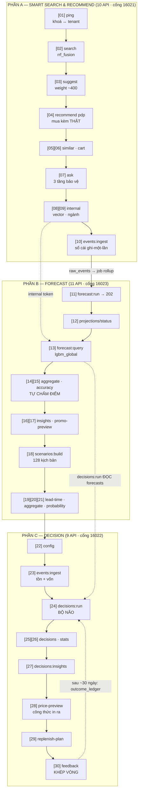
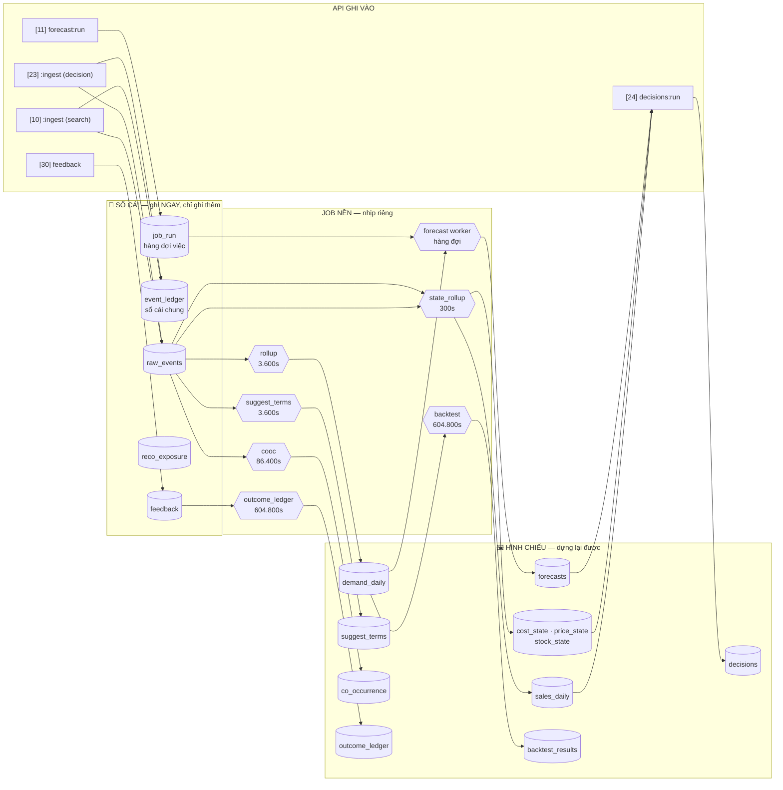

# DEMO 2 — SẢN PHẨM ĐÃ CÓ ĐỦ DỮ LIỆU: hệ chạy hết công suất
> Kịch bản 30 API, trọn 1 vòng: **smart search → recommend → forecast → decision → phản hồi**.
> SKU: **`bh-mi-haohao`** — "Thùng 30 gói mì Hảo Hảo tôm chua cay", **~132 ngày lịch sử**.
> **Số liệu đo lại toàn bộ ngày 2026-08-12**; **nâng lên khuôn INPUT/RESPONSE/LUỒNG ngày 2026-08-13**
> (xem mục **"NÂNG KHUÔN 13/08"** ở cuối file).
> **Chạy song song với DEMO-1** để khách thấy khác biệt giữa hàng mới và hàng đã có lịch sử.
>
> ⚠ **LUẬT ĐỌC SỐ:** mọi con số in trong file là **ảnh chụp của một lần đo**, không phải hằng số.
> Các bảng chỉ-ghi-thêm (`reco_exposure`, `raw_events`, `suggest_terms.weight`, số dòng `job_run`)
> **lớn dần mỗi ngày. LUÔN ĐỌC TỪ MÀN HÌNH**, chỉ đối chiếu **hiệu số** và **hình dạng** kết quả.
>
> ⭐ **MỖI API ĐỀU CÓ 4 BƯỚC + 2 BẢNG HỢP ĐỒNG:**
> ① **ĐO TRƯỚC** → ② **GỌI API** → 📥 **INPUT** → 📤 **RESPONSE** → ③ **ĐO SAU** → ④ **LUỒNG**.
> Hai bảng hợp đồng lấy **từ MÃ NGUỒN, có `file:line`** — không lấy từ trí nhớ, **không tin `openapi.json`**
> (đo được: `openapi/decision.json` thiếu `product_id`, tức hợp đồng máy cũ hơn mã).
>
> ⛔ **LUẬT NGHIỆM THU (human chốt 2026-08-12):** hai kịch bản chỉ HOÀN THIỆN khi chạy end-to-end đủ
> **4 LƯỢT LIÊN TIẾP** không lỗi, trên **cùng một bản code**; deploy giữa chừng ⇒ **đếm lại từ 1**.
> Log mỗi lượt lưu ở `icpp/demo-e2e-runs/`. Xem giải thích đầy đủ ở đầu **DEMO-1**.

## THÔNG ĐIỆP BÁN HÀNG CỦA MÀN NÀY
Cùng bộ API đó, trên sản phẩm đã bán 4 tháng: hệ **không còn phải mượn** gì cả — độ co giãn giá ước lượng
riêng cho SKU này từ **132 điểm dữ liệu**, mô hình dự báo được **chấm điểm và chọn tự động**, và hệ **tự công
bố điểm số của chính mình**. Mọi con số đều truy ngược được tới công thức và tới bảng dữ liệu.

---
# 🗺️ BẢN ĐỒ 30 API — ĐỌC TRƯỚC KHI CHẠY

## 1. Ba phần, một vòng dữ liệu khép kín



⭐ **Hai mũi tên nét đứt là kiến trúc:** `forecast` hỏi `smartsearch` bằng **token nội bộ** (không dùng key
khách), và `decision` **đọc kết quả dự báo** chứ không tự dự báo. Ba service, một dòng dữ liệu.

## 2. Bảng chức năng 30 API

| # | API | Cổng | Trả lời câu hỏi gì | Ghi/Đọc | Hợp đồng ở đâu |
|---|---|---|---|---|---|
| **[01]** | `GET /v1/ping` | 16021 | *"Khoá này của shop nào?"* | chỉ đọc `api_keys` | **file này** |
| **[02]** | `POST /v1/search` | 16021 | *"Gõ 'mi hao hao' có ra không?"* | **GHI** `query_log` + `attribution` | DEMO-1 `[02]` |
| **[03]** | `GET /v1/suggest` | 16021 | *"Gõ 2 chữ, gợi ý gì?"* | chỉ đọc `suggest_terms` | DEMO-1 `[03]` |
| **[04]** | `POST /v1/recommend` pdp | 16021 | *"Mua kèm gì?"* — có hành vi thật | **GHI** `reco_exposure` | DEMO-1 `[04]` |
| **[05]** | `POST /v1/recommend` similar | 16021 | *"Món nào thay thế được?"* | **GHI** `reco_exposure` | `[04]` + delta |
| **[06]** | `POST /v1/recommend` cart | 16021 | *"Trong giỏ nên thêm gì?"* | **GHI** `reco_exposure` | `[04]` + delta |
| **[07]** | `POST /v1/ask` | 16021 | *"Tai nghe chống ồn tốt không?"* | **GHI** `query_log` (qua self-call) | DEMO-1 `[05]` |
| **[08]** | `GET /internal/similar-products` | 16021 | *"5 hàng xóm gần nhất?"* — **nội bộ** | chỉ đọc Vespa | DEMO-1 `[06]` |
| **[09]** | `GET /internal/products-by-category` | 16021 | *"Ngành này có SKU nào?"* — **nội bộ** | chỉ đọc `products` | **file này** |
| **[10]** | `POST /v1/events:ingest` | 16021 | *"Khách vừa xem / thêm giỏ"* | **GHI** `raw_events` + sổ cái chung | **file này** |
| **[11]** | `POST /v1/forecast:run` | 16023 | *"Tính lại dự báo"* → **202** | **GHI** `job_run` | **file này** |
| **[12]** | `GET /v1/projections/status` | 16023 | *"Chạy xong chưa?"* | chỉ đọc `job_run` + sổ cái | **file này** |
| **[13]** | `POST /v1/forecast:query` | 16023 | *"14 ngày tới bán bao nhiêu?"* | chỉ đọc `forecasts` | DEMO-1 `[07]` + delta |
| **[14]** | `POST /v1/forecast:aggregate` | 16023 | *"Cả ngành bán bao nhiêu?"* | chỉ đọc | **file này** |
| **[15]** | `GET /v1/forecast:accuracy` | 16023 | *"Dự báo của anh sai bao nhiêu?"* | chỉ đọc `backtest_results` | **file này** |
| **[16]** | `POST /v1/forecast:insights` | 16023 | 6 câu hỏi nghiệp vụ BT03 | chỉ đọc | **file này** |
| **[17]** | `POST /v1/forecast:promo-preview` | 16023 | *"Giảm 30% bán thêm bao nhiêu?"* | ⭐ **KHÔNG GHI** | **file này** |
| **[18]** | `POST /v1/scenarios:build` | 16023 | *"Dựng 128 thế giới có thể xảy ra"* | **GHI** `scenario_manifest` + 3 tệp | DEMO-1 `[14]` + delta |
| **[19]** | `POST /v1/scenarios:lead-time-demand` | 16023 | *"Chờ hàng 3 ngày cần bao nhiêu?"* | chỉ đọc hiện vật | **file này** |
| **[20]** | `POST /v1/scenarios:aggregate` | 16023 | *"Tổng cả nhóm trong 7 ngày?"* | chỉ đọc hiện vật | **file này** |
| **[21]** | `POST /v1/scenarios:probability` | 16023 | *"Xác suất bán ≥ 30 thùng?"* | chỉ đọc hiện vật | **file này** |
| **[22]** | `GET /v1/config` | 16022 | *"Chính sách giá của shop tôi?"* | chỉ đọc `project_config` | **file này** |
| **[23]** | `POST /v1/events:ingest` | 16022 | *"Tồn kho + giá vốn mới"* | **GHI** `raw_events` | `[10]` + delta |
| **[24]** | `POST /v1/decisions:run` | 16022 | *"Quét cả shop, có gì cần khuyên?"* | **GHI** `decisions` | DEMO-1 `[15]` + delta |
| **[25]** | `GET /v1/decisions` | 16022 | *"Cho tôi xem lời khuyên"* | chỉ đọc | DEMO-1 `[16]` |
| **[26]** | `GET /v1/decisions:stats` | 16022 | *"Tôi nghe máy bao nhiêu %?"* | chỉ đọc | **file này** |
| **[27]** | `GET /v1/decisions:insights` | 16022 | *"Vốn đọng bao nhiêu?"* + 5 câu | chỉ đọc (+ DB search) | **file này** |
| **[28]** | `POST /v1/decisions:price-preview` | 16022 | *"Hạ giá 99k thì sao?"* | chỉ đọc | DEMO-1 `[08]` + delta |
| **[29]** | `GET /v1/decisions:replenish-plan` | 16022 | *"Khi nào đặt, đặt bao nhiêu?"* | chỉ đọc | DEMO-1 `[19]` + delta |
| **[30]** | `POST /v1/decisions/{id}:feedback` | 16022 | *"Tôi đồng ý với lời khuyên này"* | **GHI** `feedback` | DEMO-1 `[20]` |

⚠ **Nhìn cổng là biết service.** Dùng nhầm khoá sang service khác ⇒ **401**.
`16021` smartsearch (`$SKEY`) · `16022` decision (`$DKEY`) · `16023` forecast (`$FKEY`) · `/internal/*` dùng `$ITOK`.

⭐ **Vì sao 12 API "trỏ về DEMO-1" chứ không chép lại bảng:** đó là **cùng một hàm, cùng một tenant, cùng một
bản code** — hợp đồng INPUT/RESPONSE **không thể khác**. Chỉ **NHÁNH được đi bên trong** là khác (có dữ liệu
vs chưa có). Chép lại bảng = đẻ ra hai bản sự thật sẽ lệch nhau sau bản vá đầu tiên. Ở mỗi chỗ trỏ về, file
này ghi **đúng phần KHÁC** — và phần khác ấy chính là thông điệp của buổi demo.

## 3. Dữ liệu chảy đi đâu — SỔ CÁI vs HÌNH CHIẾU



⭐⭐ **Mẫu hình cốt lõi — hiểu nó là hiểu 90% buổi demo:**

| | 📕 **SỔ CÁI** | 🖼 **HÌNH CHIẾU** |
|---|---|---|
| Ghi lúc nào | **ngay lập tức** khi API nhận | theo **nhịp job nền** |
| Sửa được không | ⛔ **KHÔNG BAO GIỜ** — chỉ ghi thêm | ✅ xoá sạch vẫn **dựng lại được** |
| Hỏng thì sao | mất là mất thật | chạy lại job là có lại |
| Ví dụ | `raw_events` · `event_ledger` · `feedback` | `demand_daily` · `forecasts` · `decisions` |

> **"Ghi nhanh, tính chậm."** Cửa vào chỉ làm mỗi việc rẻ nhất — ghi thêm một dòng; mọi phép tính nặng đẩy
> sang nền. Đó là lý do 10.000 đơn/phút vẫn chỉ là 10.000 lần ghi thêm.

## 4. Nhịp job nền — đo từ mã, không đoán

| Job | Nhịp | Nuôi bảng nào | Mã nguồn |
|---|---|---|---|
| `vespa_feed` | **2 giây** | Vespa index | `smartsearch/app/jobs/vespa_feed.py:304` |
| `embed_backfill` | **300 giây** | vector + `products.embedding_version` | `embed_backfill.py:78` |
| `click-join` | **300 giây** | `click_log` | `learning_jobs.py:463` |
| `user_profile` | **300 giây** | `user_profile` | `user_profile.py:209` |
| `state_rollup` | **300 giây** | `sales_daily` · `cost_state` · `price_state` · `stock_state` | `decision/app/jobs/state_rollup.py:354` |
| `popularity` · `reviews` | **3.600 giây** | `popularity` · `products.rating_avg` | `learning_jobs.py:464,466` |
| `suggest_terms` | **3.600 giây** | `suggest_terms` | `suggest_terms.py:143-147` |
| `rollup` | **3.600 giây** | `demand_daily` | `forecast/app/jobs/rollup.py:360` |
| `cooc` | **86.400 giây** | `co_occurrence` | `learning_jobs.py:465` |
| `forecast_run` | **86.400 giây** | `forecasts` | `forecast_run.py:1948` |
| `decisions_run` | **86.400 giây** | `decisions` | `decisions_run.py:1914` |
| `backtest` | **604.800 giây** | `backtest_results` | `backtest_run.py:519` |
| `outcome_ledger` | **604.800 giây** | `outcome_ledger` | `outcome_ledger.py:29` |

⭐ **Nhịp là một HỢP ĐỒNG, không phải chi tiết kỹ thuật.** Khách hỏi *"sao tồn kho chưa đổi?"* — trả lời
được bằng con số: *"300 giây, và anh chị nhìn được nó đổi ngay tại bước [23]."*

---
## CHUẨN BỊ
```bash
cd /home/hai-soft/projects/icpp/mecom/project
SKEY=$(.venv/bin/python -c "import json;print(json.load(open('data/seed_keys_demoshop.json'))['search'])")
DKEY=$(.venv/bin/python -c "import json;print(json.load(open('data/seed_keys_demoshop.json'))['decision'])")
FKEY=$(.venv/bin/python -c "import json;print(json.load(open('data/seed_keys_demoshop.json'))['forecast'])")
ITOK=$(docker exec miniai-smartsearch printenv MINIAI_INTERNAL_TOKEN)
SKU=bh-mi-haohao
EVT=$(date -u +%Y-%m-%dT%H:%M:%SZ)
```
**BỘ ĐO** — dán cả khối `q()` và `snap()` từ **DEMO-1 mục CHUẨN BỊ** (dùng chung).

> ⛔ **KHÔNG chạy `reset1` cho kịch bản này.** `reset1` dọn SKU của DEMO-1 (`demo-mi-omachi`); màn này
> sống bằng **132 ngày lịch sử có sẵn** của `bh-mi-haohao` — xoá đi là mất toàn bộ thông điệp.

### Ảnh chụp mở màn — chiếu lên để khách thấy "đây là hàng có lịch sử"
```bash
snap bh-mi-haohao
```
**Đo thật 12/08:**
```
search  : products=1  outbox_đang_chờ=0  reco_exposure=1574
forecast: raw_events=13604  demand_daily=134  forecasts=168
decision: raw_events=17519  sales_daily=132  decisions=1587  tồn=137  vốn=70145
```
**Nói ngay:** *"So với DEMO-1: chỗ đó `demand_daily=0`, ở đây **134 ngày**. Toàn bộ khác biệt của buổi hôm nay
nằm ở hai con số này."*

> ⚠⚠ **ĐỌC TỪ MÀN HÌNH, ĐỪNG ĐỌC THUỘC — số ở đây DỊCH CHUYỂN sau mỗi lượt demo, và ĐÓ LÀ ĐÚNG.**
> Khác DEMO-1 (sân sạch, có `reset1` đưa về vạch xuất phát), DEMO-2 chạy trên **shop đang sống** — nên
> *"dữ liệu tích luỹ"* vừa là thông điệp bán hàng, vừa là **hành vi thật của chính kịch bản này**.
> Đo lại 13/08 sau ~15 lượt: `tồn = 120` (không phải 137, xem `[23]`) · `vốn = 69.526` (không phải 70.145).
> **Chỉ cần đúng HÌNH DẠNG là được:** `demand_daily ≈ 134 ngày` ≫ `0` của DEMO-1 — đó mới là điểm so sánh.
> Bảng nào trôi, trôi tới đâu, có nguy hiểm không: xem `[23]` ③ và `[03]` (`weight` 334,8 → 401,28).

Cổng: smartsearch **16021** · decision **16022** · forecast **16023**.

---
# PHẦN A — SMART SEARCH & RECOMMEND (10 API)

## [01] GET /v1/ping — xác thực key, và chứng minh khoá GẮN CHẶT với tenant
**Ý nghĩa:** API rẻ nhất trong hệ, nhưng nó trả lời câu hỏi **đắt nhất về an toàn đa-tenant**:
*"làm sao anh biết tôi là shop nào?"* — và câu trả lời là: **không phải vì khách tự khai**.

### ② GỌI API
```bash
curl -s localhost:16021/v1/ping -H "Authorization: Bearer $SKEY" -H "X-Project-Id: demoshop"
```
**OUTPUT thật:** `{"pong":true,"project_id":"demoshop"}`

#### 📥 INPUT — **không có tham số nào; toàn bộ hợp đồng nằm ở 2 HEADER**

Handler (`smartsearch/app/main.py:503-507`) chỉ đọc `request.state.project_id` — thứ do **middleware xác thực**
(`main.py:510-589`) đặt vào **sau khi** đã kiểm khoá. Ba service dùng chung khuôn này:
`decision/app/main.py:324-328` · `forecast/app/main.py:352-356`.

| Vị trí | Trường | Bắt buộc | Kiểu & ràng buộc | Mặc định | Ý nghĩa nghiệp vụ |
|---|---|:---:|---|---|---|
| header | `Authorization` | **✔** | chuỗi, **phải bắt đầu bằng `Bearer `** (`main.py:519`) | — | khoá API của shop. Sai tiền tố ⇒ `401 UNAUTHENTICATED` |
| header | `X-Project-Id` | **✔** | chuỗi không rỗng (`main.py:526-532`) | — | ⭐ **mã shop khách TỰ KHAI** — và nó phải **KHỚP** chủ sở hữu của khoá |
| thân | *(không có)* | | | | `GET`, không thân yêu cầu |

⭐⭐ **Hai header, không phải một — và đó là cả cơ chế an toàn.** Nếu chỉ có khoá thì hệ vẫn suy ra được
tenant; `X-Project-Id` tồn tại để tạo ra một phép **đối chiếu**: `verifier.verify(api_key, project_id)`
(`main.py:535`) băm khoá kèm pepper, tra `api_keys`, rồi **so chủ sở hữu với mã khách vừa khai**. Cầm khoá
shop A mà khai shop B ⇒ `401`. Khai đúng ⇒ mọi truy vấn Postgres sau đó đi qua `TenantPool`
(`main.py:567-570`) đặt `app.project_id` cho **RLS** — lớp khoá thứ hai, nằm trong CSDL.

#### 📤 RESPONSE — **đúng 2 trường, và cả hai đều là lời TỰ KHAI**

| Trường | Kiểu | Ý nghĩa | Đọc thế nào |
|---|---|---|---|
| `pong` | luận lý | luôn `true` | 200 = **khoá hợp lệ + còn `state='active'`**, không phải "service còn sống" |
| **`project_id`** | chuỗi | ⭐ **tenant đã được XÁC THỰC** | soi lại: đây là shop mà hệ **thật sự** sẽ đọc/ghi dữ liệu, không phải chuỗi khách gửi lên |

⚠ **`/v1/ping` KHÔNG phải health-check.** Health-check là `/healthz` (`main.py:477`) và `/readyz`
(`main.py:482`) — hai đường đó **không qua xác thực** vì chúng phục vụ hệ giám sát. `/v1/ping` **có** xác thực
vì nó phục vụ **khách đang tích hợp**: câu nó trả lời là *"khoá tôi vừa cắm vào có chạy không, và nó thuộc shop nào"*.

### ③ ĐO SAU — chứng minh key này gắn đúng tenant
```bash
q miniai_search "SELECT key_id, project_id, state FROM api_keys WHERE project_id='demoshop' AND state='active' LIMIT 3;"
```
**Đo thật:** các dòng trả về đều mang `project_id='demoshop'` — **không có bảng nào lưu khoá thô**, chỉ lưu
`key_hash`.

### ④ LUỒNG — **một yêu cầu đi qua 4 chốt trước khi chạm handler**

```
curl ... -H "Authorization: Bearer <khoá>" -H "X-Project-Id: demoshop"
   │
   ├─🚪 CHỐT 1 — middleware xác thực          (main.py:510-536)
   │     tiền tố "Bearer " ? ......... không ⇒ 401 UNAUTHENTICATED
   │     có X-Project-Id ?  ......... không ⇒ 401 UNAUTHENTICATED
   │     verify(khoá, project_id):
   │        băm khoá + PEPPER ──► tra api_keys (key_hash, state='active')
   │        chủ sở hữu ≠ project_id khách khai ⇒ 401
   │           ⭐ khoá KHÔNG BAO GIỜ nằm trong DB ở dạng thô
   │
   ├─🚪 CHỐT 2 — hạn mức gọi                   (main.py:539-556)
   │     lớp 'ingest' cho :ingest/:backfill/:upsert · lớp 'query' cho phần còn lại
   │     vượt ⇒ 429 + đếm quota_rejections_total{resource="api_rate"}
   │
   ├─🚪 CHỐT 3 — gắn danh tính vào request     (main.py:562-563)
   │     request.state.project_id ◄── LẤY TỪ KHOÁ ĐÃ XÁC THỰC, không từ URL/thân
   │
   ├─🚪 CHỐT 4 — RLS trong Postgres            (main.py:567-570)
   │     TenantPool: SET LOCAL role miniai_app + app.project_id = <tenant>
   │     policy V015 lọc MỌI câu SELECT/INSERT theo project_id
   │        ⭐ lập trình viên QUÊN WHERE project_id thì CSDL vẫn chặn
   │
   └─► handler v1_ping  ──►  {"pong": true, "project_id": "demoshop"}
```

**Bảng đọc/ghi — API rẻ nhất cả buổi:**

| Bảng | Đọc | Ghi | Ai nuôi bảng đó | Nhịp job |
|---|:---:|:---:|---|---|
| `api_keys` | ✔ (qua `verifier`) | ✗ | `scripts/keys.py` khi cấp khoá | — |
| `quota_counter` | ✔ | ✗ | chính đường xác thực | ngay |
| **mọi bảng khác** | ✗ | ✗ | | ⭐ **API này KHÔNG GHI GÌ** |

⭐⭐ **Vì sao đáng dừng lại 30 giây ở đây:** cả buổi demo còn lại là **các con số**; bước này là thứ duy nhất
nói về **ranh giới**. Kiến trúc đa-tenant hỏng thì mọi con số phía sau đều vô giá trị — shop A nhìn thấy
doanh số shop B là sự cố **không bản vá nào chuộc lại được**. Hệ này khoá **hai lớp**: lớp ứng dụng
(`project_id` chỉ đến từ khoá đã xác thực) và lớp CSDL (RLS). Lớp hai tồn tại vì lớp một là **con người viết** —
và con người quên `WHERE`.

**Nói với khách:** *"Khách **không tự khai** mình là ai — `X-Project-Id` phải KHỚP với khoá. Cầm khoá shop A
mà khai shop B là bị chặn. Đây là lớp khoá thứ nhất; lớp thứ hai là RLS trong Postgres — nếu lập trình viên
của tôi quên một dòng lọc, cơ sở dữ liệu vẫn không cho lấy dữ liệu shop khác."*

---
## [02] POST /v1/search — tìm kiếm lai, gõ không dấu vẫn ra
### ① ĐO TRƯỚC
```bash
q miniai_search "SELECT coalesce(sum(cnt),0) AS lan_tim FROM query_log WHERE project_id='demoshop' AND query_norm='mi hao hao';"
```
### ② GỌI API
```bash
curl -s localhost:16021/v1/search -H "Authorization: Bearer $SKEY" -H "X-Project-Id: demoshop" -H "Content-Type: application/json" -d '{"query":"mi hao hao","page_size":3}' | .venv/bin/python -c "import json,sys; [print(round(i['score'],4),'|',i['product_id'],'|',i.get('source')) for i in json.load(sys.stdin)['items']]"
```
**OUTPUT thật 12/08**
```
0.0328 | bh-mi-haohao       | rrf_fusion
0.0323 | tt-somi-nam-oxford | rrf_fusion
```

#### 📥 INPUT — **11 trường, chỉ `query` bắt buộc** → bảng đầy đủ ở **DEMO-1 `[02]`**
Cùng handler `smartsearch/app/main.py:994-1096`, cùng bản code, cùng tenant ⇒ hợp đồng **không khác một chữ**.

#### 📤 RESPONSE — bảng đầy đủ (10 trường + 6 giá trị `source`) ở **DEMO-1 `[02]`**

**KHÁC DEMO-1 ở đúng một chỗ — `source`, và đó là điểm khoe:**

| | DEMO-1 (`omachi`, hàng mới) | DEMO-2 (`mi hao hao`) |
|---|---|---|
| `source` | `vespa_bm25` — router chọn **nhánh từ khoá** | **`rrf_fusion`** — đã trộn 2 bảng xếp hạng |
| Thang `score` | hàng đơn vị (**10.22**) | hàng phần trăm (**0.0328**) |
| Nghĩa | tên thương hiệu hiếm ⇒ khớp chữ là đủ | câu **nhiều nghĩa** ⇒ phải trộn chữ + vector |

> ⛔ **ĐỪNG so `score` giữa hai lần gọi khác `source`.** RRF cho điểm bằng `1/(60 + thứ_hạng)` nên **luôn < 1**.
> `0.0328` không hề "tệ hơn" `10.22` — chúng **khác đơn vị đo**.

### ③ ĐO SAU
```bash
sleep 2; q miniai_search "SELECT cnt, results_count_last, user_cnt FROM query_log WHERE project_id='demoshop' AND query_norm='mi hao hao';"
```
**Đo thật:** `cnt` tăng đúng 1. ⚠ `user_cnt` **đứng yên ở 0** — xem ④.

### ④ LUỒNG — **giống DEMO-1 `[02]` (7 chặng + GHI HAI CUỐN SỔ), khác đúng 2 điểm**

> ⛔⛔ **ĐÃ VÁ 13/08 — mũi tên cũ ở dòng này SAI, cùng lỗi DEMO-1 đã vá.** Bản cũ vẽ:
> `query_log ──job suggest_terms──► gợi ý gõ phím CÓ TRỌNG SỐ`.
> **Đúng nửa đầu, sai nửa sau.** Trên sân `demoshop` nguồn học-từ-khách **CHƯA TỪNG CHẠY**: nó sinh
> `weight = 10 × cnt` tức **luôn chia hết cho 10**, mà đo thật 13/08 được **0/1.746** cụm có `weight` là bội
> của 10. Toàn bộ `weight ≈ 400` ở `[03]` đến từ **nguồn (a) — cắt tiêu đề**, không phải từ lượt tìm của khách.
> Gốc bệnh: `user_pseudo_id` là trường **tuỳ chọn** của `/v1/search` mà không lệnh gọi nào truyền ⇒ `user_cnt`
> mãi bằng 0 ⇒ **không bao giờ với tới ngưỡng k-anonymity ≥ 5**. (Nợ: `W-SUGGEST-QLOG-SOURCE-B-DEAD`.)

**Sơ đồ ĐÚNG cho sân demo:**
```
câu khách gõ "mi hao hao"
   │
   ├─① query_parse ─► ② parse_intent ─► ③ router (p_semantic ≥ 0.25 ⇒ "semantic")
   │
   ├─④ Vespa lượt 1: hồ sơ hybrid (chữ + vector), 100 ứng viên
   ├─⑤ Vespa lượt 2: hồ sơ bm25 THUẦN            (main.py:1310-1322)
   │      └─ RRF trộn 2 bảng xếp hạng: điểm = Σ 1/(60 + thứ_hạng)   ⇒ source = rrf_fusion
   │         ⚠ chỉ chạy khi: cờ SEARCH_RRF_FUSION=1 · CÓ vector · sort=relevance · có kết quả
   │
   ├─⑥ intent_rerank ─► ⑦ merch rules
   │
   └─► items[] + attribution_token
           │
           ├──► 📕 SỔ 1 query_log   (cnt++ ; user_cnt++ CHỈ KHI có user_pseudo_id)
           │        └──job suggest_terms (3.600s)──► ✗ CHẶN Ở CỔNG k-anon ⇒ 0 dòng qua
           │        └──job drift (86.400s) ──► cảnh báo trôi phân phối
           │
           └──► 📗 SỔ 2 attribution (token + DANH SÁCH ĐẦY ĐỦ CÓ THỨ TỰ)
                    └──job click-join (300s)──► click_log ──► HỌC XẾP HẠNG
                       ⚠ đo thật: attribution 686 dòng · click_log 0 dòng — ỐNG RỖNG,
                         cùng một gốc bệnh: không ai gửi user_pseudo_id
```

**Bảng đọc/ghi:**

| Bảng | Đọc | Ghi | Loại | Nhịp |
|---|:---:|:---:|---|---|
| Vespa index | ✔ (2 lần) | ✗ | 🖼 hình chiếu | `vespa_feed` 2s |
| `query_log` | ✗ | ✍ `cnt++` | 📕 chỉ-ghi-thêm | ngay |
| `attribution` | ✗ | ✍ 1 dòng | 📕 chỉ-ghi-thêm | ngay |
| `impression_log` | ✗ | ✍ 1 dòng/item | 📕 chỉ-ghi-thêm (fire-and-forget) | ngay |
| `products` (categories, rating) | ✔ | ✗ | 📕 sổ cái hàng hoá | — |

⭐ **Vì sao RRF đáng có mặt — có SỐ ĐO, không phải niềm tin** (`main.py:94-108`, bench 2026-08-05):
giá phải trả **+7,1 ms** trung vị mỗi truy vấn (+2,5% p50), đổi lại `eval/vn_selftest` đi từ **33/40 → 35/40**
trên **cùng một cặp container**. Tắt được bằng `SEARCH_RRF_FUSION=0`, không cần deploy.
*"Mỗi thứ bật trong hệ này đều có một dòng đo đi kèm — và một cái công tắc tắt."*

> ⚠ Vị trí #2 là "áo sơ **mi**" — âm tiết "mi" 2 ký tự gây nhiễu khi bỏ dấu. Điểm yếu đã đo, đã ghi sổ
> (`W-SEARCH-UNACCENT-ASYMMETRY`). Nói trước vẫn hơn bị khách bắt gặp.

---
## [03] GET /v1/suggest — gợi ý gõ phím có trọng số theo độ phổ biến
### ① ĐO TRƯỚC — trọng số nằm sẵn trong bảng
```bash
q miniai_search "SELECT term, round(weight::numeric,2) FROM suggest_terms WHERE project_id='demoshop' AND term LIKE 'mì%' ORDER BY weight DESC LIMIT 4;"
```
> 🆕 **Đã vá 13/08 — bản cũ viết `round(weight,2)`, lệnh NỔ ngay:**
> `ERROR: function round(double precision, integer) does not exist`.
> `suggest_terms.weight` kiểu `double precision`, Postgres chỉ có `round(numeric, int)` → phải ép `::numeric`.
### ② GỌI API
```bash
curl -s "localhost:16021/v1/suggest?q=mi&limit=4" -H "Authorization: Bearer $SKEY" -H "X-Project-Id: demoshop" | .venv/bin/python -m json.tool
```
**OUTPUT thật 12/08**
```json
{"items": [{"text": "mì hảo hảo", "weight": 376.96}, {"text": "mì", "weight": 376.96},
           {"text": "mì hảo", "weight": 376.96}, {"text": "miếng", "weight": 353.00}],
 "consistency": {"projection_watermark": …, "data_as_of": "…", "is_caught_up": true, "ledger_head": …}}
```

#### 📥 INPUT — **`GET`, đúng 2 tham số URL** → bảng đầy đủ ở **DEMO-1 `[03]`**
Cùng handler `smartsearch/app/main.py:1970-1987`: `q` bắt buộc (rỗng ⇒ `400`), `limit` **1–20** mặc định `8`.

> 💡 **Gõ tay dễ hỏng dấu tiếng Việt.** Dùng `--get --data-urlencode` thay vì nhét thẳng `?q=mì` vào URL.

#### 📤 RESPONSE — **chỉ 2 khoá; trả CHỮ, không trả HÀNG** → bảng đầy đủ ở **DEMO-1 `[03]`**

**KHÁC DEMO-1 ở đúng con số — và con số đó LÀ thông điệp:**

| | DEMO-1 (hàng mới) | DEMO-2 (đã bán 4 tháng) |
|---|---|---|
| `items[].weight` | **1.0** — điểm khởi đầu | **376.96** (12/08) → **401.28** (13/08) |
| Phải kích job không? | ⛔ **CÓ** — bảng rỗng, không kích thì trắng màn hình | ✅ **KHÔNG** — cụm từ đã nằm sẵn |
| Gõ mấy chữ ra cụm đầy đủ | `omachi` (6 ký tự) | **`mi` (2 ký tự)** ra `mì hảo hảo` **có dấu** |

⭐ **`weight` chỉ đi lên, không có cơ chế quên** (`ON CONFLICT ... GREATEST(cũ, mới)`): nó là **mức nước cao
nhất từng đạt**. Đó là lý do con số cứ lớn dần — `334.8` (07/08) → `376.96` (12/08) → `401.28` (13/08).
**Đừng đọc thuộc, hãy đọc từ màn hình.** Điểm so sánh với `1.0` bên DEMO-1 thì không đổi.

### ③ ĐO SAU — số của API **phải khớp** số trong bảng
```bash
q miniai_search "SELECT term, round(weight::numeric,2) FROM suggest_terms WHERE project_id='demoshop' AND term IN ('mì','mì hảo hảo') ORDER BY weight DESC;"
```

### ④ LUỒNG — **giống DEMO-1 `[03]`; khác ở NGUỒN NUÔI đang thật sự chạy**
Toàn bộ thân hàm chỉ là **MỘT câu SQL** (`main.py:1997-2009`) khớp **TIỀN TỐ** trên `term_unaccent` —
không đụng Vespa, không mã hoá vector. Vì thế nó chỉ vài mili-giây, bắt buộc phải vậy: khách gõ **mỗi phím
là một lần gọi**.

```
┌── NGUỒN (a): CẮT TIÊU ĐỀ SẢN PHẨM ────────────────────────────────────┐
│  products.title ──► _ngrams(title, max_n=3) ──► mọi cụm 1, 2, 3 từ    │
│  weight = 1.0 + popularity.score_7d   ◄── ⭐ ĐÂY LÀ NGUỒN DUY NHẤT     │
│                                            đang chạy trên demoshop     │
└───────────────────────────────────────────────────────────────────────┘
                                                    ├──► suggest_terms
┌── NGUỒN (b): HỌC TỪ CÂU KHÁCH ĐÃ GÕ ──────────────────────────────────┐
│  query_log ──① cnt≥2 + có kết quả ──② không PII ──③ không từ cấm       │
│            ──④ user_cnt ≥ 5  ◄── k-ANONYMITY                          │
│  weight = 10.0 × cnt                                                  │
│  ❌ ĐO THẬT 13/08: 0/1.746 cụm có weight chia hết cho 10 ⇒ CHƯA CHẠY   │
└───────────────────────────────────────────────────────────────────────┘
```

**Bảng đọc/ghi:**

| Bảng | Đọc | Ghi | Ai ghi | Nhịp |
|---|:---:|:---:|---|---|
| `suggest_terms` | ✔ (API) | ✗ (API) — ✍ job | job `suggest_terms` | **3.600 giây** |
| `products.title` | — | — | nguồn (a) đọc | — |
| `popularity.score_7d` | — | — | job `popularity` | 3.600 giây |
| `query_log` | — | — | nguồn (b) đọc — **đang bị chặn ở cổng ④** | — |

⭐⭐ **Cổng k-anonymity ≥ 5 KHÔNG SAI — hỏng ở khớp nối.** Câu hiếm là **dấu vân tay của một người**: đưa
*"thuốc tiểu đường cho mẹ"* lên ô gợi ý công khai là **bán đứng người đó**. Ngưỡng đúng; cái thiếu là
`user_pseudo_id`. *"Chỗ này chúng tôi trả lời được ngay vì đã đo — chứ không phải đoán rằng nó đang chạy."*

---
## [04] POST /v1/recommend (context=pdp) — mua kèm THẬT, học từ hành vi
### ① ĐO TRƯỚC — tri thức "mua chung" nằm ở đâu
```bash
q miniai_search "SELECT product_b, cnt, round(lift::numeric,2) FROM co_occurrence WHERE project_id='demoshop' AND product_a='$SKU' ORDER BY lift DESC LIMIT 3;"
q miniai_search "SELECT count(*) FROM reco_exposure WHERE project_id='demoshop';"
```
### ② GỌI API
```bash
curl -s localhost:16021/v1/recommend -H "Authorization: Bearer $SKEY" -H "X-Project-Id: demoshop" -H "Content-Type: application/json" -d '{"context":"pdp","product_id":"bh-mi-haohao"}' | .venv/bin/python -c "import json,sys; [print(round(i['score'],1),'|',i['product_id'],'|',i['title'][:40]) for i in json.load(sys.stdin)['items'][:3]]"
```
**OUTPUT thật 12/08**
```
148.4 | bh-snack-oishi     | Snack Oishi tôm cay 42g (lốc 10)
119.8 | bh-xucxich-ducviet | Xúc xích tiệt trùng Đức Việt gói 500g
  0.3 | bh-hatdieu-500g    | Hạt điều rang muối Bình Phước 500g
```

#### 📥 INPUT — **5 trường + 7 giá trị `context`** → bảng đầy đủ ở **DEMO-1 `[04]`**
Cùng handler `smartsearch/app/main.py:2040-2095`. Nhắc lại 3 ràng buộc hay vấp nhất:

| Trường | Ràng buộc thật (mã) | Vấp thường gặp |
|---|---|---|
| `context` | 7 giá trị ĐÓNG (`main.py:2050-2058`) | tên khác ⇒ `400` kèm **liệt kê đủ 7 giá trị hợp lệ** |
| `product_id` | bắt buộc với `pdp`/`similar`/`similar_items`/`also_viewed` (`:2209`, `:2338`, `:2498`) | thiếu ⇒ `400 'product_id' is required for context=...` |
| `page_size` | số nguyên **1–24**, mặc định `12` (`:2081-2087`) | trần **24**, hẹp hơn `/v1/search` (100) |

#### 📤 RESPONSE — 4 trường bọc ngoài → bảng đầy đủ ở **DEMO-1 `[04]`**

**KHÁC DEMO-1 ở NHÁNH ĐƯỢC ĐI — nhìn thang điểm là biết ngay:**

| | DEMO-1 (hàng mới, 0 hành vi) | DEMO-2 (đã bán 4 tháng) |
|---|---|---|
| Nhánh | ❄ **bậc thang cold-start**, nấc 1 `similar_by_content` | ✅ **đường chính**: trộn 60/40 |
| Nguồn A (60%) | rỗng | **`co_occurrence`** — "ai mua X thường mua kèm gì" |
| Nguồn B (40%) | rỗng | `similar-NN` vector Vespa |
| Thang `score` | **0–1** (nội dung) | **hàng trăm** — `lift × ln(1+cnt)` (`main.py:2226`) |
| `fallback` | `null` (nấc 1 vẫn là gợi ý THẬT) | `null` |

⭐⭐ **Đọc THANG ĐIỂM là đọc được hệ đang ở nấc nào — không cần hỏi ai.** `148.4` và `119.8` là **điểm mua-kèm
thật**; `0.3` ở vị trí 3 là **nấc nội dung** lọt vào qua nguồn B — **đúng bằng thang mà DEMO-1 nhận được cho
CẢ danh sách**. Hai thang nằm cạnh nhau trong cùng một câu trả lời, và khách nhìn thấy được.

### ③ ĐO SAU
```bash
sleep 2; q miniai_search "SELECT count(*) FROM reco_exposure WHERE project_id='demoshop';"
q miniai_search "SELECT product_id, position FROM (SELECT product_id, position, id FROM reco_exposure WHERE project_id='demoshop' ORDER BY id DESC LIMIT 12) t ORDER BY position LIMIT 3;"
```
**Đo thật:** `+12 dòng` (đúng bằng `page_size` mặc định), 3 vị trí đầu khớp thứ tự API vừa trả.

> 🆕 **Đã vá 13/08 — hai lỗi trong câu SQL cũ, cùng lỗi DEMO-1 đã vá.**
> (1) `position` **đánh số từ 0** (`main.py:2606` dùng `enumerate`), không phải từ 1.
> (2) `ORDER BY ts DESC` **không sắp được trong cùng một mẻ**: 12 dòng ghi một lượt có `ts` giống nhau tới
> micro-giây ⇒ Postgres trả 3 dòng **tuỳ ý**. Phải sắp theo **`id`** rồi mới sắp lại theo `position`.

### ④ LUỒNG — **đường chính (có hành vi), khác hẳn bậc thang của DEMO-1**

```
context=pdp, product_id=bh-mi-haohao
   │
   ├─ nguồn A (60%) bought_together        (main.py:2216-2229)
   │     đọc co_occurrence ──► score = lift × ln(1 + cnt)     ⇒ THANG TRĂM
   │     loại: chính X + mọi món user này ĐÃ MUA 7 ngày qua
   │
   ├─ nguồn B (40%) similar-NN             (main.py:2236-2241 → _similar_reco:2658)
   │     vector Vespa, lọc CÙNG NGÀNH, MMR λ=0.7 (đa dạng hoá)  ⇒ THANG 0–1
   │
   ├─► mix_sources(A, B, ratio=0.6) ──► items[] ,  fallback = null   ✅
   │
   │   ❄ CHỈ KHI A rỗng VÀ B rỗng mới tụt xuống bậc thang 3 nấc của DEMO-1
   │     (nấc 1 similar_by_content → nấc 2 popular CÙNG NGÀNH → nấc 3 popular toàn shop)
   │
   └──► ✍ reco_exposure: 12 DÒNG, position = 0,1,…,11   ⚠ ĐÁNH SỐ TỪ 0
             ├──► ghép click_log ──► khử THIÊN LỆCH VỊ TRÍ khi học xếp hạng
             └──► store/bandit ──► đếm lượt hiển thị cho thuật toán khám phá
```

**Bảng đọc/ghi:**

| Bảng | Đọc | Ghi | Ai nuôi | Nhịp |
|---|:---:|:---:|---|---|
| `co_occurrence` | ✔ | ✗ | job `cooc` từ `purchase.completed` | **86.400 giây** |
| Vespa (vector) | ✔ | ✗ | job `embed_backfill` | 300 giây |
| `products` (brands, category, rating) | ✔ | ✗ | `[10]`/`:upsert` | ngay |
| **`reco_exposure`** | ✗ | ✍ **1 dòng/sản phẩm** | **chính API này** | ngay |
| `attribution` · `impression_log` | ✗ | ✍ | chính API này (best-effort) | ngay |

⭐⭐ **Vì sao phải ghi `position`?** Vì món ở vị trí #1 **luôn** được bấm nhiều hơn, kể cả khi nó không hay
hơn món ở #8 — đơn giản vì khách **nhìn thấy nó trước**. Chỉ ghi *"món này được bấm"* mà không ghi *"nó nằm
ở đâu"* thì máy học đúng một bài vô dụng: **"cái gì đang ở trên thì cho lên trên"** — nó học thuộc chính nó.

⭐ **`co_occurrence` chạy nhịp 24 GIỜ, không phải thời gian thực — và đó là lựa chọn đúng.** Tri thức
"mua chung" cần **khối lượng đơn hàng** mới đáng tin; tính lại mỗi phút vừa tốn vừa cho ra `lift` nhảy loạn
theo vài đơn lẻ. *"Mì gói đi với snack và xúc xích — tri thức **học từ hành vi mua chung**, không ai lập trình tay."*

---
## [05] POST /v1/recommend (context=similar) — hàng thay thế
### ② GỌI API
```bash
curl -s localhost:16021/v1/recommend -H "Authorization: Bearer $SKEY" -H "X-Project-Id: demoshop" -H "Content-Type: application/json" -d '{"context":"similar","product_id":"bh-mi-haohao"}' | .venv/bin/python -c "import json,sys; d=json.load(sys.stdin); [print(round(i['score'],3),'|',i['title'][:40]) for i in d['items'][:4]]; print('source:',d['items'][0].get('source'))"
```

#### 📥 INPUT — **cùng endpoint `[04]`**, chỉ đổi `context`
| Trường | Khác gì so với `[04]` |
|---|---|
| `context` | `"similar"` |
| `product_id` | **✔ vẫn bắt buộc** (`main.py:2338-2343`) — thiếu ⇒ `400` |
| `user_pseudo_id` | tuỳ chọn; có thì hệ **loại hàng người này đã mua 7 ngày qua** |

#### 📤 RESPONSE — **cùng 4 trường `[04]`**; khác 2 giá trị đọc được
| Trường | Giá trị ở đây | Nghĩa |
|---|---|---|
| `items[].source` | **`reco_similar`** | tự khai đã đi nhánh nào (`main.py:2593` — `f"reco_{context}"`) |
| `items[].score` | **thang 0–1** | ⭐ **độ tương đồng nội dung**, KHÔNG cùng thang với `reco_pdp` |
| `fallback` | `null` = có vector thật · `"popularity"` = **đã phải chống chế** | `main.py:2348` còn bật cờ `X-Degraded` |

### ③ ĐO SAU
```bash
q miniai_search "SELECT context, count(*) FROM reco_exposure WHERE project_id='demoshop' AND ts > now()-interval '2 min' GROUP BY 1;"
```
**Đo thật:** thấy đúng `context=similar` vừa được ghi.

### ④ LUỒNG — **`_similar_reco`, và 2 lớp lọc mà `[04]` không có**

```
context=similar, product_id=X
   │
   ├─① product_info(X) ──► category_l1        (không có X trong kho ⇒ trả rỗng + fallback="popularity")
   ├─② Vespa get_document(X) ──► lấy VECTOR của chính X
   │      chưa có vector ⇒ ✗ rơi thẳng xuống popular CÙNG NGÀNH, fallback="popularity"
   ├─③ nearestNeighbor, target_hits=50, LỌC CỨNG theo category_l1   (main.py:2687-2694)
   ├─④ MMR λ=0.7 ──► chọn page_size món      ⭐ đa dạng hoá, không lấy 12 món na ná nhau
   ├─⑤ loại chính X + món đã mua 7 ngày
   └─⑥ apply_brand_cap(cap=2)                (main.py:2351-2355)
        ⭐ TỐI ĐA 2 MÓN CÙNG MỘT HÃNG — chống "cả trang toàn một nhãn"
```

**Bảng đọc/ghi:** y hệt `[04]` **trừ** `co_occurrence` (nhánh này **không đọc**) và **thêm** `products.brands`
cho trần-hãng.

⭐ **Hai lớp `[04]` không có — MMR và trần-hãng — tồn tại vì mục đích khác nhau.** PDP hỏi *"mua thêm gì"*
(càng bổ sung càng tốt); `similar` hỏi *"thay thế bằng gì"* (càng giống càng tốt) — mà **quá giống thì vô
dụng**: 12 gói mì cùng hãng khác vị không giúp khách quyết định. MMR đổi một chút độ giống lấy độ đa dạng;
trần-hãng chặn một nhãn chiếm hết màn hình.

**Trung thực:** chùm điểm sát nhau (đo DEMO-1: 0.3305 → 0.3149) ⇒ vector **phân biệt ngành còn yếu** vì kho
demo chỉ 136 SKU. Đã ghi sổ. *"Hệ liệt kê ra để anh chị bắt được — một hệ giấu danh sách thì anh chị đã tin
nhầm mà không biết vì sao."*

---
## [06] POST /v1/recommend (context=cart) — gợi ý trong giỏ hàng
### ② GỌI API
```bash
curl -s localhost:16021/v1/recommend -H "Authorization: Bearer $SKEY" -H "X-Project-Id: demoshop" -H "Content-Type: application/json" -d '{"context":"cart","product_ids":["bh-mi-haohao"],"user_pseudo_id":"demo-user-01"}' | .venv/bin/python -c "import json,sys; [print(round(i['score'],1),'|',i['title'][:40]) for i in json.load(sys.stdin)['items'][:3]]"
```

#### 📥 INPUT — **cùng endpoint `[04]`**, nhưng đổi hẳn trường bắt buộc
| Trường | Ràng buộc ở `context=cart` | Mã |
|---|---|---|
| `context` | `"cart"` | `:2357` |
| **`user_pseudo_id`** | ⛔ **BẮT BUỘC** — thiếu ⇒ `400 'user_pseudo_id' is required for context=cart` | `:2358-2363` |
| `product_id` | **không dùng** | — |
| `product_ids` | ⚠ **KHÔNG PHẢI tham số của API** — xem cảnh báo dưới | — |

> ⛔⛔ **`product_ids` trong lệnh trên BỊ BỎ QUA IM LẶNG — và đó là điểm trung thực đáng nói.**
> Handler `recommend` (`main.py:2042-2095`) **không khai** trường `product_ids`; giỏ hàng được đọc từ
> **hành vi thật**: `recent_cart_product_ids(..., minutes=30)` (`main.py:2364`) — tức các sự kiện
> `cart.added` của **chính `user_pseudo_id` này trong 30 phút qua**. Gửi `product_ids` lên **không lỗi,
> không tác dụng**. Muốn giỏ có món ⇒ phải bắn `cart.added` trước (đúng những gì `[10]` làm).
> Cùng họ khuyết tật với `limit=` ở `[08]` và `?product_id=` đã vá ở `[25]`.

#### 📤 RESPONSE — **cùng 4 trường `[04]`**
| Trường | Giá trị ở đây | Cách đọc |
|---|---|---|
| `items[].source` | `reco_cart` | |
| `items[].score` | **cộng dồn** `lift × ln(1+cnt)` qua **mọi món trong giỏ** (`:2402`) | món ăn kèm với **nhiều** món trong giỏ được cộng điểm nhiều lần |
| **`fallback`** | `"popularity"` = ⚠ **giỏ RỖNG** (không có `cart.added` nào trong 30 phút) hoặc không tìm được cặp mua-chung | ⭐ trường đáng nhìn nhất ở bước này |

### ③ ĐO SAU — hồ sơ người dùng có tồn tại không?
```bash
q miniai_search "SELECT user_pseudo_id, events_count FROM user_profile WHERE project_id='demoshop' ORDER BY events_count DESC LIMIT 3;"
q miniai_search "SELECT event_type, event_time FROM raw_events WHERE project_id='demoshop' AND user_pseudo_id='demo-user-01' AND event_type='cart.added' ORDER BY event_time DESC LIMIT 3;"
```
**Cách đọc:** câu thứ hai mới là câu quyết định — **không có dòng `cart.added` nào trong 30 phút ⇒ chắc chắn
`fallback = "popularity"`**. Chạy `[10]` trước bước này thì có.

### ④ LUỒNG — **giỏ hàng KHÔNG do người gọi khai, mà do SỔ CÁI dựng lại**

```
context=cart, user_pseudo_id=demo-user-01
   │
   ├─① recent_cart_product_ids(minutes=30)          (main.py:2364)
   │     đọc raw_events: cart.added của CHÍNH user này, 30 phút gần nhất
   │        └─ rỗng ⇒ popular toàn shop, fallback="popularity"   ⚠
   │
   ├─② với MỖI món trong giỏ: bought_together(...)   (main.py:2385-2402)
   │     hợp nhất vào một rổ, CỘNG DỒN điểm lift × ln(1+cnt)
   │     bỏ mọi món ĐANG có trong giỏ (:2389)
   │        └─ rổ rỗng ⇒ popular toàn shop, fallback="popularity"
   │
   ├─③ loại món user đã mua 7 ngày qua               (:2425-2426)
   └─► items[] + ✍ reco_exposure (context='cart')
```

**Bảng đọc/ghi:**

| Bảng | Đọc | Ghi | Ai nuôi | Nhịp |
|---|:---:|:---:|---|---|
| `raw_events` (`cart.added` 30 phút) | ✔ | ✗ | **`[10]` :ingest** | 📕 **ngay lập tức** |
| `co_occurrence` | ✔ | ✗ | job `cooc` | 86.400 giây |
| `popularity` | ✔ (nhánh chống chế) | ✗ | job `popularity` | 3.600 giây |
| `reco_exposure` | ✗ | ✍ | chính API này | ngay |

⭐⭐ **Vì sao giỏ đọc từ SỔ CÁI chứ không nhận từ người gọi — đây là quyết định kiến trúc, không phải thiếu
sót.** Nếu API nhận `product_ids` thì client **tự khai** giỏ, và hệ mất khả năng đối chiếu: hai nguồn sự thật
(giỏ trên web ≠ sự kiện đã bắn) sẽ lệch nhau, và **không ai biết bên nào đúng**. Đọc từ `raw_events` thì
gợi ý luôn khớp **đúng thứ hệ đã ghi nhận** — cùng dữ liệu mà `[04]`, `[24]` và mọi phép đo sau này dùng.
Giá phải trả: **phải bắn sự kiện trước**. Đó là giá của một sự thật duy nhất.

⭐ **Gợi ý giỏ hàng cố ý CROSS-NGÀNH**, khác `[04]` PDP phải đúng ngành: mục tiêu ở đây là **giá trị đơn hàng
tăng thêm**, không phải "món giống món đang xem".

---
## [07] POST /v1/ask — hỏi tự nhiên, có chặn bịa + lọc lệch ngành
### ② GỌI API
```bash
curl -s localhost:16021/v1/ask -H "Authorization: Bearer $SKEY" -H "X-Project-Id: demoshop" -H "Content-Type: application/json" -d '{"question":"tai nghe chong on tot khong?"}' | .venv/bin/python -c "
import json,sys; d=json.load(sys.stdin)
print(d['answer'])
print('--- nguon:', d['answer_source'], '| chan bia:', d['grounding_guard']['blocked'])
print('--- loc lech nganh:', d['answer_coherence'])"
```
**OUTPUT thật (ổn định 3/3 lần đo)**
```
Gợi ý cho bạn:
1. Tai nghe Bluetooth chụp tai Sony WH-CH520 (990.000đ)
2. Tai nghe Bluetooth TWS Baseus Bowie E2 (195.000đ)
3. Tai nghe gaming Havit H2002D có mic (449.000đ)
--- nguon: template | chan bia: False
--- loc lech nganh: {'filtered': True, 'dropped_ids': ['gd-chao-locklock', 'th-gangtay-gym']}
```

#### 📥 INPUT — **chỉ 2 trường** → bảng đầy đủ ở **DEMO-1 `[05]`**
Cùng handler `smartsearch/app/main.py:1663-1691`: `question` bắt buộc (rỗng ⇒ `400`), `page_size` **1–20**
mặc định `5`. ⚠ **Không nhận `filters`, `sort`, `user_pseudo_id`** — mọi ràng buộc phải suy ra từ câu chữ.

#### 📤 RESPONSE — **8 trường, 3 là lời TỰ KHAI** → bảng đầy đủ ở **DEMO-1 `[05]`**

**KHÁC DEMO-1 ở kết quả đo được — cả hai lưới đều lên tiếng:**

| Trường tự khai | DEMO-1 (`"co ban mi an lien khong?"`) | DEMO-2 (`"tai nghe chong on tot khong?"`) |
|---|---|---|
| `answer_source` | `template` | `template` (chưa cấu hình `LLM_API_KEY`) |
| `grounding_guard.blocked` | `false` | `false` — **không có LLM chạy thì không có gì để chặn** |
| `answer_coherence.filtered` | `true`, loại 4 SKU | **`true`, loại 2 SKU** — `gd-chao-locklock`, `th-gangtay-gym` |

⭐ **Đọc CẶP `llm_used` × `answer_source` mới thấy hết** (bảng 3 dòng ở DEMO-1 `[05]`): `true`+`template`
nghĩa là **LLM đã viết nhưng bị guard VỨT** — hệ **không giấu** việc mô hình ngôn ngữ vừa bị chặn.

### ③ ĐO SAU — chứng minh 2 sản phẩm bị loại thuộc ngành khác
```bash
q miniai_search "SELECT product_id, category_l1 FROM products WHERE project_id='demoshop' AND product_id IN ('gd-chao-locklock','th-gangtay-gym');"
q miniai_search "SELECT product_id, category_l1 FROM products WHERE project_id='demoshop' AND product_id LIKE 'dt-tainghe%' LIMIT 3;"
```
**Đo thật:** 2 SKU bị loại thuộc **Gia dụng** và **Thể thao**; 3 SKU được giữ thuộc **Điện tử — tai nghe**.

### ④ LUỒNG — **`ask` KHÔNG có động cơ tìm riêng; nó GỌI NGƯỢC vào `/v1/search`** (giống DEMO-1 `[05]`)

```
question "tai nghe chong on tot khong?"
   │
   ├─① SELF-CALL POST /v1/search       (main.py:1699-1704)
   │     ⚠ đẩy NGUYÊN VĂN cả câu hỏi làm truy vấn
   │     → hưởng trọn pipeline [02]: query_parse · intent · router · RRF · rerank · merch
   │     → và cũng GHI query_log + attribution y như [02]
   │     → lỗi ≠ 200 ⇒ 502 INTERNAL (không giả vờ trả lời)
   │
   ├─② LÀM GIÀU NGÀNH — đọc products lấy categories cho ứng viên còn thiếu (:1732-1745)
   │
   ├─③ 🛡 answer_coherence   (kill-switch ASK_ANSWER_COHERENCE=0, :1723)
   │     parse_intent(question) → ngành mong đợi = "Điện tử"
   │     loại khỏi DANH SÁCH ĐƯỢC NÓI mọi món lệch ngành → dropped_ids
   │     ⚠ intent không ra được ngành ⇒ intent_cat=None ⇒ KHÔNG LỌC GÌ
   │     lỗi/PG chết ⇒ bỏ qua, quay về hành vi cũ (không bao giờ giết API)
   │
   ├─④ DỰNG CÂU
   │     có LLM_API_KEY ─► gọi LLM (timeout 10s, max_tokens 220, temp 0.4)
   │     │                  └─🛡 grounding_guard HẬU KIỂM: bịa mã hàng? lộ prompt?
   │     │                      dính 1 chốt là VỨT (guard lỗi ⇒ FAIL-CLOSED)
   │     └─ không / bị vứt ─► KHUÔN MÁY: "Gợi ý cho bạn:" + 3 dòng đầu
   │                          ⚠ khuôn chỉ được nêu answer_items (ĐÃ LỌC), không phải items
   │
   └─► answer + 3 trường tự khai + items NGUYÊN VẸN (KHÔNG lọc)
```

**Bảng đọc/ghi:**

| Bảng | Đọc | Ghi | Ghi chú |
|---|:---:|:---:|---|
| `query_log` · `attribution` · `impression_log` | ✗ | ✍ | ⭐ **ghi GIÁN TIẾP** qua self-call `/v1/search` |
| `products` (categories) | ✔ | ✗ | làm giàu ngành cho bộ lọc |
| Vespa | ✔ | ✗ | qua `/v1/search` |
| **`ask` không có bảng riêng nào** | | | nó là **phễu lọc + người phát ngôn** |

⭐⭐ **`ask` = `search` + phễu lọc + người phát ngôn.** Chất lượng của `ask` **không bao giờ vượt được**
chất lượng `search` bên dưới; nó chỉ có thể *bỏ bớt* thứ sai và *diễn đạt* cho dễ nghe. Bằng chứng nhìn thấy
được: `items[].source` mang đúng `rrf_fusion`/`vespa_bm25` — **dấu vân tay của `/v1/search`**.

⚠⚠ **`items` KHÔNG bị lọc; chỉ `answer` bị lọc.** Chủ ý: giữ nguyên độ phủ cho giao diện, chỉ siết **cái được
phép NÓI RA**. `items` có 5 mà `answer` nêu 3 là **đúng thiết kế**.

> ⛔ **QUYẾT ĐỊNH CỦA HUMAN 13/08 (`D-DEMO-NO-ASK-0813`): CÂN NHẮC BỎ BƯỚC NÀY.**
> Đo thật 13/08, tái lập 2/2: hỏi món shop **KHÔNG BÁN** (*"shop có bán xe máy điện VinFast không?"*) thì
> `ask` vẫn kể 3 món vô can — vì **cả hai lưới đều chống BỊA, không lưới nào chống LẠC ĐỀ**, và câu an toàn
> *"Chưa tìm thấy sản phẩm phù hợp"* (`main.py:1834`) chỉ chạy khi `items` **rỗng**, mà `/v1/search` gần như
> không bao giờ trả rỗng. (Nợ: `W-ASK-NOMATCH-STILL-LISTS`.)
> ⇒ **Nếu vẫn trình:** dùng câu có **danh từ ngành rõ ràng và chắc chắn có hàng** (tai nghe · kem chống nắng ·
> sữa rửa mặt). **Tuyệt đối tránh** hỏi thứ ngoài danh mục — đó là phản xạ tự nhiên nhất của khách.

---
## [08] GET /internal/similar-products — hàng xóm theo vector
### ② GỌI API
```bash
curl -s "localhost:16021/internal/similar-products?project_id=demoshop&product_id=bh-mi-haohao&k=5" -H "X-Internal-Token: $ITOK" | .venv/bin/python -m json.tool
```

> ⛔⛔ **ĐÃ VÁ 13/08 — bản cũ dùng `limit=5`, mà tham số đó BỊ LỜ IM LẶNG.**
> Endpoint khai tham số tên **`k`** (`main.py:922`), không phải `limit`; FastAPI **bỏ qua mọi query param
> không khai báo**. Bản cũ **chỉ đúng do trùng hợp** — mặc định của `k` cũng bằng 5. Đo thật 13/08:
> ```
> k=3      → 3 item  ✓        limit=3  → 5 item  ✗ (bị lờ)
> k=10     → 10 item ✓        limit=10 → 5 item  ✗ (bị lờ)
> ```
> (Nợ đã ghi để sửa MÃ: `W-INTERNAL-SIMILAR-LIMIT-IGNORED`.)

#### 📥 INPUT — **`GET`, API NỘI BỘ, 3 tham số URL** → bảng đầy đủ ở **DEMO-1 `[06]`**
Cùng handler `smartsearch/app/main.py:917-923`. Ràng buộc mà DEMO-1 chưa nêu:

| Tham số | Ràng buộc thật | Mã | Vượt thì sao |
|---|---|---|---|
| `k` | số nguyên **1–10** | `main.py:938-943` | `k=0` hoặc `k=11` ⇒ **`400 'k' must be between 1 and 10`** |
| `project_id` · `product_id` | chuỗi, **bắt buộc** | `:919-921` | thiếu ⇒ `422` của FastAPI |
| `X-Internal-Token` | phải khớp env `MINIAI_INTERNAL_TOKEN` | `:929-936` | sai ⇒ `401 UNAUTHENTICATED` |

#### 📤 RESPONSE — **2 trường** → bảng đầy đủ ở **DEMO-1 `[06]`**
`items[].product_id` + `items[].score` (cosine, **thang 0–1**). Không `title`, không giá — **API máy-gọi-máy**.

**KHÁC DEMO-1:** ở đây SKU đã có lịch sử nên bước ③ trả lời được câu *"mượn thì mượn của ai"* — nhưng
`[13]` **sẽ không dùng tới**, vì nó có số của chính nó.

⚠ **Chưa có vector ⇒ `{"items": []}` + HTTP `200`**, không phải `404`. **Im lặng rỗng** là lý do DEMO-1
phải có cổng kích `embed_backfill`; ở đây kho đã đủ vector nên không cần.

### ③ ĐO SAU — hàng xóm có lịch sử để mượn không
```bash
q miniai_forecast "SELECT product_id, count(*) AS ngay FROM demand_daily WHERE project_id='demoshop' GROUP BY 1 ORDER BY 2 DESC LIMIT 5;"
```

### ④ LUỒNG — **mắt xích nối HAI service, và API duy nhất khách không bao giờ gọi**

```
   ┌── SERVICE forecast (16023) ────────────────────────────────────────┐
   │  [13] forecast:query thấy forecasts CÓ dòng ⇒ đi NGÃ A            │
   │       ⇒ KHÔNG gọi similar-products                                │
   │  (chỉ khi demand_daily = 0 mới gọi — đúng cảnh DEMO-1)            │
   └───────────────────────────┬────────────────────────────────────────┘
                               ▼  httpx, timeout 3.0s, X-Internal-Token
   ┌── SERVICE smartsearch (16021) ─────────────────────────────────────┐
   │  /internal/similar-products                                        │
   │   ① vespa.get_document(product_id) ──► lấy vector 1024 chiều      │
   │        lỗi / không có doc / không có vector ⇒ FAIL-OPEN: {"items":[]}│
   │   ② nearestNeighbor target_hits = k+5   (lấy dư để lọc)           │
   │   ③ loại chính nó, sắp giảm dần, cắt top-k                        │
   │   ④ trả product_id + score                                        │
   │      ⭐ CHỈ ĐỌC — không ghi bảng nào, KHÔNG ghi query_log         │
   └────────────────────────────────────────────────────────────────────┘
```

**Bảng đọc/ghi:**

| Nguồn | Đọc | Ghi |
|---|:---:|:---:|
| Vespa (vector) | ✔ | ✗ |
| **không bảng Postgres nào** | ✗ | ✗ ⭐ **API này KHÔNG GHI GÌ HẾT** |

⭐⭐ **Vì sao ranh giới nội bộ/công khai đáng dựng riêng:** `/internal/*` **không nằm dưới `/v1/`** nên nó
**không đi qua middleware xác thực khách** (`main.py:513` — `if not path.startswith("/v1/")` thì bỏ qua).
Danh tính ở đây là **token hệ thống**, tenant đến từ **tham số URL** chứ không phải header. Hệ quả nghiệp vụ:
`forecast` **không cần và không được cấp khoá của khách hàng nào** để làm việc của nó.

⭐ **`forecast` không biết gì về Vespa hay vector** — nó chỉ hỏi một câu rất hẹp: *"cho tôi 5 mã giống mã này
nhất"*. Đổi hẳn công nghệ tìm kiếm bên dưới cũng **không phải sửa một dòng nào** trong `forecast`.

**Nói với khách:** *"Hai service nói chuyện bằng token riêng, không dùng key của khách hàng. Và bên gọi chỉ
biết hỏi một câu — nên bên trả lời thay đổi công nghệ lúc nào cũng được."*

---
## [09] GET /internal/products-by-category — SKU theo ngành, hết phân biệt dấu
**Ý nghĩa:** cửa duy nhất để `forecast` biết *"ngành này gồm những SKU nào"* — vì `forecast` **không có
danh mục hàng hoá**. Đây là nền của `[14] forecast:aggregate` và `[16] group_breakdown`.

### ② GỌI API (thử **cả 3 cách viết dấu**)
```bash
for c in "B%C3%A1ch%20h%C3%B3a" "Bach%20hoa" "BACH%20HOA"; do
  echo -n "  $c -> "; curl -s "localhost:16021/internal/products-by-category?project_id=demoshop&category_l1=$c&limit=50" -H "X-Internal-Token: $ITOK" | .venv/bin/python -c "import json,sys; print(len(json.load(sys.stdin)['product_ids']),'SKU')"
done
```

#### 📥 INPUT — **`GET`, API NỘI BỘ, 3 tham số URL** (`smartsearch/app/main.py:873-879`)

| Tham số | Bắt buộc | Kiểu & ràng buộc | Mặc định | Ý nghĩa nghiệp vụ |
|---|:---:|---|---|---|
| `project_id` | **✔** | chuỗi | — | ⚠ **truyền trên URL**, không lấy từ header như API công khai (`:874`) |
| `category_l1` | **✔** | chuỗi | — | ⭐ tên ngành **cấp 1**. So khớp **KHÔNG phân biệt dấu và hoa/thường** (`:903-913`) |
| `limit` | | số nguyên **1–500** | **`200`** | trần số SKU trả về. Ngoài khoảng ⇒ **`400 'limit' must be between 1 and 500`** (`:891-896`) |
| header `X-Internal-Token` | **✔** | phải khớp env `MINIAI_INTERNAL_TOKEN` | — | sai/thiếu ⇒ `401` (`:884-890`) |

⭐⭐ **`category_l1` KHÔNG khớp chuỗi thô — nó gấp dấu ở CẢ HAI PHÍA** (`W-CAT-L1-DIACRITICS`):
```sql
WHERE project_id = $1 AND sql_vn_fold(category_l1) = $2      -- vế trái: gấp trong SQL
                                                             -- vế phải: vn_fold(category_l1) trong Python
```
Tức `"Bách hóa"`, `"Bach hoa"`, `"BACH HOA"` là **CÙNG MỘT NGÀNH**. Giá trị lưu trong bảng **không bị viết
lại** — gấp ở **lúc đọc**, nên không cần migration, hai cách viết cũ vẫn chạy, và muốn hoàn nguyên thì chỉ
việc trả lại câu truy vấn.

#### 📤 RESPONSE — **đúng 1 trường**

| Trường | Kiểu | Ý nghĩa | Cách đọc |
|---|---|---|---|
| `product_ids` | mảng chuỗi | mã SKU thuộc ngành, **sắp theo `product_id` tăng dần** (`ORDER BY product_id`, `:908`) | thứ tự **ổn định giữa các lần gọi** ⇒ `[14]` gộp lại cho kết quả tái lập được |

⚠ **Ngành không tồn tại ⇒ `{"product_ids": []}` + HTTP `200`**, không phải `404`. Bên gọi quyết định chính
sách lỗi: `[14] forecast:aggregate` biến mảng rỗng thành **`404 no products in category`**
(`forecast/app/main.py:1491-1496`), còn `[16] group_breakdown` biến nó thành **`200 insufficient_data`**
(`forecast/app/main.py:1752-1759`). **Cùng một dữ liệu, hai chính sách lỗi khác nhau — có chủ đích.**

> ⛔ **TRẦN 200 SKU LÀ MỘT CẮT ÂM THẦM — biết trước để không bị bắt gặp.**
> `forecast` luôn gọi endpoint này với **`limit=200` cứng** (`forecast/app/main.py:1305-1313`), và response
> **không có trường nào báo "đã bị cắt"**. Ngành hơn 200 SKU ⇒ `[14]` gộp thiếu mà **không ai biết**.
> Sân demo an toàn (`Bách hóa` chỉ vài chục SKU, đo ở bước ③), nhưng với shop thật thì đây là **nợ phải nói**.

### ③ ĐO SAU — đối chiếu với kho
```bash
q miniai_search "SELECT count(*) FROM products WHERE project_id='demoshop' AND category_l1='Bách hóa';"
```
**Đo thật:** cả 3 cách viết trả **CÙNG một con số**, khớp với `count(*)` trong bảng — và con số đó **< 200**
nên chưa chạm trần.

### ④ LUỒNG — **API 1 câu SQL, nhưng là chân đỡ của cả PHẦN B**

```
   ┌── SERVICE forecast (16023) ───────────────────────────────────────┐
   │  [14] forecast:aggregate  {"category_l1": "Bách hóa"}             │
   │  [16] insights kind=group_breakdown {"categories_prefix": ...}    │
   │        │                                                          │
   │        └─ forecast KHÔNG CÓ bảng products                         │
   └────────────────────────────┬──────────────────────────────────────┘
                                ▼  httpx timeout 3.0s + X-Internal-Token
   ┌── SERVICE smartsearch (16021) ────────────────────────────────────┐
   │  SELECT product_id FROM products                                   │
   │  WHERE project_id = $1 AND sql_vn_fold(category_l1) = $2          │
   │  ORDER BY product_id LIMIT $3                                      │
   │     ⭐ CHỈ ĐỌC — không ghi gì                                      │
   └────────────────────────────┬──────────────────────────────────────┘
                                ▼
   ┌── quay lại forecast ──────────────────────────────────────────────┐
   │  với MỖI product_id: đọc forecasts (mẻ mới nhất)                  │
   │  ──► gộp bằng MÔ PHỎNG (không cộng phân vị) ──► totals            │
   │  smartsearch chết ⇒ [14] trả 503 CÓ TÊN (main.py:1485-1490)       │
   │                     [16] trả 200 insufficient_data                │
   └───────────────────────────────────────────────────────────────────┘
```

**Bảng đọc/ghi:**

| Bảng / dịch vụ | Đọc | Ghi | Ai nuôi | Nhịp |
|---|:---:|:---:|---|---|
| `products.category_l1` | ✔ | ✗ | `POST /v1/products:upsert` | 📕 **ngay lập tức** |
| **không bảng nào khác** | ✗ | ✗ | | ⭐ tầng đọc thuần |

⭐⭐ **Vì sao "hết phân biệt dấu" là bản vá đắt giá:** trước 06/08, khách khai `"Bach hoa"` ở một lô hàng và
`"Bách hóa"` ở lô khác sẽ tạo ra **hai ngành song song** trong cùng một shop. Hậu quả không phải lỗi — mà là
**mọi số gộp theo ngành đều thiếu một nửa**, im lặng, không cảnh báo nào. Đây đúng loại lỗi tệ nhất:
**đúng về mặt kỹ thuật, sai về mặt nghiệp vụ, và không ai phát hiện** cho tới khi có người đối chiếu tay.

⭐ **Vì sao gấp dấu ở LÚC ĐỌC chứ không chuẩn hoá lúc ghi:** chuẩn hoá lúc ghi là **mất dữ liệu gốc** —
shop viết `"Bách hóa"` thì phải hiện đúng `"Bách hóa"` trên giao diện. Gấp lúc đọc giữ nguyên bản gốc,
không cần migration, và **hoàn nguyên được bằng cách sửa đúng một câu truy vấn**.

**Nói với khách:** *"Ba cách gõ, một con số. Trước bản vá 06/08 thì đây là ba ngành khác nhau — và báo cáo
doanh thu theo ngành của anh chị sẽ thiếu mà không có gì báo."*

---
## [10] POST /v1/events:ingest — bơm hành vi thật đang diễn ra
**Ý nghĩa:** cửa vào của **mọi dữ liệu hành vi**. Khác `:backfill` (DEMO-1 `[09]`/`[10]`) ở đúng một điểm:
`:ingest` là đường **sự kiện phát sinh hằng ngày** và **có sàn thời gian −90 ngày**; `:backfill` là đường
**nạp lịch sử khi onboard**, gỡ sàn đó.

### ① ĐO TRƯỚC
```bash
q miniai_search "SELECT count(*) AS raw FROM raw_events WHERE project_id='demoshop';"
q miniai_search "SELECT coalesce(max(events_count),0) FROM user_profile WHERE project_id='demoshop' AND user_pseudo_id='demo-user-01';"
```
### ② GỌI API
```bash
curl -s localhost:16021/v1/events:ingest -H "Authorization: Bearer $SKEY" -H "X-Project-Id: demoshop" -H "Content-Type: application/json" -d "{\"events\":[{\"event_id\":\"demo-view-$(date +%s)\",\"schema_version\":\"1.0\",\"event_type\":\"product.viewed\",\"event_time\":\"$EVT\",\"user_pseudo_id\":\"demo-user-01\",\"payload\":{\"product_id\":\"$SKU\"}},{\"event_id\":\"demo-cart-$(date +%s)\",\"schema_version\":\"1.0\",\"event_type\":\"cart.added\",\"event_time\":\"$EVT\",\"user_pseudo_id\":\"demo-user-01\",\"payload\":{\"product_id\":\"$SKU\",\"qty\":2}}]}" | .venv/bin/python -m json.tool
```
**OUTPUT thật:** `{"accepted": 2, "deduped": 0, "skipped": 0, "errors": [], "conflicted": 0, "ledger_position": …}`

#### 📥 INPUT — thân là `{"events": [...]}`, mỗi phần tử là **một PHONG BÌ sự kiện**

Bọc ngoài (`smartsearch/app/main.py:592-612`): `events` phải là **MẢNG**, thân **≤ 5 MB** (`:607`),
**≤ 1.000 sự kiện/lần gọi** (`libs/common/ingest.py:40,135`). Phong bì theo
`libs/common/contracts/events.py:151-159`:

| Trường | Bắt buộc | Kiểu & ràng buộc | Mặc định | Ý nghĩa nghiệp vụ |
|---|:---:|---|---|---|
| `event_id` | **✔** | chuỗi **1–128** ký tự | — | ⭐⭐ **KHOÁ CHỐNG TRÙNG do NGƯỜI GỬI đặt** — gửi lại 100 lần vẫn tính 1 |
| `event_type` | **✔** | **13 giá trị ĐÓNG** (`events.py:19-33`) | — | quyết định service nào tiêu thụ và bảng nào được nuôi |
| `event_time` | **✔** | ISO-8601 **PHẢI có múi giờ**; **≤ hiện tại + 5 phút**; **≥ hiện tại − 90 ngày** | — | ⭐ **thời điểm việc XẢY RA**, không phải lúc gửi |
| **`user_pseudo_id`** | **✔** | chuỗi **1–128**, **KHÔNG có mặc định** | — | ⛔ **BẮT BUỘC** (`events.py:156`) — thiếu ⇒ cả sự kiện bị từ chối. Dữ liệu hệ thống thì gửi `"system"` |
| `schema_version` | | chuỗi | **`"1.0"`** | phiên bản khuôn `payload` |
| `session_id` | | chuỗi ≤ 128 | `null` | phiên duyệt web |
| `attribution_token` | | chuỗi ≤ 128 | `null` | ⭐ mã phiếu từ `[02]`/`[04]` — **nối cú bấm về SERP đã hiện gì** |
| `payload` | **✔** | đối tượng, **hình dạng tuỳ `event_type`** | `{}` | **ruột** — bảng dưới |

**Ruột `payload` — 4 loại dùng trong màn này** (`events.py:40-98`):

| `event_type` | `payload` | Ràng buộc từng trường | Nuôi bảng nào |
|---|---|---|---|
| `product.viewed` | `{product_id}` | `product_id` 1–128 ký tự | `user_profile` · `popularity` |
| `cart.added` | `{product_id, qty}` | ⛔ **`qty`** (số thực **≥ 0**), **KHÔNG phải `quantity`** | `user_profile` · giỏ 30 phút của `[06]` |
| `purchase.completed` | `{order_ref, items[]}` | `items` **≥ 1 phần tử**, mỗi phần tử `{product_id, qty (≥0), unit_price (số nguyên ≥0)}` | `co_occurrence` · `demand_daily` · `sales_daily` |
| `review.submitted` | `{product_id, rating, review_id?, review_text?}` | `rating` **1–5** | `products.rating_avg` |

⭐ **Một sự kiện `purchase.completed` = một GIỎ nhiều mặt hàng**, không phải một dòng một SKU. Đó là lý do
`items` là mảng — và cũng là lý do `co_occurrence` học được "mua chung".

⚠ **`smartsearch` chỉ tiêu thụ 8/13 loại** (`libs/common/contracts/routing.py:10-27`):
`product.viewed` · `product.clicked` · `cart.added` · `purchase.completed` · `review.submitted` ·
`stock.level` · `stock.out` · `price.changed` · `promo.scheduled`. Gửi loại **ngoài** danh sách ⇒ rơi vào
`skipped`, **không phải lỗi**.

#### 📤 RESPONSE — **6 con số, đọc được là biết chuyện gì đã xảy ra** (`libs/common/ingest.py:282-289`)

| Trường | Kiểu | Ý nghĩa | Đọc thế nào |
|---|---|---|---|
| `accepted` | số | sự kiện **MỚI**, đã ghi vào `raw_events` | công việc thật sự đã làm |
| `deduped` | số | **service này đã có rồi** (trùng `event_id`) | ✅ **chống trùng đang chạy** — không phải lỗi |
| `skipped` | số | **service này không tiêu thụ loại đó** | vd `forecast` bỏ qua `product.viewed` |
| `errors[]` | mảng | `{index, code, message}` cho **TỪNG sự kiện hỏng** | ⭐ `index` chỉ **đúng vị trí trong mảng bạn gửi** |
| **`conflicted`** | số | **SỔ CÁI CHUNG đã có rồi** (kho service thì chưa) | ⚠ khác 0 = sổ cái nhớ dai hơn kho service — **vô hại** |
| **`ledger_position`** | số \| `null` | ⭐ **vị trí cao nhất vừa ghi vào sổ cái chung** | dùng làm `min_ledger_position` ở `[02]` để **đọc-thấy-ghi** |

⭐⭐ **Thiết kế TỪ CHỐI TỪNG DÒNG, không phải cả lô.** Gõ sai `quantity` thay vì `qty` thì **chỉ sự kiện đó**
bị từ chối và vào bảng `dead_events` (`ingest.py:211-218`), các sự kiện còn lại **vẫn được nhận**. HTTP vẫn
`200`. Đây là **thành-công-một-phần**: một lô 1.000 sự kiện không bị đánh hỏng vì một dòng lỗi.

⚠ **Hai loại lỗi, hai số phận khác nhau:**

| Loại | Ví dụ | Vào `dead_events`? | Vào `errors[]`? |
|---|---|:---:|:---:|
| **Phong bì** hỏng | thiếu `user_pseudo_id`, `event_time` không múi giờ | ✗ **không** — chưa biết là sự kiện gì | ✔ |
| **Ruột** hỏng | `cart.added` thiếu `qty` | ✔ **có** — cứu được thì replay lại | ✔ |

*"Phong bì rách thì không biết gửi cho ai; ruột hỏng thì còn giữ lại được để sửa."* Xem hàng đợi thư chết
bằng `GET /v1/events:dead` (`main.py:688-702`).

### ③ ĐO SAU
```bash
q miniai_search "SELECT count(*) AS raw FROM raw_events WHERE project_id='demoshop';"
q miniai_search "SELECT event_type, event_time FROM raw_events WHERE project_id='demoshop' ORDER BY received_at DESC LIMIT 2;"
```
**Đo thật:** `raw +2`, và thấy đúng 2 loại `product.viewed` / `cart.added` vừa bắn.

### ④ LUỒNG — **ghi HAI sổ trong yêu cầu, rồi 5 job nền chia nhau tiêu hoá**

```
POST :ingest (2 phong bì)
   │
   ├─🔒 KIỂM TỪNG PHONG BÌ, TUẦN TỰ            (ingest.py:157-228)
   │     ① phong bì hợp lệ?  ✗ ⇒ errors[] (KHÔNG dead row)
   │     ② service này tiêu thụ loại đó?  ✗ ⇒ skipped++
   │     ③ ruột hợp lệ?      ✗ ⇒ ✍ dead_events + errors[]
   │
   ├─ ✍ GHI NGAY, TRONG YÊU CẦU  ──────────────────────────────────────┐
   │     ① raw_events (kho riêng smartsearch)    📕 SỔ CÁI            │
   │        ON CONFLICT (project_id, event_id) DO NOTHING             │
   │        ⇒ 1 dòng ghi được = accepted++ · 0 dòng = deduped++       │
   │     ② event_ledger (kho chung miniai_ledger) 📕 SỔ CÁI CHUNG      │
   │        └─ đây là lý do sự kiện gửi vào MỘT service               │
   │           tự chảy sang service KHÁC cần nó (xem [23])            │
   │        ⚠ sổ cái chết ⇒ GHI LOG + đếm, KHÔNG làm hỏng yêu cầu     │
   │           (ingest.py:330-335) — ledger_position về null          │
   └───────────────────────────────────────────────────────────────────┘
   │
   └─► trả 6 con số   ⚡ NHANH — chỉ ghi thêm

                ⏳ ĐẾN ĐÂY user_profile · co_occurrence CHƯA ĐỔI ⭐

   ┌─ job user_profile  300 giây ─► user_profile (vector sở thích)      ─► [04] home
   ├─ job click-join    300 giây ─► click_log                           ─► học xếp hạng
   ├─ job popularity  3.600 giây ─► popularity.score_7d/24h             ─► [03] weight, chống chế
   ├─ job suggest     3.600 giây ─► suggest_terms                        ─► [03]
   └─ job cooc       86.400 giây ─► co_occurrence(cnt, lift)             ─► [04] [06]
```

**Bảng đọc/ghi:**

| Bảng | Đọc | Ghi | Loại | Ai ghi | Nhịp |
|---|:---:|:---:|---|---|---|
| `raw_events` | ✔ (dedup) | ✍ | 📕 **SỔ CÁI** — chỉ ghi thêm | **chính API này** | ngay |
| `event_ledger` (kho `miniai_ledger`) | ✔ (dedup) | ✍ | 📕 **SỔ CÁI CHUNG** | chính API này (bóng) | ngay |
| `dead_events` | ✗ | ✍ (chỉ khi ruột hỏng) | 📕 hàng đợi thư chết | chính API này | ngay |
| `quota_counter` | ✔ | ✍ | 📕 đếm hạn mức ngày | chính API này | ngay |
| `user_profile` | ✗ | ✗ | 🖼 hình chiếu | job `user_profile` | 300 s |
| `popularity` · `suggest_terms` | ✗ | ✗ | 🖼 hình chiếu | job tương ứng | 3.600 s |
| `co_occurrence` | ✗ | ✗ | 🖼 hình chiếu | job `cooc` | 86.400 s |

⭐⭐ **`event_id` do NGƯỜI GỬI đặt — đó là chi tiết đắt nhất của cả thiết kế.** Hệ **không tự sinh** mã, vì
nếu tự sinh thì gửi lại lần hai sẽ thành một sự kiện mới ⇒ **doanh số nhân đôi**. Để người gửi đặt mã (theo
`đơn hàng + SKU + ngày`) thì mạng chập chờn, khách bấm hai lần, hệ thống bên họ retry — **gửi lại bao nhiêu
lần cũng an toàn**. Đây là điều kiện để cửa vào **an toàn khi lặp** (idempotent), và nó phải do phía gửi
quyết định, không thể do phía nhận.

⭐ **Hạn mức `events_per_day` chặn ở đây, KHÔNG chặn ở `:backfill`** (`main.py:614-635` vs `:647-655`):
onboard một shop mới là **một lần duy nhất, hợp pháp** và sẽ đốt sạch hạn mức ngày nếu tính chung. Hai đường
cùng hợp đồng, khác chính sách — **có chủ đích, ghi thẳng trong mã**.

**Nói với khách:** *"`ledger_position` tăng — mọi sự kiện vào **sổ cái ghi-một-lần**; không sửa, không xoá.
Muốn đảo một giao dịch thì ghi bút toán đảo, giống kế toán. Và nếu anh chị gửi lại đúng lô này lần nữa,
`accepted` sẽ về 0 còn `deduped` lên 2 — doanh số không bao giờ bị đếm hai lần."*

---
# PHẦN B — FORECAST (11 API)

## [11] POST /v1/forecast:run — chạy dự báo (bất đồng bộ)
**Ý nghĩa:** ra lệnh *"huấn luyện lại mô hình cho toàn bộ hàng trong shop"*. Nó **không tính ngay** — chỉ ghi
một dòng việc vào hàng đợi rồi trả `202` (*"đã nhận việc"*); worker nền mới làm thật.
**Chức năng trong buổi demo:** khoe kiến trúc bất đồng bộ, và **bất biến MỘT tenant — MỘT ngày — MỘT mẻ**.

### ① ĐO TRƯỚC
```bash
q miniai_forecast "SELECT run_id, count(*) FROM forecasts WHERE project_id='demoshop' GROUP BY 1 ORDER BY 1 DESC LIMIT 3;"
```
### ② GỌI API
```bash
curl -s -w "\nstatus: %{http_code}\n" -X POST localhost:16023/v1/forecast:run -H "Authorization: Bearer $FKEY" -H "X-Project-Id: demoshop" -H "Content-Type: application/json" -d '{}'
```
**OUTPUT thật:** `202` + `{"status":"queued","run_id":"r_2026-08-13","job_id":"fr-demoshop-r_2026-08-13"}`

#### 📥 INPUT — **thân RỖNG `{}`**, đúng 1 trường tuỳ chọn (`forecast/app/main.py:1087-1104`)

| Trường | Bắt buộc | Kiểu & ràng buộc | Mặc định | Ý nghĩa nghiệp vụ |
|---|:---:|---|---|---|
| *(thân)* | **✔** | **phải là đối tượng JSON** — `-d '{}'` là tối thiểu hợp lệ (`:1089-1094`) | — | không có thân ⇒ `400 INVALID_ARGUMENT` |
| `project_id` | | chuỗi | *(lấy từ header)* | ⛔ nếu truyền thì **phải KHỚP** tenant của khoá, khác ⇒ **`403 PERMISSION_DENIED`** (`:1097-1104`) |

⭐ **Không chọn được từng SKU — có chủ ý.** Lệnh này nghĩa là *"tính lại cho **toàn bộ** hàng trong shop"*;
phạm vi lấy từ `X-Project-Id`. Bản chất nó là **mẻ quét định kỳ** (job nền chạy đúng cùng đường mỗi
**86.400 giây**), API chỉ là cách **kích tay**.

⭐⭐ **Trường `project_id` tồn tại chỉ để BỊ TỪ CHỐI.** Nó không cho phép làm gì thêm — chỉ để một client
gửi nhầm tenant nhận về `403` rõ ràng thay vì âm thầm chạy cho shop khác. *"Trường duy nhất của API này
là một cái bẫy có chủ đích."*

#### 📤 RESPONSE — HTTP **`202 Accepted`**, 3 trường (`:1128-1131`)

| Trường | Kiểu | Ý nghĩa | Cách đọc |
|---|---|---|---|
| `status` | chuỗi | luôn `"queued"` | ⭐ **"đã nhận việc", KHÔNG phải "đã làm xong"** |
| **`run_id`** | chuỗi | `r_<ngày UTC>` — **tên MẺ dự báo** | mọi dòng `forecasts` sinh ra mang mã này |
| **`job_id`** | chuỗi | `fr-<tenant>-<run_id>` — **mã CÔNG VIỆC** | dán vào `[12]` để tra trạng thái |

⭐⭐ **`202` khác `200` ở đúng một chỗ, và đó là cả kiến trúc:** `200` = *"xong rồi, đây là kết quả"*;
`202` = *"tôi đã nhận, kết quả sẽ có sau, đây là mã để anh theo dõi"*. Huấn luyện mất vài chục giây — nếu API
ngồi chờ thì cửa vào **nghẽn** lúc đông khách. Đo 2026-08-06: bản cũ chạy nội tuyến làm probe **timeout 4/4
lần**, và nó **không bao giờ là 5xx** — chỉ là treo. Loại hỏng tệ nhất.

⚠ **`run_id` theo NGÀY UTC, không phải ngày trên máy** (`:1118` — `date.today()` chạy trong container múi UTC).
Demo lúc **04:xx sáng giờ VN** thì UTC vẫn là **hôm trước** ⇒ nhận `r_2026-08-12` là **đúng**, không phải lỗi.
Lệnh `[12]` dùng `date -u +%F` nên vẫn khớp.

> ⛔ **HẠ CẤP CÓ TÊN — nếu hàng đợi chết, API này trả `200` chứ không phải `202`** (`:1121-1127`).
> Bảng `job_run` không tồn tại (bản deploy cũ) ⇒ nó **quay về chạy nội tuyến** và trả **toàn bộ kết quả**
> với `200`. Bề mặt vẫn sống; và probe đang chờ `202` sẽ **đỏ**, chỉ thẳng vào hàng đợi hỏng thay vì che nó đi.
> *"Suy giảm mà vẫn phục vụ được, nhưng phải để lại một cái đèn đỏ."*

### ③ ĐO SAU
```bash
q miniai_forecast "SELECT job_id, status, attempt FROM job_run WHERE tenant_id='demoshop' AND job_type='forecast_run' ORDER BY updated_at DESC LIMIT 1;"
```
**Đo thật:** dòng `queued` — **nhìn thấy việc nằm trong hàng đợi**.
> ⚠ **Gõ NHANH.** Worker nhặt việc trong vài giây; chậm là đã thành `running`. Cả hai đều đúng, nhưng
> `queued` mới là cảnh *"nhìn thấy việc nằm trong hàng đợi"*.

### ④ LUỒNG — **API và WORKER là hai tiến trình khác nhau, nối nhau bằng MỘT BẢNG**

```
   ┌── TIẾN TRÌNH API (container miniai-forecast) ─────────────────────┐
   │  POST :run                                                        │
   │    └─ ✍ enqueue_forecast_run → 1 dòng job_run:                    │
   │         job_id = fr-demoshop-r_<ngày UTC>   status = queued        │
   │         ON CONFLICT (job_id) DO UPDATE SET status='queued'         │
   │            WHERE job_run.status IN ('done','dead')                 │
   │              ⭐ đã xong ⇒ XẾP HÀNG LẠI (dữ liệu có thể đã đổi)     │
   │              ⭐ đang queued/running ⇒ KHÔNG ĐỤNG (chống nhân đôi)  │
   │    └─► trả 202 NGAY (mili-giây)  —  API HẾT VIỆC TẠI ĐÂY          │
   └───────────────────────────────────────────────────────────────────┘
                              │
                    bảng job_run = HÀNG ĐỢI VIỆC
                    (không Redis, không Kafka — hàng đợi nằm ngay trong Postgres)
                              │
   ┌── TIẾN TRÌNH WORKER (container miniai-forecast-worker) ───────────┐
   │  vòng lặp: nhặt dòng status='queued', đặt 'running'               │
   │     ① đọc demand_daily (job rollup 3.600s dựng từ raw_events)     │
   │     ② backtest: thử vài mô hình trên lịch sử, CHỌN cái sai ít nhất │
   │     ③ chạy mô hình đã chọn → p10/p50/p90 cho 28 ngày tới          │
   │     ④ ép bất biến 0 ≤ p10 ≤ p50 ≤ p90  (W-ETS-NEGATIVE-FORECAST)  │
   │     ⑤ ✍ GHI forecasts — 28 dòng/SKU, mang run_id của mẻ           │
   │     ⑥ job_run.status = 'done' (hoặc 'failed'/'dead' + error_code) │
   │  lỗi ⇒ attempt++ , thử lại; quá số lần ⇒ 'dead' + copy sang        │
   │        job_run_failed                                              │
   └───────────────────────────────────────────────────────────────────┘
                              │
                              ▼  ⇒ [12] theo dõi · [13] đọc kết quả
```

**Bảng đọc/ghi:**

| Bảng | API `:run` | Worker | Loại | Nhịp |
|---|:---:|:---:|---|---|
| `job_run` | ✍ **1 dòng** (`queued`) | ✍ `running`→`done`/`failed`/`dead` | 📕 hàng đợi **giữ lịch sử** | ngay / vài giây |
| `demand_daily` | — | 📖 đọc | 🖼 hình chiếu | job `rollup` 3.600 s |
| `backtest_results` | — | 📖 đọc (chọn model) | 🖼 hình chiếu | job `backtest` 604.800 s |
| **`forecasts`** | — | ✍ **28 dòng/SKU** | 🖼 hình chiếu | mỗi mẻ |

⭐ **Vì sao hàng đợi nằm trong Postgres chứ không phải Redis/Kafka?** Vì dòng `job_run` được ghi **trong cùng
một giao dịch** với mọi thứ khác của yêu cầu ⇒ **không bao giờ có cảnh "đã nhận việc mà quên xếp hàng"**.
Cùng mẫu hình `outbox` với `products:upsert` ở DEMO-1 `[01]`, chỉ khác: hàng đợi này **giữ lại lịch sử**
(`attempt`, `error_code`) thay vì xoá dòng sau khi xong — nên `[12]` mới **tra ngược được**.

⭐ **Đo thật trên demoshop: ~60 giây cho 134 SKU** (≈ 3.752 dòng dự báo). So DEMO-1 (1 SKU, 28 dòng): cùng
đường ống, khác khối lượng — và **API vẫn trả lời trong mili-giây ở cả hai ca**.

> ⚠ **Thứ tự BẮT BUỘC: `[11]` → `[12]` → `[13]`.** Gọi `[13]` khi worker chưa ghi xong sẽ đọc phải **số của
> mẻ CŨ**, và **không có gì báo sai** — bảng vẫn có dữ liệu, API vẫn trả `200`.

---
## [12] GET /v1/projections/status — chờ job xong rồi mới đo tiếp
**Ý nghĩa:** cặp đôi bắt buộc của `[11]`. Nó soi **HAI cái đồng hồ khác nhau**: *"việc tôi đặt chạy tới đâu?"*
và *"số tôi sắp đọc đã mới nhất chưa?"*

### ② GỌI API (vòng lặp **bắt buộc**)
```bash
JOB="fr-demoshop-r_$(date -u +%F)"
until curl -s "localhost:16023/v1/projections/status?job_id=$JOB" -H "Authorization: Bearer $FKEY" -H "X-Project-Id: demoshop" | .venv/bin/python -c "
import json,sys; s=(json.load(sys.stdin).get('job') or {}).get('status'); print('   trang thai:',s); sys.exit(0 if s in ('done','failed') else 1)"; do sleep 5; done
```
**OUTPUT thật:** `queued → running → done`

#### 📥 INPUT — **`GET`, 2 tham số URL, CẢ HAI tuỳ chọn** (`forecast/app/main.py:903-908`)

| Tham số | Bắt buộc | Kiểu | Mặc định | Ý nghĩa nghiệp vụ |
|---|:---:|---|---|---|
| `job_id` | | chuỗi | — | có ⇒ response **thêm khối `job`**. ⛔ mã không thuộc tenant này ⇒ **`404`** (`:936-941`) |
| `ledger_position` | | số nguyên | — | có ⇒ response **thêm `reached`**: hình chiếu đã vượt mốc đó chưa (mốc lấy từ `[10]`) |

⭐ **Không truyền gì cũng gọi được** — khi đó chỉ trả tình trạng bắt kịp sổ cái của service.

⭐⭐ **Tra job có LỌC TENANT trong chính câu SQL** (`:930` — `WHERE job_id=$1 AND tenant_id=$2`): đoán trúng
`job_id` của shop khác vẫn nhận `404`, không phải trạng thái của họ. Bảo mật ở **mệnh đề WHERE**, không phải
ở "khó đoán".

#### 📤 RESPONSE — API này trả lời **HAI câu hỏi khác nhau** (`:949-970`)

| Trường | Luôn có | Kiểu | Ý nghĩa |
|---|:---:|---|---|
| `consumer` | ✔ | chuỗi | service đang trả lời (`"forecast"`) |
| `ledger_head` | ✔* | số | 📕 **sổ cái chung đã ghi tới vị trí nào** |
| `projection_watermark` | ✔* | số | 🖼 **hình chiếu của service này tiêu hoá tới đâu** |
| **`is_caught_up`** | ✔* | luận lý | ⭐ `watermark == head` ⇒ **đang nhìn số mới nhất** |
| `data_as_of` | ✔* | ISO-8601 | thời điểm của dữ liệu đang phục vụ |
| **`job`** | khi có `job_id` | đối tượng | bảng con dưới |
| `reached` | khi có `ledger_position` | luận lý | hình chiếu đã vượt mốc đó chưa |

<sub>* 5 trường sổ cái vắng mặt khi sổ cái không truy cập được **và** có `job_id` — xem ghi chú dưới.</sub>

**Khối `job` — 6 trường:**

| Trường | Ý nghĩa | Cách đọc |
|---|---|---|
| `job_id` | soi lại mã vừa hỏi | |
| **`status`** | ⭐ `queued` \| `running` \| `done` \| `failed` | **đã DỊCH** từ trạng thái nội bộ — bảng dưới |
| `run_id` | mẻ dự báo, đọc từ `checkpoint` của dòng job | ⚠ có thể `null` nếu checkpoint chưa ghi |
| `attempt` | **đã thử mấy lần** | > 0 = đã từng hỏng và thử lại |
| `error_code` | mã lỗi khi `failed` | ⭐ **lỗi nhìn thấy được, không phải đi đào log** |
| `updated_at` | lần đổi trạng thái gần nhất | |

⭐ **`status` là bản DỊCH, không phải trạng thái thô** (`_JOB_STATUS_MAP`, `:894-900`):

| Trạng thái thật trong `job_run` | Trả cho khách | Vì sao dịch |
|---|---|---|
| `queued` | `queued` | — |
| **`retry`** | **`queued`** | hỏng tạm thời, hàng đợi **sẽ chạy lại** — với người dùng thì vẫn là "đang chờ"; chi tiết nằm ở `attempt`/`error_code` |
| `running` | `running` | — |
| `done` | `done` | — |
| **`dead`** | **`failed`** | hết số lần thử, dòng đã copy sang `job_run_failed` — **hỏng thật, đừng chờ nữa** |

⭐⭐ **Vì sao phải dịch:** vòng lặp `until ... done|failed` của người dẫn sẽ **treo vĩnh viễn** nếu API trả
`dead` — một trạng thái mà kịch bản không biết. Dịch về 4 giá trị đóng là **hợp đồng với người gọi**;
trạng thái thô là **chuyện nội bộ của hàng đợi**.

⚠ **Sổ cái chết ⇒ hai chính sách khác nhau, có chủ đích** (`:958-964`):

| Tình huống | Kết quả |
|---|---|
| **KHÔNG** truyền `job_id`, sổ cái chết | **`503 UNAVAILABLE` CÓ TÊN** — API này **LÀ** cái đồng hồ đo; đồng hồ hỏng thì phải nói hỏng |
| **CÓ** truyền `job_id`, sổ cái chết | vẫn **`200`**, chỉ thiếu 5 trường sổ cái — ⭐ **việc tra job phải chạy được kể cả khi sổ cái sập** |

### ③ ĐO SAU
```bash
q miniai_forecast "SELECT status, attempt, coalesce(error_code,'-') FROM job_run WHERE job_id='$JOB';"
q miniai_forecast "SELECT run_id, count(*) AS dong, count(DISTINCT product_id) AS sku FROM forecasts WHERE project_id='demoshop' GROUP BY 1 ORDER BY 1 DESC LIMIT 2;"
```
**Đo thật:** mẻ mới có **≈134 SKU × 28 ngày ≈ 3.752 dòng**.

### ④ LUỒNG — **API này KHÔNG làm gì, nó chỉ SOI hai cái đồng hồ**

```
   ┌── ĐỒNG HỒ 1: HÀNG ĐỢI VIỆC ────────────────────────────────────┐
   │   bảng job_run                                                  │
   │      API [11] ─ghi─► queued                                     │
   │      worker  ─ghi─► running ─► done | retry | dead(+error_code) │
   └──────────────────────────┬──────────────────────────────────────┘
                              │  đọc theo (job_id, tenant_id, job_type)
                              ▼
                  GET /v1/projections/status  ──► trả về, ✗ KHÔNG GHI GÌ
                              ▲
                              │  đọc watermark vs head
   ┌──────────────────────────┴──────────────────────────────────────┐
   │  ĐỒNG HỒ 2: ĐỘ TRỄ HÌNH CHIẾU                                   │
   │     event_ledger.max(event_pk) ........ ledger_head   📕         │
   │     con trỏ tiêu thụ của forecast ..... projection_watermark 🖼  │
   │     bằng nhau ⇒ is_caught_up = true                             │
   └─────────────────────────────────────────────────────────────────┘
```

**Bảng đọc/ghi:**

| Bảng | Đọc | Ghi | Nhịp |
|---|:---:|:---:|---|
| `job_run` | ✔ | ✗ | — |
| `event_ledger` (kho chung) | ✔ | ✗ | — |
| **bất kỳ bảng nào khác** | ✗ | ✗ | ⭐ tầng đọc thuần |

⭐⭐ **Hai câu hỏi RẤT dễ nhầm thành một:**

| Câu hỏi | Trường trả lời |
|---|---|
| *"Việc tôi đặt chạy xong chưa?"* | `job.status` |
| *"Số tôi sắp đọc đã mới nhất chưa?"* | `is_caught_up` |

Một việc có thể `done` mà hình chiếu **vẫn chưa** bắt kịp (job khác đang chạy), và ngược lại. Gộp hai câu này
làm một là cách chắc chắn nhất để **đọc số cũ mà tưởng số mới**.

**Nói với khách:** *"`202` lúc nãy chỉ là lời hứa. Đây là chỗ kiểm lời hứa đó. Và nếu việc hỏng thì nó hiện
ra `error_code` cùng số lần đã thử lại — chứ không im lặng để anh chị đọc phải số cũ."*

---
## [13] POST /v1/forecast:query — dải dự báo P10/P50/P90
### ① ĐO TRƯỚC — số nằm sẵn trong bảng
```bash
q miniai_forecast "SELECT model_used, data_window, count(*) FROM forecasts WHERE project_id='demoshop' AND product_id='$SKU' GROUP BY 1,2;"
```
### ② GỌI API
```bash
curl -s localhost:16023/v1/forecast:query -H "Authorization: Bearer $FKEY" -H "X-Project-Id: demoshop" -H "Content-Type: application/json" -d '{"product_id":"bh-mi-haohao","horizon_days":14}' | .venv/bin/python -c "
import json,sys; d=json.load(sys.stdin)
print('run_id     =', d['run_id']); print('model_used =', d['model_used']); print('data_window=', d['data_window'])
print('calibration=', json.dumps(d['calibration']))
print('3 ngay dau =', [(x['day'][5:], round(x['p10'],2), round(x['p50'],2), round(x['p90'],2)) for x in d['daily'][:3]])"
```
**OUTPUT thật 12/08** (đo lại sau bản vá chiều 12/08)
```
run_id     = r_2026-08-12
model_used = lgbm_global
data_window= 2026-04-01..2026-08-11     ← kết ở HÔM QUA, xem ghi chú dưới
calibration= {"width_factor": 1.2004, "empirical_coverage": 0.7143}
3 ngay dau = [('08-13', 1.65, 3.93, 7.69), ('08-14', 1.59, 4.19, 7.59), ('08-15', 1.42, 5.09, 8.25)]
```

#### 📥 INPUT — **4 trường, chỉ `product_id` bắt buộc** → bảng đầy đủ ở **DEMO-1 `[07]`**
Cùng handler `forecast/app/main.py:635-677`.

> ⛔⛔ **ĐÃ VÁ 13/08 — bảng của DEMO-1 SAI ở 2 ô, đối chiếu mã thì rộng hơn hẳn.** Đã sửa cả hai file:
>
> | Trường | DEMO-1 bản cũ ghi | **Mã nguồn thật** | Mã |
> |---|---|---|---|
> | `quantiles` | "mảng số thực 0–1" | ⛔ **CHỈ nhận `0.95` và `0.99`** — số khác ⇒ `400` | `:658-670` |
> | `granularity` | chỉ `daily` | ✅ **`daily` \| `weekly` \| `monthly`** — gộp ngày thành kỳ trong `periods` | `:671-677` |
>
> Ghi hẹp hơn mã là **giấu mất tính năng của khách**: họ tưởng muốn xem theo tuần thì phải tự cộng — mà cộng
> phân vị là **sai về toán** (xem `[18]`). Hệ **đã** làm đúng hộ họ bằng mô phỏng (`:832-857`).

| Trường | Bắt buộc | Ràng buộc thật | Mặc định | Ý nghĩa nghiệp vụ |
|---|:---:|---|---|---|
| `product_id` | **✔** | chuỗi không rỗng | — | SKU cần dự báo |
| `horizon_days` | | số nguyên **1–56** | `14` | ⚠ trần **56** — quá 8 tuần thì mô hình hết đáng tin |
| `quantiles` | | mảng **KHÔNG rỗng**, phần tử ∈ **{0.95, 0.99}** | — | xin thêm **phân vị ĐUÔI TRÊN** cho ca cần rất chắc chắn |
| `granularity` | | `daily` \| `weekly` \| `monthly` | `daily` | khác `daily` ⇒ response **thêm `periods`**, mỗi kỳ gộp bằng **mô phỏng** |

#### 📤 RESPONSE — bảng 12 trường cơ bản ở **DEMO-1 `[07]`**; **bổ sung 5 trường DEMO-1 chưa nêu**

| Trường (bổ sung) | Kiểu | Xuất hiện khi | Ý nghĩa |
|---|---|---|---|
| **`model_requested`** | chuỗi | chỉ khi **có hạ cấp mô hình** | ⭐ backtest đã chọn mô hình NÀO |
| **`model_fallback`** | đối tượng | chỉ khi **có hạ cấp mô hình** | ⭐⭐ **VÌ SAO mô hình đó không được dùng** (`:747-752`) |
| `granularity` · `periods` | chuỗi · mảng | khi `granularity ≠ daily` | tổng theo tuần/tháng, **tính bằng mô phỏng** |
| `quantile_method` | chuỗi | khi có `quantiles` | `lognormal_tail_extrapolation` — **tự khai đuôi là NGOẠI SUY** |

⭐⭐ **`model_fallback` là trường trung thực nhất của API này.** *"Một lần hạ cấp mô hình KHÔNG được im lặng"*
(chú thích tại `:747`). Trước bản vá, `:query` **vứt đi** phần giải thích này trong khi `promo-preview` đã
chuyển tiếp nó từ lâu — tức cùng một hệ, hai chỗ trung thực khác nhau. Nay thống nhất.

**KHÁC DEMO-1 — 4 trường tự khai đổi hẳn, và đó LÀ thông điệp:**

| Trường tự khai | DEMO-1 `[07]` (0 ngày) | DEMO-1 `[13]` (21 ngày) | **DEMO-2 (132 ngày)** |
|---|---|---|---|
| `run_id` | `analog_2026-08-12` 🟡 | `r_<ngày>` ✅ | **`r_2026-08-12`** ✅ |
| `model_used` | `cold_start_analog` 🟡 | `seasonal_naive` ✅ | **`lgbm_global`** ⭐ máy học đầy đủ |
| `data_window` | `null` 🟡 | `2026-07-22..2026-08-11` | **`2026-04-01..2026-08-11`** (133 ngày đã chốt sổ) |
| `analog_of` | `[5 mã]` 🟡 | **vắng mặt** ✅ | **vắng mặt** ✅ |
| `calibration` | — | — | **`coverage 0.7143 · width_factor 1.2004`** |

⭐ **Bậc thang 3 nấc mô hình — hệ TỰ LƯỢNG SỨC theo lượng dữ liệu:**

| Dữ liệu | `model_used` | Ở đâu |
|---|---|---|
| **0 ngày** | `cold_start_analog` — mượn 5 hàng xóm | DEMO-1 `[07]` |
| **21 ngày** | `seasonal_naive` — mùa vụ đơn giản | DEMO-1 `[13]` |
| **132 ngày** | **`lgbm_global`** — LightGBM quantile | **bước này** |

*"Với 21 ngày, máy học phức tạp sẽ **học thuộc nhiễu** — dự báo trông đẹp mà sai. Phải đủ vài tháng nó mới
nâng cấp. Nói cách khác: nó biết **tự lượng sức**."*

> 🆕 **`data_window` kết ở HÔM QUA chứ không phải hôm nay — và đó là điểm ĐÚNG ĐẮN** (vá 12/08).
> `rollup` sinh dòng cho cả ngày hôm nay, mà ngày đó **chưa đóng sổ** (9 giờ sáng mới có doanh số 9 tiếng).
> Trước bản vá, mẫu mùa vụ lấy nhầm ngày dở dang nên **cứ 7 ngày dự báo có 1 ngày bị ép xuống gần 0**.
> *"Hệ chỉ học từ những ngày đã chốt sổ — hôm nay còn đang bán thì chưa tính."*

### ③ ĐO SAU — **API trả đúng số trong bảng**
```bash
q miniai_forecast "SELECT horizon_day, round(p10,2), round(p50,2), round(p90,2) FROM forecasts WHERE project_id='demoshop' AND product_id='$SKU' ORDER BY horizon_day LIMIT 3;"
```
**Hai bảng số phải TRÙNG KHÍT** — tầng đọc **không tính lại gì**, chỉ đọc kết quả đã đông lạnh.

### ④ LUỒNG — **NGÃ A của cùng API DEMO-1 `[07]`: đọc số đã đông lạnh**

Sơ đồ 2 ngã đầy đủ ở **DEMO-1 `[07]` ④**. Ở đây **luôn đi ngã A**, và ngã A có **3 chặng hậu kỳ** mà DEMO-1
không chạm tới:

```
POST :query (product_id, horizon_days=14)
   │
   ├─ TRA forecasts theo (project_id, product_id, run_id mới nhất)     (store/forecasts.latest_daily)
   │     ✅ CÓ ≥ 14 dòng — do worker [11] ghi, đã qua cổng chờ [12]
   │        ✗ KHÔNG gọi similar-products   ← khác DEMO-1 [07]
   │        ✗ KHÔNG tính lại mô hình       ← chỉ ĐỌC kết quả đông lạnh
   │        ⚠ THIẾU dòng (vd hỏi h=56 mà mẻ chỉ lưu 28) ⇒ tính TẠI CHỖ,
   │          KHÔNG chờ huấn luyện LightGBM, và khai lý do ở model_fallback
   │          (W-QUERY-BLOCKS-ON-LGBM-TRAIN — đo: 49,18s lần đầu vs 0,047s
   │           lần sau; một truy vấn đọc KHÔNG được phép chiếm hàng chục giây)
   │
   ├─① HỆ SỐ LỊCH (Tết/lễ)                                (main.py:759-766)
   │     ⛔ BỎ QUA khi model_used == "lgbm_global"   ⭐ CHÍNH LÀ CA NÀY
   │        vì lgbm đã HỌC lịch qua biến cal_factor ⇒ nhân lần nữa là ĐẾM HAI LẦN
   │        (đo trước bản vá: pre-Tet 1.8 × 1.3 = 2.34 — phồng 134%)
   │     best-effort tuyệt đối: calendar_events hỏng ⇒ trả [] , KHÔNG giết câu trả lời
   │
   ├─② GỘP totals — KHÔNG BAO GIỜ bằng cách cộng phân vị   (main.py:775-798)
   │     croston/sba/croston_auto ⇒ mô phỏng NBD n=2000  → totals_method = nbd_horizon_sim_2000
   │     còn lại (kể cả lgbm)     ⇒ tam giác MC   n=2000  → totals_method = triangular_mc_2000
   │
   ├─③ ĐẾM NGÀY BỊ CHẶN CỤT — censored_adjusted_days      (main.py:801-810)
   │     số ngày demand_daily.stockout = true
   │     ⭐ "bán 0 vì HẾT HÀNG" ≠ "bán 0 vì Ế" — không phân biệt thì mô hình
   │        học nhầm rằng khách không muốn mua
   │
   └─► 11 trường + (analog_of / model_fallback / periods / quantile_method nếu có)
        + consistency (vắng mặt nếu sổ cái chết — API đọc KHÔNG chết theo)
```

**Bảng đọc/ghi:**

| Bảng / dịch vụ | Đọc | Ghi | Ai nuôi | Nhịp |
|---|:---:|:---:|---|---|
| `forecasts` | ✔ | ✗ **không bao giờ** | worker `[11]` | mỗi mẻ |
| `demand_daily` | ✔ (đếm `stockout`) | ✗ | job `rollup` | 3.600 giây |
| `calendar_events` | ✔ (best-effort) | ✗ | cấu hình + lịch dùng chung `project_id=''` | — |
| `event_ledger` | ✔ (khối `consistency`) | ✗ | `[10]`/`[23]` | ngay |
| `smartsearch /internal/similar-products` | ✗ **ngã A không gọi** | ✗ | | — |

⭐⭐ **Điểm khoe lớn nhất của bước này không phải con số dự báo, mà là `calibration`.**
`empirical_coverage = 0.7143` nghĩa là hệ **tự đo được** khoảng [P10,P90] của nó chỉ bao **71,4%** thực tế
trong khi **hứa 80%** — tức nó đang **quá hẹp**. Và `width_factor = 1.20` là **nó tự nới khoảng ra 20%** để
bù. *"Nó tự biết mình đang hẹp, và tự sửa. Một hệ không đo lại chính mình thì không bao giờ biết điều đó."*

⭐ **Cách đọc 3 con số — mỗi phân vị cho một quyết định khác nhau:**

| | Nghĩa | Dùng để |
|---|---|---|
| **`p50`** | kịch bản giữa — 50% khả năng bán hơn | **lập kế hoạch**, ước doanh thu |
| **`p90`** | kịch bản cao — chỉ 10% khả năng vượt | **nhập hàng** (chuẩn bị ngày đắt khách) |
| **`p10`** | kịch bản thấp — 90% khả năng bán hơn | **giữ dòng tiền** (mức sàn an toàn) |

⭐ Nhập theo `p50` thì **cháy hàng một nửa số ngày**. Đó là lý do phải trả cả dải, không phải một con số.

---
## [14] POST /v1/forecast:aggregate — dự báo gộp theo ngành
**Ý nghĩa:** câu hỏi của **chủ shop**, không phải của người quản lý một SKU: *"cả ngành Bách hóa 7 ngày tới
bán bao nhiêu?"* — con số để đặt đơn gộp và giữ dòng tiền.

### ① ĐO TRƯỚC
```bash
q miniai_search "SELECT count(*) AS sku_trong_nganh FROM products WHERE project_id='demoshop' AND category_l1='Bách hóa';"
```
### ② GỌI API
```bash
curl -s localhost:16023/v1/forecast:aggregate -H "Authorization: Bearer $FKEY" -H "X-Project-Id: demoshop" -H "Content-Type: application/json" -d '{"category_l1":"Bách hóa","horizon_days":7}' | .venv/bin/python -m json.tool | head -20
```

#### 📥 INPUT — **4 trường, phạm vi khai theo 1 trong 3 cách LOẠI TRỪ NHAU** (`forecast/app/main.py:1425-1522`)

| Trường | Bắt buộc | Kiểu & ràng buộc | Mặc định | Ý nghĩa nghiệp vụ |
|---|:---:|---|---|---|
| `product_ids` | ⭐ 1-trong-3 | mảng chuỗi **1–200 phần tử**, mỗi phần tử không rỗng | — | liệt kê **đích danh** SKU. > 200 ⇒ `400` (`:1503-1508`) |
| `category_l1` | ⭐ 1-trong-3 | chuỗi không rỗng | — | tên ngành cấp 1 → hỏi `[09]` để lấy danh sách SKU |
| `categories_prefix` | ⭐ 1-trong-3 | chuỗi không rỗng | — | đường dẫn ngành. ⚠ **v1 chỉ dùng phần L1** (cắt ở `/` đầu tiên, `:1279-1290`) |
| `horizon_days` | | số nguyên **1–56** | `14` | số ngày gộp |
| `sku_categories` | | `{sku: ngành}` | — | chỉ đọc khi **bật cờ đối chiếu tầng**; sai định dạng ⇒ **BỎ QUA im lặng, không 400** (`:1319-1342`) |

⛔ **Ba luật loại trừ, cả ba đều `400` chứ không tự chọn hộ:**

| Gửi gì | Kết quả | Mã |
|---|---|---|
| cả `categories_prefix` **và** `category_l1` | `400 pass either 'categories_prefix' or 'category_l1', not both` | `:1439-1444` |
| cả `product_ids` **và** một bộ lọc ngành | `400 pass either 'product_ids' or a category filter, not both` | `:1475-1480` |
| không gửi gì | `400 'product_ids' must be a non-empty list` | `:1497-1502` |

⭐ **`resolved_level: "l1"` là lời TỰ KHAI về ngữ nghĩa.** Gửi `"Thời trang/Áo nam"` thì hệ **không** lọc tới
cấp 2 — nó chỉ dùng `"Thời trang"`, **và nói ra điều đó trong response** thay vì trả 404 như bản trước.
*"Làm được tới đâu thì khai tới đó."*

#### 📤 RESPONSE — 6 trường + khối `scope` tự mô tả phạm vi (`:1567-1588`)

| Trường | Kiểu | Ý nghĩa | Cách đọc |
|---|---|---|---|
| `scope.product_ids_count` | số | **số SKU đưa vào** phạm vi | |
| **`scope.resolved_product_ids`** | mảng | ⭐⭐ **liệt kê ĐÍCH DANH từng SKU đã gộp** | chủ shop **tự kiểm có bỏ sót hàng nào không** |
| `scope.resolved_level` · `resolved_category_l1` | chuỗi | chỉ có khi dùng `categories_prefix` | **tự khai chỉ khớp tới cấp 1** |
| `sku_count` | số | số SKU **THẬT SỰ có dự báo** | ⚠ so với `product_ids_count` — chênh nhau là có SKU bị bỏ |
| **`skipped_no_forecast`** | số | ⭐ số SKU **bị bỏ vì chưa có mẻ dự báo đủ dài** | khác 0 ⇒ chạy `[11]` rồi gộp lại |
| `totals` | đối tượng | `{p10, p50, p90}` của **cả nhóm** | |
| **`method`** | chuỗi | luôn `"triangular_mc_2000"` | ⭐ **tự khai: gộp bằng MÔ PHỎNG 2.000 lần**, không cộng thô |
| `reconciliation` | đối tượng | chỉ khi **bật cờ đối chiếu tầng** | mặc định TẮT ⇒ response giống hệt v1 |
| `generated_at` | ISO-8601 | | |

⭐⭐ **Cặp `sku_count` và `skipped_no_forecast` là phép kiểm trung thực.** Một API kém sẽ gộp 40/50 SKU rồi
trả một con số trông rất gọn. API này **nói thẳng đã bỏ 10 cái** — và chủ shop biết ngay con số đang thiếu.

### ③ ĐO SAU — số SKU gộp **phải khớp** số SKU trong ngành
```bash
# so resolved_product_ids của API với danh sách trong kho
q miniai_search "SELECT string_agg(product_id, ' ' ORDER BY product_id) FROM products WHERE project_id='demoshop' AND category_l1='Bách hóa';"
```
**Cách đọc:** danh sách trong kho **sắp theo `product_id`**, đúng thứ tự mà `[09]` trả về — nên so hai chuỗi
là so được. Chênh lệch ⇒ đọc `skipped_no_forecast` để biết bao nhiêu SKU chưa có dự báo.

### ④ LUỒNG — **hai service, và một phép toán KHÔNG được làm tắt**

```
POST :aggregate {"category_l1": "Bách hóa", "horizon_days": 7}
   │
   ├─① PHÂN GIẢI PHẠM VI                                   (main.py:1474-1496)
   │     forecast KHÔNG CÓ bảng products ⇒ gọi chéo [09] /internal/products-by-category
   │        limit=200 CỨNG (main.py:1311)  ⚠ ngành > 200 SKU bị cắt IM LẶNG
   │        smartsearch chết ⇒ 503 UNAVAILABLE CÓ TÊN (không giả vờ gộp thiếu)
   │        ngành rỗng      ⇒ 404 no products in category
   │
   ├─② VỚI MỖI SKU: đọc forecasts mẻ mới nhất              (main.py:1540-1551)
   │     thiếu dòng ⇒ skipped_no_forecast++ , KHÔNG bịa
   │     hệ số lịch: nhân cho model thống kê, BỎ QUA lgbm  ← cùng luật [13]
   │     gộp 7 ngày của SKU đó ──► (p10, p50, p90) của SKU
   │
   ├─③ GỘP LIÊN SKU bằng MÔ PHỎNG 2.000 lần                (aggregate_quantiles)
   │     ⛔ KHÔNG cộng p90 của các SKU lại
   │
   └─► totals + scope liệt kê đích danh + skipped_no_forecast
```

**Bảng đọc/ghi:**

| Bảng / dịch vụ | Đọc | Ghi | Ai nuôi | Nhịp |
|---|:---:|:---:|---|---|
| `smartsearch /internal/products-by-category` | ✔ gọi chéo | ✗ | `products` | ngay |
| `forecasts` | ✔ | ✗ | worker `[11]` | mỗi mẻ |
| `calendar_events` | ✔ (best-effort) | ✗ | cấu hình | — |
| **không ghi bảng nào** | | ✗ | | ⭐ tầng đọc thuần |

⭐⭐ **PHÂN VỊ KHÔNG CỘNG ĐƯỢC — đây là điểm kỹ thuật đắt nhất của cả PHẦN B.**
Ba SKU, mỗi cái `p90 = 10`. Cộng lại ra `30`? **SAI, và sai theo hướng nguy hiểm:** để tổng chạm 30 thì
**cả ba SKU phải CÙNG LÚC rơi vào kịch bản cao** — chuyện đó hiếm hơn nhiều so với một SKU cao. Cộng thô ra
số **lớn hơn thực tế** ⇒ chủ shop **nhập dư, đọng vốn**.
Cách chữa: **mô phỏng 2.000 thế giới**, mỗi thế giới cộng đủ các SKU **của chính nó**, rồi sắp 2.000 tổng đó
lại và lấy phân vị. `method: "triangular_mc_2000"` là **lời khai rằng đã làm đúng cách đó**.

⚠ **Trần 200 SKU/ngành là một cắt âm thầm** (xem `[09]`) — sân demo chưa chạm, shop thật thì phải biết.

**Nói với khách:** *"`resolved_product_ids` liệt kê đích danh từng mã đã gộp — anh chị đối chiếu với kho là
biết có sót không. Và con số tổng không phải phép cộng: cộng phân vị lại là bài toán sai kinh điển trong
quản trị tồn kho, nó làm anh chị nhập dư."*

---
## [15] GET /v1/forecast:accuracy — **HỆ TỰ CHẤM ĐIỂM CHÍNH MÌNH**
**Ý nghĩa:** API thuyết phục nhất với khách khó tính. Nó không khoe dự báo — nó **công bố sai số của chính
mình**, kể cả chỗ chưa đẹp.

### ① ĐO TRƯỚC — bảng chấm điểm nằm ở đâu
```bash
q miniai_forecast "SELECT model, count(*) AS lan_cham, round(avg(mase)::numeric,3) AS mase FROM backtest_results WHERE project_id='demoshop' GROUP BY 1 ORDER BY 3;"
```
### ② GỌI API
```bash
curl -s "localhost:16023/v1/forecast:accuracy?window=90d" -H "Authorization: Bearer $FKEY" -H "X-Project-Id: demoshop" | .venv/bin/python -c "
import json,sys; d=json.load(sys.stdin)
for m in d['by_model']: print(f\"  {m['model']:<24} {str(m.get('segment')):<13} sku={m['sku_count']:<4} mase={m['mase_avg']} cov={m['coverage_p10_p90']}\")
print('  OVERALL                              ', 'mase=', d['overall']['mase_avg'], 'cov=', d['overall']['coverage_p10_p90'])"
```
**OUTPUT thật 12/08**
```
  adida                    intermittent  sku=74   mase=0.891  cov=0.909
  autoets_theta_ensemble   smooth        sku=71   mase=0.811  cov=0.867
  croston_auto             intermittent  sku=74   mase=0.897  cov=0.943
  imapa                    intermittent  sku=74   mase=0.891  cov=0.908
  lgbm_global              intermittent  sku=74   mase=0.782  cov=0.844
```

#### 📥 INPUT — **`GET`, đúng 1 tham số URL** (`forecast/app/main.py:1134-1141`)

| Tham số | Bắt buộc | Kiểu & ràng buộc | Mặc định | Ý nghĩa nghiệp vụ |
|---|:---:|---|---|---|
| `window` | | **CHỈ `7d` \| `30d` \| `90d`** | **`90d`** | cửa sổ **thời điểm CHẤM ĐIỂM** (`backtest_results.created_at`), không phải cửa sổ dữ liệu bán. Giá trị khác (`60d`, `1y`) ⇒ **`400 window must be one of '7d', '30d', '90d'`** |

⭐ **Ba giá trị đóng, không phải số ngày tự do — có chủ ý.** Job `backtest` chạy mỗi **604.800 giây (1 tuần)**,
nên `window=3d` gần như chắc chắn trả rỗng và người hỏi sẽ tưởng hệ **không có** điểm số. Đóng bộ giá trị là
cách nói *"đây là những cửa sổ có ý nghĩa với nhịp chấm điểm của tôi"*.

#### 📤 RESPONSE — 4 trường; ruột là **bảng điểm theo (mô hình × phân khúc)** (`:1197-1202`)

| Trường | Kiểu | Ý nghĩa | Cách đọc |
|---|---|---|---|
| `window` | chuỗi | soi lại cửa sổ đã hỏi | |
| `by_model[]` | mảng | **một dòng cho mỗi cặp (mô hình, phân khúc)** | bảng con dưới |
| **`overall`** | đối tượng | `{mase_avg, coverage_p10_p90}` **trung bình TOÀN BỘ**, bỏ qua phân khúc | ⭐ con số một-dòng để chốt slide |
| `generated_at` | ISO-8601 | | |

**Mỗi dòng `by_model[]` — 6 trường:**

| Trường | Ý nghĩa | Ngưỡng đọc |
|---|---|---|
| `model` | tên mô hình đã được chấm | 9 mô hình trong thang |
| **`segment`** | ⭐ `smooth` (bán đều) \| `intermittent` (bán lai rai) | hệ **chia hàng ra hai nhóm** và dùng mô hình khác nhau |
| `sku_count` | số SKU **KHÁC NHAU** đã chấm (`COUNT(DISTINCT product_id)`) | mẫu nhỏ ⇒ đừng kết luận vội |
| **`mase_avg`** | sai số so với cách ngây thơ "tuần trước bao nhiêu, tuần này bấy nhiêu" | ⭐ **< 1 là THẮNG**; ở đây **0,78–0,90** ⇒ tốt hơn **10–22%** |
| **`coverage_p10_p90`** | thực tế rơi vào [P10,P90] bao nhiêu % | lý tưởng ≈ **0,80**. `0,844` gần đích nhất |
| `pinball_q50_avg` | sai số phân vị trung vị | thấp hơn = tốt hơn; dùng để **xếp hạng nội bộ** |

⚠⚠ **`coverage` CAO KHÔNG PHẢI THÀNH TÍCH.** `0,943` nghĩa là khoảng dự báo **quá rộng** — hệ "an toàn" bằng
cách nói *"bán từ 1 tới 50 cái"*, đúng gần như luôn nhưng **vô dụng để nhập hàng**. Chệch lên **cũng là lỗi
hiệu chuẩn**, đúng như chệch xuống. Đích là **0,80**, không phải 1,00.

⚠ **Không có dữ liệu ⇒ `by_model: []` và `overall` toàn `null`**, HTTP vẫn `200` — không phải lỗi, nghĩa là
**job backtest chưa chạy lần nào trong cửa sổ đó**.

### ③ ĐO SAU — API và bảng chấm điểm **phải khớp**
```bash
q miniai_forecast "SELECT model, round(avg(mase)::numeric,3), round(avg(coverage_p10_p90)::numeric,3) FROM backtest_results WHERE project_id='demoshop' AND created_at > now()-interval '90 days' GROUP BY 1 ORDER BY 2;"
```
**Cách đọc:** SQL này gộp **bỏ qua `segment`**, còn API gộp theo `(model, segment)` — nên một mô hình chấm
trên cả hai phân khúc sẽ có **1 dòng trong SQL** và **2 dòng trong API**. Muốn khớp từng dòng thì thêm
`, segment` vào `GROUP BY`.

### ④ LUỒNG — **API chỉ ĐỌC; công việc thật nằm ở job backtest, nhịp 1 TUẦN**

```
   ┌── JOB BACKTEST — nhịp 604.800 GIÂY (1 tuần)  (backtest_run.py:519) ──┐
   │  với MỖI SKU:                                                        │
   │    ① cắt lịch sử demand_daily ra: phần HUẤN LUYỆN | phần GIẤU ĐI     │
   │    ② phân loại SKU: smooth (bán đều) | intermittent (bán lai rai)    │
   │    ③ chạy TỪNG mô hình trong thang 9 cái trên phần huấn luyện        │
   │    ④ so dự báo với phần GIẤU ĐI ──► mase · pinball_q50 · coverage    │
   │    ⑤ ✍ GHI backtest_results (1 dòng / mô hình / SKU / lần chấm)      │
   │    ⑥ mô hình sai ít nhất ──► được worker [11] chọn cho mẻ sau        │
   └──────────────────────────────┬───────────────────────────────────────┘
                                  ▼
   GET /v1/forecast:accuracy?window=90d
      │  SELECT model, segment, COUNT(DISTINCT product_id),
      │         AVG(pinball_q50), AVG(mase), AVG(coverage_p10_p90)
      │  FROM backtest_results
      │  WHERE project_id=$1 AND created_at >= <mốc cửa sổ>
      │  GROUP BY model, segment
      │
      └─► by_model[] + overall     ✗ KHÔNG GHI GÌ
```

**Bảng đọc/ghi:**

| Bảng | Đọc | Ghi | Ai nuôi | Nhịp |
|---|:---:|:---:|---|---|
| `backtest_results` | ✔ | ✗ | **job `backtest`** | **604.800 giây (1 tuần)** |
| `demand_daily` | ✗ (API) — job đọc | ✗ | job `rollup` | 3.600 giây |
| **không ghi bảng nào** | | ✗ | | ⭐ tầng đọc thuần |

⭐⭐ **Vì sao chấm điểm phải là JOB RIÊNG, không tính lúc hỏi:** chấm điểm nghĩa là **chạy lại 9 mô hình
trên toàn bộ lịch sử của mọi SKU** — hàng phút, không phải mili-giây. Tách ra job tuần thì API trả lời tức
thì, và quan trọng hơn: **điểm số được đóng dấu thời gian** (`created_at`), nên hỏi lại tuần sau vẫn thấy
điểm cũ để so. Điểm số tự tính lúc hỏi là điểm số **không so được với chính nó tuần trước**.

⭐ **Vì sao chia `segment`:** hàng bán đều và hàng bán lai rai là **hai bài toán khác nhau về toán học**.
Ép một mô hình cho cả hai thì hoặc là quá mượt với hàng lai rai, hoặc quá giật với hàng đều. Chia nhóm rồi
mới chấm là điều kiện để **so sánh công bằng**.

**Câu nói:** *"Hệ tự công bố điểm số của chính nó, **kể cả chỗ chưa đẹp** — anh chị vừa thấy một dòng
`coverage 0,943`, và tôi vừa nói với anh chị rằng đó là **khoảng quá rộng**, tức là một lỗi. Anh chị không
phải tin lời tôi: số này lấy thẳng từ bảng `backtest_results`, tôi vừa truy vấn trước mặt anh chị."*

---
## [16] POST /v1/forecast:insights — 6 câu hỏi nghiệp vụ mà bảng dữ liệu ĐÃ trả lời được
**Ý nghĩa:** một cửa, sáu câu hỏi mà chủ shop thật sự hỏi. Không phải "thêm tính năng" — mà là **mở khoá tri
thức đã nằm sẵn trong `demand_daily`/`forecasts`/`backtest_results`** nhưng chưa API nào phơi ra.

### ② GỌI API
```bash
curl -s localhost:16023/v1/forecast:insights -H "Authorization: Bearer $FKEY" -H "X-Project-Id: demoshop" -H "Content-Type: application/json" -d '{"kind":"top_movers","window_days":30}' | .venv/bin/python -m json.tool | head -18
```

#### 📥 INPUT — **`kind` chọn nhánh, mỗi nhánh có bộ tham số RIÊNG** (`forecast/app/main.py:1649-1729`)

| Trường | Bắt buộc | Kiểu & ràng buộc | Mặc định | Ý nghĩa |
|---|:---:|---|---|---|
| **`kind`** | **✔** | ⚠ **SỐ ÍT**, 1 trong **6** giá trị (`:1591-1598`) | — | sai ⇒ `400` **kèm `details.valid_kinds` liệt kê đủ 6** |

**Sáu `kind` và tham số riêng của từng cái:**

| `kind` | Trả lời câu hỏi | Tham số | Ràng buộc |
|---|---|---|---|
| `accuracy_sku` | *"SKU này dự báo có trúng không?"* | `product_id` **✔** | chuỗi không rỗng (`:1678`) |
| `top_movers` | *"Top SKU bán chạy nhất tháng tới?"* | `horizon_days` (1–56, mđ **28**) · `limit` | `limit` số nguyên **1–20**, mđ `10` (`:1681-1687`) |
| `group_breakdown` | *"SKU nào đóng góp lớn nhất trong nhóm?"* | **ĐÚNG MỘT** trong `product_ids` \| `categories_prefix` | `product_ids` 1–200 phần tử; gửi cả hai **hoặc** không gửi gì ⇒ `400` (`:1692-1697`) |
| `seasonality` | *"Cuối tuần cao hơn bao nhiêu? Tháng nào bán chạy?"* | `product_id` **HOẶC** `scope:"project"` | gửi cả hai ⇒ `400`; `scope` khác `"project"` ⇒ `400` (`:1623-1646`) |
| `sell_through_prob` | *"Xác suất bán hết N cái?"* | `product_id` **✔** · `quantity` **✔** · `horizon_days` | `quantity` **số dương** (`:1720-1726`) |
| `promo_uplift_learned` | *"Uplift học từ các đợt promo TRƯỚC của shop tôi?"* | `product_id` **HOẶC** `scope:"project"` | như `seasonality` |

⚠ **`window_days` KHÔNG phải tham số của API này.** Lệnh mẫu ở trên gửi `"window_days":30` — nó **bị bỏ qua
im lặng**; tham số đúng của `top_movers` là **`horizon_days`** (mặc định 28). Gửi thừa không lỗi, không tác dụng.

#### 📤 RESPONSE — **hình dạng KHÁC NHAU theo `kind`**; 2 trường luôn có (`:1783-1785`)

| Trường | Luôn có | Ý nghĩa |
|---|:---:|---|
| `kind` | ✔ | soi lại nhánh đã chạy |
| `generated_at` | ✔ | thời điểm |
| **`insufficient_data`** | khi thiếu dữ liệu | ⭐⭐ `true` + `note` giải thích — **HTTP vẫn `200`** |

⭐⭐ **LUẬT LỚN NHẤT CỦA API NÀY: lỗi tham số ⇒ `400`; THIẾU DỮ LIỆU ⇒ `200 insufficient_data`, KHÔNG BAO GIỜ
`5xx`** (`:1773-1781` bắt mọi ngoại lệ). *"Anh gõ sai thì tôi mắng anh; tôi thiếu dữ liệu thì đó là chuyện
của tôi, và tôi nói thẳng ra là tôi thiếu."*

**Ruột của 3 `kind` dùng trong buổi demo:**

| `kind` | Trường | Ý nghĩa | Cách đọc |
|---|---|---|---|
| `top_movers` | `movers[]` | `{product_id, total_p50, total_p10, total_p90, days}` | xếp giảm dần theo `total_p50` |
| | `run_id` | mẻ dự báo đã dùng | ⭐ khớp `[13]` |
| | `method` | `persisted_run_sum_p50` \| `naive_recent_mean_28d` | ⚠ giá trị thứ hai = **chưa có mẻ nào**, đang ước lượng thô |
| | **`ranking_note`** | *"ranked by direct sum of daily p50 (ordering only)"* | ⭐⭐ **tự khai giới hạn của chính nó** |
| `promo_uplift_learned` | `uplift_factor_observed` | ⭐ **TRUNG VỊ uplift của TỪNG SKU** | > 1 = giảm giá làm bán nhiều hơn |
| | `n_skus_usable` / `n_skus_total` | bao nhiêu SKU đủ dữ liệu | ⭐ mẫu thật, không giấu |
| | `uplift_min_sku` · `uplift_max_sku` | **biên độ giữa các SKU** | biên rộng ⇒ đừng dùng một hệ số cho mọi hàng |
| | `n_promo_days` · `n_base_days` · `avg_promo_pct` | cỡ mẫu + mức giảm trung bình | |
| | `normalization` | `"per-SKU rồi lấy TRUNG VỊ (không gộp chung SKU)"` | ⭐ **tự khai phương pháp** |
| `accuracy_sku` | `backtest{models[], best_model}` | điểm chấm ngoại tuyến | như `[15]` nhưng cho 1 SKU |
| | `realized{n, mape_pct, n_mape_points, wape_pct, bias_pct, coverage_p10_p90}` | ⭐ **so dự báo cũ với thực tế ĐÃ XẢY RA** | xem cảnh báo dưới |

⚠⚠ **`mape_pct` phải đọc CÙNG `n_mape_points`, không đọc cùng `n`** (vá 12/08, `W-MAPE-HIDDEN-SUBSET`):
MAPE chỉ tính được trên ngày **bán > 0** (chia cho 0 là vô định). Bản cũ in `mape_pct` cạnh `n` = **TỔNG số
ngày**, nên một SKU bán lai rai có 30 ngày mà chỉ 2 ngày có bán sẽ khoe *"n=30, MAPE=x"* trong khi **x đến từ
đúng 2 điểm**. Nay: in thêm `n_mape_points`, **im lặng (`null`) khi cỡ mẫu < 5** kèm `mape_note` nói rõ lý do,
và bổ sung **`wape_pct`** — thước **định nghĩa được cả khi có ngày bán 0**, nên mới là thước đúng cho hàng lai rai.

### ③ ĐO SAU — tự kiểm bảng xếp hạng
```bash
q miniai_forecast "SELECT product_id, round(sum(p50),2) AS tong_p50 FROM forecasts WHERE project_id='demoshop' AND run_id=(SELECT max(run_id) FROM forecasts WHERE project_id='demoshop') AND horizon_day > CURRENT_DATE AND horizon_day <= CURRENT_DATE + 28 GROUP BY 1 ORDER BY 2 DESC LIMIT 3;"
```
**Số của API và của SQL phải khớp** — vì API cũng chỉ cộng đúng cột đó, trên đúng cửa sổ đó
(`insights.py:447-464`: `horizon_day > CURRENT_DATE AND horizon_day <= CURRENT_DATE + horizon_days`).

🆕 **Thử luôn `kind=promo_uplift_learned`** (vá 12/08):
```bash
curl -s localhost:16023/v1/forecast:insights -H "Authorization: Bearer $FKEY" -H "X-Project-Id: demoshop" -H "Content-Type: application/json" -d '{"kind":"promo_uplift_learned"}' | .venv/bin/python -m json.tool
```

### ④ LUỒNG — **một cửa, sáu đường; và một BÀI HỌC THỐNG KÊ đắt giá**

```
POST :insights {"kind": ...}
   │
   ├─ VALIDATE THEO KIND     (main.py:1676-1729)   sai ⇒ 400 + liệt kê giá trị hợp lệ
   │
   ├─ THỰC THI               (main.py:1732-1781)   MỌI ngoại lệ ⇒ 200 insufficient_data
   │   │
   │   ├─ accuracy_sku ────► backtest_results (1 SKU) + GHÉP forecasts CŨ với demand_daily THẬT
   │   │                     ⭐ "dự báo ngày 01/08 nói 5, thực tế bán 4" — chấm điểm HẬU NGHIỆM
   │   │
   │   ├─ top_movers ─────► forecasts mẻ mới nhất, SUM(p50) theo SKU
   │   │                     ⚠ cộng thẳng p50 — CHỈ để XẾP THỨ TỰ (ranking_note tự khai)
   │   │                     không có mẻ nào ⇒ ước lượng thô: TB 28 ngày × horizon, cắt 50 SKU
   │   │
   │   ├─ group_breakdown ► [09] phân giải ngành ──► forecasts từng SKU ──► share_pct
   │   │                     smartsearch chết ⇒ 200 insufficient_data (KHÔNG 503 như [14])
   │   │
   │   ├─ seasonality ────► demand_daily (bỏ ngày stockout) ──► hệ số THỨ TRONG TUẦN + THÁNG
   │   │                     cần ≥ 14 ngày cho tuần · ≥ 60 ngày cho tháng, thiếu ⇒ khai thiếu
   │   │                     + calendar_events đang cấu hình (Tết/lễ)
   │   │
   │   ├─ sell_through_prob ► forecasts ──► gộp MC ──► CDF tuyến-tính-từng-khúc qua 3 phân vị
   │   │                     ──► P(cầu ≥ N) + 5 điểm CDF + tự khai "assumptions"
   │   │
   │   └─ promo_uplift ───► demand_daily(promo_pct > 0 vs = 0), CHUẨN HOÁ theo thứ trong tuần
   │                         ⭐ NHÓM THEO SKU rồi lấy TRUNG VỊ  (xem bài học dưới)
   │
   └─► kết quả + kind + generated_at
```

**Bảng đọc/ghi:**

| Bảng / dịch vụ | Đọc | Ghi | Ai nuôi | Nhịp |
|---|:---:|:---:|---|---|
| `forecasts` | ✔ | ✗ | worker `[11]` | mỗi mẻ |
| `demand_daily` | ✔ | ✗ | job `rollup` | 3.600 giây |
| `backtest_results` | ✔ | ✗ | job `backtest` | 604.800 giây |
| `calendar_events` | ✔ | ✗ | cấu hình | — |
| `smartsearch /internal/products-by-category` | ✔ (chỉ `group_breakdown`) | ✗ | | — |
| **không ghi bảng nào** | | ✗ | | ⭐ tầng đọc thuần |

⭐⭐ **BÀI HỌC THỐNG KÊ — NGHỊCH LÝ SIMPSON, đo được trên chính sân này** (`W-UPLIFT-POOLED-SKU`, vá 12/08):
bản cũ đổ **toàn bộ dòng của mọi SKU vào một rổ** rồi lấy trung bình — tức so *"ngày sale của SKU A"* với
*"ngày thường của SKU B"*. Hai hệ quả, **cả hai đều im lặng**:
1. SKU bán chạy **át hết** phần còn lại (trung bình theo dòng, không theo SKU);
2. nếu các đợt sale rơi vào SKU bán chậm thì uplift gộp có thể ra **< 1** — *"giảm giá làm bán ÍT đi"* —
   **dù MỌI SKU đều có uplift > 1**.

**Đo thật sau khi vá:** `p1` trước đây khai `uplift = 0.0` (vô nghĩa) → nay trả `insufficient_data` **trung
thực**; `demoshop` `1.3203 → 1.2883` với **biên độ SKU 0.895–2.6755** và **48/133 SKU đủ dữ liệu**;
`simworld1` `1.8561 → 1.713`.

⭐ **`ranking_note` — "một hệ trung thực là hệ ghi rõ chỗ nó xấp xỉ".** `top_movers` **cộng thẳng p50**, mà
cộng phân vị là sai về toán (xem `[14]`). API **không giấu**: nó nói thẳng *"chỉ dùng để xếp thứ tự"*. Muốn
con số tổng đúng thì đi qua `[14]` hoặc `[20]`.

---
## [17] POST /v1/forecast:promo-preview — "giảm 30% thì bán thêm bao nhiêu?"
**Ý nghĩa:** API *thử-nếu-thì* về khuyến mại. Điểm khoe: hệ số uplift **học từ chính shop này**, không phải
hằng số bịa — và API **không ghi một dòng nào** vào sổ dự báo.

### ① ĐO TRƯỚC — hệ số uplift học từ đâu
```bash
q miniai_forecast "SELECT v FROM kv_state WHERE k='promo_uplift_k:demoshop';"
q miniai_forecast "SELECT count(*) AS ngay_da_tung_sale FROM demand_daily WHERE project_id='demoshop' AND product_id='$SKU' AND promo_pct > 0;"
```
**Đo thật:** `k ≈ 0.947` học từ **48 SKU / 719 ngày sale**.

### ② GỌI API
```bash
S=$(date -u -d "+3 days" +%F); E=$(date -u -d "+10 days" +%F)
curl -s localhost:16023/v1/forecast:promo-preview -H "Authorization: Bearer $FKEY" -H "X-Project-Id: demoshop" -H "Content-Type: application/json" -d "{\"product_id\":\"bh-mi-haohao\",\"discount_pct\":30,\"start\":\"$S\",\"end\":\"$E\"}" | .venv/bin/python -c "
import json,sys; d=json.load(sys.stdin)
print('uplift_k =', d['uplift_k'], '| uplift_factor =', d['uplift_factor'], '| model =', d['model_used'], '| persisted =', d['persisted'])
for x in d['daily'][:8]: print(f\"  {x['day'][5:]}  p50={x['p50']:.2f}  promo={x['promo']}\")"
```

#### 📥 INPUT — **4 trường, TẤT CẢ bắt buộc** (`forecast/app/main.py:973-1020`)

| Trường | Bắt buộc | Kiểu & ràng buộc | Mặc định | Ý nghĩa nghiệp vụ |
|---|:---:|---|---|---|
| `product_id` | **✔** | chuỗi không rỗng | — | SKU muốn thử khuyến mại |
| `discount_pct` | **✔** | số trong khoảng **(0, 90]** | — | mức giảm %. `0` hoặc `> 90` ⇒ `400` (`:991-997`) |
| `start` | **✔** | ngày ISO, ⛔ **PHẢI ở TƯƠNG LAI** (`start > hôm nay`) | — | ngày bắt đầu đợt sale (`:1007-1013`) |
| `end` | **✔** | ngày ISO, **≥ `start`**, và **trong vòng 56 ngày** kể từ hôm nay | — | ngày kết thúc (`:1014-1020`) |

⛔ **Bốn cách vấp, cả bốn đều `400` có thông điệp rõ:**

| Gửi gì | Thông điệp |
|---|---|
| thiếu `start`/`end` hoặc không phải ngày ISO | `'start' and 'end' must be ISO dates` |
| `start` = **hôm nay** hoặc quá khứ | `'start' must be in the future and 'end' >= 'start'` |
| `end` < `start` | cùng thông điệp trên |
| `end` xa hơn **56 ngày** | `'end' must be within 56 days from today` |

⭐ **Vì sao `start` phải ở TƯƠNG LAI, không cho phép hôm nay:** đây là API **lập kế hoạch**, không phải API
báo cáo. Đợt sale bắt đầu hôm nay thì một phần ngày đã bán mất rồi — con số trả về sẽ **trộn thực tế đã xảy
ra với dự báo**, và không ai đọc ra được đâu là đâu. Chặn ở cửa còn hơn trả một con số mập mờ.

#### 📤 RESPONSE — 9 trường; **3 là lời TỰ KHAI, 1 là LỜI HỨA KHÔNG GHI** (`:1064-1079`)

| Trường | Kiểu | Ý nghĩa | Cách đọc |
|---|---|---|---|
| `product_id` | chuỗi | soi lại | |
| `daily[]` | mảng | `{day, p10, p50, p90, promo}` | ⭐ **`promo: true/false`** đánh dấu ngày nào nằm trong đợt sale |
| **`baseline_daily[]`** | mảng | ⭐⭐ **dự báo GỐC, chưa nhân uplift** | đặt cạnh `daily` là **thấy ngay phần tăng thêm** |
| **`uplift_k`** | số | ⭐ **hệ số HỌC ĐƯỢC từ lịch sử của chính shop này** | đọc từ `kv_state` khoá `promo_uplift_k:<tenant>` |
| **`uplift_factor`** | số | `1 + k × giảm` — **thừa số áp cho ngày sale** | bấm tay kiểm được |
| `discount_pct` | số | soi lại mức giảm | |
| `model_used` | chuỗi | mô hình đã sinh dự báo nền | |
| **`model_requested`** · **`model_fallback`** | chuỗi · đối tượng | ⭐ backtest muốn mô hình nào, **vì sao không dùng được** | `null` = không hạ cấp |
| **`persisted`** | luận lý | ⭐⭐ **LUÔN `false`** | **lời hứa nằm ngay trong response: tôi KHÔNG ghi gì** |

⭐⭐ **`persisted: false` là một hằng số — và đó chính là điểm đáng nói.** API này không có nhánh nào ghi vào
`forecasts`; trường đó tồn tại để **người đọc response không phải đi hỏi tài liệu**. So với `[13]` (đọc số đã
đông lạnh) và `[11]` (ghi số vào sổ), bước này là **thử nghiệm thuần tuý**: bấm bao nhiêu lần, với bao nhiêu
mức giảm, cũng không làm bẩn một dòng dữ liệu nào.

⚠ **SKU chưa có lịch sử bán ⇒ `404 no demand history`** (`:1039-1044`) — khác `[13]` (còn có ngã cold-start
analog để mượn). Ở đây **không mượn**: dự báo uplift trên lịch sử đi mượn là **hai lớp không chắc chắn chồng
lên nhau**.

### ③ ĐO SAU — tự kiểm mức nhảy, và kiểm lời hứa "không ghi"
```bash
# 1. công thức: thừa số kỳ vọng
.venv/bin/python -c "k=0.947; print(f'thua so ky vong = 1 + {k}*0.30 = {1+k*0.30:.4f}')"
# 2. lời hứa persisted=false: đếm dòng forecasts TRƯỚC và SAU đều phải bằng nhau
q miniai_forecast "SELECT count(*) FROM forecasts WHERE project_id='demoshop' AND product_id='$SKU';"
```
**Đo thật:** đúng ngày khuyến mại `p50` **nhảy ~+28%**, khớp thừa số `(1 + 0,947×0,30) = 1,2841`; và
`forecasts` **không đổi một dòng**.

### ④ LUỒNG — **đọc dự báo nền, nhân thừa số, KHÔNG chạm sổ**

```
POST :promo-preview (product_id, discount_pct=30, start, end)
   │
   ├─① DỰ BÁO NỀN — forecast_on_demand(persist=False)      (main.py:1031-1038)
   │     ⛔ wait_for_global_model=False  ⭐ KHÔNG BAO GIỜ ngồi chờ huấn luyện
   │        (W-PROMO-PREVIEW-CACHE: simworld1 từng huấn luyện lại CẢ BỘ LightGBM
   │         mỗi lần gọi — 90-180 giây cho một API "thử-nếu-thì")
   │        cache lạnh ⇒ trả lời NGAY bằng model router, khai ở model_fallback,
   │        rồi HÂM NÓNG mô hình ở NỀN để lần sau có lgbm
   │     không có lịch sử ⇒ 404 no demand history
   │
   ├─② ĐỌC HỆ SỐ HỌC ĐƯỢC                                   (_load_uplift_k)
   │     SELECT v FROM kv_state WHERE k = 'promo_uplift_k:' || <tenant>
   │        không có dòng ⇒ dùng hằng số mặc định PROMO_UPLIFT_K
   │        ⭐ k học bằng: nhóm theo SKU → so ngày sale với ngày thường
   │           → lấy TRUNG VỊ  (cùng cách [16] promo_uplift_learned)
   │
   ├─③ factor = 1 + k × (discount_pct/100)                  (main.py:1046-1048)
   │
   ├─④ VỚI MỖI NGÀY: nằm trong [start, end] ?               (main.py:1052-1062)
   │        CÓ  ⇒ p10, p50, p90 đều × factor , promo = true
   │        KHÔNG ⇒ giữ nguyên               , promo = false
   │
   └─► daily + baseline_daily + uplift_k + persisted:false
         ✗ KHÔNG GHI forecasts · ✗ KHÔNG GHI kv_state · ✗ KHÔNG GHI job_run
```

**Bảng đọc/ghi:**

| Bảng | Đọc | Ghi | Ai nuôi | Nhịp |
|---|:---:|:---:|---|---|
| `demand_daily` | ✔ (dự báo nền) | ✗ | job `rollup` | 3.600 giây |
| `forecasts` | ✔ (nếu có mẻ) | ✗ **không bao giờ** | worker `[11]` | mỗi mẻ |
| **`kv_state`** khoá `promo_uplift_k:<tenant>` | ✔ | ✗ | job học uplift từ `demand_daily.promo_pct` | theo mẻ |
| **không ghi bảng nào** | | ✗ | | ⭐ ⭐ `persisted: false` |

⭐⭐ **Vì sao `k` phải HỌC chứ không đặt cứng:** hằng số "giảm 10% thì bán thêm 10%" đúng với ngành này và sai
với ngành kia, đúng với shop này và sai với shop kia. `k ≈ 0.947` của `demoshop` nghĩa là *"giảm 30% thì cầu
tăng ~28%"* — và con số đó đến từ **719 ngày sale thật của chính shop**. Với một shop khác, cùng đoạn mã sẽ
cho ra `k` khác.

⭐ **Vì sao KHÔNG ghi vào `forecasts` — cùng nguyên tắc với `cold_start_analog` ở DEMO-1 `[07]`:** bảng
`forecasts` là **sổ dự báo chính thức**; số của một kịch bản *"nếu tôi giảm giá"* **chưa xảy ra**. Ghi vào sổ
thì `[24] decisions:run` và `[29] replenish-plan` sẽ đọc nhầm **kịch bản giả định thành cầu thật** và đi
nhập hàng theo nó. *"Số giả định thì chỉ được sống trong câu trả lời, không được vào sổ."*

**Nói với khách:** *"Hệ số này **học từ chính shop này**, không phải hằng số tôi bịa — anh chị vừa truy vấn
nó ở bước ①. Và toàn bộ phép thử này **không để lại dấu vết nào** trong dữ liệu: `persisted: false`, và anh
chị vừa tự đếm số dòng trước sau."*

---
## [18] POST /v1/scenarios:build — dựng 128 kịch bản
### ① ĐO TRƯỚC
```bash
q miniai_forecast "SELECT count(*) FROM scenario_manifest WHERE project_id='demoshop';"
```
### ② GỌI API
```bash
RUN=$(curl -s localhost:16023/v1/scenarios:build -H "Authorization: Bearer $FKEY" -H "X-Project-Id: demoshop" -H "Content-Type: application/json" -d '{"product_ids":["bh-mi-haohao"],"horizon_days":7,"scenario_count":128}' | .venv/bin/python -c "import json,sys; d=json.load(sys.stdin); print(d['run_id'])")
echo "RUN=$RUN"
```

#### 📥 INPUT — 3 trường → bảng đầy đủ ở **DEMO-1 `[14]`**; **bổ sung TRẦN và MẶC ĐỊNH thật**
Cùng handler `forecast/app/main.py:1906-1935`. DEMO-1 chưa nêu con số ràng buộc:

| Trường | Bắt buộc | Ràng buộc thật | **Mặc định thật** | Mã |
|---|:---:|---|---|---|
| `product_ids` | **✔** | mảng chuỗi không rỗng, **tối đa 100 SKU** | — | `:1811-1832`, `_SCENARIO_MAX_SKUS=100` |
| `horizon_days` | | số nguyên **1–90** | **`28`** | `:1912-1915` |
| `scenario_count` | | số nguyên **1–2.000** | ⚠ **`2000`**, KHÔNG phải 128 | `:1916-1919` |
| `run_id` | | *(không nhận ở `:build`)* | tự sinh `sc_<12 ký tự hex>` | `:1922` |

⚠ **Vượt trần ⇒ `400` kèm gợi ý có tên:** *"(interactive scenario limit — a Heavy batch class will cover
larger requests later)"* (`:1796-1798`). Đây là **lớp tương tác**, cố tình giới hạn để trả lời trong vài giây;
lớp lô nặng cho yêu cầu lớn hơn là việc còn nợ, **và API nói thẳng ra điều đó**.

⭐ **Kịch bản demo truyền `128` tường minh** để chạy nhanh và cho con số dễ nói. Mặc định thật là **2.000** —
càng nhiều kịch bản, phân vị càng mịn, càng lâu.

#### 📤 RESPONSE — `run_id` + khối `manifest` **tự mô tả cách nó được sinh ra** → bảng đầy đủ ở **DEMO-1 `[14]`**

**KHÁC DEMO-1 ở đúng một trường — và nó là điểm khoe:**

| | DEMO-1 (`demo-mi-omachi`, 21 ngày) | DEMO-2 (`bh-mi-haohao`, 132 ngày) |
|---|---|---|
| `manifest.marginals[sku].demand_class` | **`smooth`** — bán đều 21/21 ngày | **`intermittent`** — bán lai rai, nhiều ngày bằng 0 |
| Hệ quả | dùng họ phân phối cho hàng bán đều | ⭐ **dùng họ phân phối KHÁC** cho hàng lai rai |

⭐ *"Nó tự nhìn ra mặt hàng này bán đều hay bán lai rai, rồi chọn cách mô phỏng phù hợp — không ép một khuôn
cho tất cả."* Hai file demo cho ra **hai giá trị khác nhau trên cùng một đoạn mã** — đối chiếu được ngay.

### ③ ĐO SAU — manifest + tệp trên đĩa
```bash
q miniai_forecast "SELECT run_id, created_at FROM scenario_manifest WHERE project_id='demoshop' ORDER BY created_at DESC LIMIT 1;"
# ⚠ tệp nằm TRONG CONTAINER (MINIAI_ARTIFACT_DIR=/srv/data/artifacts), KHÔNG ở data/ trên host
docker exec miniai-forecast ls -la /srv/data/artifacts/scenario/demoshop/$RUN/
```
**Đo thật:** 3 tệp `marginals.npz` · `factors.npz` · `manifest.json`, mỗi tệp có **SHA-256 trong manifest**.

### ④ LUỒNG — **API tạo ra HIỆN VẬT (tệp), không chỉ trả JSON** → sơ đồ đầy đủ ở **DEMO-1 `[14]`**

**Bảng đọc/ghi — điểm khác biệt với mọi API còn lại trong file:**

| Nơi lưu | Đọc | Ghi | Loại |
|---|:---:|:---:|---|
| `demand_daily` | ✔ | ✗ | 🖼 hình chiếu |
| **đĩa trong container** `/srv/data/artifacts/scenario/<tenant>/<run_id>/` | ✗ | ✍ **3 tệp** | 🗄 **HIỆN VẬT** |
| **`scenario_manifest`** (Postgres) | ✗ | ✍ 1 dòng | 📕 **sổ chỉ mục** trỏ tới hiện vật |

⭐⭐ **Vì sao tách HIỆN VẬT khỏi SỔ CHỈ MỤC:** 128 kịch bản × 7 ngày × N SKU là **ma trận số**, nhét vào
Postgres vừa phình vừa chậm. Nhưng nếu chỉ có tệp thì **không ai tra được có những mẻ nào**. Cách chữa:
số nặng nằm trên đĩa dưới dạng `.npz`, **một dòng chỉ mục** nằm trong CSDL kèm **SHA-256 của từng tệp** —
tra thì tra sổ, đọc thì đọc tệp, và **sửa lén tệp là lộ ngay**.

⭐ **Hai bằng chứng kiểm toán được:** `rng_algorithm: philox` **có hạt giống** ⇒ chạy lại ra **đúng bộ kịch
bản cũ**; `files` kèm **SHA-256** ⇒ ai sửa tệp là lộ. Đây là điều kiện để một con số dự báo **đứng được
trước kiểm toán** sáu tháng sau.

> 🆕 **ĐÍNH CHÍNH (đo 12/08):** ba API kịch bản `[19]`–`[21]` **KHÔNG bắt buộc** truyền `run_id` — thiếu thì
> chúng **tự lấy mẻ mới nhất** (`_scenario_resolve`, `main.py:1848-1887`) và trả `200` kèm `run_id` đã dùng.
> Bản trước ghi *"thiếu `run_id` → 400"*, **sai**. Vẫn nên truyền `$RUN` tường minh khi demo để **chỉ đích
> danh** mẻ đang nói tới; và phải có **ít nhất một mẻ đã `:build`**, nếu không ⇒ `404 no scenario artifact
> — run POST /v1/scenarios:build first`.

---
## [19] POST /v1/scenarios:lead-time-demand — cầu trong thời gian chờ hàng
**Ý nghĩa:** câu hỏi **tốn tiền nhất** của khâu nhập hàng: *"từ lúc đặt tới lúc hàng về, tôi cần chuẩn bị
bao nhiêu?"* Và nó là câu mà `[13]` **không trả lời được** — vì phân vị không cộng được.

### ② GỌI API
```bash
curl -s localhost:16023/v1/scenarios:lead-time-demand -H "Authorization: Bearer $FKEY" -H "X-Project-Id: demoshop" -H "Content-Type: application/json" -d "{\"product_ids\":[\"bh-mi-haohao\"],\"run_id\":\"$RUN\",\"lead_time_days\":3,\"review_period_days\":2,\"required_quantiles\":[0.5,0.9]}" | .venv/bin/python -m json.tool
```

#### 📥 INPUT — **5 trường; 3 bắt buộc** (`forecast/app/main.py:1938-1977`)

| Trường | Bắt buộc | Kiểu & ràng buộc | Mặc định | Ý nghĩa nghiệp vụ |
|---|:---:|---|---|---|
| `product_ids` | **✔** | mảng chuỗi không rỗng, **tối đa 100** | — | ⛔ **SỐ NHIỀU** — `product_id` số ít ⇒ `400` |
| **`lead_time_days`** | **✔** | số nguyên **1–90**, ⛔ **KHÔNG có mặc định** (`default=None`, `:1943-1945`) | — | **hàng về mất mấy ngày** |
| `review_period_days` | | số nguyên **0–90** | **`0`** | chu kỳ kiểm kho — bao lâu mới nhìn lại tồn một lần |
| `required_quantiles` | **✔** | mảng **KHÔNG rỗng**, mỗi phần tử là số trong **[0, 1]** | — | xin những phân vị nào (`0.5` = bình thường · `0.9` = 90% chắc chắn) |
| `run_id` | | chuỗi không rỗng | **mẻ mới nhất** | chỉ đích danh bộ kịch bản |

> ⛔⛔ **`horizon_days` BỊ BỎ QUA IM LẶNG ở API này — đã bỏ khỏi lệnh mẫu 13/08.**
> Bản trước gửi `"horizon_days":7`, nhưng handler `scenarios_lead_time_demand` (`:1938-1991`) **không đọc**
> trường đó ở bất kỳ đâu — cửa sổ được tính hoàn toàn bằng `lead_time_days + review_period_days` (`:1967`).
> Gửi lên **không lỗi, không tác dụng**. Hai API anh em `[20]`/`[21]` thì **CÓ** đọc `horizon_days` — nên rất
> dễ tưởng cả ba giống nhau. **Cùng họ khuyết tật** với `limit=` ở `[08]` và `product_ids` ở `[06]`.

⛔ **Cửa sổ vượt tầm nhìn của hiện vật ⇒ `400` có hướng dẫn** (`:1968-1977`):
`lead_time + review_period` phải **≤ `horizon_days` mà mẻ `[18]` đã dựng**. Vượt ⇒ thông điệp nói rõ phải
**dựng lại mẻ với tầm nhìn lớn hơn** (trần 90). *"Nó không đoán bừa phần ngoài tầm nhìn."*

#### 📤 RESPONSE — 6 trường (`:1979-1991`)

| Trường | Kiểu | Ý nghĩa | Cách đọc |
|---|---|---|---|
| `run_id` | chuỗi | ⭐ **mẻ THẬT SỰ đã dùng** | không truyền thì đây là mẻ mới nhất nó tự chọn |
| **`quantiles`** | đối tượng | `{"0.5": …, "0.9": …}` — **khoá là chuỗi của số bạn xin** | ⭐ con số để **đặt đơn nhập** |
| `mean` | số | trung bình của tổng cầu trong cửa sổ | ⚠ **khác** `q0.5` khi phân phối lệch |
| `sku_count` | số | số SKU đã gộp | |
| **`scenario_count`** | số | ⭐ **gộp trên bao nhiêu kịch bản** | 128 ⇒ mỗi phân vị dựa trên 128 mẫu |
| `consistency` | đối tượng | tình trạng bắt kịp sổ cái (vắng nếu sổ cái chết) | |

⭐ **`mean` đứng cạnh `q0.5` là có chủ ý.** Với hàng bán lai rai, phân phối **lệch phải**: vài ngày bùng nổ
kéo trung bình lên cao hơn trung vị. Hai con số đặt cạnh nhau cho chủ shop thấy ngay *"phân phối này có đuôi"*
mà không cần biết chữ "lệch".

### ③ ĐO SAU — đối chiếu với dự báo ngày
```bash
q miniai_forecast "SELECT round(sum(p50),2) AS tong_p50_5ngay FROM forecasts WHERE project_id='demoshop' AND product_id='$SKU' AND horizon_day > CURRENT_DATE AND horizon_day <= CURRENT_DATE + 5;"
```
**Điểm nhấn:** con số kịch bản **gần** tổng p50 nhưng **không bằng** — vì `q0.9` của tổng ≠ tổng các `p90`,
và ngay cả `q0.5` cũng lệch nhẹ do mô phỏng có tương quan giữa các ngày.

### ④ LUỒNG — **CỘNG TRONG TỪNG THẾ GIỚI, rồi mới lấy phân vị**

```
POST :lead-time-demand (lead_time=3, review=2 ⇒ cửa sổ 5 ngày)
   │
   ├─① PHÂN GIẢI MẺ                                  (main.py:1848-1887)
   │     có run_id ⇒ tra scenario_manifest theo (tenant, run_id)
   │     không có  ⇒ lấy MẺ MỚI NHẤT của tenant
   │     không mẻ nào ⇒ 404 "run POST /v1/scenarios:build first"
   │     ⭐ NẠP TỆP + KIỂM SHA-256:
   │        tệp mất      ⇒ 404 "missing on disk"
   │        băm không khớp ⇒ 412 FAILED_PRECONDITION "failed integrity check"
   │           ⭐⭐ AI SỬA LÉN LÀ LỘ — đây là chỗ SHA-256 ở [18] thu hồi vốn
   │
   ├─② KIỂM THÀNH VIÊN                               (main.py:1890-1903)
   │     SKU không nằm trong mẻ ⇒ 404 kèm DANH SÁCH 5 mã thiếu + "rebuild with these"
   │     ⭐ không im lặng bỏ qua SKU lạ
   │
   ├─③ CỬA SỔ = lead_time_days + review_period_days = 5 ngày
   │     > horizon của mẻ ⇒ 400 kèm hướng dẫn dựng lại
   │
   ├─④ ⭐⭐ VỚI TỪNG KỊCH BẢN s (s = 1..128):
   │        LTD[s] = Σ (cầu của MỌI SKU, trong 5 ngày ĐẦU của CHÍNH kịch bản s)
   │        ⇒ được 128 con số tổng
   │
   ├─⑤ SẮP 128 con số đó, lấy phân vị 0.5 và 0.9
   │
   └─► quantiles + mean       ✗ KHÔNG GHI BẢNG NÀO
```

**Bảng đọc/ghi:**

| Nơi | Đọc | Ghi | Ai nuôi |
|---|:---:|:---:|---|
| `scenario_manifest` | ✔ | ✗ | `[18]` |
| đĩa `/srv/data/artifacts/…` (`.npz`) | ✔ + **kiểm băm** | ✗ | `[18]` |
| `event_ledger` | ✔ (khối `consistency`) | ✗ | `[10]`/`[23]` |
| **không ghi bảng nào** | | ✗ | ⭐ tầng đọc thuần |

⭐⭐ **Thứ tự "cộng trước, lấy phân vị sau" là toàn bộ giá trị của `[18]`–`[21]`.**
Cách sai: lấy `p90` của từng ngày rồi cộng — ra số **quá lớn**, vì nó ngầm giả định **mọi ngày cùng lúc rơi
vào kịch bản cao**.
Cách đúng: mỗi kịch bản là **một thế giới nhất quán** (ngày 1 cao thì ngày 2 cũng có xu hướng cao — tương quan
đã nằm trong `factors.npz`); cộng trong từng thế giới rồi mới xếp hạng 128 tổng.
Chênh lệch giữa hai cách **chính là số vốn bị đọng thừa**.

### Dịch sang lời chủ shop
*"Từ lúc đặt hàng tới lúc hàng về (3 ngày) cộng chu kỳ kiểm kho (2 ngày), tôi cần chuẩn bị khoảng **q0.5**
thùng cho trường hợp bình thường, và **q0.9** thùng nếu muốn 90% chắc chắn không cháy hàng."* Đây chính là
con số để đặt đơn nhập — và `[29]` sẽ tính ra cùng loại con số bằng **công thức đóng**, để đối chiếu.

---
## [20] POST /v1/scenarios:aggregate — gộp kịch bản cho cả nhóm
**Ý nghĩa:** cùng bộ kịch bản `[18]`, câu hỏi khác: *"cả nhóm hàng này, 7 ngày tới, tổng cầu bao nhiêu?"*

### ② GỌI API
```bash
curl -s localhost:16023/v1/scenarios:aggregate -H "Authorization: Bearer $FKEY" -H "X-Project-Id: demoshop" -H "Content-Type: application/json" -d "{\"product_ids\":[\"bh-mi-haohao\"],\"run_id\":\"$RUN\",\"horizon_days\":7}" | .venv/bin/python -m json.tool
```

#### 📥 INPUT — **3 trường; 1 bắt buộc** (`forecast/app/main.py:1994-2004`)

| Trường | Bắt buộc | Kiểu & ràng buộc | Mặc định | Ý nghĩa |
|---|:---:|---|---|---|
| `product_ids` | **✔** | mảng chuỗi không rỗng, **tối đa 100** | — | ⛔ SỐ NHIỀU. SKU không có trong mẻ ⇒ `404` kèm danh sách thiếu |
| `run_id` | | chuỗi không rỗng | **mẻ mới nhất** | chỉ đích danh mẻ |
| **`horizon_days`** | | số nguyên **1 – `horizon` của MẺ** | ⭐ **= đúng `horizon` của mẻ** | ⚠ **CÓ đọc** ở API này (khác `[19]`). Vượt tầm nhìn mẻ ⇒ `400 (the artifact horizon)` |

⭐ **Mặc định là *"toàn bộ tầm nhìn của mẻ"*, không phải một hằng số** — nên gọi không tham số vẫn ra con số
có nghĩa, và **không bao giờ vượt ra ngoài thứ đã mô phỏng**.

#### 📤 RESPONSE — 5 trường (`:2006-2018`)

| Trường | Kiểu | Ý nghĩa | Cách đọc |
|---|---|---|---|
| `run_id` · `horizon_days` · `sku_count` · `scenario_count` | | soi lại phạm vi thật đã dùng | ⭐ 4 trường **tự khai phạm vi** |
| `totals` | đối tượng | **`{p10, p50, p90, mean}`** | ⭐ có cả `mean` cạnh 3 phân vị |
| **`method`** | chuỗi | **`"scenario_mc_<số kịch bản>"`** — vd `scenario_mc_128` | ⭐⭐ **tự khai: số này tính bằng MÔ PHỎNG bao nhiêu lần**, không cộng phân vị |

⭐⭐ **`method` nhúng luôn CON SỐ kịch bản vào tên.** `scenario_mc_128` và `scenario_mc_2000` là **hai mức
tin cậy khác nhau**, và người đọc response biết ngay mình đang cầm cái nào — không phải đi tra xem mẻ đó dựng
bao nhiêu lần quay.

### ③ ĐO SAU — đối chiếu với `[14] forecast:aggregate`
```bash
curl -s localhost:16023/v1/forecast:aggregate -H "Authorization: Bearer $FKEY" -H "X-Project-Id: demoshop" -H "Content-Type: application/json" -d '{"product_ids":["bh-mi-haohao"],"horizon_days":7}' | .venv/bin/python -c "import json,sys; d=json.load(sys.stdin); print('method =', d['method'], '| totals =', d['totals'])"
```
**Cách đọc:** hai API cho **hai con số GẦN nhau nhưng KHÁC nhau**, và cả hai đều đúng:

| | `[14] forecast:aggregate` | `[20] scenarios:aggregate` |
|---|---|---|
| Nguồn | bảng `forecasts` (3 phân vị/ngày) | hiện vật `.npz` (128 đường cầu đầy đủ) |
| `method` | `triangular_mc_2000` | `scenario_mc_128` |
| Giả định | mỗi ngày là **tam giác** qua p10/p50/p90 | phân phối **khớp từ lịch sử thật**, có tương quan |
| Dùng khi | không cần dựng mẻ trước, gọi là có | cần chính xác hơn, chấp nhận `:build` trước |

⭐ *"Cùng một câu hỏi, hai đường trả lời, và hệ **khai rõ đường nào** trong trường `method` — nên anh chị biết
con số nào đáng tin hơn khi hai bên lệch."*

### ④ LUỒNG
```
POST :scenarios:aggregate
   │
   ├─① phân giải mẻ + kiểm SHA-256          (giống [19] ①)
   ├─② kiểm SKU có trong mẻ                 (giống [19] ②)
   ├─③ horizon_days ≤ horizon của mẻ, mặc định = horizon của mẻ
   │
   ├─④ VỚI TỪNG KỊCH BẢN s: tổng[s] = Σ (mọi SKU × horizon_days ngày, trong thế giới s)
   ├─⑤ sắp 128 tổng ⇒ p10 / p50 / p90 / mean
   │
   └─► totals + method="scenario_mc_128"    ✗ KHÔNG GHI BẢNG NÀO
```
**Bảng đọc/ghi:** y hệt `[19]` (đọc `scenario_manifest` + hiện vật `.npz`, **không ghi gì**).

---
## [21] POST /v1/scenarios:probability — xác suất vượt ngưỡng
**Ý nghĩa:** dạng câu hỏi chủ shop hỏi thật khi cân nhắc **ôm hàng theo lô**: *"nếu tôi nhập 30 thùng, xác
suất bán hết trong 7 ngày là bao nhiêu?"* — câu mà một con số dự báo đơn lẻ **không trả lời được**.

### ② GỌI API
```bash
curl -s localhost:16023/v1/scenarios:probability -H "Authorization: Bearer $FKEY" -H "X-Project-Id: demoshop" -H "Content-Type: application/json" -d "{\"run_id\":\"$RUN\",\"product_id\":\"bh-mi-haohao\",\"threshold_units\":30,\"horizon_days\":7}" | .venv/bin/python -m json.tool
```

#### 📥 INPUT — **4 trường; 2 bắt buộc** (`forecast/app/main.py:2021-2042`)

| Trường | Bắt buộc | Kiểu & ràng buộc | Mặc định | Ý nghĩa |
|---|:---:|---|---|---|
| **`product_id`** | **✔** | chuỗi không rỗng | — | ⛔ **SỐ ÍT** ở đây — khác hẳn `[19]`/`[20]` dùng `product_ids` **số nhiều** |
| **`threshold_units`** | **✔** | số **≥ 0** | — | ⛔ tên là **`threshold_units`**, gửi `threshold` ⇒ `400` |
| `run_id` | | chuỗi không rỗng | mẻ mới nhất | |
| `horizon_days` | | số nguyên **1 – `horizon` của mẻ** | = `horizon` của mẻ | ⚠ **CÓ đọc** (khác `[19]`) |

⚠⚠ **Ba API kịch bản, ba hợp đồng KHÁC NHAU — bảng đối chiếu để không vấp:**

| | `[19]` lead-time | `[20]` aggregate | `[21]` probability |
|---|---|---|---|
| SKU | `product_ids` **mảng** | `product_ids` **mảng** | `product_id` **số ít** |
| `horizon_days` | ⛔ **BỊ BỎ QUA** | ✅ có đọc | ✅ có đọc |
| Bắt buộc riêng | `lead_time_days` · `required_quantiles` | — | `threshold_units` |

#### 📤 RESPONSE — 5 trường (`:2044-2051`)

| Trường | Kiểu | Ý nghĩa | Cách đọc |
|---|---|---|---|
| `run_id` · `product_id` · `horizon_days` · `scenario_count` | | soi lại phạm vi thật | |
| `threshold_units` | số | soi lại ngưỡng đã hỏi | |
| **`probability`** | số **0–1** | ⭐⭐ **tỉ lệ kịch bản có tổng cầu ≥ ngưỡng** | `0.42` = **54/128 kịch bản** vượt ngưỡng |

⭐ **`probability` cùng với `scenario_count` mới đọc được.** `0.42` trên **128** kịch bản có độ mịn khoảng
`1/128 ≈ 0,008`; trên **2.000** kịch bản thì mịn hơn nhiều. Hai trường này **phải đọc cùng nhau** —
đó là lý do `scenario_count` luôn có mặt trong response.

### ③ ĐO SAU — tự bấm lại bằng chính con số của `[20]`
```bash
# [20] vừa cho p50 và p90 của cùng cửa sổ 7 ngày — dùng chúng để KIỂM CHÉO probability
# quy tắc đọc: threshold ≈ p50 ⇒ probability ≈ 0.5 · threshold ≈ p90 ⇒ probability ≈ 0.1
```
**Cách đọc:** đây là **phép kiểm chéo không cần công cụ**. Nếu `threshold_units` bằng đúng `p50` mà
`probability` không xấp xỉ `0,5`, thì một trong hai API đang đọc nhầm mẻ — kiểm `run_id` của cả hai.

### ④ LUỒNG
```
POST :scenarios:probability (product_id, threshold_units=30, horizon=7)
   │
   ├─① phân giải mẻ + kiểm SHA-256          (giống [19] ①)
   ├─② kiểm SKU có trong mẻ                 (giống [19] ②)
   │
   ├─③ VỚI TỪNG KỊCH BẢN s: tổng[s] = Σ (cầu của SKU trong 7 ngày của thế giới s)
   ├─④ probability = ĐẾM(tổng[s] ≥ 30) / 128
   │
   └─► probability + scenario_count         ✗ KHÔNG GHI BẢNG NÀO
```

**Bảng đọc/ghi:** y hệt `[19]`/`[20]`.

⭐⭐ **Vì sao câu hỏi này CHỈ trả lời được bằng kịch bản:** `[13]` cho `p10/p50/p90` — tức **ba điểm** trên
một phân phối. Câu hỏi *"xác suất ≥ 30"* cần **cả phân phối**, ở một ngưỡng bất kỳ do người dùng chọn. Với
128 đường cầu đầy đủ thì chỉ là một phép **đếm**; với ba con số thì phải **giả định hình dạng** phân phối —
và giả định đó chính là chỗ sai số chui vào.

**Nói với khách:** *"Câu này là câu anh chị hỏi thật khi cân nhắc ôm một lô hàng. Và câu trả lời không phải
một mô hình mới — nó chỉ là **đếm xem trong 128 thế giới, bao nhiêu thế giới bán được từ 30 thùng trở lên**."*

---
# PHẦN C — DECISION (9 API)

## [22] GET /v1/config — chính sách giá của tenant
**Ý nghĩa:** nơi chủ shop **đặt luật chơi** cho bộ não quyết định. Mỗi shop một chính sách, **đổi được lúc
đang chạy, không cần khởi động lại**.

### ① ĐO TRƯỚC
```bash
q miniai_decision "SELECT key, value FROM project_config WHERE project_id='demoshop';"
```
### ② GỌI API
```bash
curl -s localhost:16022/v1/config -H "Authorization: Bearer $DKEY" -H "X-Project-Id: demoshop" | .venv/bin/python -m json.tool
```
**OUTPUT thật:** `{"config": {"promo_cap_pct": 50, "pricing_mode": "lerner"}}`

#### 📥 INPUT — **`GET`, KHÔNG có tham số nào** (`decision/app/main.py:829-832`)
Phạm vi lấy hoàn toàn từ header `X-Project-Id` **đã xác thực** — không có cách nào đọc cấu hình shop khác.

**Đường GHI là `PUT /v1/config`** (`:835-869`) — không nằm trong 30 bước demo nhưng phải biết hợp đồng, vì
`[24]` và `[28]` đọc thẳng các khoá này:

| Khoá | Kiểu & ràng buộc | Ý nghĩa nghiệp vụ | Mã |
|---|---|---|---|
| `promo_cap_pct` | số **0–100** | ⭐ **trần giảm giá** — hệ **không bao giờ** đề xuất vượt (NĐ 81/2018) | `:808` |
| `service_level` | số **0,5–0,999** | mức không-cháy-hàng mong muốn ⇒ đổi hệ số `z` ở `[29]` | `:809` |
| `max_discount_pct` | số **0–100** | trần giảm giá của **một lời khuyên đơn lẻ** | `:810` |
| `charm_pricing` | luận lý | có làm tròn giá "duyên" (`…900`) không | `:811` |
| `map_floors` | `{mã_hoặc_tiền_tố: giá_sàn}`, **≤ 500 khoá**, giá **> 0** | giá sàn theo cam kết nhà cung cấp | `:788-798` |
| **`pricing_mode`** | `"lerner"` \| `"robust"` | ⭐⭐ **chọn bộ tối ưu giá cho tenant này** | `:813` |
| `quota_<tài nguyên>` | số **> 0 và ≤ 10¹²** | hạn mức riêng của shop, đè mặc định toàn cụm | `:821-826` |

⛔ **Khoá lạ ⇒ `400` KÈM DANH SÁCH khoá hợp lệ** (`:845-851`); giá trị sai kiểu ⇒ `400 invalid value for '<khoá>'`.
**Không có đường ghi khoá tự do** — cấu hình là **hợp đồng đóng**, không phải túi đựng linh tinh.

⭐ **`quota_*` bị chặn ở `> 0`, không cho `0`** (`:823`): đặt hạn mức 0 nghĩa là *"khoá shop này lại"* — mà
khoá một shop là thao tác trên `api_keys`, **không phải trên hạn mức**. Chặn số 0 là chặn một cách khoá shop
**nhầm** mà không ai nhận ra.

#### 📤 RESPONSE — **1 trường bọc ngoài**

| Trường | Kiểu | Ý nghĩa | Cách đọc |
|---|---|---|---|
| `config` | đối tượng | **chỉ những khoá đã ĐẶT** cho tenant này | ⚠ khoá **vắng mặt = đang dùng MẶC ĐỊNH của hệ**, không phải "chưa hỗ trợ" |

⚠ **Đọc `config` phải đọc cả cái KHÔNG có.** `demoshop` chỉ hiện 2 khoá — nghĩa là `service_level` đang lấy
mặc định `0.9` (thấy được ở `[29]`), `charm_pricing` đang lấy mặc định. Response **không bịa ra** giá trị mặc
định để trông cho đầy: nó chỉ nói *"đây là những gì shop này đã đặt"*.

### ③ ĐO SAU — **API đọc đúng bảng** (2 số phải khớp)
```bash
q miniai_decision "SELECT key, value FROM project_config WHERE project_id='demoshop' ORDER BY key;"
```
**Cách đọc:** từng cặp khoá-giá trị trong `config` phải có **đúng một dòng** tương ứng trong bảng.

### ④ LUỒNG — **cấu hình đọc theo yêu cầu, và một BỘ NHỚ ĐỆM có chủ ý**

```
PUT /v1/config {"pricing_mode": "robust"}
   │
   ├─ VALIDATE theo bảng khoá đóng   (main.py:844-857)   khoá/giá trị lạ ⇒ 400
   ├─ ✍ set_config_key ──► project_config (1 dòng / khoá / tenant)   📕 ngay
   └─ nếu là khoá quota ⇒ resolver.invalidate(tenant)   (main.py:860-868)
        ⭐ tiến trình NÀY thấy ngay; tiến trình khác thấy trong ≤ 60 giây (TTL)

GET /v1/config  ──► đọc thẳng project_config   ✗ KHÔNG GHI GÌ

               ┌─────────── AI ĐỌC project_config ───────────┐
               │  [24] decisions:run  → promo_cap_pct · pricing_mode · max_discount_pct
               │  [28] price-preview  → (gián tiếp qua rubric độ tin cậy)
               │  [29] replenish-plan → service_level ⇒ hệ số z
               │  middleware hạn mức  → quota_<tài nguyên>  (đệm TTL 60s)
               └─────────────────────────────────────────────┘
```

**Bảng đọc/ghi:**

| Bảng | `GET` | `PUT` | Loại | Nhịp |
|---|:---:|:---:|---|---|
| `project_config` | ✔ | ✍ 1 dòng/khoá | 📕 **cấu hình — ghi ngay** | tức thì |
| bộ đệm hạn mức trong tiến trình | — | ♻ **vô hiệu hoá có chủ đích** | 🖼 đệm | TTL **60 giây** |

⭐⭐ **Vì sao có đệm 60 giây, và vì sao vẫn vô hiệu hoá ngay tại chỗ:** tra hạn mức **mỗi yêu cầu** là một
lượt đi CSDL trên đường nóng — đắt. Đệm bỏ nó khỏi đường nóng. Nhưng đổi gói cước cho khách mà **phải chờ
một phút** thì người vận hành sẽ tưởng lệnh hỏng — nên tiến trình vừa nhận lệnh **xoá đệm ngay**. Các tiến
trình khác chịu lệch tối đa 60 giây trên một hạn mức tính theo **ngày**: đó là **đánh đổi đã cân nhắc, viết
thẳng trong mã** (`:861-865`).

⭐ **`pricing_mode` là ĐƯỜNG HOÀN NGUYÊN, không phải tuỳ chọn trang trí:**

| Giá trị | Cách làm | Khi nào chọn |
|---|---|---|
| **`lerner`** *(mặc định)* | tối ưu **lợi nhuận kỳ vọng**, công thức đóng | shop có dữ liệu giá tốt, muốn tối đa hoá |
| **`robust`** | **trung bình-CVaR** trên hậu nghiệm độ co giãn — **giải thích được từng lần giữ giá** | bất định lớn: thà **giữ giá** còn hơn mạo hiểm |

*"Đổi cách máy nghĩ về giá cho một shop = **một lệnh API**, không phải một lần deploy."* Đó là điều kiện để
dám bật một thuật toán mới cho **một** khách trước khi bật cho tất cả.

**Nói với khách:** *"`promo_cap_pct: 50` là trần giảm giá 50% — đúng Nghị định 81/2018, và hệ **không bao giờ**
đề xuất vượt. Trần này không nằm trong mã nguồn của tôi, nó nằm trong cấu hình **của shop anh chị** — anh chị
đổi được, và tôi không phải deploy lại gì cả."*

---
## [23] POST /v1/events:ingest — nạp tồn kho + giá vốn
### ① ĐO TRƯỚC
```bash
q miniai_decision "SELECT on_hand_qty FROM stock_state WHERE project_id='demoshop' AND product_id='$SKU';"
q miniai_decision "SELECT round(ewma_cost) AS von, n_receipts FROM cost_state WHERE project_id='demoshop' AND product_id='$SKU';"
```
**Đo thật 12/08:** `tồn = 137` · `vốn = 70145`
### ② GỌI API
```bash
curl -s localhost:16022/v1/events:ingest -H "Authorization: Bearer $DKEY" -H "X-Project-Id: demoshop" -H "Content-Type: application/json" -d "{\"events\":[{\"event_id\":\"demo-stock-$(date +%s)\",\"schema_version\":\"1.0\",\"event_type\":\"stock.level\",\"event_time\":\"$EVT\",\"user_pseudo_id\":\"system\",\"payload\":{\"product_id\":\"$SKU\",\"on_hand_qty\":120}},{\"event_id\":\"demo-cost-$(date +%s)\",\"schema_version\":\"1.0\",\"event_type\":\"cost.recorded\",\"event_time\":\"$EVT\",\"user_pseudo_id\":\"system\",\"payload\":{\"product_id\":\"$SKU\",\"unit_cost\":69500,\"qty\":50}}]}" | .venv/bin/python -m json.tool
```

#### 📥 INPUT — **cùng hợp đồng phong bì với `[10]`** (bảng đầy đủ ở đó), khác `event_type` + `payload`

`decision` tiêu thụ **9 loại** (`libs/common/contracts/routing.py:28-40`) — nhiều nhất trong ba service:
`purchase.completed` · `stock.out` · `stock.level` · `cost.recorded` · `price.changed` · `promo.scheduled` ·
`decision.feedback` · `competitor.price` · `order.returned`.

**Hai loại dùng ở bước này** (`libs/common/contracts/events.py:70-86`):

| `event_type` | `payload` | Ràng buộc từng trường | Nuôi bảng nào | Mở khoá bước nào |
|---|---|---|---|---|
| `stock.level` | `{product_id, on_hand_qty}` | ⛔ **`on_hand_qty`** số thực **≥ 0** — KHÔNG phải `on_hand` | `stock_state` | `[29]` kế hoạch nhập hàng |
| `cost.recorded` | `{product_id, unit_cost, qty, supplier_ref?}` | `unit_cost` **số NGUYÊN ≥ 0** (đơn vị đồng) · `qty` số thực **≥ 0** — **thiếu `qty` là từ chối** | `cost_ledger` → `cost_state` | `[28]` tính lãi · chặn bán dưới vốn |
| *(tham khảo)* `price.changed` | `{product_id, new_price, old_price?}` | `new_price` số **NGUYÊN ≥ 0** | `price_history` → `price_state` | `[28]` mốc P0 · ước lượng độ co giãn |

⚠⚠ **`unit_cost` là giá NHẬP VÀO, `new_price` là giá BÁN RA.** Gửi nhầm loại sự kiện thì mọi phép tính lãi
**đảo dấu** mà **không có gì báo** — hệ không có cách nào biết con số nào là vốn nếu người gửi dán sai chỗ.

⭐ **`user_pseudo_id` vẫn BẮT BUỘC dù đây là dữ liệu hệ thống** — gửi `"system"`. Phong bì **không có ngoại lệ
cho sự kiện máy**: mọi dòng trong sổ cái đều phải trả lời được câu *"ai/cái gì đã ghi dòng này"*.

⚠ **Sàn thời gian −90 ngày áp cho `:ingest`** (`events.py:175`). Nạp lịch sử cũ hơn ⇒ phải dùng
`POST /v1/events:backfill` (DEMO-1 `[09]`/`[10]`), đường đó gỡ sàn và đóng dấu `ingestion_mode='backfill'`
vào sổ cái chung.

#### 📤 RESPONSE — **y hệt `[10]`**: `accepted` · `deduped` · `skipped` · `errors[]` · `conflicted` · `ledger_position`

**KHÁC `[10]` ở cách đọc `skipped`:** cùng một lô sự kiện gửi vào **hai service khác nhau** cho ra **hai bộ số
khác nhau**, vì mỗi service tiêu thụ một tập loại khác nhau:

| Gửi `stock.level` + `cost.recorded` vào | `accepted` | `skipped` | Vì sao |
|---|---|---|---|
| `decision` (16022) — **bước này** | **2** | 0 | tiêu thụ cả hai loại |
| `forecast` (16023) | 0 | **2** | ⚠ chỉ tiêu thụ 5 loại, **không** có `stock.level`/`cost.recorded` |
| `smartsearch` (16021) | **1** | **1** | tiêu thụ `stock.level`, **không** tiêu thụ `cost.recorded` |

⭐ *"`skipped` không phải lỗi — nó là **bản đồ trách nhiệm**: mỗi service chỉ ăn thứ nó cần."*

### ③ ĐO SAU — **⚠ ĐÂY LÀ ĐIỂM DỄ VẤP NHẤT CỦA CẢ BUỔI**
```bash
echo "ngay sau : ton=$(q miniai_decision "SELECT on_hand_qty FROM stock_state WHERE project_id='demoshop' AND product_id='$SKU'")"
# vòng state_rollup chạy mỗi 300 GIÂY — demo thì kích tay cho nhanh:
docker exec miniai-decision python3 -c "
import asyncio, asyncpg, os, json
from app.jobs.state_rollup import run_state_rollup_once
async def m():
    p=await asyncpg.create_pool(os.environ.get('DECISION_DSN') or os.environ.get('DATABASE_URL'),min_size=1,max_size=3)
    print('state_rollup:', json.dumps(await run_state_rollup_once(p))); await p.close()
asyncio.run(m())"
echo "sau job  : ton=$(q miniai_decision "SELECT on_hand_qty FROM stock_state WHERE project_id='demoshop' AND product_id='$SKU'")  von=$(q miniai_decision "SELECT round(ewma_cost) FROM cost_state WHERE project_id='demoshop' AND product_id='$SKU'")"
```
**Đo thật LƯỢT ĐẦU:** `ngay sau: ton=137` (**CHƯA đổi**) → `sau job: ton=120` ✅

> ⛔⛔ **TỪ LƯỢT THỨ HAI TRỞ ĐI CẢNH NÀY KHÔNG HIỆN — biết trước để không bị hớ.**
> Đo thật 13/08 (lượt thứ 16): `ngay sau: ton=120` → `sau job: ton=120` — **không đổi gì**.
> Lý do nằm ở bản chất bảng: `stock_state` là **ẢNH CHỤP**, không phải sổ cộng dồn. `_process_stock`
> (`state_rollup.py:176-187`) **GHI ĐÈ** `on_hand_qty` bằng đúng con số trong lệnh. Lệnh gửi **hằng số 120**,
> mà tồn **đã là 120** từ lượt trước ⇒ ghi 120 đè lên 120 = không có gì để nhìn.
> ⭐ **Đây KHÔNG phải lỗi — và nói ra được điều này còn hay hơn chính cảnh định khoe.** Nếu khách hỏi:
> *"Tồn kho là ảnh chụp hiện tại, không phải sổ cộng dồn. Tôi khai 120 thì nó thành 120; khai lại 120 lần nữa
> thì vẫn 120. Muốn thấy nó nhảy, tôi phải khai một con số KHÁC — đúng như ngoài đời, kiểm kho ra số mới thì
> mới có gì để cập nhật."*
> **Muốn diễn lại cảnh nhảy số:** đổi `on_hand_qty` trong lệnh thành số khác tồn hiện tại.
> ⚠ Đổi lệnh ⇒ theo luật nghiệm thu phải **đếm lại 4 lượt e2e** — cân nhắc trước khi sửa.

> ⚠ **`vốn` thì TRÔI THẬT — nhưng trôi CÓ CHẶN, và chặn ở chỗ vô hại.**
> `ewma = 0,7 × cũ + 0,3 × 69.500` (`state_rollup.py:96`) ⇒ mỗi lượt demo kéo vốn **30% về phía 69.500** rồi
> **hội tụ và dừng ở đó**. Đo được: `70.145` (12/08) → `69.537` → `69.526` (13/08, sau 15 lượt).
> **Không bao giờ tụt dưới 69.500**, nên `[28b]` thử giá `50.000` **vĩnh viễn `FAIL`** — mạch kể an toàn.
> ⇒ **Số trong tài liệu là ảnh chụp, ĐỌC TỪ MÀN HÌNH.** Với DEMO-2 thì **số dịch chuyển sau mỗi lượt là ĐÚNG**:
> đây là shop đang sống, không phải sân sạch có `reset1` như DEMO-1.

### ④ LUỒNG — **sổ cái ghi NGAY, ba bảng trạng thái ra đời theo NHỊP**

```
POST :ingest → service DECISION (16022)
   │
   ├─ ✍ raw_events (kho decision) + event_ledger (sổ cái chung)     📕 NGAY
   │
   │      ⭐ ĐƯỜNG NGƯỢC LẠI — vì sao đơn hàng gửi vào forecast cũng có ở đây:
   │      ┌────────────────────────────────────────────────────────────┐
   │      │ purchase.completed gửi vào FORECAST                        │
   │      │   └─► ghi event_ledger (SỔ CÁI CHUNG, libs/common/ledger)  │
   │      │        └─► projector đẩy sang MỌI service tiêu thụ loại đó │
   │      │             └─► decision cũng ăn purchase.completed        │
   │      │                  ⇒ gửi lại vào decision ra `deduped`,      │
   │      │                    KHÔNG phải `accepted` — không đếm 2 lần │
   │      └────────────────────────────────────────────────────────────┘
   │
   └─► 6 con số

                ⏳ ĐẾN ĐÂY  stock_state VẪN LÀ 137   (bảng trạng thái CHƯA đổi)

   ┌───────────────────────────────────────────────────────────────────────┐
   │  job state_rollup — nhịp 300 GIÂY   (decision/app/jobs/state_rollup.py:354)│
   │     đọc raw_events → dựng 3 bảng ẢNH CHỤP HIỆN TẠI:                   │
   │        cost.recorded ─► cost_ledger  ─► cost_state.ewma_cost           │
   │                          (bình quân TRƯỢT có trọng số — lô nhập mới    │
   │                           ảnh hưởng nhiều hơn lô cũ)                   │
   │        price.changed ─► price_history ─► price_state.current_price     │
   │                          (giữ CẢ LỊCH SỬ — đo độ co giãn cần biến động)│
   │        stock.level   ─► stock_state.on_hand_qty                        │
   │     ⚠ CHỈ nhận sự kiện có event_time ≤ HIỆN TẠI                        │
   └───────────────────────────┬───────────────────────────────────────────┘
         │                     │                     │
         ▼                     ▼                     ▼
   [28] lãi/lỗ           [28] mốc so giá        [29] nhập hàng · [24] bộ não
```

**Bảng đọc/ghi:**

| Bảng | Đọc | Ghi | Loại | Ai ghi | Nhịp |
|---|:---:|:---:|---|---|---|
| `raw_events` (kho decision) | ✔ (dedup) | ✍ | 📕 **SỔ CÁI** | **chính API này** | ngay |
| `event_ledger` | ✔ (dedup) | ✍ | 📕 **SỔ CÁI CHUNG** | chính API này | ngay |
| `cost_ledger` | ✗ | ✗ | 📕 sổ nhập hàng | job `state_rollup` | **300 giây** |
| `cost_state.ewma_cost` | ✗ | ✗ | 🖼 **hình chiếu** | job `state_rollup` | 300 giây |
| `price_history` + `price_state` | ✗ | ✗ | 📕 + 🖼 | job `state_rollup` | 300 giây |
| `stock_state.on_hand_qty` | ✗ | ✗ | 🖼 **hình chiếu** | job `state_rollup` | 300 giây |

**Ba bảng trạng thái — tên khác nhau vì BẢN CHẤT khác nhau:**

| Bảng | Giữ gì | Vì sao phải như vậy |
|---|---|---|
| `cost_state.ewma_cost` | **một** con số vốn bình quân trượt | mỗi lô nhập một giá; cần một con số đại diện, **ưu tiên lô mới** |
| `price_state` + `price_history` | giá hiện tại **VÀ cả lịch sử** | ⭐ đo độ co giãn **bắt buộc phải có biến động giá** — chỉ giữ giá hiện tại thì `eps` **không tính được** |
| `stock_state.on_hand_qty` | tồn kho hiện tại | ảnh chụp, không cần lịch sử |

⭐⭐ **Vì sao `price_history` phải giữ cả lịch sử — đây là chỗ kiến trúc phục vụ trực tiếp một tính năng
kinh doanh.** `[28]` trả lời *"giảm giá thì lãi tăng hay giảm"* bằng độ co giãn `eps`, mà `eps` chỉ ước lượng
được khi **giá đã từng thay đổi và doanh số phản ứng theo**. Một hệ chỉ lưu "giá hiện tại" sẽ **vĩnh viễn**
không tính được `eps` — và sẽ phải đi mượn số trung bình ngành. Giữ lịch sử giá là **quyết định kiến trúc
mở khoá một tính năng**, không phải để đầy bảng.

⭐ **Giá vốn cộng dồn theo bình quân trượt có trọng số (EWMA)** — lô mới ảnh hưởng nhiều hơn lô cũ. Nhập giá
cao hôm nay thì vốn nhích lên ngay, nhưng **không nhảy** hẳn sang giá mới: một lô lẻ giá bất thường không
được phép làm lệch cả bài toán lãi.

**Nói với khách:** *"Sổ cái ghi ngay; **hình chiếu** cập nhật theo nhịp 300 giây. Nếu tôi không nói trước,
anh chị sẽ tưởng hệ hỏng khi thấy tồn kho chưa đổi. Đây là **tách sổ cái khỏi hình chiếu** — sổ là sự thật,
các bảng trạng thái chỉ là ảnh chụp dựng lại từ sổ, hỏng thì dựng lại được."*

---
## [24] POST /v1/decisions:run — kích bộ não quyết định
### ① ĐO TRƯỚC
```bash
q miniai_decision "SELECT count(*) AS tong, count(*) FILTER (WHERE status='open') AS dang_mo FROM decisions WHERE project_id='demoshop';"
```
### ② GỌI API
```bash
curl -s -X POST localhost:16022/v1/decisions:run -H "Authorization: Bearer $DKEY" -H "X-Project-Id: demoshop" -H "Content-Type: application/json" -d '{}' | .venv/bin/python -m json.tool
```
**OUTPUT thật 12/08** (số đổi theo ngày)
```json
{"created": 2, "skipped_dedup": 149,
 "skipped_by_reason": {"anti_oscillation": 142, "plan_conflict": 84,
                       "insufficient_history": 2, "no_stock": 2, "no_cost": 57},
 "superseded_plan": 1}
```

#### 📥 INPUT — **thân RỖNG `{}`, không tham số** → giải thích đầy đủ ở **DEMO-1 `[15]`**
Handler `decision/app/main.py:1056-1063` chỉ lấy tenant từ header. Không chọn được từng SKU — bản chất nó là
**mẻ quét định kỳ** (job nền chạy đúng đường này mỗi **86.400 giây**), API chỉ là cách **kích tay**.

#### 📤 RESPONSE — **không trả lời khuyên, mà trả BÁO CÁO CÔNG VIỆC** → bảng 6 trường ở **DEMO-1 `[15]`**

> ⛔ **BỔ SUNG 13/08 — DEMO-1 chưa nói: BA trường là CÓ ĐIỀU KIỆN, vắng mặt khi bằng 0** (`decisions_run.py:1879-1889`).

| Trường | Luôn có | Vắng mặt khi | Ý nghĩa |
|---|:---:|---|---|
| `created` · `skipped_dedup` · `skipped_by_reason` · `superseded_plan` | ✔ | — | 4 trường xương sống |
| `price_source` | ✗ | cờ `DECISION_ROBUST_OPTIMIZER` **đang tắt** | bộ tối ưu nào đã sinh giá |
| `price_hold` | ✗ | **không có** ca "giữ giá" nào | số ca kết luận *"giữ nguyên giá"* |
| `anti_osc_hold` | ✗ | **không có** ca bị khoá | số ca khoá vì vừa đổi giá |

⭐⭐ **Vắng mặt = 0, KHÔNG PHẢI "không hỗ trợ" — và đó là lựa chọn có chủ ý:** thêm khoá mới vào response là
**đổi hợp đồng** với mọi client đang chạy. Chỉ xuất hiện khi khác 0 thì client cũ **không thấy trường lạ**
trên đường bình thường. Cùng luật với `analog_of` ở `[13]`. ⚠ Hệ quả khi đọc: **`.get("price_hold", 0)`**,
đừng `["price_hold"]`.

⭐ **`skipped_by_reason` — mỗi khoá là một lý do máy chọn IM LẶNG:**

| Lý do | Nghĩa | Vì sao im lặng là ĐÚNG |
|---|---|---|
| `anti_oscillation` | SKU **vừa đổi giá** gần đây | đổi giá liên tục làm khách mất niềm tin **và phá luôn dữ liệu đo co giãn** |
| `plan_conflict` | SKU đã có hành động giá khác trong kế hoạch | **không phát 2 lệnh mâu thuẫn** cho cùng một mặt hàng |
| `insufficient_history` | chưa đủ lịch sử | khuyên trên 3 ngày dữ liệu là đoán bừa |
| `no_stock` | thiếu tồn kho | không biết còn bao nhiêu thì không khuyên nhập |
| `no_cost` | thiếu giá vốn | không biết vốn thì **không được** khuyên giá — sẽ khuyên bán lỗ |

### ③ ĐO SAU
```bash
q miniai_decision "SELECT kind, count(*) FROM decisions WHERE project_id='demoshop' AND created_at > now()-interval '5 min' GROUP BY 1 ORDER BY 2 DESC;"
```
**Số dòng mới phải bằng đúng `created`.**

### ④ LUỒNG — **6 nguồn hội tụ, 4 tầng lọc** → sơ đồ đầy đủ ở **DEMO-1 `[15]` ④**

**KHÁC DEMO-1 ở khối lượng và ở một hiệu ứng chỉ thấy được khi có dữ liệu thật:**

| | DEMO-1 (SKU mới, sân sạch) | DEMO-2 (137 SKU, 4 tháng lịch sử) |
|---|---|---|
| Quét | 137 SKU, phần lớn thiếu dữ liệu | 137 SKU, **phần lớn ĐỦ dữ liệu** |
| `created` | 2 | **2** — ⭐ *vẫn chỉ 2* |
| `anti_oscillation` | 143 | **142** — hệ đã khuyên rồi, giờ **chủ động im** |
| `no_cost` | 63 | **57** |
| `superseded_plan` | 0 | **1** — ⭐ bắt được cảnh **máy tự bác bỏ chính nó** |

⭐⭐ **Con số đắt nhất của bước này là `created = 2` trên 137 mặt hàng — và nó KHÔNG đổi giữa hai kịch bản.**
Đó không phải vì hệ nghèo ý tưởng, mà vì **4 tầng lọc** làm việc: đã khuyên rồi thì không nhắc lại
(`skipped_dedup` 149), vừa đổi giá thì khoá (142), trùng kế hoạch thì bỏ (84).
*"Một hệ AI khuyên đổi giá mỗi ngày là hệ **làm hại** chủ shop — nhân viên sẽ tắt thông báo sau một tuần.
**Biết khi nào nên im khó hơn biết khi nào nên nói.**"*

⭐ **`superseded_plan: 1` — máy sinh `price_suggestion`, rồi tầng `DecisionPlan` xét lại và thay bằng
`price_hold`.** Lệnh bị bỏ **vẫn lưu** với `status='superseded'`, `presentable=false`.
*"Xoá là mất dấu; ẩn là còn dấu."*

**Bảng đọc/ghi:**

| Bảng | Đọc | Ghi | Ai nuôi | Nhịp |
|---|:---:|:---:|---|---|
| `sales_daily` · `cost_state` · `price_state` · `stock_state` | ✔ | ✗ | job `state_rollup` | 300 giây |
| `forecasts` | ✔ | ✗ | worker `[11]` | mỗi mẻ |
| `elasticity` | ✔ | ✗ | ước lượng nền | theo mẻ |
| `project_config` | ✔ | ✗ | `[22]` | tức thì |
| **`decisions`** | ✔ (khử trùng) | ✍ **ghi mới + đánh dấu `superseded`** | **chính API này** | ngay |
| **`kv_state`** khoá `decisions_last_skips:<tenant>` | ✗ | ✍ | chính API này (`:1861-1870`) | ngay |

⭐ **Dòng `kv_state` cuối bảng là thứ `[26]` sẽ đọc** — và nó chỉ giữ **lần chạy GẦN NHẤT**, không cộng dồn.
Đọc kỹ ở `[26]`.

⚠ **API này ĐỌC `forecasts`, nên phải chạy SAU `[11]`+`[12]`.** Chạy trước thì nó quyết định trên dự báo cũ —
và **không có gì báo sai**.

---
## [25] GET /v1/decisions — hàng đợi lời khuyên
### ② GỌI API
```bash
curl -s "localhost:16022/v1/decisions?page_size=5" -H "Authorization: Bearer $DKEY" -H "X-Project-Id: demoshop" | .venv/bin/python -c "
import json,sys
for x in json.load(sys.stdin)['items']:
    ev=x.get('expected_value') or {}
    print(x['decision_id'][:20],'|',x['kind'],'|',x['status'],'| EV', format(ev.get('amount',0),',.0f'),'d/',ev.get('per',''))"
```

#### 📥 INPUT — **`GET`, 8 tham số URL, TẤT CẢ tuỳ chọn** → bảng đầy đủ ở **DEMO-1 `[16]`**
Cùng handler `decision/app/main.py:526-537`. Ba luật hay vấp:

| Luật | Hành vi | Mã |
|---|---|---|
| `product_id` là **bí danh** của `subject_id` | lọc thật theo SKU | `:556-566` |
| gửi **cả hai** với giá trị **khác nhau** | ⛔ **`400`**, hệ **không tự chọn hộ** | `:557-565` |
| `page_size` ngoài **1–100** | `400` | `:549-554` |
| `include_blocked=false` *(mặc định)* | ⭐ **chỉ trả `presentable = true`** — lời khuyên bị guard chặn **không hiện** | `:580-581` |

> 🆕 **Đã vá 12/08:** trước đây `?product_id=` bị **bỏ qua im lặng** (FastAPI lờ mọi query param không khai
> báo) nên API trả **nguyên danh sách cả shop** trong khi người gọi tưởng đã lọc. **Bỏ qua im lặng tệ hơn báo
> lỗi:** người dùng không có cách nào biết mình đang nhìn số sai.

#### 📤 RESPONSE — `items[]` (12 trường/dòng) + `next_cursor` + `consistency` → bảng đầy đủ ở **DEMO-1 `[16]`**

**KHÁC DEMO-1: ở đây `trace` có RUỘT THẬT để đọc to lên.**

### ③ ĐO SAU — đọc trọn `trace` của 1 quyết định (điểm khoe)
```bash
q miniai_decision "SELECT trace FROM decisions WHERE project_id='demoshop' AND kind='bundle_suggestion' ORDER BY created_at DESC LIMIT 1;"
```
**Đo thật — ví dụ `trace` thật:**
```
lift=18.63 (>=2.0), pair_cnt=44 (>=5); margin_a=33.80%, margin_b=22.30% (both >15%);
bundle_price=130000 voucher=7000 …; EV = 0.15*44*(33466+8474) = 276807
```

### ④ LUỒNG — **tầng ĐỌC THUẦN, nhưng là nơi lộ ra kỷ luật của hệ**

```
[24] decisions:run ──ghi──► bảng decisions ──đọc──► [25] GET /v1/decisions ──► giao diện
                                  │                        │
                                  │                        └──► ✍ impression_log (1 dòng/lời khuyên
                                  │                              hiện lên, best-effort, main.py:644-661)
                                  └──► [30] feedback đổi status
```

**Bảng đọc/ghi:**

| Bảng | Đọc | Ghi | Ghi chú |
|---|:---:|:---:|---|
| `decisions` | ✔ | ✗ | |
| `event_ledger` | ✔ (khối `consistency`) | ✗ | |
| **`impression_log`** | ✗ | ✍ | ⭐ DEMO-1 chưa nêu — **mỗi lần LIỆT KÊ cũng là một lần HIỂN THỊ**, ghi lại để sau này đo được "khuyên rồi có ai làm theo không" |

⭐⭐ **Hai cột đáng dừng lại — chúng là bằng chứng hệ không phải hộp đen:**

**`trace`** — khai báo `NOT NULL` trong CSDL. **Không thể tồn tại** một lời khuyên mà không kèm toàn bộ phép
tính viết bằng chữ. Chống hộp đen bằng **ràng buộc của cơ sở dữ liệu**, không bằng lời hứa của người bán
phần mềm: muốn ghi lời khuyên thiếu giải thích thì **Postgres từ chối**.

**`presentable`** — lời khuyên bị thay thế có `status=superseded, presentable=false`: **ẩn khỏi giao diện
nhưng vẫn nằm trong bảng**. *"Sáu tháng sau kiểm toán hỏi 'sao hôm đó máy không khuyên đổi giá', ta mở đúng
dòng đó ra đọc được cả lý do."*

**Nói với khách:** *"**Toàn bộ phép tính viết ra bằng chữ** — anh chị vừa thấy cả ngưỡng (`>=2.0`, `>=5`,
`>15%`) lẫn phép nhân cuối cùng. Và cột này là `NOT NULL` — nghĩa là hệ thống của tôi **không có khả năng**
ghi một lời khuyên mà không giải thích được."*

---
## [26] GET /v1/decisions:stats — thống kê + tỷ lệ chấp nhận
**Ý nghĩa:** **thước đo hệ tự soi mình**: *"chủ shop có thực sự làm theo lời tôi khuyên không?"* — và nếu
không, thì loại lời khuyên nào đang bị bỏ qua nhiều nhất.

### ① ĐO TRƯỚC
```bash
q miniai_decision "SELECT kind, count(*) FROM decisions WHERE project_id='demoshop' AND created_at > now()-interval '30 days' GROUP BY 1 ORDER BY 2 DESC;"
q miniai_decision "SELECT count(*) AS so_phan_hoi FROM feedback WHERE project_id='demoshop';"
```
### ② GỌI API
```bash
curl -s "localhost:16022/v1/decisions:stats?window=30d" -H "Authorization: Bearer $DKEY" -H "X-Project-Id: demoshop" | .venv/bin/python -m json.tool | head -25
```

#### 📥 INPUT — **`GET`, đúng 1 tham số URL** (`decision/app/main.py:915-923`)

| Tham số | Bắt buộc | Kiểu & ràng buộc | Mặc định | Ý nghĩa nghiệp vụ |
|---|:---:|---|---|---|
| `window` | | **CHỈ `7d` \| `30d` \| `90d`** | **`30d`** | cửa sổ tính theo `decisions.created_at`. Giá trị khác ⇒ **`400 window must be one of 7d, 30d, 90d`** |

⭐ **Cùng bộ 3 giá trị đóng với `[15] forecast:accuracy`** — hai service khác nhau, cùng một quy ước. Người
tích hợp học một lần, dùng được cả hai.

#### 📤 RESPONSE — 5 trường, **và 2 trong số đó KHÔNG theo cửa sổ** (`:1000-1006`)

| Trường | Kiểu | Theo `window`? | Ý nghĩa | Cách đọc |
|---|---|:---:|---|---|
| `by_kind` | đối tượng | ✅ **có** | `{loại: {count, accepted_rate, dismissed_rate}}` | ⭐ tỉ lệ tính trên **chính loại đó**, không phải trên tổng |
| `ev_predicted_sum` | số | ✅ **có** | tổng `expected_value.amount` của mọi lời khuyên trong cửa sổ | ⚠ **LỜI HỨA**, chưa phải tiền thật |
| `ev_realized_sum` | số | ✅ có (theo `outcome_ledger.measured_at`) | tổng lãi **THỰC TẾ đã đo được** | ⭐ đặt cạnh trên là thấy hệ hứa đúng tới đâu |
| **`total`** | số | ⛔ **KHÔNG** | **tổng số lời khuyên TỪ TRƯỚC TỚI NAY** (`:978-981`, truy vấn không có mệnh đề cửa sổ) | ⚠ đừng đọc `total` như "trong 30 ngày" |
| **`skipped_by_reason`** | đối tượng | ⛔ **KHÔNG** | ⭐⭐ **ẢNH CHỤP CỦA LẦN CHẠY `[24]` GẦN NHẤT**, đọc từ `kv_state` khoá `decisions_last_skips:<tenant>` (`:984-998`) | ⚠ **không cộng dồn trong cửa sổ** |

⛔⛔ **Hai cái bẫy đọc số — nói trước để không bị khách bắt gặp:**
1. **`total` là tổng mọi thời**, trong khi `by_kind` chỉ đếm trong cửa sổ. Cộng các `by_kind[*].count` lại
   **sẽ KHÔNG bằng `total`** — và đó là **đúng**, không phải lỗi.
2. **`skipped_by_reason` là của MỘT lần chạy**, lần `[24]` gần nhất. Nếu hôm nay chưa chạy `[24]` thì nó là
   số của **hôm qua**; nếu chưa chạy lần nào thì là `{}`.
   *"Đây là con số vận hành — 'lần quét vừa rồi máy im lặng vì những lý do gì' — chứ không phải thống kê
   lịch sử."*

⭐ **`accepted_rate` tính riêng theo từng `kind`** (`:946-950`) chứ không phải một con số chung. Lý do nghiệp
vụ: chủ shop **chấp nhận** `stockout_warning` gần như 100% nhưng **bỏ qua** phần lớn `price_suggestion` là
chuyện **bình thường và có nghĩa** — gộp lại thành một tỉ lệ chung sẽ **giấu mất** thông tin đó.

### ③ ĐO SAU — **`by_kind[*].count` phải khớp SQL ở bước ①**
```bash
q miniai_decision "SELECT kind, count(*), count(*) FILTER (WHERE status='accepted') AS accepted, count(*) FILTER (WHERE status='dismissed') AS dismissed FROM decisions WHERE project_id='demoshop' AND created_at >= NOW() - INTERVAL '30 days' GROUP BY kind ORDER BY 2 DESC;"
```
**Cách đọc:** `accepted_rate = accepted / count` — bấm tay ra đúng số API. ⚠ **Đừng** so với `total`.

### ④ LUỒNG — **gộp từ BA nguồn có nhịp khác hẳn nhau**

```
GET /v1/decisions:stats?window=30d
   │
   ├─① by_kind ────────► decisions   WHERE created_at >= now() - 30d
   │                      GROUP BY kind, đếm accepted/dismissed        📕 nhịp: NGAY
   │
   ├─② ev_predicted_sum ► decisions.expected_value->>'amount', cùng cửa sổ
   │                      ⚠ LỜI HỨA của máy
   │
   ├─③ ev_realized_sum ─► outcome_ledger.realized_ev
   │                      WHERE measured_at >= now() - 30d             🖼 nhịp: 1 TUẦN
   │                      ⚠ chỉ có row khi lời khuyên đã ĐỦ TUỔI cửa sổ của nó
   │                        (pricing 14d · replenishment 21d · markdown 90d · mặc định 30d)
   │
   ├─④ total ──────────► COUNT(*) decisions — ⛔ KHÔNG lọc cửa sổ
   │
   └─⑤ skipped_by_reason ► kv_state['decisions_last_skips:demoshop']
                            ⚠ ẢNH CHỤP lần [24] GẦN NHẤT, ghi ở decisions_run.py:1861-1870
```

**Bảng đọc/ghi:**

| Bảng | Đọc | Ghi | Ai nuôi | Nhịp |
|---|:---:|:---:|---|---|
| `decisions` | ✔ | ✗ | `[24]` + job `decisions_run` | 86.400 giây |
| `outcome_ledger` | ✔ | ✗ | job `outcome_ledger` | **604.800 giây (1 tuần)** |
| `kv_state` | ✔ | ✗ | **`[24]`** ghi mỗi lần chạy | mỗi lần quét |
| **không ghi bảng nào** | | ✗ | | ⭐ tầng đọc thuần |

⭐⭐ **Cặp `ev_predicted_sum` ↔ `ev_realized_sum` là câu hỏi khó nhất mà một hệ AI phải trả lời:** *"những
gì anh hứa, có xảy ra không?"* Trên `demoshop` hôm nay `ev_realized_sum = 0` — **đúng và bình thường**: lời
khuyên phải **đủ tuổi cửa sổ của chính loại nó** rồi job tuần mới chấm. Dòng đầu tiên dự kiến khoảng
**09/2026** (nợ tracked: `T-OUTCOME-30D`).
⛔ **Đừng hứa với khách là mở ra xem được ngay hôm nay** — hãy nói *"cột này còn trống, và tôi cho anh chị
xem chỗ nó SẼ được điền, cùng ngày dự kiến."*

**Nói với khách:** *"`price_hold` nhiều hơn `price_suggestion` nghĩa là hệ nói *giữ giá* nhiều hơn *đổi giá* —
đúng tinh thần thận trọng. Còn `below_cost_alert` là số ca đang bán dưới vốn mà hệ đã bắt được. Và tỉ lệ
`accepted_rate` là chỗ hệ **tự soi mình**: nếu anh chị bỏ qua 90% lời khuyên loại nào đó, tôi cần biết để sửa
loại đó — chứ không phải để khoe."*

---
## [27] GET /v1/decisions:insights — 6 câu hỏi kinh doanh của chủ shop
**Ý nghĩa:** đối xứng với `[16]` bên forecast. Sáu câu hỏi mà chủ shop hỏi thật, và dữ liệu **đã có sẵn câu
trả lời** nhưng chưa API nào phơi ra.

### ② GỌI API
```bash
curl -s "localhost:16022/v1/decisions:insights?kind=capital_locked" -H "Authorization: Bearer $DKEY" -H "X-Project-Id: demoshop" | .venv/bin/python -m json.tool
```

#### 📥 INPUT — **`GET`, đúng 1 tham số; `kind` SỐ ÍT và BẮT BUỘC** (`decision/app/main.py:1032-1040`)

| Tham số | Bắt buộc | Kiểu & ràng buộc | Mặc định | Ý nghĩa |
|---|:---:|---|---|---|
| `kind` | **✔** | ⚠ **SỐ ÍT**, 1 trong **6** giá trị (`store/insights.py:29-36`) | ⛔ **không có** | thiếu hoặc sai ⇒ `400` **kèm liệt kê đủ 6 giá trị** |

**Sáu `kind` — mỗi cái một câu hỏi tiền bạc:**

| `kind` | Trả lời câu hỏi của chủ shop | Nguồn dữ liệu |
|---|---|---|
| **`capital_locked`** | *"Vốn tôi đang đọng trong hàng ế là bao nhiêu tiền?"* | `stock_state` ⋈ `cost_state` ⋈ `sales_daily` |
| `advice_scorecard` | *"Máy khuyên sai nhiều nhất ở loại nào?"* | `decisions` ⋈ `outcome_ledger` |
| `monthly_benefit` | *"Tháng này nghe máy giúp tôi thêm bao nhiêu tiền?"* | `decisions` (accepted 30d) + `outcome_ledger` |
| `removal_candidates` | *"Nên thanh lý hẳn hàng nào?"* | `decisions` (markdown) ⋈ hàng ế hiện tại |
| `bundle_candidates` | *"Ghép hàng ế với hàng chạy được không?"* | ⭐ đọc **CHÉO sang DB `miniai_search`** |
| `golden_hours` | *"Flash sale nên chọn khung giờ nào?"* | `raw_events` `purchase.completed`, **giờ Việt Nam** |

⚠ `kind` **không có mặc định** — gọi trần `/v1/decisions:insights` ⇒ `400`. Khác `[15]`/`[26]` (có mặc định
cho `window`): ở đây **không có câu hỏi nào là "câu hỏi mặc định"**, nên bắt người gọi phải chọn.

#### 📤 RESPONSE — **hình dạng KHÁC NHAU theo `kind`**; mỗi cái đều tự khai `kind` và **`basis`**

**`capital_locked`** (`store/insights.py:72-92`) — dùng trong buổi demo:

| Trường | Kiểu | Ý nghĩa | Cách đọc |
|---|---|---|---|
| `total_capital_locked` | số | ⭐ **tổng tiền đang nằm chết trong hàng ế** | `Σ (tồn × giá vốn)` |
| `currency_code` | chuỗi | `"VND"` | |
| `n_slowmovers` | số | số SKU bị xếp là "hàng ế" | ⭐ đối chiếu bằng SQL ở bước ③ |
| `top[]` | mảng | **10 SKU đọng vốn nhiều nhất** — `{product_id, on_hand, ewma_cost, capital_locked}` | xếp giảm dần |
| **`basis`** | chuỗi | ⭐⭐ **ĐỊNH NGHĨA "hàng ế" viết ra ngay trong kết quả** | *"slowmover = on_hand>0, units_30d=0, history>=30d; von dong = on_hand\*ewma_cost"* |

**Các `kind` còn lại — trường đáng nhìn nhất:**

| `kind` | Trường trung thực nhất | Vì sao |
|---|---|---|
| `advice_scorecard` | **`note`** khi `n_measured_total = 0` | nói thẳng *"outcome chưa đo — measured=0 là hợp lệ"* thay vì để người đọc tưởng máy khuyên sai hết |
| | `worst_kind` · `ev_gap_abs` | loại lời khuyên có **khoảng cách hứa-vs-thật lớn nhất** |
| `monthly_benefit` | **`basis`** | *"EV DỰ KIẾN (predicted) … **KHÔNG phải tiền thực đo**"* — chống hiểu nhầm ngay trong response |
| `removal_candidates` | `reason` | *"tier 3 (age>=90d), đã markdown mà velocity vẫn 0"* — **điều kiện đầy đủ**, không phải nhãn |
| `bundle_candidates` | **`unavailable: "search db"`** | ⭐ DB tìm kiếm chết ⇒ **`200` + trường này**, KHÔNG phải `5xx` |
| `golden_hours` | **`timezone`** + `insufficient_data` | ⭐ khai rõ **giờ Việt Nam** (`Asia/Ho_Chi_Minh`); **< 100 đơn/30 ngày ⇒ từ chối kết luận** |

⭐⭐ **`basis` là trường mà mọi API insight ở đây đều có, và nó đáng giá hơn con số.** Chủ shop không cần
đoán *"máy hiểu thế nào là hàng ế"* — định nghĩa nằm ngay cạnh con số, **và anh chị viết lại được nó bằng
SQL** (bước ③).

⭐ **`golden_hours` từ chối kết luận khi mẫu nhỏ** (`insights.py:361-369`): dưới **100 đơn** trong 30 ngày,
nó trả `insufficient_data` kèm `n_events` và `min_events` thay vì chia tỉ lệ trên vài đơn lẻ.
*"Một tỉ lệ chia trên 7 đơn hàng không phải là kế hoạch flash sale, nó là nhiễu."*

### ③ ĐO SAU — **tự viết lại đúng định nghĩa `basis` bằng SQL**
```bash
q miniai_decision "
WITH s30 AS (SELECT product_id, COALESCE(SUM(units),0) AS u FROM sales_daily
             WHERE project_id='demoshop' AND day >= CURRENT_DATE - INTERVAL '30 days' GROUP BY 1),
     hist AS (SELECT product_id, COUNT(DISTINCT day) AS d FROM sales_daily
              WHERE project_id='demoshop' GROUP BY 1)
SELECT count(*) AS n_slowmovers, round(sum(st.on_hand_qty*cs.ewma_cost)) AS von_dong
FROM stock_state st
JOIN cost_state cs ON cs.project_id=st.project_id AND cs.product_id=st.product_id
LEFT JOIN s30 ON s30.product_id=st.product_id
LEFT JOIN hist ON hist.product_id=st.product_id
WHERE st.project_id='demoshop' AND st.on_hand_qty>0 AND cs.ewma_cost IS NOT NULL
  AND COALESCE(s30.u,0)=0 AND COALESCE(hist.d,0)>=30;"
```
**Hai con số phải khớp `n_slowmovers` và `total_capital_locked` của API.**

> ⛔⛔ **ĐÃ VÁ 13/08 — câu SQL cũ trong file này ĐẾM SAI, và sai theo hướng RA SỐ LỚN HƠN.**
> Bản cũ chỉ kiểm `on_hand_qty > 0` và `không bán trong 30 ngày`. Đối chiếu mã (`store/insights.py:42-69`)
> thì định nghĩa thật có **hai điều kiện nữa**:
>
> | Điều kiện bản cũ THIẾU | Mã | Hậu quả nếu thiếu |
> |---|---|---|
> | `JOIN cost_state` + `ewma_cost IS NOT NULL` | `:59-65` | đếm cả SKU **chưa biết giá vốn** — mà không biết vốn thì **không tính được tiền đọng** |
> | `COUNT(DISTINCT day) >= 30` trên **TOÀN BỘ** lịch sử | `:48-53, :67` | đếm cả **hàng MỚI** chưa kịp bán — hàng mới ≠ hàng ế |
>
> ⇒ Chạy bản cũ trước mặt khách sẽ ra **`n_slowmovers` lớn hơn API**, và người dẫn không giải thích được.
> Đây đúng loại lỗi mà cả 4 lượt e2e **không bắt được**, vì nó nằm ở câu SQL người dẫn gõ tay.

### ④ LUỒNG — **sáu truy vấn, một cửa; và một lần ĐỌC CHÉO SANG DB KHÁC**

```
GET /v1/decisions:insights?kind=...
   │
   ├─ kind không thuộc 6 giá trị ⇒ 400 kèm danh sách    (main.py:1035-1040)
   │
   ├─ capital_locked ─────► stock_state ⋈ cost_state ⋈ sales_daily(30d) ⋈ lịch sử(>=30 ngày)
   │                         ⇒ tổng + top 10 + basis
   │
   ├─ advice_scorecard ───► decisions GROUP BY kind  ⋈  outcome_ledger
   │                         0 dòng đo ⇒ note giải thích, KHÔNG phải lỗi
   │
   ├─ monthly_benefit ────► decisions(accepted, 30d) + outcome_ledger(30d)
   │                         basis nói rõ đâu là HỨA, đâu là ĐO
   │
   ├─ removal_candidates ─► decisions(slow_mover_alert, tier 3) ⋈ hàng-ế-HIỆN-TẠI
   │                         ⭐ đã markdown mà VẪN ế ⇒ mới là ứng viên thanh lý
   │
   ├─ golden_hours ───────► raw_events purchase.completed 30d
   │                         EXTRACT(HOUR ... AT TIME ZONE 'Asia/Ho_Chi_Minh')
   │                         < 100 đơn ⇒ insufficient_data
   │                         cụm giờ liên tiếp có share ≥ 1,5 × trung bình (1/24) ⇒ "giờ vàng"
   │
   └─ bundle_candidates ──► ⭐⭐ MỞ KẾT NỐI RIÊNG, CHỈ-ĐỌC sang DB miniai_search
                             (env SEARCH_DATABASE_URL, timeout 3s, insights.py:398-417)
                             đọc co_occurrence ──► ghép hàng ế với hàng chạy
                             DB search chết ⇒ 200 {"unavailable": "search db"}   ✗ KHÔNG 5xx
```

**Bảng đọc/ghi:**

| Bảng / kho | Đọc | Ghi | Ai nuôi | Nhịp |
|---|:---:|:---:|---|---|
| `stock_state` · `cost_state` · `sales_daily` | ✔ | ✗ | job `state_rollup` | 300 giây |
| `decisions` | ✔ | ✗ | `[24]` | 86.400 giây |
| `outcome_ledger` | ✔ | ✗ | job `outcome_ledger` | 604.800 giây |
| `raw_events` | ✔ (`golden_hours`) | ✗ | `[23]` | 📕 ngay |
| **`co_occurrence` ở kho `miniai_search`** | ✔ **chéo kho, CHỈ ĐỌC** | ✗ | job `cooc` (smartsearch) | 86.400 giây |
| **không ghi bảng nào** | | ✗ | | ⭐ tầng đọc thuần |

⭐⭐ **`bundle_candidates` đọc chéo sang kho của service khác — và đó là ngoại lệ ĐƯỢC GHI RÕ, không phải
tuỳ tiện.** Ba service mỗi cái một kho riêng (cô lập lỗi, cô lập hiệu năng). Ở đây `decision` cần
`co_occurrence` — thứ chỉ `smartsearch` mới học được. Ba lựa chọn: (a) chép bảng sang, (b) dựng API nội bộ
mới, (c) mở **một kết nối chỉ-đọc**. Chọn (c) và **đóng khung chặt**: DSN riêng, **timeout 3 giây**, chỉ
`SELECT`, và **kho chết ⇒ `200` + `unavailable`** chứ không kéo sập cả API. Đánh đổi được viết thẳng trong
docstring của module — *"nợ có tên, không phải nợ giấu"*.

⭐ **Vì sao `removal_candidates` phải giao nhau với hàng-ế-HIỆN-TẠI:** một SKU từng bị cảnh báo ế 3 tháng
trước **có thể đã bán hết** rồi. Chỉ đọc lịch sử cảnh báo thì sẽ khuyên thanh lý hàng **không còn tồn**.
Giao với `stock_state` hiện tại là phép **kiểm tính còn hiệu lực** — thứ mà một báo cáo tĩnh không có.

**Nói với khách:** *"Trường `basis` định nghĩa rõ thế nào là hàng ế **ngay trong kết quả** — anh chị không
phải đoán tiêu chí. Và anh chị vừa **tự viết lại đúng định nghĩa đó bằng SQL** để đối chiếu; hai con số khớp
nhau."*

---
## [28] POST /v1/decisions:price-preview — thử giá (2 lần: hợp lệ & dưới vốn)
### ① ĐO TRƯỚC — 3 nguyên liệu của phép tính
```bash
q miniai_decision "SELECT current_price FROM price_state WHERE project_id='demoshop' AND product_id='$SKU';"
q miniai_decision "SELECT round(ewma_cost) AS von FROM cost_state WHERE project_id='demoshop' AND product_id='$SKU';"
q miniai_decision "SELECT round(eps::numeric,4) AS eps, n_points, round(r2::numeric,3) AS r2, method FROM elasticity WHERE project_id='demoshop' AND product_id='$SKU';"
```
**Đo thật 12/08:** `giá 112.000` · `vốn 70.145` · `eps −0.4641 · n=132 · r²=0.417 · ols_daily`

### ② GỌI API — 28a: thử giảm 112.000 → 99.000
```bash
curl -s localhost:16022/v1/decisions:price-preview -H "Authorization: Bearer $DKEY" -H "X-Project-Id: demoshop" -H "Content-Type: application/json" -d '{"product_id":"bh-mi-haohao","candidate_price":99000}' | .venv/bin/python -m json.tool
```
**OUTPUT thật 12/08**
```json
{"current":   {"price": 112000.0, "est_units_30d": 171.0,    "est_profit_30d": 7157260.66},
 "candidate": {"price": 99000,    "est_units_30d": 181.08,   "est_profit_30d": 5225040.83},
 "delta_profit_30d": -1932220,
 "elasticity_used": {"eps": -0.4641, "method": "ols_daily", "n_points": 132, "r2": 0.4172},
 "guardrails": [{"code": "BELOW_COST", "status": "PASS"}],
 "confidence": 0.9,
 "explanation": "Q(P)=Q0·(P/P0)^eps; profit=(P-c)·Q"}
```

#### 📥 INPUT — **chỉ 2 trường, cả hai bắt buộc** → bảng ở **DEMO-1 `[08]`**; **bổ sung 1 ràng buộc**
Cùng handler `decision/app/main.py:1066-1084`.

| Trường | Bắt buộc | Ràng buộc thật | Ý nghĩa |
|---|:---:|---|---|
| `product_id` | **✔** | chuỗi không rỗng | SKU muốn thử giá |
| `candidate_price` | **✔** | ⛔ **số DƯƠNG** (`> 0`), đơn vị đồng | giá muốn thử |

> ⛔ **BỔ SUNG 13/08 — DEMO-1 chỉ ghi "số > 0" mà chưa nói VÌ SAO có chốt đó.**
> `candidate_price ≤ 0` làm **vỡ** phép luỹ thừa log-log ở dưới: đo `bt02_100q` ngày 2026-08-04, giá âm hoặc
> `0` cho ra **HTTP 500**. Nay chặn **từ cửa** bằng `400 candidate_price must be a positive number`
> (`:1079-1084`). *"Một tham số vô nghĩa về nghiệp vụ phải chết ở cửa, không phải chết trong ruột hàm."*

⚠ **Không có `horizon`, không có `quantity`.** API luôn tính trên **cửa sổ 30 ngày cố định** — chính là ý
nghĩa của mọi trường `*_30d` trong kết quả.

#### 📤 RESPONSE — **hai hình dạng tuỳ đủ hay thiếu dữ liệu** → bảng đầy đủ ở **DEMO-1 `[08]`**

**KHÁC DEMO-1 — đây là toàn bộ thông điệp của bước này:**

| Trường | DEMO-1 (hàng mới) | **DEMO-2 (132 ngày)** | Nghĩa |
|---|---|---|---|
| HTTP | `412` ở `[08]` → `200` ở `[17]` | **`200`** ngay từ đầu | 3 cổng dữ liệu đủ sẵn |
| `elasticity_used.method` | **`pooled_prior`** — MƯỢN trung bình shop | **`ols_daily`** — hồi quy **riêng SKU này** | ⭐ điểm khoe |
| `n_points` | 19 | **132** | |
| `r2` | **`null`** — không tính được độ khớp | **`0.4172`** | |
| `confidence` | **0.7** | **0.9** | ⭐ hệ **tự chấm độ tin** |

⭐⭐ **`confidence` KHÔNG phải con số bịa — nó là một BẢNG TRA cố định theo `method`** (`main.py:1149-1156`):
```
confidence = RUBRIC["full"]              nếu method thuộc OLS_METHODS   ⇒ 0.9
             RUBRIC["prior_elasticity"]  nếu là pooled_prior            ⇒ 0.7
```
Và chú thích tại chỗ ghi lại một **bệnh án đã trả giá** (`W-OLS-DAILY-RESIDUE`): đây là **bản sao thứ ba**
của hằng số đó trong mã; hai bản kia đã sửa ở commit trước mà **quên bản này**, nên **cùng một `eps`** được
API này trả `0.7` còn `[25] GET /v1/decisions` trả `0.9`. *"Cùng một sự thật mà hai cửa nói hai con số là lỗi
nặng hơn cả sai số — nay cả ba dùng chung một bảng tra."*

### ③ ĐO SAU — **tự bấm máy tính ra đúng con số**
```bash
.venv/bin/python -c "
P0,P1,c,Q0,eps = 112000.0, 99000.0, 70145.0, 171.0, -0.4641
Q1 = Q0*(P1/P0)**eps
print(f'  est_units_30d moi = {Q1:.2f}      (API noi 181.08)')
print(f'  lai hien tai      = {(P0-c)*Q0:,.0f}   (API noi 7.157.261)')
print(f'  lai neu giam gia  = {(P1-c)*Q1:,.0f}   (API noi 5.225.041)')
print(f'  delta             = {(P1-c)*Q1-(P0-c)*Q0:,.0f}  (API noi -1.932.220)')"
```
> ⚠ **THAY 5 số trên bằng đúng số API vừa trả ở bước ②** — đừng dán số in sẵn. Bài học từ DEMO-1 `[19]`:
> người dẫn dán khối cũ, ra đúng số **trong tài liệu** nhưng lệch số **API hôm đó** ⇒ hoá ra chép đáp án,
> **mất sạch ý nghĩa của bước này**.

⭐ **Khoảnh khắc mạnh nhất của cả buổi:** công thức `Q(P)=Q0·(P/P0)^eps` in **ngay trong kết quả API**, và
khách **tự bấm ra đúng từng con số**.

### ④ LUỒNG — **3 CỔNG nối tiếp, dừng ở cổng đầu tiên thiếu** → sơ đồ đầy đủ ở **DEMO-1 `[08]` ④**

**KHÁC DEMO-1: cả 3 cổng đều QUA, nên đi tiếp tới nhánh chọn độ co giãn.**

```
POST :price-preview (99000)
   │
   ├─🚪 CỔNG 1 sales_daily 30 ngày  → 171 đơn vị  ✅  (DEMO-1 màn 2: 0 ⇒ 412)   main.py:1090-1096
   ├─🚪 CỔNG 2 cost_state.ewma_cost → 70.145      ✅  (DEMO-1 màn 2: trống)      :1097-1108
   ├─🚪 CỔNG 3 price_state.current  → 112.000     ✅  (DEMO-1 màn 2: trống)      :1110-1121
   │
   ├─ CHỌN ĐỘ CO GIÃN                                                            :1124-1131
   │     có dòng trong bảng elasticity ⇒ dùng nó  ──► ols_daily, n=132, r²=0.417
   │     KHÔNG có dòng                 ⇒ ⚠ hằng số dự phòng eps = −1.3,
   │                                      method='pooled_prior', n=0, r2=0.0
   │
   ├─ Q(P) = Q0 × (P/P0)^eps        171 × (99000/112000)^(−0.4641) = 181.08
   ├─ profit = (P − vốn) × Q        hiện tại: (112.000−70.145) × 171   = 7.157.261
   │                                giá thử : (99.000−70.145) × 181,08 = 5.225.041
   ├─ delta_profit_30d = −1.932.220
   ├─ guardrails: BELOW_COST — 99.000 > 70.145 ⇒ PASS                            :1141-1147
   ├─ confidence = BẢNG TRA theo method ⇒ ols_daily ⇒ 0.9                        :1149-1156
   │
   └─► 200 + bảng tính + explanation      ✗ KHÔNG GHI BẢNG NÀO (kể cả decisions)
```

**Bảng đọc/ghi:**

| Bảng | Đọc | Ghi | Ai nuôi | Nhịp |
|---|:---:|:---:|---|---|
| `sales_daily` | ✔ | ✗ | job `state_rollup` ← `raw_events` | 300 giây |
| `cost_state` | ✔ | ✗ | job `state_rollup` ← `cost.recorded` | 300 giây |
| `price_state` | ✔ | ✗ | job `state_rollup` ← `price.changed` | 300 giây |
| `elasticity` | ✔ | ✗ | ước lượng nền ← `price_history` × `sales_daily` | theo mẻ |
| **`decisions`** | ✗ | ✗ | ⭐⭐ **thử giá KHÔNG đẻ ra lời khuyên nào** | — |

#### SO SÁNH TRỰC TIẾP VỚI DEMO-1 — điểm chốt
| | Hàng mới (DEMO-1 `[17]`) | Hàng ~132 ngày (file này) |
|---|---|---|
| `method` | `pooled_prior` — **mượn** của shop | **`ols_daily`** — hồi quy riêng SKU này |
| `n_points` | 19 | **132** |
| `r2` | `null` | **0.417** |
| `confidence` | 0.7 | **0.9** |

> ⭐⭐ **CẢNH ĐẸP NHẤT — hai `eps` GIỐNG HỆT NHAU mà hệ vẫn tự hạ điểm tin** (đo thật 13/08):
> ```
> demo-mi-omachi :  eps −0.4641 · n=19  · r2 TRỐNG   · method pooled_prior · confidence 0.7
> bh-mi-haohao   :  eps −0.4641 · n=132 · r2 0.4172  · method ols_daily    · confidence 0.9
> ```
> *"Về kết quả, cái mượn đang **đúng**. Nhưng hệ **không biết** điều đó — nó chỉ biết mình đang mượn số
> trung bình của shop, chỉ có 19 điểm, và không tính được `r2`. Nên nó khai `pooled_prior` và hạ độ tin
> xuống 0.7. Đó là **trung thực về nhận thức**: không vì đoán trúng mà tự nhận là mình biết chắc."*

**Kết luận kinh doanh:** hạ giá 11,6% → bán thêm 5,9% → **lãi tháng GIẢM 1,93 triệu** ⇒ máy **can đừng làm**.

### ② GỌI API — 28b: thử giá **DƯỚI VỐN**
```bash
curl -s localhost:16022/v1/decisions:price-preview -H "Authorization: Bearer $DKEY" -H "X-Project-Id: demoshop" -H "Content-Type: application/json" -d '{"product_id":"bh-mi-haohao","candidate_price":50000}' | .venv/bin/python -c "import json,sys; d=json.load(sys.stdin); print('guardrails:', d['guardrails']); print('delta_profit_30d:', format(d['delta_profit_30d'],',.0f'))"
```
**OUTPUT thật:** `[{'code': 'BELOW_COST', 'status': 'FAIL'}]` · lãi tháng **âm hàng chục triệu**

📥 INPUT / 📤 RESPONSE: **y hệt 28a**, chỉ đổi `candidate_price` `99000` → `50000`.

**④ LUỒNG:** cùng đường 28a, rẽ ở **đúng một chốt**:
```
   ├─🚪 3 cổng dữ liệu ....................... ✅ vẫn qua (dữ liệu không đổi)
   ├─ Q(P) và profit ......................... vẫn tính bình thường
   ├─🛑 guardrails: BELOW_COST
   │        50.000  <  70.145 (ewma_cost)   ⇒  status = "FAIL"
   └─► 200 + bảng tính, NHƯNG mang cờ FAIL
```

⭐⭐ **Chú ý: vẫn trả `200`, không phải `4xx`.** Đây là API **thử-nếu-thì** — nhiệm vụ của nó là **trả lời câu
hỏi "nếu tôi bán 50k thì sao?"**, và câu trả lời đúng là *"anh sẽ lỗ hàng chục triệu, và chốt an toàn báo
FAIL"*. Từ chối tính sẽ **cướp mất thông tin** của người hỏi. Ranh giới ba tầng:

| Tầng | Vai trò |
|---|---|
| `412` (DEMO-1 `[08]`) | *"tôi KHÔNG ĐỦ dữ liệu để trả lời"* |
| **`200` + `FAIL`** (bước này) | *"tôi trả lời được, và câu trả lời là: **ĐỪNG**"* |
| `[24] decisions:run` | nơi guardrail **thực sự CHẶN** không cho lời khuyên ra đời |

**Nói với khách:** *"Giá 50.000 dưới vốn 70.145 — anh chị vừa tự truy vấn con số vốn đó ở bước ①. Và máy
không chỉ nói 'không nên', nó nói **mất bao nhiêu tiền**."*

---
## [29] GET /v1/decisions:replenish-plan — kế hoạch nhập hàng
### ① ĐO TRƯỚC — nguyên liệu
```bash
# ⚠ chia cho TRỌN 30 ngày cửa sổ — ĐÚNG cách API tính (xem ghi chú dưới)
q miniai_decision "SELECT round(sum(units)/30.0,3) AS ban_tb_ngay, count(*) AS so_ngay_co_dong, sum(units) AS tong_ban FROM sales_daily WHERE project_id='demoshop' AND product_id='$SKU' AND day >= CURRENT_DATE - 29;"
q miniai_decision "SELECT on_hand_qty FROM stock_state WHERE project_id='demoshop' AND product_id='$SKU';"
q miniai_decision "SELECT * FROM supplier_config WHERE project_id='demoshop' AND product_id='$SKU';"
```
> ⛔⛔ **ĐÃ VÁ 13/08 — câu SQL cũ dùng `avg(units)` và RA SỐ KHÁC API.** Đối chiếu mã
> (`store/replenish_plan.py:35-42`): API dựng **chuỗi 30 ngày ĐIỀN 0** từ `today - 29` tới `today`, rồi chia
> cho **trọn 30**. `avg(units)` chỉ chia cho **số ngày CÓ DÒNG** ⇒ với SKU có ngày nghỉ bán, hai con số lệch
> nhau **ngay trước mặt khách**. Cửa sổ cũng khác: `>= CURRENT_DATE - 30` là **31 ngày**, phải là `- 29`.
>
> ⚠ **Ngày HÔM NAY nằm trong cửa sổ và thường mới bán được một phần** ⇒ kéo `avg_daily_units` **xuống nhẹ**.
> Đây là hành vi đã biết, không phải lỗi — chỉ cần đọc từ màn hình, đừng đọc thuộc.

> ⚠ **Bước này PHỤ THUỘC bước `[23]`.** Nếu vừa chạy `[23]` (nạp tồn 120) thì `on_hand` ở đây là **120**,
> không phải con số cũ — và `days_of_inventory` nhảy theo. Đo thật 12/08 sau `[23]`: `avg 5.433 · sigma 3.35 ·
> ss 7.43 · ROP 23.73 · on_hand 120 · DOI 22.1 · moq 10`.

### ② GỌI API
```bash
curl -s "localhost:16022/v1/decisions:replenish-plan?product_id=bh-mi-haohao" -H "Authorization: Bearer $DKEY" -H "X-Project-Id: demoshop" | .venv/bin/python -m json.tool
```

#### 📥 INPUT — **`GET`, 1 tham số, TUỲ CHỌN** → bảng ở **DEMO-1 `[19]`** (`decision/app/main.py:1009-1017`)

| Tham số | Bắt buộc | Ràng buộc | Ý nghĩa nghiệp vụ |
|---|:---:|---|---|
| `product_id` | | chuỗi | có ⇒ **chỉ 1 SKU** · **không có ⇒ kế hoạch cho TOÀN SHOP, cắt ở 100 SKU** (`store/replenish_plan.py:28`) |

⚠ **SKU không có dữ liệu ở BẤT KỲ bảng nào ⇒ `404 no data for product '<mã>'`** (`main.py:1018-1023`) —
khác `200` + mảng rỗng. Hỏi đích danh một mã mà nhận mảng rỗng thì người gọi không biết là *"mã sai"* hay
*"chưa có dữ liệu"*; `404` nói rõ.

#### 📤 RESPONSE — 4 trường bọc ngoài + **16 trường mỗi SKU** → bảng đầy đủ ở **DEMO-1 `[19]`**

**Bổ sung 13/08 — 3 mặc định mà DEMO-1 chưa nêu, đọc từ `store/replenish_plan.py:30-32`:**

| Trường | Nguồn | **Mặc định khi KHÔNG có dòng `supplier_config`** |
|---|---|---|
| `lead_time_days` | `supplier_config` | **7,0 ngày** |
| `lead_time_std` | `supplier_config` | **2,0 ngày** |
| `moq` · `pack_size` | `supplier_config` | **0** và **1** |
| `service_level` | `project_config` | **0,9** ⇒ `z = 1,28` |

⭐ **`demoshop` CÓ dòng `supplier_config`** (đo: `lead_time 3 ngày · moq 10`) — nên các con số ở đây **không
phải mặc định**. Bước ① in nguyên dòng đó ra để khách thấy: *"thời gian giao hàng này là **của nhà cung cấp
thật của anh chị**, không phải giả định của tôi."*

### ③ ĐO SAU — **tự kiểm công thức**
```bash
# ⚠ THAY 6 số này bằng đúng số API vừa in ra ở bước ②
.venv/bin/python -c "
import math
avg, sig, LT, sLT, z, on_hand = 5.433, 3.350, 3.0, 0.0, 1.28, 120.0
ss  = z*math.sqrt(LT*sig**2 + avg**2*sLT**2); rop = avg*LT + ss
print(f'  safety_stock  = {ss:.2f}'); print(f'  reorder_point = {rop:.2f}'); print(f'  days_of_inv   = {on_hand/avg:.1f}')"
```
**Đã kiểm chứng 12/08:** công thức tay ra **đúng** con số API (sai lệch chỉ do làm tròn).

> ⛔⛔ **ĐỪNG DÙNG SỐ IN SẴN — PHẢI THAY BẰNG SỐ API VỪA TRẢ.** Sáu biến phải lấy từ chính response bước ②:
> `avg_daily_units` · `sigma_daily` · `lead_time_days` · `lead_time_std` · `z` · `on_hand`.
> Bài học DEMO-1: dán khối cũ ra đúng số **tài liệu** nhưng lệch số **API hôm đó** ⇒ hoá ra chép đáp án.

### ④ LUỒNG — **4 nguồn hội tụ, tất cả chỉ ĐỌC** → sơ đồ đầy đủ ở **DEMO-1 `[19]` ④**

```
   sales_daily 30 ngày ĐIỀN 0  ─┐   ← job state_rollup (300s) ← raw_events [23]
       │ avg_daily, sigma       │      ⭐ ngày KHÔNG có dòng = bán 0, KHÔNG phải bỏ qua
   stock_state                 ─┤   ← job state_rollup ← stock.level [23]
       │ on_hand                │
   supplier_config             ─┤   ← PUT /v1/config:supplier (không có ⇒ LT=7, std=2)
       │ LT, sigma_LT, moq, pack│
   project_config.service_level ┘   ← [22]  (không có ⇒ 0.9 ⇒ z=1.28)
                                │
                                ▼
        ROP = avg_daily × LT  +  z × √(LT×σd² + avg_d²×σLT²)
               ↑ bán bình thường   ↑ đệm cho dao động CẢ HAI phía
                                │
                                ▼
        so với on_hand ⇒ below_reorder_point
        thiếu hụt = max(0, ROP − on_hand) ⇒ làm tròn LÊN theo moq/pack_size
                                │
                                └─► trả về  ✗ KHÔNG GHI BẢNG NÀO
```

**Bảng đọc/ghi:**

| Bảng | Đọc | Ghi | Ai nuôi | Nhịp |
|---|:---:|:---:|---|---|
| `sales_daily` | ✔ | ✗ | job `state_rollup` | 300 giây |
| `stock_state` | ✔ | ✗ | job `state_rollup` | 300 giây |
| `supplier_config` | ✔ | ✗ | `PUT /v1/config:supplier` | tức thì |
| `project_config` | ✔ | ✗ | `[22]` | tức thì |
| **không ghi bảng nào** | | ✗ | | ⭐ tầng đọc thuần |

⭐⭐ **Vì sao chuỗi 30 ngày phải ĐIỀN 0 chứ không bỏ qua ngày trống** (`replenish_plan.py:35-42`): ngày
**không có dòng** trong `sales_daily` nghĩa là **bán 0**, không phải *"không có dữ liệu"*. Bỏ qua chúng thì
`avg_daily_units` bị **thổi phồng** — hệ tưởng hàng bán đều hơn thực tế ⇒ **đặt ROP quá cao ⇒ nhập dư, đọng
vốn**. Điền 0 là cách nói: *"những ngày đó tôi có mở cửa, và không bán được cái nào."*

⭐ **Vì sao đệm an toàn phải có căn bậc hai, không phải cộng thẳng?** Vì có **hai nguồn bất định độc lập**:
bán nhanh/chậm bất thường (`σd`) **và** hàng về sớm/muộn (`σLT`). Hai rủi ro độc lập thì **phương sai cộng
được, độ lệch chuẩn thì KHÔNG** — nên phải cộng bình phương rồi mới lấy căn. Cộng thẳng ra đệm **quá lớn**
⇒ đọng vốn không cần thiết.

⭐⭐ **`formula` là trường đắt nhất cả buổi.** API **tự in ra phép tính của chính nó** để người đọc **bấm máy
tính kiểm lại**. Không hệ nào dám in công thức ra nếu nó không tự tin con số của mình đúng.

### Dịch sang lời chủ shop
Bán **~5,4 thùng/ngày** (dao động ±3,35) · hàng về sau **3 ngày** · muốn **90% không cháy hàng**
⇒ trữ thêm **~7,4 thùng an toàn** ⇒ **đặt lại khi còn ~24 thùng**. Đang có 120 ⇒ **chưa cần đặt**, đủ bán
**~22 ngày**. `moq = 10` là lượng đặt tối thiểu nhà cung cấp yêu cầu — hệ **làm tròn LÊN** theo con số đó.

---
## [30] POST /v1/decisions/{id}:feedback — chủ shop phán, khép vòng
### ① ĐO TRƯỚC
```bash
q miniai_decision "SELECT count(*) AS so_phan_hoi FROM feedback WHERE project_id='demoshop';"
```
### ② GỌI API
```bash
DID=$(curl -s "localhost:16022/v1/decisions?page_size=1" -H "Authorization: Bearer $DKEY" -H "X-Project-Id: demoshop" | .venv/bin/python -c "import json,sys; print(json.load(sys.stdin)['items'][0]['decision_id'])")
curl -s -X POST "localhost:16022/v1/decisions/$DID:feedback" -H "Authorization: Bearer $DKEY" -H "X-Project-Id: demoshop" -H "Content-Type: application/json" -d '{"action":"accepted","note":"demo doi tac"}' | .venv/bin/python -c "import json,sys; d=json.load(sys.stdin); print(d['decision_id'],'->',d.get('status'))"
```

#### 📥 INPUT — `decision_id` trên **ĐƯỜNG DẪN**, 3 trường trong thân → bảng ở **DEMO-1 `[20]`**
Cùng handler `decision/app/main.py:691-724`.

| Vị trí | Trường | Bắt buộc | Ràng buộc thật | Ý nghĩa |
|---|---|:---:|---|---|
| đường dẫn | `{decision_id}` | **✔** | phải **tồn tại VÀ thuộc tenant này** (`:730-740`) | không có ⇒ **`404 Decision not found`** |
| thân | `action` | **✔** | ⛔ **CHỈ `accepted` \| `dismissed`** | giá trị khác ⇒ `400` |
| thân | `outcome_note` | | phải là **chuỗi** nếu có (`:719-724`) | ghi chú của chủ shop |
| thân | `note` | | ⭐ **bí danh hợp lệ** của `outcome_note` | gửi **cả hai** với giá trị **khác nhau** ⇒ `400` |

> 🆕 **Đã vá 12/08 — `note` trước kia bị NUỐT IM LẶNG.** Handler chỉ đọc `outcome_note`, nên gửi `note` thì
> API vẫn trả `200`, dòng `feedback` vẫn vào bảng — **chỉ mất chữ**. **Cùng họ khuyết tật** với `?product_id=`
> ở `[25]`, `limit=` ở `[08]`, `product_ids` ở `[06]` và `horizon_days` ở `[19]`.

#### 📤 RESPONSE — ⚠ **DEMO-1 ghi 2 trường; thực tế trả VỀ TOÀN BỘ lời khuyên đã cập nhật** (`:772-785`)

| Trường | Ý nghĩa | Cách đọc |
|---|---|---|
| `decision_id` · `kind` · `subject` | soi lại lời khuyên vừa phản hồi | |
| **`status`** | ⭐ trạng thái **MỚI** — `accepted` hoặc `dismissed` | bằng đúng `action` vừa gửi |
| `action` · `action_params` · `expected_value` · `confidence` · `guardrails` · `trace` · `presentable` · `created_at` | **12 trường y hệt một dòng của `[25]`** | ⭐ client **không phải gọi lại `[25]`** để làm mới giao diện |

⭐ **Trả về nguyên bản ghi sau khi sửa, không phải một tiếng "ok".** Giao diện chủ shop bấm *"Đồng ý"* thì
nhận lại **đúng dòng đã đổi** — không có khoảng thời gian nào mà màn hình hiển thị trạng thái cũ.

### ③ ĐO SAU
```bash
q miniai_decision "SELECT count(*) AS so_phan_hoi FROM feedback WHERE project_id='demoshop';"
q miniai_decision "SELECT decision_id||' | '||action||' | '||coalesce(outcome_note,'(khong ghi chu)') FROM feedback WHERE project_id='demoshop' ORDER BY ts DESC LIMIT 1;"
q miniai_decision "SELECT status FROM decisions WHERE decision_id='$DID';"
```
**Đo thật:** `feedback +1`, dòng mới đúng `decision_id`, `decisions.status` đã đổi, `outcome_note` **được lưu**.
> ⚠ Dùng `coalesce(...)` như trên — nối chuỗi với cột `NULL` trong Postgres cho ra **`NULL`**, tức dòng in ra
> **rỗng trơn** và trông như lệnh hỏng.

### ④ LUỒNG — **vòng khép kín, và cột CHỊU TRÁCH NHIỆM** → sơ đồ đầy đủ ở **DEMO-1 `[20]` ④**

```
[24] máy khuyên ──► decisions (expected_value = LỜI HỨA bằng tiền/tháng)
        │
        ▼
[25] chủ shop đọc trên giao diện
        │
        ▼
[30] chủ shop phán  ──┬─ ✍ INSERT feedback (project_id, decision_id, action, outcome_note, ts)
                      └─ ✍ UPDATE decisions SET status = 'accepted' | 'dismissed'
                                   │              ⚠ HAI câu lệnh, KHÔNG bọc giao dịch (:742-758)
        ┌──────────────────────────┼──────────────────────────────┐
        ▼                          ▼                              ▼
  [26] accepted_rate       job outcome_ledger              [27] advice_scorecard
  "máy được nghe            nhịp 604.800 GIÂY (1 TUẦN)      "sai nhiều nhất ở
   theo bao nhiêu %"        chấm lời khuyên ĐỦ TUỔI          loại nào"
                            (pricing 14d · replenish 21d
                             · markdown 90d · mặc định 30d)
                                   │
                                   ▼
                      ┌──────────────────────────────────────────┐
                      │  bảng outcome_ledger                     │
                      │     predicted_ev  ◄── máy ĐÃ HỨA         │
                      │     realized_ev   ◄── thực tế ĐÃ XẢY RA  │
                      │     ⭐ đặt CẠNH NHAU trong cùng một dòng │
                      └──────────────────────────────────────────┘
```

**Bảng đọc/ghi:**

| Bảng | Đọc | Ghi | Loại | Nhịp |
|---|:---:|:---:|---|---|
| `decisions` | ✔ (kiểm tồn tại) | ✍ **cập nhật `status` tại chỗ** | 📕 sổ lời khuyên | ngay |
| **`feedback`** | ✗ | ✍ **1 dòng mới** | 📕 **chỉ-ghi-thêm** | ngay |
| `outcome_ledger` | ✗ | ✗ (job ghi) | 🖼 hình chiếu | **604.800 giây** |

⭐ **`decisions.status` bị SỬA TẠI CHỖ, còn `feedback` chỉ GHI THÊM — hai bảng, hai vai.** `decisions` là
**trạng thái hiện tại** (giao diện cần biết lời khuyên này đang mở hay đã xử lý); `feedback` là **sổ lịch sử**
(chủ shop đổi ý mấy lần, lúc nào, ghi chú gì). Nếu chỉ có bảng thứ nhất thì mất dấu; chỉ có bảng thứ hai thì
mỗi lần dựng giao diện phải phát lại toàn bộ lịch sử.

⭐⭐ **Cặp cột `predicted_ev` ↔ `realized_ev` là câu chốt của cả kịch bản.** Không có bảng này thì mọi con số
`expected_value` chỉ là **lời hứa đẹp không ai kiểm**. Có nó thì hệ **tự chấm điểm chính mình bằng tiền
thật**, và điểm đó **ai cũng mở ra xem được**.

```bash
q miniai_decision "SELECT count(*) AS so_dong_da_cham FROM outcome_ledger WHERE project_id='demoshop';"
```
⚠ **Trên `demoshop` bảng này còn 0 dòng hợp lệ** — đúng và bình thường: lời khuyên phải **đủ tuổi cửa sổ của
loại nó** mới chấm được. Dòng đầu tiên dự kiến khoảng **09/2026** (nợ tracked: `T-OUTCOME-30D`).

**Câu chốt:** *"Đây là điều phân biệt một hệ thống AI nghiêm túc với một cái máy đoán: **nó chịu trách nhiệm
với lời khuyên của mình bằng số**. Và hôm nay tôi cho anh chị xem **cái cột còn trống** cùng ngày nó sẽ được
điền — chứ không giấu đi."*

---
# BẢNG SO SÁNH 2 FILE DEMO (slide chốt buổi)

| Năng lực | DEMO-1: hàng mới 0 dữ liệu | DEMO-2: hàng ~132 ngày |
|---|---|---|
| Tìm kiếm | ✅ sau ~10 giây (**nhìn thấy hàng đợi 0→1→0**) | ✅ `rrf_fusion` — trộn chữ + vector |
| Gợi ý gõ phím | `weight` **1.0**, phải kích job | **376.96 → 401.28**, có sẵn |
| Gợi ý liên quan | nấc nội dung, thang **0-1** | **mua kèm thật**, thang **trăm** (148.4) |
| Dự báo | `cold_start_analog`, **khai mượn của 5 SKU**, `data_window=null` | **`lgbm_global`**, `data_window` 133 ngày |
| Hiệu chuẩn khoảng | — | ✅ **coverage 0,714 vs hứa 0,80 ⇒ tự nới 1,20 lần** |
| Tự chấm điểm | — | ✅ MASE **0,78-0,90**, coverage 0,84-0,94 |
| Khuyến mại | — | ✅ `k` học từ **48 SKU/719 ngày sale** của chính shop |
| Kịch bản nhập hàng | dựng được, chưa dùng tới | ✅ 128 kịch bản + **3 API hỏi ngược** (`[19][20][21]`) |
| Phân loại cầu | `smooth` (bán đều) | **`intermittent`** (bán lai rai) — ⭐ **cùng mã, hai kết quả** |
| Độ co giãn giá | `pooled_prior`, 19 điểm, `r2` trống, tin **0.7** | **`ols_daily`, 132 điểm, r²=0.417, tin 0.9** |
| Chặn bán dưới vốn | ✅ FAIL | ✅ FAIL |
| Vòng phản hồi | ✅ | ✅ + `accepted_rate` theo từng loại |
| Insight kinh doanh | — | ✅ **6 câu forecast + 6 câu decision**, mỗi cái kèm `basis` |

**Câu chốt cả buổi:** *"Hai sản phẩm, cùng một bộ API. Khác biệt duy nhất là lượng dữ liệu — và hệ thống
**tự khai mình đang ở đâu** trên thang đó: mượn hay tự tính, tin 70% hay 90%, mô hình nào trong thang 9 cái.
Và mọi con số anh chị vừa nghe, anh chị đều đã tự truy vấn thẳng vào cơ sở dữ liệu để đối chiếu."*

---
# PHỤ LỤC A — LỖI THƯỜNG GẶP KHI GÕ TAY (đã đo, đừng vấp trước mặt khách)

| API | Sai | Đúng |
|---|---|---|
| lệnh python | `python3 -m json.tool` | **`.venv/bin/python -m json.tool`** (python3 hệ thống thiếu thư viện) |
| **mọi `events:*`** | thiếu `user_pseudo_id` | ⛔ **BẮT BUỘC** — dữ liệu hệ thống thì gửi `"system"` |
| `/v1/recommend` context=cart | thiếu `user_pseudo_id` → 400 | thêm `"user_pseudo_id"` |
| `/v1/forecast:insights` | `"kinds": [...]` → 400 | **`"kind"` số ít** |
| `/v1/decisions:insights` | `?kinds=` → 400 · **thiếu `kind` → 400** | **`?kind=`** số ít, **không có mặc định** |
| `/v1/forecast:promo-preview` | thiếu `start`/`end` → 400 · **`start` = hôm nay → 400** | 2 ngày ISO, `start` **PHẢI ở tương lai** |
| `/v1/scenarios:*` | ~~thiếu `run_id` → 400~~ **SAI** — đo 12/08 trả **200**, tự lấy mẻ mới nhất | truyền `run_id` khi muốn chỉ đích danh một mẻ |
| `/v1/scenarios:probability` | `threshold` → 400 | **`threshold_units`** |
| `/v1/scenarios:lead-time-demand` | `product_id` → 400 · **thiếu `lead_time_days` → 400** | **`product_ids`** (mảng) + `lead_time_days` **bắt buộc** |
| `/v1/forecast:accuracy` · `/v1/decisions:stats` | `?window=60d` → 400 | **chỉ `7d` \| `30d` \| `90d`** |
| `/v1/forecast:query` | ~~`quantiles: [0.8]`~~ → 400 | **chỉ `0.95` và `0.99`** |
| `purchase.completed` | `order_id`/`quantity`/`price` → từ chối | **`order_ref`** + **`qty`** + **`unit_price`** |
| `stock.level` | `on_hand` → từ chối | **`on_hand_qty`** |
| `cost.recorded` | thiếu `qty` → từ chối | `{product_id, unit_cost, qty}` |
| `make check-apis PROJECT=` | `PROJECT=forecast` (tên service) | **`PROJECT=demoshop`** (mã shop) |
| ⛔ SQL `round(cột_double, 2)` | `ERROR: function round(double precision, integer) does not exist` | **`round(cột::numeric, 2)`** |

**Lưu ý:** mọi thông báo lỗi đều nói **đích danh trường sai** — lỡ gõ sai, cứ **đọc to thông báo lỗi**,
đó cũng là điểm cộng về chất lượng API.

## ⚠⚠ PHỤ LỤC A-2 — HỌ KHUYẾT TẬT "THAM SỐ BỊ LỜ IM LẶNG"

FastAPI **bỏ qua im lặng** mọi query param không khai báo; và một trường thân yêu cầu không được handler đọc
cũng **không báo gì**. Đã đo được **6 ca** trên chính hai kịch bản demo:

| Nơi | Tham số bị lờ | Trạng thái | Hậu quả nếu không biết |
|---|---|---|---|
| `[08]` `/internal/similar-products` | `limit=` (đúng là **`k=`**) | ❌ **CHƯA VÁ** — `W-INTERNAL-SIMILAR-LIMIT-IGNORED` | tưởng điều khiển được số hàng xóm; thật ra luôn nhận 5 |
| `[06]` `/v1/recommend` cart | `product_ids` | ❌ **CHƯA VÁ** | tưởng đã khai giỏ; thật ra giỏ đọc từ `cart.added` 30 phút |
| `[19]` `/v1/scenarios:lead-time-demand` | `horizon_days` | ❌ **CHƯA VÁ** | tưởng đổi được tầm nhìn; thật ra cửa sổ = `lead_time + review` |
| `[16]` `/v1/forecast:insights` | `window_days` (đúng là **`horizon_days`**) | ❌ **CHƯA VÁ** | tưởng đổi cửa sổ; thật ra luôn 28 ngày |
| `[25]` `/v1/decisions` | `?product_id=` | ✅ **ĐÃ VÁ 12/08** — nay là bí danh của `subject_id` | từng trả nguyên danh sách cả shop |
| `[30]` `:feedback` | `note` | ✅ **ĐÃ VÁ 12/08** — nay là bí danh của `outcome_note` | ghi chú chủ shop bị mất chữ |

⭐⭐ **ĐỀ XUẤT CHẶN TẬN GỐC (đáng hơn mọi bản vá lẻ):** sáu ca trên là **cùng một khuyết tật**. Một lớp test
tổng quát: *với MỌI endpoint, gửi tham số bịa → phải `400` **hoặc** là bí danh đã khai báo, **TUYỆT ĐỐI
không im lặng trả kết quả**.* Bỏ qua im lặng **tệ hơn báo lỗi**: người dùng không có cách nào biết mình đang
nhìn số sai.

---
# PHỤ LỤC B — CỘT `double precision` VÀ HÀM `round()`

**Postgres chỉ có `round(numeric, int)`, KHÔNG có bản cho `double precision`.** Ba câu SQL trong file này
từng NỔ trước mặt khách; đã vá 13/08:

| Chỗ | Cột | Bản cũ | Nay |
|---|---|---|---|
| `[03]` ① ĐO TRƯỚC | `suggest_terms.weight` | `round(weight,2)` | **`round(weight::numeric,2)`** |
| `[03]` ③ ĐO SAU | `suggest_terms.weight` | `round(weight,2)` | **`round(weight::numeric,2)`** |
| `[04]` ① ĐO TRƯỚC | `co_occurrence.lift` | `round(lift,2)` | **`round(lift::numeric,2)`** |

**Đã chạy kiểm chứng 13/08 sau khi vá:**
```
[03] →  mì|401.28   mì hảo|401.28   mì hảo hảo|401.28
[04] →  bh-snack-oishi|71|34.70     bh-xucxich-ducviet|69|28.21
```

**Các cột `double precision` khác cần nhớ:** `popularity.score_24h/7d/30d` · `intent_kg.weight` ·
`merch_rules.weight` · `products.rating_avg` · `impression_log.propensity` · `price_bandit_state.mu/sigma` ·
`supplier_config.lead_time_days/lead_time_std/moq/pack_size` ·
`experiment_gate_audit.ci_lo/ci_hi/cum_loss/loss_budget/diff_mean` · `quota_counter.used` ·
`calendar_events.uplift_pre/in/post`.

⚠ **Vì sao 4 lượt e2e không bắt được:** đây là SQL **người dẫn gõ tay** ở mục ĐO TRƯỚC/ĐO SAU, không nằm
trong đường chạy API mà bộ e2e đo. **Bài học: lệnh trong tài liệu cũng là deliverable, phải chạy thật ≥1 lần**
(LUẬT-0 mục 4).

> 📘 Lược đồ CSDL đầy đủ (70 bảng · từng cột · kiểu · ERD · ai ghi bảng nào): `icpp/db-docs/MINIAI-DB-SCHEMA.md`

---
# PHỤ LỤC C — ĐÃ ĐỔI SO VỚI BẢN 07/08 (đo lại 12/08)

| Chỗ | Bản 07/08 | Thực tế 12/08 |
|---|---|---|
| `[03]` suggest `weight` | 334.80 | **376.96** (13/08: **401.28**) |
| `[04]` recommend pdp | 145.3 / 106.7 | **148.4 / 119.8** |
| `[13]` forecast:query | không nêu model | **`lgbm_global`**, calib `width 1.20 / cov 0.714` |
| `[15]` accuracy | mase 0.784-0.896 | **0.782-0.897**, autoets cov 0.888 → **0.867** |
| `[28]` giá hiện tại | 111.000 | **112.000** |
| `[28]` `n_points` / `r2` | 119 / 0.447 | **132 / 0.417** |
| `[28]` `delta_profit_30d` | −1.849.284 | **−1.932.220** |
| `[29]` vốn | 69.455 | **70.145** |
| Số API | 28 | **30** (đánh lại số cho khớp mục lục) |

> ⚠ **Số của `[24]` `decisions:run` và `[26]` `stats` đổi mỗi ngày** — đừng đọc thuộc lòng, hãy đọc từ màn
> hình. Cấu trúc và ý nghĩa từng trường thì không đổi.

---
# NÂNG KHUÔN 13/08 — chỉ sửa TÀI LIỆU, KHÔNG đụng mã nguồn

> ⛔ **Không deploy gì, nên 4 lượt nghiệm thu e2e đã chạy VẪN CÒN GIÁ TRỊ** (luật đầu file chỉ reset khi
> thay đổi **bản code**).

## 1. Khuôn mới — 3 khối cho MỖI API

| Khối | Vị trí | Nguồn | Luật |
|---|---|---|---|
| 📥 **INPUT** | ngay sau OUTPUT của mục ② | **MÃ NGUỒN**, ghi `file:line` | ⛔ **không lấy từ trí nhớ, KHÔNG tin `openapi.json`** |
| 📤 **RESPONSE** | ngay dưới INPUT | **MÃ NGUỒN** | từng trường + **cách đọc**; đánh dấu rõ trường nào là **lời TỰ KHAI** |
| ④ **LUỒNG** | cuối mỗi API | mã + đo thật | sơ đồ nhiều chặng + bảng **Đọc \| Ghi \| Nhịp job** + phân biệt 📕 **SỔ CÁI** với 🖼 **HÌNH CHIẾU** + **giải thích VÌ SAO thiết kế vậy** |

**Trường tự khai đã đánh dấu xuyên suốt:** `model_used` · `run_id` · `data_window` · `analog_of` ·
`model_fallback` · `method` · `totals_method` · `fallback` · `answer_source` · `presentable` · `fuzzy` ·
`persisted` · `ranking_note` · `basis` · `normalization` · `assumptions` · `resolved_level` ·
`skipped_no_forecast` · `insufficient_data`.

## 2. Đếm nghiệm thu

| Phép đếm | Kết quả |
|---|---|
| Số API trong file | **30** |
| Số mục ④ LUỒNG | **30** ✅ bằng số API |
| Số khối 📥 INPUT | **30** ✅ |
| Số khối 📤 RESPONSE | **30** ✅ |
| Trong đó **trỏ về bảng gốc** thay vì chép lại | **15** = **12 trỏ DEMO-1** (`[02][03][04][07][08][13][18][24][25][28][29][30]`) + **3 trỏ trong file** (`[05][06]`→`[04]` · `[23]`→`[10]`); riêng `28b` là **bước con** của `[28]`, trỏ về `28a` |
| API có bảng hợp đồng **ĐẦY ĐỦ, tự chứa** | **15** (`[01][09][10][11][12][14][15][16][17][19][20][21][22][26][27]`) |
| Cộng lại | **15 + 15 = 30** ✅ khớp số API |

⭐ **Vì sao trỏ về thay vì chép:** cùng hàm, cùng bản code ⇒ hợp đồng **không thể khác**. Chép lại = đẻ ra hai
bản sự thật, sẽ lệch nhau sau bản vá đầu tiên. Ở mỗi chỗ trỏ về đều có **bảng KHÁC GÌ** — và phần khác ấy
chính là thông điệp của buổi demo.

## 3. Lỗi tài liệu đã sửa trong đợt này

| # | Chỗ | Bản cũ | Nay | Vì sao |
|---|---|---|---|---|
| 1 | `[02]` ④ | mũi tên `query_log --job suggest_terms--> gợi ý CÓ TRỌNG SỐ` | **sơ đồ 2 nguồn, nguồn (b) đánh dấu ❌ CHƯA CHẠY** | đo 13/08: **0/1.746** cụm có `weight` chia hết cho 10 ⇒ 100% gợi ý đến từ **cắt tiêu đề**, không phải từ lượt tìm của khách. **Cùng lỗi DEMO-1 đã vá** |
| 2 | `[08]` ② | `limit=5` | **`k=5`** | tham số `limit` **BỊ LỜ IM LẶNG** (`main.py:922` khai `k`). Đo: `k=10 → 10 item` ✓ · `limit=10 → 5 item` ✗. Bản cũ **chỉ đúng do trùng hợp** |
| 3 | `[27]` ③ | SQL đếm hàng ế thiếu **2 điều kiện** | **SQL đủ 4 điều kiện** khớp `store/insights.py:42-69` | thiếu `JOIN cost_state` và `lịch sử ≥ 30 ngày` ⇒ **đếm ra số LỚN HƠN API**, người dẫn không giải thích được |
| 4 | `[29]` ① | `avg(units)` trên cửa sổ `- 30` | **`sum(units)/30.0`** trên cửa sổ `- 29` | API dựng chuỗi **30 ngày ĐIỀN 0** rồi chia trọn 30 (`replenish_plan.py:35-42`); `avg()` chia số ngày có dòng ⇒ **mâu thuẫn ngay trước mặt khách**. **Cùng lỗi DEMO-1 đã vá** |
| 5 | `[19]` ② | gửi `"horizon_days":7` | **bỏ khỏi lệnh** + ghi rõ nó bị lờ | handler `:1938-1991` **không đọc** trường đó; cửa sổ = `lead_time + review_period` |
| 6 | `[16]` ② | `"window_days":30` | giữ lệnh + **ghi rõ tham số đúng là `horizon_days`** | `window_days` không tồn tại trong hợp đồng |
| 7 | `[13]` 📥 | *(dựa vào bảng DEMO-1)* | **đính chính 2 ô của DEMO-1** | `quantiles` chỉ nhận **{0.95, 0.99}**; `granularity` có cả **`weekly`/`monthly`**. Ghi hẹp hơn mã = **giấu mất tính năng của khách** |
| 8 | `[18]` 📥 | không nêu trần/mặc định | **trần 100 SKU · horizon 1–90 · `scenario_count` mặc định 2.000** | kịch bản truyền `128` tường minh; mặc định thật khác hẳn |
| 9 | `[24]` 📤 | *(dựa vào bảng DEMO-1)* | **3 trường CÓ ĐIỀU KIỆN** | `price_source`/`price_hold`/`anti_osc_hold` **vắng mặt khi = 0** ⇒ client phải `.get(...)` |
| 10 | `[26]` 📤 | không nêu | **`total` KHÔNG theo cửa sổ · `skipped_by_reason` là ẢNH CHỤP lần chạy gần nhất** | hai cái bẫy đọc số; cộng `by_kind` **không bằng** `total` và đó là **đúng** |
| 11 | `[30]` 📤 | "2 trường" | **12 trường — trả về TOÀN BỘ lời khuyên đã cập nhật** | `main.py:772-785` |
| 12 | `[09]` 📤 | không nêu | **trần 200 SKU là CẮT ÂM THẦM** | `forecast` gọi với `limit=200` cứng, response **không có trường báo đã cắt** |
| 13 | `[06]` 📥 | gửi `product_ids` như tham số thật | **ghi rõ nó bị lờ; giỏ đọc từ `cart.added` 30 phút** | `main.py:2364` |
| 14 | `[28]` 📥 | "số > 0" | **thêm VÌ SAO**: giá ≤ 0 từng cho **HTTP 500** (đo `bt02_100q` 04/08) | chốt ở cửa, không chết trong ruột hàm |
| 15 | `[07]` | trình bình thường | **cảnh báo `D-DEMO-NO-ASK-0813`** | hỏi món shop KHÔNG bán vẫn kể 3 món vô can (tái lập 2/2) — cân nhắc bỏ bước |
| 16 | Đầu file | không có | **LUẬT ĐỌC SỐ** + **bản đồ 30 API** + **bảng nhịp job** | mọi số là ảnh chụp một lần đo |

## 4. Ba điều CỐ Ý KHÔNG SỬA (đổi hành vi lệnh ⇒ phải đếm lại 4 lượt e2e)

1. **`[16]` vẫn gửi `window_days`** — bỏ đi là đổi lệnh; nay chỉ **ghi chú** rằng nó bị lờ. Sửa cùng đợt với
   bản vá mã `W-*-PARAM-IGNORED`.
2. **`[06]` vẫn gửi `product_ids`** — lý do như trên.
3. **Không bỏ bước `[07] ask`** khỏi kịch bản — human chốt `D-DEMO-NO-ASK-0813` là *"cân nhắc"*, và bỏ một
   bước là **đổi số API từ 30 xuống 29**, kéo theo toàn bộ mục lục. Nay ghi cảnh báo tại chỗ + hướng dẫn chọn
   câu hỏi an toàn.

## 5. Nợ MÃ NGUỒN phát hiện trong đợt nâng khuôn (chưa vá, đã có mã theo dõi)

| Mã nợ | Nội dung | Mức |
|---|---|---|
| `W-INTERNAL-SIMILAR-LIMIT-IGNORED` | `[08]` nhận `limit=` im lặng | 🟡 nên nhận bí danh hoặc `400` |
| `W-SUGGEST-QLOG-SOURCE-B-DEAD` | `[03]` nguồn học-từ-khách chết mọi tenant (`user_pseudo_id` tuỳ chọn ⇒ `user_cnt`=0 ⇒ k-anon chặn) | ❌ human phải chọn 1 trong 3 phương án |
| `W-ASK-NOMATCH-STILL-LISTS` | `[07]` hỏi món không bán vẫn kể 3 món | 🟡 ~1 buổi, ngưỡng phải ĐO |
| `W-SEARCH-UNACCENT-ASYMMETRY` | `[02]` gõ không dấu bị thiệt hơn gõ có dấu | ❌ chạm `eval-search 40/40` |
| **mới** `[19]` `horizon_days` bị lờ | ba API kịch bản, ba hợp đồng khác nhau — dễ tưởng giống | 🟡 gộp vào lớp test tổng quát (PHỤ LỤC A-2) |
| **mới** `[09]` trần 200 SKU cắt âm thầm | response không báo đã cắt | 🟡 thêm trường `truncated` |
| `T-OUTCOME-30D` | `outcome_ledger` còn 0 dòng — chờ lời khuyên đủ tuổi (~09/2026) | ✅ đúng thiết kế, chỉ cần nói trước |

⭐ **Nguyên tắc chung rút ra từ đợt này:** **mọi lỗi tài liệu tìm được đều là lỗi ở mục ① ĐO TRƯỚC / ③ ĐO SAU** —
phần *người dẫn gõ tay để chứng minh*, không nằm trong đường chạy API mà bộ e2e đo. Chúng lọt qua **4 lượt
nghiệm thu** vì bộ e2e chỉ đo API. **Lệnh trong tài liệu cũng là deliverable** — và deliverable nào cũng phải
chạy thật ít nhất một lần.

## 6. ĐÃ CHẠY THẬT TOÀN BỘ LỆNH — 13/08 (LUẬT-0 mục 4)

Nâng khuôn xong thì **mọi câu lệnh mới/sửa đều CHƯA từng chạy**. Đã chạy **trọn 30 bước, ~90 lệnh**, nguyên
văn như in trong file:

| Phần | Số lệnh | HỎNG | Ghi chú |
|---|---|:---:|---|
| A — `[01]`–`[10]` | 27 | **0** | `[08]` `k=5` trả đúng 5 item · `[09]` ba cách viết dấu đều ra **17 SKU** |
| B — `[11]`–`[21]` | 30 | **0** | `[12]` `queued → running → done` sau **51 giây** (tài liệu ghi ~60s) |
| C — `[22]`–`[30]` | 33 | **0** | 3 câu SQL vừa sửa đều chạy |

### Hai bản sửa được CHỨNG MINH bằng số, không phải bằng lập luận

**`[29]`** — SQL mới khớp API tuyệt đối, SQL cũ lệch 10%:
```
SQL MỚI  ban_tb_ngay = 5.100        API  avg_daily_units = 5.1     ✅ KHỚP
SQL CŨ   ban_tb      = 5.621                                        ❌ lệch 10%
```
Nếu không sửa, người dẫn đọc `5,621` trong khi API in `5,1` **ngay cạnh nhau** trên cùng màn hình.

**`[27]`** — trên `demoshop` cả hai bản đều ra `0` nên **không phân biệt được**; phải đi tìm tenant có hàng ế
thật, và chạy **chính câu SQL của module** (`store/insights.py:_SLOWMOVER_SQL`) để đối chứng:

| Tenant | SQL CŨ | **SQL MỚI** | SQL của module | API `n_slowmovers` |
|---|---|---|---|---|
| `p1` | **250** ❌ | **0** ✅ | 0 | **0** |
| `demoshop` | 0 | 0 | 0 | 0 |
| `m14test` | 1 | 1 ✅ | 1 | 1 |

⇒ Bản cũ chạy trên một tenant có hàng ế sẽ **đếm dư 250 dòng** so với API. Sân demo may mà không lộ.

### 5 lỗi HIỂN THỊ chỉ bắt được khi ĐỌC BẰNG MẮT

Máy đếm dấu ``` báo "chẵn 256 ✅" nhưng vẫn còn 5 lỗi mà chỉ đọc trọn file mới thấy:

| # | Chỗ | Lỗi | Hậu quả khi render |
|---|---|---|---|
| 17 | 3 ranh giới PHẦN A/B/C | `---` **dính ngay dưới đoạn văn** | Markdown biến đoạn văn đó thành **tiêu đề H2 khổng lồ** |
| 18 | `[15]` 📥 | `**604.800 giây (1 tuần)`,` — backtick lạc chỗ `**` | in đậm không đóng ⇒ **hỏng định dạng cả đoạn** |
| 19 | mục 2 "Đếm nghiệm thu" | ghi **14** API tự chứa, đếm tay ra **15** | tổng không khớp 30 |
| 20 | mục 2 | "4 API trỏ trong file" — thật ra **3** (`28b` là bước con, không phải API) | như trên |
| 21 | `[23]` ③ + Ảnh chụp mở màn | in số cứng `tồn 137 · vốn 70.145` như thể là hằng số | **sai so với sân thật** (`120` / `69.526`) |

⭐⭐ **Bài học của mục này:** *gate máy đếm được cái nó biết đếm.* Dấu ``` chẵn, 30/30/30 khớp — **năm lỗi
trên vẫn lọt**, vì không có phép đếm nào cho *"`---` có dính đoạn văn không"* hay *"con số này còn đúng với
sân hôm nay không"*. Máy soi cấu trúc; **mắt soi ý nghĩa**. Phải có cả hai.
