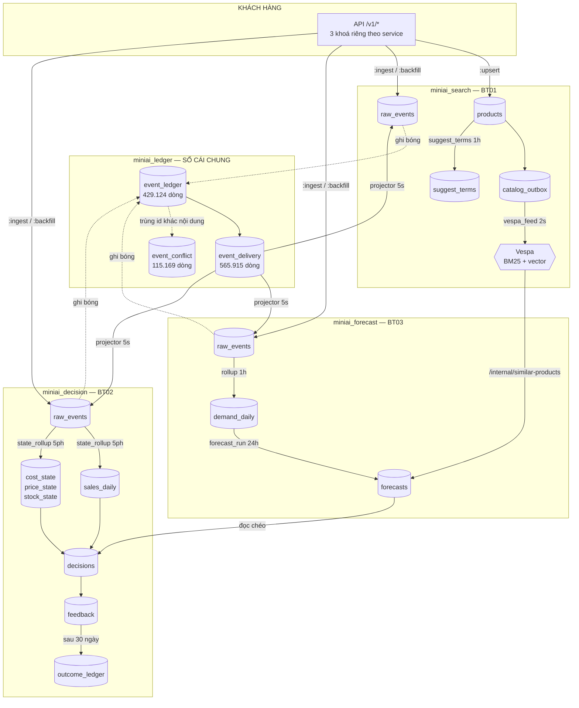
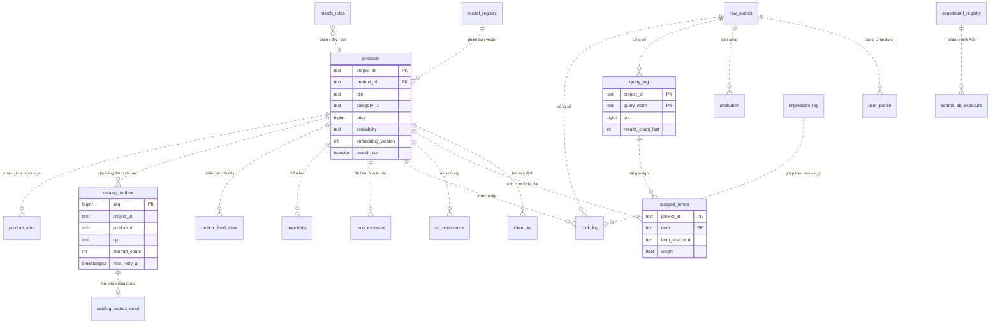
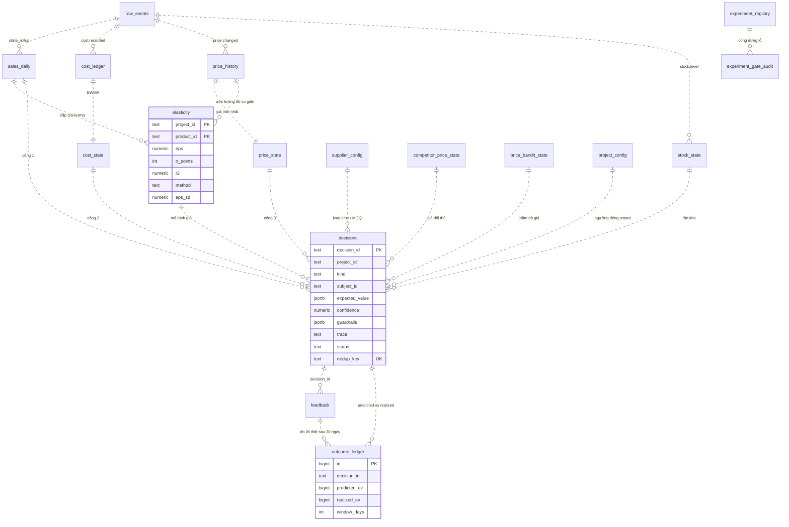
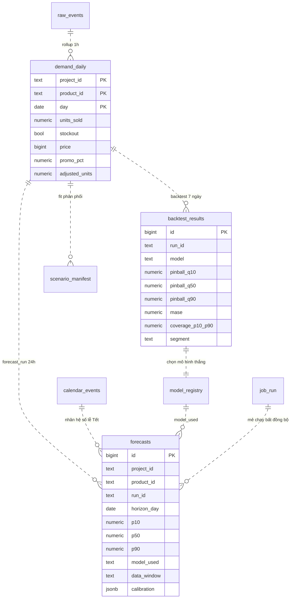
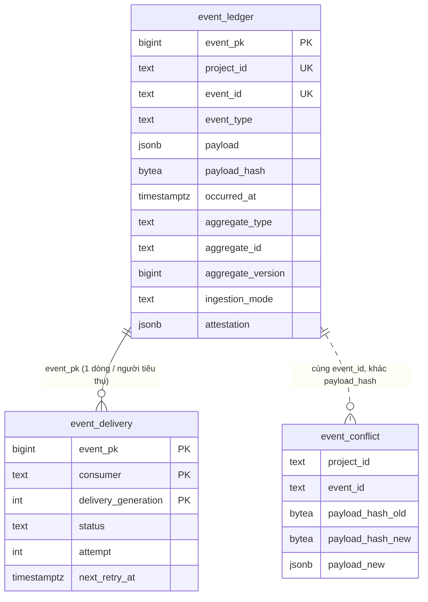

# miniAI — LƯỢC ĐỒ CƠ SỞ DỮ LIỆU ĐẦY ĐỦ

> **70 bảng nghiệp vụ · 4 kho · đo thật ngày 2026-08-13** trên hệ đang chạy (không viết từ trí nhớ).
> Mọi con số dòng, kiểu cột, chỉ mục, giá trị mặc định đều lấy trực tiếp từ `information_schema`,
> `pg_class`, `pg_constraint`, `pg_indexes`. Cột "Ai ghi" lấy từ `grep` mã nguồn `services/*/app/`.
>
> **Kho ngoài repo** (`icpp/db-docs/`) theo đúng luật kernel mecom: cấm đẻ `.md` tri thức trong `mecom/project/`.

---

## MỤC LỤC

- [0. Cách đọc tài liệu này](#0-cách-đọc-tài-liệu-này)
- [1. Tổng quan 4 kho](#1-tổng-quan-4-kho)
- [2. ERD — bức tranh toàn hệ](#2-erd--bức-tranh-toàn-hệ)
- [3. Sự thật kiến trúc: KHÔNG có khoá ngoại](#3-sự-thật-kiến-trúc-không-có-khoá-ngoại)
- [4. NHÓM A — khung sườn chung (8 bảng × 3 service)](#4-nhóm-a--khung-sườn-chung)
- [5. `miniai_search` — 27 bảng](#5-miniai_search--27-bảng)
- [6. `miniai_decision` — 26 bảng](#6-miniai_decision--26-bảng)
- [7. `miniai_forecast` — 14 bảng](#7-miniai_forecast--14-bảng)
- [8. `miniai_ledger` — 3 bảng](#8-miniai_ledger--3-bảng)
- [9. Bản đồ quan hệ ngầm](#9-bản-đồ-quan-hệ-ngầm)
- [10. Ai ghi bảng nào + chu kỳ job](#10-ai-ghi-bảng-nào--chu-kỳ-job)
- [11. Hai mẫu hình xuyên suốt](#11-hai-mẫu-hình-xuyên-suốt)
- [12. Phát hiện & nợ đã biết](#12-phát-hiện--nợ-đã-biết)
- [13. Lệnh tự đo lại](#13-lệnh-tự-đo-lại)

---

## 0. Cách đọc tài liệu này

**Ký hiệu trong bảng cột:**

| Ký hiệu | Nghĩa |
|---|---|
| `!` sau kiểu | `NOT NULL` — bắt buộc có giá trị |
| **in đậm** tên cột | thuộc khoá chính |
| ⭐ | cột mang ý nghĩa nghiệp vụ then chốt |
| `seq` | sinh tự động bằng `nextval(...)` |

**Ba loại bảng, phân biệt bằng hậu tố:**

| Loại | Hậu tố / tên | Tính chất |
|---|---|---|
| **Sổ cái** | `_ledger`, `_log`, `_history`, `raw_events` | chỉ ghi thêm, **không bao giờ sửa** — nguồn sự thật |
| **Hình chiếu** | `_state`, `_daily`, `forecasts`, `popularity` | ảnh chụp, **dựng lại được từ sổ cái** |
| **Cấu hình** | `_config`, `_registry`, `_rules` | người vận hành đặt |

---

## 1. Tổng quan 4 kho

| Kho | Bảng | Cổng | Service | Vai trò |
|---|---|---|---|---|
| `miniai_search` | **27** | 16021 | smartsearch | BT01 — tìm kiếm, gợi ý, hành vi người dùng |
| `miniai_decision` | **26** | 16022 | decision | BT02 — giá, tồn kho, quyết định nhập hàng |
| `miniai_forecast` | **14** | 16023 | forecast | BT03 — dự báo nhu cầu |
| `miniai_ledger` | **3** | — | dùng chung | sổ cái chung, cầu nối giữa 3 service |

**Vật lý là 73 quan hệ:** `impression_log` ở `miniai_search` và `miniai_decision` là **bảng phân mảnh**
(1 bảng cha `relkind='p'` + 2 mảnh con theo tháng: `_2026_08`, `_2026_09`). Đếm logic thì tính là 1 bảng.

Ngoài ra Postgres còn **15 kho `*_test`** dành cho bộ kiểm thử tích hợp, không thuộc phạm vi tài liệu này:
`miniai_decision_antiosc_test`, `miniai_decision_belowcost_test`, `miniai_decision_eps_sd_test`,
`miniai_decision_olsres_test`, `miniai_decision_plan_test`, `miniai_decision_pmode_test`,
`miniai_decision_tenant_scope_test`, `miniai_expkey_test`, `miniai_implog_test`,
`miniai_ledger_consistency_it`, `miniai_ledger_projector_it`, `miniai_ledger_search_prj_it`,
`miniai_search_outbox_v2_test`, `miniai_search_suggest_priv_test`, `miniai_search_test`.

**5 bảng lớn nhất toàn hệ** (số dòng thật lúc đo):

| Bảng | Kho | Dòng |
|---|---|---|
| `raw_events` | search | 3.141.740 |
| `event_delivery` | ledger | 565.915 |
| `event_ledger` | ledger | 429.124 |
| `forecasts` | forecast | 324.415 |
| `attribution` | search | 287.803 |

---

## 2. ERD — bức tranh toàn hệ

### 2.1 Dòng chảy giữa 3 service



**Ba đường nối chéo service — đây là thứ khó thấy nhất khi đọc từng kho riêng:**

| # | Từ | Đến | Cơ chế | Bằng chứng |
|---|---|---|---|---|
| 1 | mọi service | mọi service | **sổ cái chung** `event_ledger` + `event_delivery`, projector poll **5 giây** | `services/*/app/worker.py:PROJECTOR_POLL_SECONDS = 5.0` |
| 2 | forecast | smartsearch | **gọi HTTP** `/internal/similar-products` với header `X-Internal-Token` | `services/forecast/app/main.py:1241` |
| 3 | decision | forecast | đọc `forecasts` để lập kế hoạch nhập hàng | `services/decision/app/jobs/decisions_run.py` |

> ⭐ Đường #1 giải thích hiện tượng ở bước `[10]` của kịch bản demo: gửi 21 đơn vào **forecast** rồi
> gửi lại vào **decision** thì nhận `accepted: 3, deduped: 21` — vì 21 đơn kia đã tự chảy sang decision
> qua sổ cái chung trước đó.

### 2.2 ERD `miniai_search`



### 2.3 ERD `miniai_decision`



### 2.4 ERD `miniai_forecast`



### 2.5 ERD `miniai_ledger`



---

## 3. Sự thật kiến trúc: KHÔNG có khoá ngoại

**Đo được: `0` ràng buộc `FOREIGN KEY` trên cả 4 kho.**

```sql
SELECT count(*) FROM pg_constraint con
JOIN pg_class c ON c.oid = con.conrelid
JOIN pg_namespace n ON n.oid = c.relnamespace
WHERE con.contype = 'f' AND n.nspname = 'public';
-- → 0 ở cả miniai_search, miniai_decision, miniai_forecast, miniai_ledger
```

**Đây là lựa chọn có chủ đích, không phải sơ suất.** Bốn lý do đọc ra được từ chính lược đồ:

1. **Xuyên service.** `decisions` (kho decision) tham chiếu SKU nằm ở `products` (kho search) — hai
   **cơ sở dữ liệu khác nhau**, Postgres không thể đặt FK xuyên kho.
2. **Sổ cái tới trước dữ liệu chủ.** `raw_events` phải nhận được sự kiện của SKU **chưa kịp** có trong
   `products` (thứ tự tới không đảm bảo). FK sẽ chặn ⇒ mất sự kiện.
3. **Ghi hàng loạt.** `forecasts` ghi hàng trăm nghìn dòng mỗi mẻ; kiểm FK từng dòng làm chậm đáng kể.
4. **Xoá theo tenant.** Dọn một tenant sẽ phải theo đúng thứ tự phụ thuộc; không FK thì xoá bảng nào trước cũng được.

**Cái giá phải trả — quan trọng khi vận hành:**

- CSDL **không** ngăn được dòng mồ côi. `feedback` có thể trỏ tới `decision_id` đã bị xoá.
- Thứ tự xoá phải **tự lo bằng tay**. Đây chính là lý do trong `reset1` của kịch bản demo, dòng xoá
  `feedback` **bắt buộc** chạy trước dòng xoá `decisions` — vì nó dùng câu con
  `SELECT decision_id FROM decisions WHERE subject_id=...`. Đảo thứ tự thì câu con rỗng và `feedback` còn nguyên.
- Toàn bộ tính toàn vẹn được giữ ở **tầng ứng dụng**, không ở tầng CSDL.

**Thay cho FK, hệ dùng 3 lớp bảo vệ khác:**

| Lớp | Cơ chế | Ví dụ |
|---|---|---|
| Khoá tự nhiên | `(project_id, product_id)` lặp lại ở mọi bảng | 21 bảng dùng chung khuôn này |
| Ràng buộc CHECK | enum kiểm ở tầng CSDL | `catalog_outbox.op IN ('upsert','delete')` |
| Chỉ mục duy nhất | chống trùng nghiệp vụ | `decisions(project_id, dedup_key)` |

**7 ràng buộc `CHECK` đang có** (toàn bộ):

| Kho | Bảng | Ràng buộc |
|---|---|---|
| search | `catalog_outbox` | `op IN ('upsert','delete')` |
| search | `experiment_registry` | `experiment_type IN ('RANKER_INTERLEAVING','POSITION_SWAP','UNIFORM_TOP_K_EXPLORATION','PRICE_SWITCHBACK')` |
| search | `merch_rules` | `rule_type IN ('pin','boost','bury')` |
| search | `model_registry` | `state IN ('shadow','active','retired')` |
| decision | `experiment_gate_audit` | `decision IN ('FIRE','BLOCK','KILL')` |
| decision | `experiment_registry` | (như search) |
| forecast | `model_registry` | `state IN ('shadow','active','retired')` |

---

## 4. NHÓM A — khung sườn chung

8 bảng này **lặp y hệt ở cả 3 service**. Hiểu một lần, dùng cho cả ba.

### 4.1 `api_keys` — khoá API của khách

**Dòng:** search 179 · decision 237 · forecast 206 · **Khoá chính:** `(project_id, key_id)`

| Cột | Kiểu | Mặc định | Ý nghĩa |
|---|---|---|---|
| **`project_id`** | `text!` | | tenant sở hữu khoá |
| **`key_id`** | `text!` | | định danh khoá (in được ra log an toàn) |
| ⭐ `key_hash` | `text!` | | **băm** của khoá — khoá gốc **không** được lưu |
| `state` | `text!` | `'active'` | `active` / thu hồi |
| `created_at` | `timestamptz!` | `now()` | |
| `last_used_at` | `timestamptz` | | phát hiện khoá chết để dọn |

**Chỉ mục:** `idx_api_keys_key_hash (key_hash)` — tra khoá khi có request, không quét bảng.

> Chỉ lưu băm nghĩa là **lộ toàn bộ CSDL cũng không đọc ngược ra khoá**. Đây là lý do
> `data/seed_keys_demoshop.json` phải giữ bản gốc riêng — mất tệp đó là mất khoá vĩnh viễn, phải cấp lại.

### 4.2 `raw_events` — sổ cái sự kiện thô ⭐

**Dòng:** search 3.141.740 · decision 173.233 · forecast 147.647 · **Khoá chính:** `(project_id, event_id)`

| Cột | Kiểu | Mặc định | Ý nghĩa |
|---|---|---|---|
| **`project_id`** | `text!` | | tenant |
| ⭐ **`event_id`** | `text!` | | **khoá chống trùng do client cấp** |
| `schema_version` | `text!` | | phiên bản khuôn sự kiện — cho phép tiến hoá không phá bản cũ |
| `event_type` | `text!` | | `purchase.completed`, `cost.recorded`, `price.changed`, `stock.level`, `product.clicked`… |
| `event_time` | `timestamptz!` | | **thời điểm việc xảy ra thật** (được phép ở quá khứ) |
| `user_pseudo_id` | `text!` | | định danh giả danh người dùng |
| `session_id` | `text` | | phiên |
| `attribution_token` | `text` | | nối về truy vấn tìm kiếm đã dẫn tới đơn |
| `payload` | `jsonb!` | | thân sự kiện — **mã hàng nằm TRONG đây**, không có cột riêng |
| `received_at` | `timestamptz!` | `now()` | thời điểm hệ nhận |

**Chỉ mục:** `(project_id, event_type, event_time)` · `(received_at)`

> ⭐ **`event_id` là khoá chính ⇒ chống trùng ở tầng CSDL, không ở tầng ứng dụng.** Gửi lại cùng
> `event_id` thì `INSERT ... ON CONFLICT DO NOTHING` bỏ qua. Đây chính là con số `deduped: 21` ở bước `[09]`.
>
> ⚠ **`raw_events` KHÔNG có cột `product_id`.** Mã hàng chôn trong `payload` JSONB. Muốn lọc theo SKU
> phải dùng `payload::text LIKE '%<sku>%'` — thô và **không dùng được chỉ mục**. Với 3,1 triệu dòng
> bên search thì mỗi câu như vậy là một lần quét toàn bảng.
>
> ⚠ **Phân biệt `event_time` với `received_at`.** `event_time` do client khai (có thể sai, có thể ở
> tương lai); `received_at` do hệ đóng dấu (luôn đúng). Bài học đã trả giá ở bước `[10]`: gửi
> `stock.level` với `event_time` là **ngày mai** thì `state_rollup` bỏ qua, `stock_state` mãi rỗng,
> và bước `[19]` không có tồn kho để tính — **hỏng im lặng, không báo gì**.

### 4.3 `dead_events` — hàng đợi thư chết

**Dòng:** search 259 · decision 30 · forecast 85 · **Khoá chính:** `id`

| Cột | Kiểu | Mặc định | Ý nghĩa |
|---|---|---|---|
| **`id`** | `bigint!` | `seq` | |
| `project_id` | `text!` | | |
| `event_id` | `text!` | | sự kiện gốc |
| `event_type` | `text` | | |
| ⭐ `reason` | `text!` | | **vì sao hỏng** — thứ khiến lỗi nhìn thấy được |
| `payload` | `jsonb` | | giữ nguyên thân để chạy lại được |
| `dead_at` | `timestamptz!` | `now()` | |

**Chỉ mục:** `(project_id, dead_at DESC, id DESC)` — lấy nhanh lỗi mới nhất của một tenant.

> Triết lý: sự kiện xử lý hỏng **không bị nuốt**. Nó rơi vào đây kèm lý do, người vận hành xem được,
> và vì `payload` còn nguyên nên chạy lại được sau khi vá.

### 4.4 `job_run` — việc nền có thuê bao (thế hệ MỚI) ⭐

**Dòng:** search 0 · decision 0 · **forecast 396** · **Khoá chính:** `job_id`

| Cột | Kiểu | Mặc định | Ý nghĩa |
|---|---|---|---|
| **`job_id`** | `text!` | | vd `fr-demoshop-r_2026-08-13` — **tự sinh từ nội dung ⇒ idempotent** |
| `job_type` | `text!` | | `forecast_run`, `scenario_build`, `ledger_projector` |
| `tenant_id` | `text` | | |
| `scheduled_at` | `timestamptz!` | `now()` | hẹn giờ chạy |
| `status` | `text!` | `'queued'` | `queued` → `running` → `done` / `retry` / `dead` |
| ⭐ `lease_owner` | `text` | | **worker nào đang giữ việc** |
| ⭐ `lease_expires_at` | `timestamptz` | | hết hạn ⇒ worker khác nhận tiếp |
| `lease_epoch` | `bigint!` | `0` | chống worker "sống lại" ghi đè kết quả mới |
| `attempt` | `int!` | `0` | lần thử hiện tại |
| `max_attempt` | `int!` | `5` | quá số này thì sang `job_run_failed` |
| `checkpoint` | `jsonb` | | chạy tiếp từ giữa chừng |
| `output_fingerprint` | `text` | | vân tay kết quả |
| `error_code` | `text` | | mã lỗi **nhìn thấy được**, không nuốt |
| `parent_job_id` | `text` | | việc con của việc nào |
| `step_name` | `text` | | tên bước |
| `input_fingerprint` | `text` | | vân tay đầu vào |

**Chỉ mục (4 cái, 2 cái là chỉ mục có điều kiện — đáng học):**

| Chỉ mục | Định nghĩa |
|---|---|
| `job_run_pkey` | `(job_id)` |
| `idx_job_run_status_updated_at` | `(status, updated_at)` |
| ⭐ `jr_claim` | `(job_type, status, scheduled_at) WHERE status IN ('queued','retry')` |
| ⭐ `jr_child_idem` | `(parent_job_id, step_name, input_fingerprint) WHERE parent_job_id IS NOT NULL` |

> ⭐ **`jr_claim` là chỉ mục có điều kiện (partial index).** Nó chỉ đánh chỉ mục những việc **đang chờ**.
> Bảng có thể chứa hàng triệu việc `done`, nhưng chỉ mục vẫn nhỏ xíu vì chỉ đếm phần `queued`/`retry` —
> worker giành việc luôn nhanh bất kể lịch sử dài bao nhiêu. Đây là kỹ thuật quan trọng nhất trong toàn lược đồ.
>
> **Cơ chế thuê bao (lease) giải bài toán gì:** worker chết giữa chừng thì việc **không kẹt vĩnh viễn**.
> Hết `lease_expires_at`, worker khác nhận tiếp từ `checkpoint`. `lease_epoch` chặn tình huống worker cũ
> hồi sinh và ghi đè kết quả của worker mới.

### 4.5 `job_run_failed` — việc chết hẳn

**Khoá chính:** không có · **Chỉ mục:** `(failed_at)`

| Cột | Kiểu | Ý nghĩa |
|---|---|---|
| `job_id`, `job_type`, `tenant_id` | `text` | |
| `attempt` | `int` | đã thử bao nhiêu lần |
| `error_code` | `text` | |
| `checkpoint` | `jsonb` | |
| `failed_at` | `timestamptz` | `now()` |

> Bước `[12]` của kịch bản demo hiển thị việc này là `failed` kèm `error_code` — *"lỗi nhìn thấy được, không nuốt"*.

### 4.6 `job_runs` — nhật ký job (thế hệ CŨ)

**Dòng:** search 263 · decision 1.526 · forecast 975 · **Khoá chính:** `(job_name, run_id)`

| Cột | Kiểu | Mặc định | Ý nghĩa |
|---|---|---|---|
| **`job_name`** | `text!` | | `rollup_loop`, `vespa_feed`, `state_rollup`… |
| **`run_id`** | `text!` | | |
| `started_at` | `timestamptz!` | `now()` | |
| `finished_at` | `timestamptz` | | |
| `status` | `text!` | `'running'` | |
| `stats` | `jsonb` | | số liệu mẻ chạy |
| `error` | `text` | | |

**Job đang thật sự chạy** (đếm từ chính bảng này):

| Kho | `job_name` | Số lần chạy | Lần cuối |
|---|---|---|---|
| forecast | `forecast_run` | 782 | 12/08 16:53 |
| forecast | `backtest_run` | 142 | 12/08 16:53 |
| forecast | `rollup_loop` | 47 | 12/08 20:16 |
| decision | `experiment_gate_sweep` | 992 | 12/08 20:49 |
| decision | `decisions_run` | 442 | 12/08 16:54 |
| decision | `state_rollup` | 93 | 12/08 16:59 |
| search | `vespa_feed` | 138 | 12/08 16:53 |
| search | `state_apply` | 125 | 12/08 16:54 |

> ⚠ **Hai thế hệ cùng tồn tại.** `job_run` (số ít, có lease) là bản mới, **chỉ forecast dùng** (396 dòng);
> search và decision đều `0` dòng ở `job_run` nhưng có 263 và 1.526 dòng ở `job_runs`. Chú thích trong
> `services/decision/app/worker.py:8` viết rõ: *"everything else until the migration wave cuts them over"* —
> tức đây là **cuộc di trú đang dở**, không phải trùng lặp thiết kế.
>
> Bảng `job_run` chính là thứ bước `[11]` và `[12]` của kịch bản demo truy vấn.

### 4.7 `kv_state` — kho khoá-giá trị vặt

**Dòng:** search 3 · decision 147 · forecast 608 · **Khoá chính:** `k`

| Cột | Kiểu | Ý nghĩa |
|---|---|---|
| **`k`** | `text!` | tên khoá |
| `v` | `jsonb!` | giá trị bất kỳ |
| `updated_at` | `timestamptz!` | |

> Dùng cho con trỏ đọc sổ cái, mốc thời gian job chạy lần cuối, cờ bật/tắt.
> **Không có `project_id`** — đây là trạng thái của *hệ*, không thuộc khách nào.

### 4.8 `schema_migrations` — đã vá lược đồ tới đâu

**Dòng:** search 20 · decision 16 · forecast 10 · **Khoá chính:** `version`

| Cột | Kiểu | Ý nghĩa |
|---|---|---|
| **`version`** | `text!` | `V001`, `V002`… |
| `applied_at` | `timestamptz!` | |

> Migration **chỉ tiến, không lùi** (forward-only). Số bản vá cho thấy search tiến hoá nhiều nhất (20 bản).

---

## 5. `miniai_search` — 27 bảng

### 5.1 Danh mục hàng hoá

#### `products` ⭐ — bảng lõi của BT01

**Dòng:** 1.682 · **Khoá chính:** `(project_id, product_id)` · **Ai ghi:** `store/products.py`,
`jobs/learning_jobs.py`, `jobs/state_apply.py`

| Cột | Kiểu | Mặc định | Ý nghĩa |
|---|---|---|---|
| **`project_id`** | `text!` | | tenant |
| **`product_id`** | `text!` | | mã SKU |
| ⭐ `title` | `text!` | | **nguồn chính cho tìm kiếm** — cả BM25 lẫn vector |
| `description` | `text` | | |
| `categories` | `text[]` | | `"Cha > Con"` |
| ⭐ `category_l1` | `text` | | **tách sẵn** phần trước dấu `>` — lọc/gộp nhanh, không phải cắt chuỗi lúc truy vấn |
| `brands` | `text[]` | | |
| `price` | `bigint` | | VND, số nguyên (**không dùng float cho tiền**) |
| `original_price` | `bigint` | | giá gạch ngang |
| `currency_code` | `char` | | |
| `availability` | `text` | | `IN_STOCK` / `OUT_OF_STOCK` — hết hàng **biến mất khỏi kết quả tìm** |
| `available_quantity` | `numeric` | | |
| `attrs` | `jsonb` | | thuộc tính tự do |
| `images` | `jsonb` | | |
| `publish_time` | `timestamptz` | | lên kệ lúc nào |
| ⚠ `embedding_version` | `int!` | **`0`** | **`0` = CHƯA có vector**; `≥1` = đã sinh |
| `updated_at` | `timestamptz!` | `now()` | |
| ⭐ `search_tsv` | `tsvector` | | chỉ mục toàn văn của Postgres (dự phòng khi Vespa chết) |
| `rating_avg` | `double` | | |
| `rating_count` | `int!` | `0` | |
| `state_event_time` | `timestamptz` | | mốc sự kiện trạng thái gần nhất |

**Chỉ mục (3, hai cái là GIN):**

| Chỉ mục | Định nghĩa | Dùng cho |
|---|---|---|
| `products_pkey` | `btree (project_id, product_id)` | tra cứu trực tiếp |
| ⭐ `idx_products_title_trgm` | `gin (immutable_unaccent(lower(title)) gin_trgm_ops)` | **tìm gần đúng, không dấu** — gõ `mi omachi` ra `mì Omachi` |
| `products_search_tsv_idx` | `gin (search_tsv)` | tìm toàn văn |

> ⭐ **`idx_products_title_trgm` là chỗ xử lý tiếng Việt.** `immutable_unaccent` bỏ dấu, `gin_trgm_ops`
> cắt chuỗi thành bộ-ba-ký-tự (trigram) nên chịu được gõ sai. Đây là lý do tìm được hàng dù khách gõ thiếu dấu.
>
> ⚠ **BẪY ĐO LƯỜNG — `embedding_version` là `NOT NULL DEFAULT 0`.** Nghĩa là câu
> `WHERE embedding_version IS NOT NULL` **luôn luôn đúng**, kể cả khi SKU chưa có vector. Phép đo đúng
> phải là `WHERE embedding_version > 0`. Đo thật trên demoshop: 114 sản phẩm đều có `embedding_version = 1`.
> *(Tài liệu `DEMO-1-SAN-PHAM-MOI-2026-08-07.md` dòng 343 đang dùng `IS NOT NULL` — phép đo đó cho xanh giả.)*

#### `product_attrs` — thuộc tính bóc tách

**Dòng:** 849 · **Khoá chính:** `(project_id, product_id)` · **Ai ghi:** `store/attrs.py`

| Cột | Kiểu | Mặc định | Ý nghĩa |
|---|---|---|---|
| **`project_id`**, **`product_id`** | `text!` | | |
| `attrs` | `text[]!` | `'{}'` | thuộc tính bóc từ mô tả |
| `source` | `text!` | `'rule'` | `rule` = luật, hay mô hình |
| ⭐ `content_hash` | `text` | | băm nội dung nguồn — **biết mô tả có đổi không, khỏi bóc lại** |
| `updated_at` | `timestamptz!` | `now()` | |

### 5.2 Đường ra Vespa — mẫu hình Transactional Outbox

#### `catalog_outbox` ⭐ — hàng đợi đánh chỉ mục

**Dòng:** 0 (rỗng = đã rút hết) · **Khoá chính:** `seq` · **Ai ghi:** `store/products.py`, `jobs/vespa_feed.py`

| Cột | Kiểu | Mặc định | Ý nghĩa |
|---|---|---|---|
| **`seq`** | `bigint!` | `seq` | **thứ tự nghiêm ngặt** — đảm bảo đẩy đúng trình tự |
| `project_id`, `product_id` | `text!` | | |
| `op` | `text!` | | `upsert` / `delete` — có `CHECK` |
| `enqueued_at` | `timestamptz!` | `now()` | |
| `attempt_count` | `int!` | `0` | đã thử mấy lần |
| ⭐ `next_retry_at` | `timestamptz` | | **thử lại có giãn cách** (backoff) |
| `error_class` | `text` | | phân loại lỗi |
| `payload_hash` | `bytea` | | băm — bỏ qua nếu nội dung không đổi |
| `document_version` | `bigint` | | chống ghi lùi |

> ⭐ **Đây là con số nhảy `0 → 1 → 0` ở bước `[01]` của kịch bản demo.**
>
> **Mẫu hình Transactional Outbox giải bài toán gì:** ghi Postgres và ghi Vespa là hai hệ khác nhau,
> **không thể chung một giao dịch**. Nếu ghi Postgres xong rồi gọi Vespa mà Vespa chết ⇒ lệch dữ liệu vĩnh viễn.
> Mẫu outbox giải bằng cách: ghi `products` **và** ghi `catalog_outbox` trong **cùng một giao dịch**
> (cùng một CSDL nên làm được), rồi một tiến trình riêng rút hàng đợi đẩy sang Vespa. Vespa chết thì
> hàng đợi phình; Vespa sống lại thì tự bù. **Không mất dữ liệu, chỉ trễ.**

#### `catalog_outbox_dead` — thử mãi không được

**Dòng:** 0 · **Khoá chính:** `seq`

| Cột | Kiểu | Ý nghĩa |
|---|---|---|
| **`seq`** | `bigint!` | |
| `project_id`, `product_id`, `op` | `text!` | |
| `error_class` | `text` | |
| `payload_hash` | `bytea` | |
| `dead_at` | `timestamptz!` | `now()` |

#### `outbox_feed_state` — mốc đã đẩy

**Dòng:** 1.165 · **Khoá chính:** `(project_id, product_id)` · **Ai ghi:** `jobs/vespa_feed.py`

| Cột | Kiểu | Ý nghĩa |
|---|---|---|
| **`project_id`**, **`product_id`** | `text!` | |
| ⭐ `last_fed_version` | `bigint!` | phiên bản cuối đã đẩy — **chống ghi lùi** khi tin tới lệch thứ tự |

### 5.3 Hành vi người dùng

#### `click_log` — nhấp chuột

**Dòng:** 210.713 · **Khoá chính:** `id` · **Ai ghi:** `jobs/learning_jobs.py`

| Cột | Kiểu | Mặc định | Ý nghĩa |
|---|---|---|---|
| **`id`** | `bigint!` | `seq` | |
| `project_id` | `text!` | | |
| `query_norm` | `text` | | truy vấn đã chuẩn hoá |
| `product_id` | `text!` | | |
| ⭐ `position` | `int` | | **vị trí hiển thị** — bắt buộc để khử thiên lệch |
| `label` | `smallint!` | | nhãn cho học xếp hạng |
| `ts` | `timestamptz!` | `now()` | |

**Chỉ mục:** `(project_id, ts)`

#### `impression_log` ⭐ — đã hiện gì cho ai (BẢNG PHÂN MẢNH)

**Dòng:** 120.597 (mảnh `_2026_08`) · **Khoá chính:** `(id, ts)`

| Cột | Kiểu | Mặc định | Ý nghĩa |
|---|---|---|---|
| **`id`** | `bigint!` | `seq` | |
| **`ts`** | `timestamptz!` | `now()` | **khoá phân mảnh** |
| `request_id` | `text` | | nối với `click_log` |
| `session_id` | `text` | | |
| `project_id` | `text!` | | |
| `surface` | `text!` | | `search` / `pdp` / `home`… |
| `context` | `jsonb` | | |
| `candidate_set` | `jsonb` | | **toàn bộ ứng viên** đã cân nhắc, không chỉ cái hiện ra |
| `item_id` | `text` | | |
| `position` | `int` | | |
| `policy_version` | `text` | | phiên bản chính sách xếp hạng |
| `scores` | `jsonb` | | điểm từng thành phần |
| `filters` | `jsonb` | | bộ lọc đã áp |
| ⭐ `propensity` | `double` | | **xác suất món này được chọn** dưới chính sách lúc đó |
| ⭐ `exploration_flag` | `bool` | `false` | có phải lượt thăm dò không |
| `experiment_id` | `text` | | |

> ⭐ **`propensity` + `exploration_flag` là nền của học ngoài chính sách (off-policy learning).**
> Muốn trả lời *"nếu hồi đó dùng mô hình B thay vì A thì kết quả ra sao?"* mà **không** cần chạy A/B thật,
> phải biết xác suất mỗi món được chọn dưới chính sách cũ. Không ghi `propensity` lúc đó thì **vĩnh viễn
> không tính ngược lại được** — dữ liệu mất là mất hẳn.
>
> **Phân mảnh theo tháng** (`_2026_08`, `_2026_09`): dọn dữ liệu cũ bằng `DROP TABLE` mảnh cũ —
> tức thì, thay vì `DELETE` hàng triệu dòng rồi phải `VACUUM`.

#### `reco_exposure` — lượt hiện khối gợi ý

**Dòng:** 40.674 · **Khoá chính:** `id` · **Ai ghi:** `store/reco.py`

| Cột | Kiểu | Mặc định | Ý nghĩa |
|---|---|---|---|
| **`id`** | `bigint!` | `seq` | |
| `project_id` | `text!` | | |
| `user_pseudo_id` | `text` | | |
| `context` | `text!` | | `pdp` / `cart` / `home` |
| `product_id` | `text!` | | |
| `position` | `int` | | |
| `explore` | `bool!` | `false` | lượt thăm dò |
| `ts` | `timestamptz` | `now()` | |

**Chỉ mục:** `(project_id, ts)`

> Đây là con số `1562 → 1574` ở bước `[04]` — tăng **đúng bằng** số sản phẩm vừa gợi ý.

#### `search_ab_exposure` — phân nhánh A/B

**Dòng:** 1.467 · **Khoá chính:** `id` · **Ai ghi:** `store/ab.py`

| Cột | Kiểu | Ý nghĩa |
|---|---|---|
| **`id`** | `bigint!` | |
| `project_id`, `user_pseudo_id` | `text!` | |
| `bucket` | `text!` | nhánh `A` hay `B` |
| `ranking_profile` | `text!` | hồ sơ xếp hạng đang phục vụ |
| `q_norm` | `text!` | |
| `created_at` | `timestamptz!` | `now()` |

**Chỉ mục:** `(project_id, bucket, created_at)`

#### `attribution` — gán công cho truy vấn

**Dòng:** 287.803 · **Khoá chính:** `(project_id, token)` · **Ai ghi:** `store/learning.py`

| Cột | Kiểu | Ý nghĩa |
|---|---|---|
| **`project_id`**, **`token`** | `text!` | token gán công |
| `kind` | `text!` | loại |
| `query_norm` | `text` | truy vấn đã dẫn tới |
| `product_ids` | `text[]!` | các SKU liên quan |
| `ts` | `timestamptz!` | `now()` |

**Chỉ mục:** `(ts)`

> Trả lời câu *"đơn hàng này đến từ truy vấn nào?"* — nếu không có, mọi phép đo hiệu quả tìm kiếm đều là đoán.

#### `user_profile` — chân dung người dùng

**Dòng:** 5.131 · **Khoá chính:** `(project_id, user_pseudo_id)` · **Ai ghi:** `jobs/user_profile.py`

| Cột | Kiểu | Mặc định | Ý nghĩa |
|---|---|---|---|
| **`project_id`**, **`user_pseudo_id`** | `text!` | | |
| `embedding` | `float[]` | | vector sở thích |
| `events_count` | `int!` | `0` | đủ tin chưa |
| `updated_at` | `timestamptz` | | |

### 5.4 Tín hiệu đã cộng sổ

#### `query_log` — sổ truy vấn

**Dòng:** 2.551 · **Khoá chính:** `(project_id, query_norm)` · **Ai ghi:** `store/learning.py`

| Cột | Kiểu | Mặc định | Ý nghĩa |
|---|---|---|---|
| **`project_id`**, **`query_norm`** | `text!` | | truy vấn **đã chuẩn hoá** (thường/bỏ dấu) |
| ⭐ `cnt` | `bigint!` | `0` | số lần tìm — bước `[02]` xem nó nhảy `0 → 1` |
| `results_count_last` | `int` | | lần cuối trả bao nhiêu kết quả — **`0` liên tục = truy vấn chết, cần vá từ điển** |
| `last_seen` | `timestamptz` | | |
| `user_cnt` | `int!` | `0` | bao nhiêu người **khác nhau** đã tìm |
| `last_user_pseudo_id` | `text` | | |

> ⭐ **`cnt` và `user_cnt` tách nhau có chủ đích.** Một người tìm 100 lần khác hẳn 100 người tìm 1 lần —
> cái sau mới là tín hiệu nhu cầu thật.

#### `suggest_terms` ⭐ — gợi ý gõ phím

**Dòng:** 7.399 · **Khoá chính:** `(project_id, term)` · **Ai ghi:** `jobs/suggest_terms.py` · **Chu kỳ:** 3.600s

| Cột | Kiểu | Mặc định | Ý nghĩa |
|---|---|---|---|
| **`project_id`**, **`term`** | `text!` | | cụm từ gốc |
| ⭐ `term_unaccent` | `text!` | | **bản không dấu** — gõ `mi` khớp `mì` |
| `weight` | `double!` | `0` | độ phổ biến |
| `updated_at` | `timestamptz` | | |

**Chỉ mục:** `idx_suggest_terms_unaccent gin (term_unaccent gin_trgm_ops)`

> Mỗi cụm sinh ra **2 dòng** (có dấu + không dấu) — đó là lý do bước `[03]` đo được **6 dòng** trong bảng
> nhưng API chỉ trả **3 cụm**.
>
> `weight = 1.0` = hàng mới chưa ai tìm; `"mì hảo hảo"` có `weight = 334.8`. Chênh lệch này chính là
> **giá trị của dữ liệu tích luỹ, nhìn thấy bằng một con số**.

#### `popularity` — điểm hot

**Dòng:** 1.247 · **Khoá chính:** `(project_id, product_id)` · **Ai ghi:** `jobs/learning_jobs.py` · **Chu kỳ:** 3.600s

| Cột | Kiểu | Mặc định | Ý nghĩa |
|---|---|---|---|
| **`project_id`**, **`product_id`** | `text!` | | |
| `score_24h` | `double!` | `0` | đang hot |
| `score_7d` | `double!` | `0` | ổn định tuần |
| `score_30d` | `double!` | `0` | nền dài hạn |
| `updated_at` | `timestamptz` | | |

> **Ba cửa sổ chứ không một.** Hàng viral 24h khác hàng bán đều 30 ngày — gợi ý cho hai loại phải khác nhau.
> Đây là nấc cuối của **bậc thang cold-start** ở bước `[04]`.

#### `co_occurrence` — mua chung

**Dòng:** 420 · **Khoá chính:** `(project_id, product_a, product_b)` · **Ai ghi:** `jobs/learning_jobs.py` · **Chu kỳ:** 86.400s

| Cột | Kiểu | Mặc định | Ý nghĩa |
|---|---|---|---|
| **`project_id`**, **`product_a`**, **`product_b`** | `text!` | | cặp hàng |
| `cnt` | `bigint!` | `0` | số lần cùng xuất hiện |
| ⭐ `lift` | `double` | | **hệ số nâng** |
| `updated_at` | `timestamptz` | | |

> ⭐ **`lift` mới là thứ có ý nghĩa, không phải `cnt`.** Hai món bán chạy nhất shop tất nhiên hay xuất hiện
> cùng nhau — `cnt` cao nhưng **không** liên quan gì nhau. `lift` chuẩn hoá theo tần suất từng món:
> `lift > 1` mới là *"mua A thì hay mua B hơn bình thường"*.

#### `intent_kg` — đồ thị ý định

**Dòng:** 212 · **Khoá chính:** `(project_id, subject, rel, object)` · **Ai ghi:** `store/attrs.py`

| Cột | Kiểu | Mặc định | Ý nghĩa |
|---|---|---|---|
| **`project_id`**, **`subject`**, **`rel`**, **`object`** | `text!` | | bộ ba tri thức |
| `weight` | `double!` | `1.0` | |
| `source` | `text!` | `'rule'` | |
| `updated_at` | `timestamptz!` | `now()` | |

**Chỉ mục:** `idx_intent_kg_object (project_id, object)` — truy **ngược** từ object về subject.

> ⚠ Nợ đã ghi sổ: `W-INTENT-KG-ORPHAN` — 97 bộ ba từng đo được là **0 route dùng tới**.

### 5.5 Điều khiển & thử nghiệm

#### `merch_rules` — luật ghim tay

**Dòng:** 0 · **Khoá chính:** `(project_id, rule_id)`

| Cột | Kiểu | Mặc định | Ý nghĩa |
|---|---|---|---|
| **`project_id`**, **`rule_id`** | `text!` | | |
| `rule_type` | `text!` | | `pin` / `boost` / `bury` — có `CHECK` |
| `match_query_norm` | `text` | | áp cho truy vấn nào |
| `target_product_ids` | `text[]!` | | |
| `weight` | `double!` | `0.5` | |
| `active` | `bool!` | `true` | |
| ⭐ `valid_from` / `valid_to` | `timestamptz` | | **luật có hạn** — chạy chiến dịch xong tự hết |
| `updated_at` | `timestamptz!` | `now()` | |

> Cửa để người bán **đè lên máy**: ghim hàng lên đầu, đẩy lên, hoặc vùi xuống. Có hạn dùng nên
> không để lại rác sau chiến dịch.

#### `experiment_registry` — sổ thử nghiệm

**Dòng:** 2 · **Khoá chính:** `(project_id, experiment_id)`

| Cột | Kiểu | Mặc định | Ý nghĩa |
|---|---|---|---|
| **`project_id`**, **`experiment_id`** | `text!` | | |
| `experiment_type` | `text!` | | 4 giá trị, có `CHECK` |
| `config` | `jsonb` | | |
| `status` | `text!` | `'draft'` | |
| `created_at` | `timestamptz` | `now()` | |

#### `model_registry` — sổ mô hình

**Dòng:** search 0 · forecast 20 · **Khoá chính:** `(project_id, model_name, version)` · **Ai ghi:** `common/registry.py`

| Cột | Kiểu | Mặc định | Ý nghĩa |
|---|---|---|---|
| **`project_id`**, **`model_name`**, **`version`** | `text!` | | |
| `state` | `text!` | | `shadow` / `active` / `retired` — có `CHECK` |
| `artifact_path` | `text` | | |
| ⭐ `artifact_sha256` | `text` | | **băm tệp mô hình** — chống tráo lén |
| `feature_schema` | `jsonb` | | khuôn đặc trưng đầu vào |
| `train_data_window` | `text` | | huấn luyện trên dữ liệu khoảng nào |
| `metrics` | `jsonb` | | điểm số |
| `created_at` / `promoted_at` / `retired_at` | `timestamptz` | | vòng đời |

**Chỉ mục:** ⭐ `uq_model_registry_active (project_id, model_name) WHERE state='active'`

> ⭐ **Chỉ mục duy nhất có điều kiện = bất biến "mỗi mô hình chỉ có ĐÚNG MỘT bản đang chạy".**
> CSDL tự ép, ứng dụng không thể phá kể cả khi có lỗi. Bản `shadow` và `retired` thì bao nhiêu cũng được.
>
> **Ba trạng thái là một quy trình an toàn:** `shadow` (chạy song song, không phục vụ khách) →
> `active` (phục vụ thật) → `retired`. Có `artifact_sha256` nên **quay lui được** về đúng bản cũ.

---

## 6. `miniai_decision` — 26 bảng

### 6.1 Ba cổng dữ liệu — thứ bước `[08]` kiểm

#### `sales_daily` ⭐ — CỔNG 1

**Dòng:** 56.008 · **Khoá chính:** `(project_id, product_id, day)` · **Ai ghi:** `jobs/state_rollup.py` · **Chu kỳ:** 300s

| Cột | Kiểu | Mặc định | Ý nghĩa |
|---|---|---|---|
| **`project_id`**, **`product_id`**, **`day`** | `text!`/`date!` | | |
| `units` | `numeric!` | `0` | số lượng bán |
| `revenue` | `bigint!` | `0` | doanh thu (VND nguyên) |

> ⭐ Đây là bảng khiến bước `[08]` trả **412 `FAILED_PRECONDITION: no sales in last 30d`**.

#### `cost_state` ⭐ — CỔNG 2 (giá vốn)

**Dòng:** 1.152 · **Khoá chính:** `(project_id, product_id)` · **Ai ghi:** `jobs/state_rollup.py`

| Cột | Kiểu | Mặc định | Ý nghĩa |
|---|---|---|---|
| **`project_id`**, **`product_id`** | `text!` | | |
| ⭐ `ewma_cost` | `numeric` | | **bình quân trượt có trọng số mũ** — lô mới nặng hơn lô cũ |
| `last3_avg` | `numeric` | | trung bình 3 lần nhập gần nhất |
| `prev3_avg` | `numeric` | | 3 lần trước đó |
| `n_receipts` | `int!` | `0` | đã nhập mấy lần |
| `updated_at` | `timestamptz!` | `now()` | |

> ⭐ **Vì sao có cả `last3_avg` và `prev3_avg`?** So hai số này biết **vốn đang tăng hay giảm** —
> tín hiệu cần thiết trước khi khuyên giữ giá. `ewma_cost` cho mức, cặp `last3/prev3` cho xu hướng.

#### `price_state` ⭐ — CỔNG 3 (giá hiện tại)

**Dòng:** 1.000 · **Khoá chính:** `(project_id, product_id)` · **Ai ghi:** `jobs/state_rollup.py`

| Cột | Kiểu | Mặc định | Ý nghĩa |
|---|---|---|---|
| **`project_id`**, **`product_id`** | `text!` | | |
| `current_price` | `bigint!` | | VND nguyên |
| `updated_at` | `timestamptz!` | `now()` | |

### 6.2 Sổ cái nguyên liệu

#### `cost_ledger` — sổ từng lần nhập

**Dòng:** 10.567 · **Khoá chính:** `id` · **Ai ghi:** `jobs/state_rollup.py`

| Cột | Kiểu | Mặc định | Ý nghĩa |
|---|---|---|---|
| **`id`** | `bigint!` | `seq` | |
| `project_id`, `product_id` | `text!` | | |
| `unit_cost` | `bigint!` | | giá vốn đơn vị |
| `qty` | `numeric!` | `1` | số lượng nhập |
| `supplier_ref` | `text` | | nhà cung cấp |
| `recorded_at` | `timestamptz!` | `now()` | |

**Chỉ mục:** `(project_id, product_id, recorded_at)`

> `cost_state` là **ảnh chụp tính từ sổ này**. Xoá `cost_state` không mất gì — dựng lại được.

#### `price_history` — mọi lần đổi giá

**Dòng:** 7.378 · **Khoá chính:** `id` · **Ai ghi:** `jobs/state_rollup.py`

| Cột | Kiểu | Mặc định | Ý nghĩa |
|---|---|---|---|
| **`id`** | `bigint!` | `seq` | |
| `project_id`, `product_id` | `text!` | | |
| `price` | `bigint!` | | |
| `changed_at` | `timestamptz!` | `now()` | |

**Chỉ mục:** `(project_id, product_id, changed_at)`

> ⭐ **Đây là nguyên liệu ước lượng độ co giãn.** Không có lịch sử đổi giá thì không thể biết
> *"giảm 10% thì bán thêm bao nhiêu"* — hệ buộc phải mượn số trung bình của shop (`method = pooled_prior`).

#### `stock_state` — tồn kho

**Dòng:** 1.163 · **Khoá chính:** `(project_id, product_id)` · **Ai ghi:** `jobs/state_rollup.py`

| Cột | Kiểu | Mặc định | Ý nghĩa |
|---|---|---|---|
| **`project_id`**, **`product_id`** | `text!` | | |
| `on_hand_qty` | `numeric!` | | tồn thực tế |
| `updated_at` | `timestamptz!` | `now()` | |

#### `supplier_config` — tham số nhà cung cấp

**Dòng:** 70 · **Khoá chính:** `(project_id, product_id)` · **Ai ghi:** `store/supplier.py`

| Cột | Kiểu | Mặc định | Ý nghĩa |
|---|---|---|---|
| **`project_id`**, **`product_id`** | `text!` | | |
| ⭐ `lead_time_days` | `double!` | `7` | hàng về mất mấy ngày |
| ⭐ `lead_time_std` | `double!` | `0` | **độ dao động** của thời gian giao |
| `moq` | `double!` | `0` | lượng đặt tối thiểu |
| `pack_size` | `double!` | `1` | đóng gói theo lô |
| `updated_at` | `timestamptz!` | `now()` | |

> ⭐ **Đây là tham số của công thức ROP** ở bước `[19]`:
> `ROP = avg_daily × LT + z × √(LT × σ_d² + avg_d² × σ_LT²)`
>
> Chú ý `lead_time_std` mặc định `0` — nghĩa là nếu chưa cấu hình, hệ giả định **giao hàng đúng hạn tuyệt đối**,
> làm tồn an toàn tính ra **thấp hơn thực tế**. Cấu hình đúng số này là việc thật, không phải tuỳ chọn.

#### `competitor_price_state` — giá đối thủ

**Dòng:** 12 · **Khoá chính:** `(project_id, product_id)` · **Ai ghi:** `jobs/state_rollup.py`

| Cột | Kiểu | Ý nghĩa |
|---|---|---|
| **`project_id`**, **`product_id`** | `text!` | |
| `competitor_price` | `bigint!` | |
| `competitor_ref` | `text` | nguồn |
| `updated_at` | `timestamptz` | `now()` |

### 6.3 Bộ não quyết định

#### `decisions` ⭐⭐ — bảng lời khuyên

**Dòng:** 11.622 · **Khoá chính:** `decision_id` · **Ai ghi:** `main.py`, `jobs/decisions_run.py` · **Chu kỳ:** 86.400s

| Cột | Kiểu | Mặc định | Ý nghĩa |
|---|---|---|---|
| **`decision_id`** | `text!` | | |
| `project_id` | `text!` | | |
| `kind` | `text!` | | `price_hold`, `replenishment_advice`, `price_change`… |
| `subject_type` | `text` | | thường là `product` |
| ⚠ `subject_id` | `text` | | **mã SKU — KHÔNG phải cột `product_id`** |
| `action` | `text` | | hành động đề xuất |
| `action_params` | `jsonb` | | tham số |
| ⭐ `expected_value` | `jsonb` | | **lợi ích kỳ vọng bằng tiền/tháng** — cơ sở xếp ưu tiên |
| `confidence` | `numeric` | | độ tin theo chất lượng bằng chứng |
| ⭐ `guardrails` | `jsonb` | | các chốt an toàn đã kiểm + kết quả, vd `[{"code":"BELOW_COST","status":"PASS"}]` |
| ⭐ `trace` | `text!` | | **toàn bộ phép tính viết ra bằng chữ** — `NOT NULL`, tức **bắt buộc giải thích được** |
| `status` | `text!` | `'open'` | `open` → `accepted` / `rejected` |
| `presentable` | `bool!` | `true` | có đưa lên giao diện không |
| ⭐ `dedup_key` | `text!` | | **khoá chống spam lại cùng lời khuyên** |
| `created_at` | `timestamptz!` | `now()` | |

**Chỉ mục:**

| Chỉ mục | Định nghĩa | Ý nghĩa |
|---|---|---|
| `decisions_pkey` | `(decision_id)` | |
| ⭐ `decisions_project_id_dedup_key_key` | **UNIQUE** `(project_id, dedup_key)` | **CSDL tự ép không spam** |
| `idx_decisions_project_created` | `(project_id, created_at DESC)` | danh sách mới nhất |

> ⭐ **`trace` là `NOT NULL` — đây là quyết định thiết kế đắt giá nhất trong toàn lược đồ.**
> Không thể ghi một lời khuyên mà không giải thích được nó tính ra từ đâu. Hộp đen bị chặn **ở tầng CSDL**,
> không phải bằng quy ước.
>
> ⭐ **`dedup_key` UNIQUE tạo ra con số `skipped_dedup: 149`** ở bước `[15]`. Máy chạy hằng ngày nhưng
> không dội lại cùng một lời khuyên — chống mệt mỏi cảnh báo.
>
> ⚠ **Dùng `subject_id`, không phải `product_id`.** Đây là lý do vòng lặp quét-mọi-bảng-có-`product_id`
> trong `reset1` **không** bắt được bảng này, phải có dòng xoá riêng.

#### `elasticity` ⭐ — độ co giãn giá

**Dòng:** 2.085 · **Khoá chính:** `(project_id, product_id)` · **Ai ghi:** `jobs/decisions_run.py`

| Cột | Kiểu | Ý nghĩa |
|---|---|---|
| **`project_id`**, **`product_id`** | `text!` | |
| ⭐ `eps` | `numeric` | hệ số co giãn (âm: giá tăng thì lượng giảm) |
| `n_points` | `int` | **bao nhiêu điểm dữ liệu** đứng sau con số |
| `r2` | `numeric` | độ khớp; `null` = chưa khớp riêng được |
| ⭐ `method` | `text` | `pooled_prior` = **đang mượn số trung bình của shop** |
| `eps_sd` | `numeric` | độ bất định |
| `updated_at` | `timestamptz!` | `now()` |

> ⭐ **Bốn cột `eps` / `n_points` / `r2` / `method` đi thành bộ — đây là cách hệ "tự khai".**
> Bước `[17]` trả `method: pooled_prior, n_points: 21, r2: null` và **tự hạ `confidence` xuống 0.7**
> thay vì 0.9. Một hệ chỉ trả `eps` trần trụi sẽ không phân biệt được *"biết chắc"* với *"đoán có căn cứ"*.
>
> Công thức dùng: `Q(P) = Q₀ · (P/P₀)^eps` · `profit = (P − c) · Q`

#### `price_bandit_state` — máy học giá

**Dòng:** 921 · **Khoá chính:** `(project_id, product_id, arm_price)` · **Ai ghi:** `store/price_bandit.py`

| Cột | Kiểu | Mặc định | Ý nghĩa |
|---|---|---|---|
| **`project_id`**, **`product_id`**, **`arm_price`** | `text!`/`bigint!` | | **mỗi mức giá là một "cánh tay"** |
| `mu` | `double!` | | kỳ vọng lợi ích |
| `sigma` | `double!` | | độ bất định |
| `n` | `int!` | `0` | đã thử mấy lần |
| `updated_at` | `timestamptz!` | `now()` | |

> **Multi-armed bandit** cân bằng *thăm dò* (thử giá mới) với *khai thác* (giữ giá đang tốt).
> `sigma` cao = chưa biết rõ, đáng thử thêm; `sigma` thấp = đã chắc, nên khai thác.

### 6.4 Vòng phản hồi — thứ khép kín hệ

#### `feedback` — chủ shop phán

**Dòng:** 135 · **Khoá chính:** `id` · **Ai ghi:** `main.py`

| Cột | Kiểu | Mặc định | Ý nghĩa |
|---|---|---|---|
| **`id`** | `bigint!` | `seq` | |
| `project_id` | `text!` | | |
| ⭐ `decision_id` | `text!` | | trỏ về `decisions` — **không có FK** |
| `action` | `text!` | | `accepted` / `rejected` |
| `outcome_note` | `text` | | ghi chú của chủ shop |
| `ts` | `timestamptz!` | `now()` | |

> ⚠ **Không có khoá ngoại tới `decisions`.** Đó là lý do trong `reset1` phải xoá `feedback` **trước**
> `decisions` — CSDL không tự lo hộ.
>
> ⚠ Trường API tên `note` là **bí danh** của cột `outcome_note` (vá 12/08 — trước đó `note` bị nuốt im lặng,
> API vẫn trả 200, dòng vẫn vào bảng, **chỉ mất chữ**).

#### `outcome_ledger` ⭐ — hệ chịu trách nhiệm bằng số

**Dòng:** 13 · **Khoá chính:** `id` · **Ai ghi:** `jobs/outcome_ledger.py` · **Chu kỳ:** 604.800s (7 ngày)

| Cột | Kiểu | Mặc định | Ý nghĩa |
|---|---|---|---|
| **`id`** | `bigint!` | `seq` | |
| `project_id` | `text!` | | |
| `decision_id` | `text!` | | |
| ⭐ `predicted_ev` | `bigint` | | **hệ đã hứa bao nhiêu** |
| ⭐ `realized_ev` | `bigint` | | **thực tế được bao nhiêu** |
| `measured_at` | `timestamptz!` | `now()` | |
| `note` | `text` | | |
| `window_days` | `int` | | đo trong bao lâu |

> ⭐⭐ **Đây là bảng phân biệt một hệ AI nghiêm túc với một cái máy đoán.** Cặp
> `predicted_ev` ↔ `realized_ev` là lời hứa đối chiếu với kết quả. Không có nó thì mọi
> `expected_value` chỉ là con số đẹp không ai kiểm.
>
> Chỉ 13 dòng vì cần **30 ngày tuổi** mới đo được. Nợ theo dõi: `T-OUTCOME-30D`, dự kiến có dòng đầu ~09/2026.

### 6.5 Vận hành

#### `project_config` — cấu hình riêng tenant

**Dòng:** 141 · **Khoá chính:** `(project_id, key)` · **Ai ghi:** `store/config.py`

| Cột | Kiểu | Ý nghĩa |
|---|---|---|
| **`project_id`**, **`key`** | `text!` | |
| `value` | `jsonb!` | giá trị bất kỳ |

#### `quota_counter` — hạn mức

**Dòng:** 9 · **Khoá chính:** `(project_id, resource, window_key)` · **Ai ghi:** `common/quota_store.py`

| Cột | Kiểu | Mặc định | Ý nghĩa |
|---|---|---|---|
| **`project_id`**, **`resource`**, **`window_key`** | `text!`/`bigint!` | | `window_key` = cửa sổ thời gian |
| `used` | `double!` | `0` | đã dùng bao nhiêu |
| `updated_at` | `timestamptz!` | `now()` | |

**Chỉ mục:** `(updated_at)` — dọn cửa sổ cũ.

> Chống **hàng xóm ồn ào**: một tenant không ăn hết tài nguyên của tenant khác.
> ⚠ Nợ: `W-QUOTA-WIRE-SW-FC` — smartsearch và forecast **chưa nối** vào sổ hạn mức chung.

#### `experiment_gate_audit` ⭐ — cổng dừng lỗ

**Dòng:** 26 · **Khoá chính:** `id` · **Ai ghi:** `store/experiment_gate.py` · **Chu kỳ:** 300s

| Cột | Kiểu | Mặc định | Ý nghĩa |
|---|---|---|---|
| **`id`** | `bigint!` | `seq` | |
| `project_id`, `experiment_id` | `text!` | | |
| `cycle` | `int!` | | vòng đánh giá |
| ⭐ `decision` | `text!` | | `FIRE` / `BLOCK` / `KILL` — có `CHECK` |
| `reason` | `text!` | | |
| `diff_mean` | `double` | | chênh lệch trung bình |
| ⭐ `ci_lo` / `ci_hi` | `double` | | **khoảng tin cậy** |
| `n_treat` / `n_control` | `int` | | cỡ mẫu hai nhánh |
| ⭐ `cum_loss` | `double` | | **lỗ tích luỹ** |
| ⭐ `loss_budget` | `double` | | **ngân sách lỗ** |
| `applied` | `bool!` | `false` | |
| `auto_apply_enabled` | `bool!` | `false` | |
| `created_at` | `timestamptz!` | `now()` | |

**Chỉ mục:** UNIQUE `(project_id, experiment_id, cycle)` · `(project_id, experiment_id)`

> ⭐ **`cum_loss` vs `loss_budget` = tự dừng khi lỗ vượt ngân sách.** Thử nghiệm giá trên hàng thật là
> tiêu tiền thật; cổng này ép mọi thử nghiệm phải khai trước *"tôi được phép lỗ tối đa bao nhiêu"* và
> tự `KILL` khi chạm ngưỡng. `ci_lo`/`ci_hi` bắt buộc kết luận phải kèm khoảng tin cậy, không được
> phán từ chênh lệch trung bình trần.
>
> ⚠ Nợ: `W-GATE-DEPLOY-FLAG` — cần bật `MINIAI_EXPERIMENT_AUTO_APPLY=1` trong stack live.

---

## 7. `miniai_forecast` — 14 bảng

#### `demand_daily` ⭐ — chuỗi nhu cầu

**Dòng:** 121.909 · **Khoá chính:** `(project_id, product_id, day)` · **Ai ghi:** `jobs/rollup.py` · **Chu kỳ:** 3.600s

| Cột | Kiểu | Mặc định | Ý nghĩa |
|---|---|---|---|
| **`project_id`**, **`product_id`**, **`day`** | `text!`/`date!` | | |
| `units_sold` | `numeric!` | `0` | bán thật |
| ⭐ `stockout` | `bool!` | `false` | **hôm đó có cháy hàng không** |
| `price` | `bigint` | | giá hôm đó |
| `promo_pct` | `numeric!` | `0` | mức giảm giá |
| ⭐ `adjusted_units` | `numeric` | | **nhu cầu đã hiệu chỉnh** |

> ⭐⭐ **Cặp `stockout` + `adjusted_units` là chi tiết tinh tế nhất của cả BT03.**
> Bán 0 vì **hết hàng** khác hoàn toàn bán 0 vì **ế**. Không phân biệt thì mô hình học rằng nhu cầu tụt,
> dự báo thấp đi, nhập ít hơn, lại cháy hàng — **vòng xoáy tự huỷ**. `adjusted_units` là nhu cầu *ước lượng
> nếu đã có đủ hàng*, và đó mới là thứ đáng dự báo.
>
> ⚠ Bài học vận hành: dữ liệu seed **cũ đi theo ngày**. Đo 12/08: 6 ngày liên tiếp bán 0 kéo tổng dự báo
> tụt **60%** và 30% số SKU về gần 0. Ngày **hôm nay** bằng 0 là **đúng** (seed chỉ sinh tới hết hôm qua);
> chỉ tính là bệnh khi có **≥2 ngày 0 liên tiếp không kể hôm nay**.

#### `forecasts` ⭐ — kết quả đông lạnh

**Dòng:** 324.415 · **Khoá chính:** `id` · **Ai ghi:** `store/forecasts.py` · **Chu kỳ:** 86.400s

| Cột | Kiểu | Mặc định | Ý nghĩa |
|---|---|---|---|
| **`id`** | `bigint!` | `seq` | |
| `project_id`, `product_id` | `text!` | | |
| ⭐ `run_id` | `text!` | | **mã mẻ chạy**, vd `r_2026-08-13`; tiền tố `analog_` = cold-start |
| `horizon_day` | `date!` | | ngày được dự báo |
| ⭐ `p10` / `p50` / `p90` | `numeric` | | **ba phân vị** |
| ⭐ `model_used` | `text` | | **tự khai dùng mô hình gì** |
| ⭐ `data_window` | `text` | | khoảng dữ liệu; `null` = **không đứng trên dữ liệu của chính SKU** |
| `calibration` | `jsonb` | | tham số hiệu chỉnh |
| `created_at` | `timestamptz!` | `now()` | |

**Chỉ mục:** `(project_id, product_id, created_at DESC)` · `(project_id, product_id, run_id)`

> ⭐ **Ba phân vị chứ không một số.** `p50` = kịch bản giữa → lập kế hoạch · `p90` = kịch bản cao →
> nhập hàng (tránh cháy) · `p10` = kịch bản thấp → giữ dòng tiền. Một con số duy nhất che mất rủi ro.
>
> ⭐ **Bất biến `0 ≤ p10 ≤ p50 ≤ p90` được ép ngay tại nguồn** (`_clean_triples`). Bệnh án: ETS/Theta là
> mô hình **không bị chặn**, với chuỗi giảm thì dự báo điểm chạy xuống dưới 0 — đã đếm được **1.662 dòng
> `p50` âm** trước khi vá. Sau vá: 0 dòng âm, 0 dòng vỡ thứ tự.
>
> ⚠ **Nợ đã ghi sổ: `W-FORECASTS-NO-RETENTION`.** 324.415 dòng và **không ai dọn**. Mỗi mẻ ghi
> 28 dòng/SKU, chạy hằng ngày ⇒ phình vĩnh viễn.

#### `backtest_results` — chấm điểm mô hình

**Dòng:** 40.087 · **Khoá chính:** `id` · **Ai ghi:** `jobs/backtest_run.py` · **Chu kỳ:** 604.800s (7 ngày)

| Cột | Kiểu | Ý nghĩa |
|---|---|---|
| **`id`** | `bigint!` | |
| `project_id`, `product_id`, `run_id` | `text!` | |
| `model` | `text` | mô hình được chấm |
| ⭐ `pinball_q10` / `q50` / `q90` | `numeric` | **hàm mất mát pinball** — chấm riêng từng phân vị |
| ⭐ `mase` | `numeric` | sai số so với dự báo ngây thơ; **`< 1` = tốt hơn ngây thơ** |
| ⭐ `coverage_p10_p90` | `numeric` | **bao nhiêu % thực tế rơi vào khoảng p10–p90** (lý tưởng ≈ 0.80) |
| `segment` | `text` | phân khúc SKU |
| `created_at` | `timestamptz!` | `now()` |

**Chỉ mục:** `(project_id, created_at DESC)`

> ⭐ **Ba loại chỉ số đo ba thứ khác nhau:** `mase` đo *độ chính xác điểm*; `pinball` đo *chất lượng
> từng phân vị*; `coverage` đo *khoảng tin cậy có trung thực không*. Một mô hình có `mase` đẹp nhưng
> `coverage` 0.5 nghĩa là **khoảng dự báo quá hẹp — tự tin quá mức**, nguy hiểm hơn là sai to.
>
> **Baseline đang gác** (`make eval-forecast`): `coverage 0.7685` · `MASE 0.7290` — cả hai đều PASS.

#### `calendar_events` — lễ Tết

**Dòng:** 30 · **Khoá chính:** `(project_id, event, date_start)` · **Nạp bằng migration**
(`V005__calendar_events.sql`, `V007__calendar_events_vn_full.sql`)

| Cột | Kiểu | Mặc định | Ý nghĩa |
|---|---|---|---|
| **`project_id`** | `text!` | **`''`** | ⭐ **rỗng = áp cho MỌI tenant** |
| **`event`** | `text!` | | tên dịp |
| **`date_start`** | `date!` | | |
| `date_end` | `date!` | | |
| ⭐ `uplift_pre` | `double!` | `1.0` | hệ số **trước** dịp (mua sắm chuẩn bị) |
| ⭐ `uplift_in` | `double!` | `1.0` | **trong** dịp |
| ⭐ `uplift_post` | `double!` | `1.0` | **sau** dịp (thường < 1: đã mua trước rồi) |
| `pre_days` | `int!` | `20` | trước bao nhiêu ngày |
| `post_days` | `int!` | `7` | sau bao nhiêu ngày |

> ⭐ **Ba hệ số thay vì một.** Tết không phải một ngày đột biến — nó là **20 ngày mua tích trữ trước**,
> mấy ngày cao điểm, rồi **7 ngày ế sau** vì nhà nào cũng đầy hàng. Dùng một hệ số duy nhất sẽ khuyên
> nhập hàng sai cả trước lẫn sau.
>
> ⭐ `project_id` mặc định `''` = **lịch dùng chung toàn hệ**. Tenant nào cần lịch riêng thì ghi đè bằng
> `project_id` của mình — đây là bảng duy nhất có mẫu "mặc định toàn cục + ghi đè theo tenant".

#### `scenario_manifest` — bản kê Monte Carlo

**Dòng:** 532 · **Khoá chính:** `(project_id, run_id)` · **Ai ghi:** `store/scenario_store.py`

| Cột | Kiểu | Mặc định | Ý nghĩa |
|---|---|---|---|
| **`project_id`**, **`run_id`** | `text!` | | |
| `manifest` | `jsonb!` | | bản kê đầy đủ |
| `created_at` | `timestamptz!` | `now()` | |

**Chỉ mục:** `(project_id, created_at DESC)`

**Nội dung `manifest` (đo thật):**

```json
{"scenario_count": 128, "horizon_days": 7,
 "rng_algorithm": "philox", "rng_version": "1", "scenario_index_contract": "v1",
 "files": {"marginals.npz": "57c8830a…", "factors.npz": "7aa2c0a0…"},
 "marginals": {"<sku>": {"marginal_source": "history_empirical",
                         "tail": "none", "demand_class": "intermittent"}}}
```

> ⭐ **`rng_algorithm: philox` + `rng_version` = tái lập được.** Chạy lại ra **đúng** bộ kịch bản cũ.
> `files` kèm **SHA-256 từng tệp** = bằng chứng chống sửa lén. `marginal_source: history_empirical` =
> phân phối lấy từ **lịch sử thật**, không phải giả định hình chuông.
>
> ⚠ Tệp `.npz` nằm **TRONG container** (`MINIAI_ARTIFACT_DIR=/srv/data/artifacts`), **không** ở `data/`
> trên máy host.

---

## 8. `miniai_ledger` — 3 bảng

Kho ít bảng nhất nhưng **quan trọng nhất về kiến trúc**. Toàn bộ do `libs/common/ledger.py` ghi.

#### `event_ledger` ⭐⭐ — sổ cái toàn hệ

**Dòng:** 429.124 · **Khoá chính:** `event_pk` · **UNIQUE:** `(project_id, event_id)`

| Cột | Kiểu | Mặc định | Ý nghĩa |
|---|---|---|---|
| ⭐ **`event_pk`** | `bigint!` | `seq` | **số thứ tự toàn cục tăng dần** |
| `project_id` | `text!` | | |
| `event_id` | `text!` | | do client cấp; UNIQUE cùng `project_id` |
| `event_type` | `text` | | |
| `schema_version` | `int` | | |
| `payload` | `jsonb` | | |
| ⭐ `payload_hash` | `bytea` | | **băm nội dung** — phát hiện sửa lén / xung đột |
| `occurred_at` | `timestamptz` | | xảy ra thật |
| `received_at` | `timestamptz!` | `now()` | hệ nhận |
| ⭐ `aggregate_type` | `text` | | loại thực thể (Event Sourcing) |
| ⭐ `aggregate_id` | `text` | | định danh thực thể |
| ⭐ `aggregate_version` | `bigint` | | **phiên bản** — chống ghi đè đồng thời |
| `source_sequence` | `bigint` | | thứ tự bên nguồn |
| `source_system` | `text` | | hệ nào gửi |
| `ingestion_mode` | `text!` | `'realtime'` | `realtime` / `backfill` |
| `attestation` | `jsonb` | | chứng thực nguồn |
| `user_pseudo_id`, `session_id` | `text` | | |

> ⭐ **`event_pk` chính là `ledger_head`** trong khối `consistency` mà bước `[03]` và `[12]` trả về.
> So `projection_watermark == ledger_head` cho ra `is_caught_up: true` — khách biết mình đang nhìn
> số mới nhất, chứ không phải ảnh chụp cũ.
>
> ⭐ **Bộ ba `aggregate_type` / `aggregate_id` / `aggregate_version` là Event Sourcing chuẩn.**
> Nó cho phép dựng lại trạng thái của **bất kỳ thực thể nào tại bất kỳ thời điểm nào** bằng cách
> phát lại sự kiện theo thứ tự.
>
> ⭐ **`ingestion_mode`** phân biệt sự kiện thời gian thực với sự kiện nạp lịch sử — quan trọng vì
> backfill **được phép** có `occurred_at` ở quá khứ, còn realtime thì không.

#### `event_delivery` ⭐ — phát cho từng người tiêu thụ

**Dòng:** 565.915 · **Khoá chính:** `(event_pk, consumer, delivery_generation)`

| Cột | Kiểu | Mặc định | Ý nghĩa |
|---|---|---|---|
| **`event_pk`** | `bigint!` | | trỏ về `event_ledger` |
| ⭐ **`consumer`** | `text!` | | `search` / `decision` / `forecast` |
| ⭐ **`delivery_generation`** | `int!` | `0` | **thế hệ phát** — tăng lên để **phát lại từ đầu** |
| `status` | `text!` | `'pending'` | `pending` → `done` / `retry` |
| `attempt` | `int` | `0` | |
| `next_retry_at` | `timestamptz` | | giãn cách thử lại |

**Chỉ mục:** ⭐ `ed_pending (consumer, status) WHERE status IN ('pending','retry')` — chỉ mục có điều kiện,
nên projector lấy việc chờ luôn nhanh dù bảng có 565 nghìn dòng.

> ⭐⭐ **Đây là cơ chế khiến một sự kiện gửi vào MỘT service tự chảy sang service khác cần nó.**
> Mỗi sự kiện sinh **một dòng cho mỗi người tiêu thụ**. Số dòng (565.915) lớn hơn số sự kiện (429.124)
> đúng vì nhiều sự kiện có **hơn một** người tiêu thụ.
>
> Đây là lời giải thích cho bước `[10]`: gửi 21 đơn `purchase.completed` vào **forecast**, sau đó gửi lại
> vào **decision** thì nhận `accepted: 3, deduped: 21` — vì 21 cái kia đã tự sang decision qua đường này rồi.
> Projector poll mỗi **5 giây** (`PROJECTOR_POLL_SECONDS = 5.0`).
>
> ⭐ **`delivery_generation` giải bài toán phát lại.** Vá lỗi projector xong muốn xử lý lại **toàn bộ**
> lịch sử? Tăng thế hệ lên 1 — mọi sự kiện thành `pending` trở lại, **mà không mất vết lần phát cũ**.

#### `event_conflict` — cùng id, khác nội dung

**Dòng:** 115.169 · **Khoá chính:** **không có** (nhật ký thuần)

| Cột | Kiểu | Mặc định | Ý nghĩa |
|---|---|---|---|
| `project_id`, `event_id` | `text` | | |
| ⭐ `payload_hash_old` | `bytea` | | băm bản **đã có** |
| ⭐ `payload_hash_new` | `bytea` | | băm bản **vừa gửi** |
| `payload_new` | `jsonb` | | giữ nguyên bản mới để điều tra |
| `received_at` | `timestamptz` | `now()` | |

> ⭐ **Đây là nguồn con số `conflicted`** ở bước `[09]`. Nghĩa là: *"đã có sự kiện với `event_id` này rồi,
> nhưng nội dung khác"* — dấu hiệu client gửi lại với dữ liệu đã sửa. Hệ **giữ bản gốc** (sổ cái bất biến)
> và ghi lại xung đột để người vận hành xem.
>
> Bảng duy nhất trong cả 4 kho **không có khoá chính** — hợp lý, vì là nhật ký chỉ ghi thêm, không cần
> định danh dòng.

---

## 9. Bản đồ quan hệ ngầm

Vì **không có FK nào**, mọi quan hệ dưới đây là **quy ước ở tầng ứng dụng**. Đây là bản đồ để tra khi
viết truy vấn hoặc dọn dữ liệu.

### 9.1 Khoá nối phổ biến nhất: `(project_id, product_id)`

**21 bảng** dùng chung khuôn này, nối được thẳng với nhau:

| Kho | Bảng |
|---|---|
| `miniai_search` (8) | `products`, `product_attrs`, `popularity`, `catalog_outbox`, `catalog_outbox_dead`, `outbox_feed_state`, `click_log`, `reco_exposure` |
| `miniai_decision` (10) | `sales_daily`, `cost_state`, `cost_ledger`, `price_state`, `price_history`, `stock_state`, `elasticity`, `price_bandit_state`, `supplier_config`, `competitor_price_state` |
| `miniai_forecast` (3) | `demand_daily`, `forecasts`, `backtest_results` |

### 9.2 Quan hệ trong `miniai_search`

| Từ | Đến | Khoá nối | Ai duy trì |
|---|---|---|---|
| `products` | `catalog_outbox` | `(project_id, product_id)` | `store/products.py` (cùng giao dịch) |
| `catalog_outbox` | `catalog_outbox_dead` | `seq` | `jobs/vespa_feed.py` |
| `products` | `outbox_feed_state` | `(project_id, product_id)` | `jobs/vespa_feed.py` |
| `products` | `suggest_terms` | `title` → cụm từ | `jobs/suggest_terms.py` |
| `query_log` | `suggest_terms` | `query_norm` → `term` | `jobs/suggest_terms.py` (nâng `weight`) |
| `impression_log` | `click_log` | `request_id` | `jobs/learning_jobs.py` |
| `raw_events` | `click_log`/`query_log`/`attribution` | `payload` JSONB | `jobs/learning_jobs.py` |
| `experiment_registry` | `search_ab_exposure` | `experiment_id` | `store/ab.py` |

### 9.3 Quan hệ trong `miniai_decision`

| Từ | Đến | Khoá nối | Ghi chú |
|---|---|---|---|
| `raw_events` | `sales_daily` | `payload` JSONB, `event_type='purchase.completed'` | `state_rollup` |
| `raw_events` | `cost_ledger` | `event_type='cost.recorded'` | |
| `raw_events` | `price_history` | `event_type='price.changed'` | |
| `raw_events` | `stock_state` | `event_type='stock.level'` | ⚠ bỏ qua nếu `event_time` ở tương lai |
| `cost_ledger` | `cost_state` | `(project_id, product_id)` | EWMA |
| `price_history` | `price_state` | `(project_id, product_id)` | giá mới nhất |
| `price_history` + `sales_daily` | `elasticity` | `(project_id, product_id)` | hồi quy log-log |
| `decisions` | `feedback` | ⚠ `decision_id` — **không FK** | **xoá `feedback` TRƯỚC** |
| `decisions` + `feedback` | `outcome_ledger` | `decision_id` | sau 30 ngày |
| `experiment_registry` | `experiment_gate_audit` | `experiment_id` | |

> ⚠ **`decisions` dùng `subject_id`, không phải `product_id`** — nối với các bảng khác phải viết
> `decisions.subject_id = other.product_id`.

### 9.4 Quan hệ trong `miniai_forecast`

| Từ | Đến | Khoá nối |
|---|---|---|
| `raw_events` | `demand_daily` | `payload` JSONB → `(project_id, product_id, day)` |
| `demand_daily` | `forecasts` | `(project_id, product_id)`, kết quả gắn `run_id` |
| `demand_daily` | `backtest_results` | `(project_id, product_id, run_id)` |
| `demand_daily` | `scenario_manifest` | `(project_id, run_id)` |
| `calendar_events` | `forecasts` | `date_start`–`date_end` ⊇ `horizon_day`; `project_id=''` áp mọi tenant |
| `backtest_results` | `model_registry` | `model` → `model_name` (chọn mô hình thắng) |
| `job_run` | `forecasts` | `job_id = 'fr-<project>-<run_id>'` |

### 9.5 Quan hệ xuyên kho

| Từ | Đến | Cơ chế | Chú ý |
|---|---|---|---|
| `search.products` | `forecast.demand_daily` | cùng `product_id` | **không** ép được ở CSDL |
| `search.products` | `decision.decisions` | `product_id` = `subject_id` | |
| `forecast.forecasts` | `decision.decisions` | `decision` đọc chéo kho forecast | |
| `*.raw_events` | `ledger.event_ledger` | `(project_id, event_id)` — **ghi bóng** | |
| `ledger.event_delivery` | `*.raw_events` | projector đẩy ngược về từng service | poll 5s |

### 9.6 ⚠ Thứ tự xoá bắt buộc

Vì không có `ON DELETE CASCADE`, dọn dữ liệu phải theo đúng trình tự:

```
1. feedback           ← PHẢI trước (dùng câu con SELECT ... FROM decisions)
2. outcome_ledger     ← trỏ tới decision_id
3. decisions
4. các bảng *_state / *_daily (thứ tự tuỳ ý)
5. các bảng *_ledger / *_history / raw_events
6. event_ledger + event_delivery (sổ cái chung)
7. products           ← xoá QUA API, không SQL, để Vespa cùng sạch
```

---

## 10. Ai ghi bảng nào + chu kỳ job

### 10.1 Bản đồ người ghi

Đây là câu trả lời cho **"câu hỏi vàng"** của LUẬT-0: *"Bảng này AI GHI?"* — bảng chỉ-được-đọc là cờ đỏ số 1.

**`miniai_search`:**

| Bảng | Ai ghi |
|---|---|
| `products` | `store/products.py` · `jobs/learning_jobs.py` · `jobs/state_apply.py` |
| `catalog_outbox` | `store/products.py` · `jobs/vespa_feed.py` |
| `outbox_feed_state` | `jobs/vespa_feed.py` |
| `suggest_terms` | `jobs/suggest_terms.py` |
| `query_log` · `attribution` | `store/learning.py` |
| `popularity` · `click_log` · `co_occurrence` | `jobs/learning_jobs.py` |
| `reco_exposure` | `store/reco.py` |
| `user_profile` | `jobs/user_profile.py` |
| `product_attrs` · `intent_kg` | `store/attrs.py` |
| `search_ab_exposure` | `store/ab.py` |

**`miniai_decision`:**

| Bảng | Ai ghi |
|---|---|
| `decisions` | `main.py` · `jobs/decisions_run.py` |
| `feedback` | `main.py` |
| `outcome_ledger` | `jobs/outcome_ledger.py` |
| `sales_daily` · `cost_state` · `cost_ledger` · `price_state` · `price_history` · `stock_state` · `competitor_price_state` | `jobs/state_rollup.py` |
| `elasticity` | `jobs/decisions_run.py` |
| `price_bandit_state` | `store/price_bandit.py` |
| `supplier_config` | `store/supplier.py` |
| `project_config` | `store/config.py` |
| `quota_counter` | `common/quota_store.py` |
| `experiment_gate_audit` | `store/experiment_gate.py` |

**`miniai_forecast`:**

| Bảng | Ai ghi |
|---|---|
| `demand_daily` | `jobs/rollup.py` |
| `forecasts` | `store/forecasts.py` |
| `backtest_results` | `jobs/backtest_run.py` |
| `scenario_manifest` | `store/scenario_store.py` |
| `model_registry` | `common/registry.py` · `jobs/forecast_run.py` |
| `calendar_events` | **migration** (`V005`, `V007`) — không job nào ghi |

**`miniai_ledger`:** cả 3 bảng đều do `libs/common/ledger.py` ghi.

### 10.2 Chu kỳ job (đọc từ mã nguồn)

| Job | Biến môi trường | Mặc định | Đổi ra |
|---|---|---|---|
| **projector sổ cái** | `PROJECTOR_POLL_SECONDS` | **5 s** | 5 giây |
| `vespa_feed` | (tham số `interval_seconds`) | **2 s** | 2 giây |
| `state_apply` | `STATE_APPLY_INTERVAL` | **5 s** | 5 giây |
| `state_rollup` | `STATE_ROLLUP_INTERVAL` | **300 s** | 5 phút |
| `embed_backfill` | `EMBED_BACKFILL_INTERVAL` | **300 s** | 5 phút |
| `user_profile` | `USER_PROFILE_INTERVAL` | **300 s** | 5 phút |
| `click_join` | `CLICK_JOIN_INTERVAL` | **300 s** | 5 phút |
| `experiment_gate` | (mặc định trong module) | **300 s** | 5 phút |
| `rollup` (forecast) | `ROLLUP_INTERVAL` | **3.600 s** | 1 giờ |
| `popularity` | `POPULARITY_INTERVAL` | **3.600 s** | 1 giờ |
| `suggest_terms` | `SUGGEST_INTERVAL` | **3.600 s** | 1 giờ |
| `reviews` | `REVIEWS_INTERVAL` | **3.600 s** | 1 giờ |
| `job_runs_retention` | `JOB_RUNS_RETENTION_INTERVAL` | **3.600 s** | 1 giờ |
| `co_occurrence` | `COOC_INTERVAL` | **86.400 s** | 1 ngày |
| `drift` | `DRIFT_INTERVAL` | **86.400 s** | 1 ngày |
| `decisions_run` | `DECISIONS_INTERVAL` | **86.400 s** | 1 ngày |
| `forecast_run` | `FORECAST_RUN_INTERVAL` | **86.400 s** | 1 ngày |
| `backtest_run` | `BACKTEST_INTERVAL` | **604.800 s** | 7 ngày |
| `outcome_ledger` | `OUTCOME_INTERVAL` | **604.800 s** | 7 ngày |

> ⭐ **Nhịp quyết định độ trễ nhìn thấy được.** Ghi `stock.level` xong mà `stock_state` chưa đổi thì
> **không phải lỗi** — chỉ là chưa tới nhịp 300 giây. Đây chính là điều bước `[10]` biểu diễn:
> *"ngay sau: ton=— von=—"* rồi *"sau job: ton=40 von=98000"*.
>
> Trong demo có thể **kích tay** thay vì chờ, bằng `docker exec <container> python3 -c "...run_*_once(...)"`.

### 10.3 Bảng nào KHÔNG có người ghi trong mã nguồn

| Bảng | Nguồn thật |
|---|---|
| `calendar_events` | migration `V005__calendar_events.sql`, `V007__calendar_events_vn_full.sql` |
| `merch_rules` | chưa có đường ghi (0 dòng) — cửa cho người bán, chưa dựng giao diện |
| `dead_events` | ghi bởi lớp xử lý sự kiện dùng chung |
| `schema_migrations` | trình chạy migration |

---

## 11. Hai mẫu hình xuyên suốt

### 11.1 Sổ cái ↔ Hình chiếu (Event Sourcing + CQRS)

Toàn hệ tách đôi rành mạch. Hiểu cái này là hiểu được vì sao API trả `202` chứ không `200`, và vì sao
số chưa đổi ngay sau khi ghi.

| | **SỔ CÁI** (nguồn sự thật) | **HÌNH CHIẾU** (ảnh chụp) |
|---|---|---|
| Tính chất | chỉ ghi thêm, **không bao giờ sửa** | dựng lại được, xoá đi không mất gì |
| Ghi lúc nào | **ngay lập tức** khi API nhận | theo **nhịp job nền** |
| Hỏng thì sao | **mất dữ liệu thật** | dựng lại từ sổ cái |
| Ví dụ | `raw_events` · `event_ledger` · `cost_ledger` · `price_history` · `click_log` · `impression_log` | `demand_daily` · `sales_daily` · `cost_state` · `price_state` · `stock_state` · `popularity` · `suggest_terms` · `forecasts` |

**Đây chính là thứ bước `[09]` và `[10]` biểu diễn cho khách:**

```
:backfill ──ghi NGAY──► raw_events (21 dòng)      ✅ đếm được ngay
                            │
                            └──job rollup (1 giờ)──► demand_daily (0 dòng)  ⛔ chưa tới nhịp
```

**Ghi nhanh, tính chậm.** Cửa vào chịu được giờ cao điểm vì nó chỉ làm mỗi việc ghi thêm; mọi phép tính
nặng đẩy sang job nền. Hệ quả thực tế: hình chiếu hỏng thì **dựng lại từ sổ**, không mất dữ liệu —
đó là lý do `reset1` xoá thoải mái được.

### 11.2 Đa tenant bằng `project_id` ở cột đầu

**Gần như mọi bảng** đều có `project_id` đứng **đầu** khoá chính. Ba lý do:

1. **Cô lập:** một câu SQL quên `WHERE project_id=...` là rò dữ liệu giữa các shop.
2. **Hiệu năng:** `project_id` đứng đầu chỉ mục ⇒ mọi truy vấn của một tenant nằm gọn một vùng.
3. **Dọn dẹp:** xoá một tenant = xoá theo tiền tố khoá.

**Ba bảng KHÔNG có `project_id`, đều có lý do chính đáng:**

| Bảng | Vì sao |
|---|---|
| `kv_state` | trạng thái của **hệ**, không thuộc khách nào |
| `schema_migrations` | phiên bản lược đồ, dùng chung |
| `event_delivery` | nối qua `event_pk`, mà `event_ledger` đã mang `project_id` |

> ⚠ **`calendar_events` là ngoại lệ có chủ đích:** `project_id` mặc định `''` nghĩa là *"áp cho mọi tenant"*.
> Đây là mẫu "mặc định toàn cục + ghi đè theo tenant", duy nhất trong lược đồ.

### 11.3 Ba kỹ thuật Postgres đáng học lại

| Kỹ thuật | Dùng ở đâu | Giải bài toán gì |
|---|---|---|
| **Chỉ mục có điều kiện** | `jr_claim`, `ed_pending`, `uq_model_registry_active` | chỉ mục nhỏ dù bảng khổng lồ; ép bất biến "chỉ một bản active" |
| **Chỉ mục GIN + trigram + unaccent** | `idx_products_title_trgm`, `idx_suggest_terms_unaccent` | tìm gần đúng, không dấu — xử lý tiếng Việt |
| **Phân mảnh theo tháng** | `impression_log` | dọn dữ liệu cũ bằng `DROP TABLE`, tức thì thay vì `DELETE` hàng triệu dòng |

---

## 12. Phát hiện & nợ đã biết

### 12.1 Phát hiện mới trong lần rà này (2026-08-13)

| # | Phát hiện | Bằng chứng | Ảnh hưởng |
|---|---|---|---|
| 1 | **`embedding_version` là `NOT NULL DEFAULT 0`** ⇒ điều kiện `IS NOT NULL` **luôn đúng** | `information_schema.columns` | Tài liệu `DEMO-1-SAN-PHAM-MOI-2026-08-07.md:343` dùng phép đo này ở bước `[06]` ① ĐO TRƯỚC ⇒ **xanh giả**. Phép đo đúng: `WHERE embedding_version > 0` |
| 2 | Chú thích hàm `q()` viết *"1 trong 3 kho"* nhưng `reset1` gọi cả `q miniai_ledger` | `DEMO-1…md:41` vs `:54` | chỉ là chú thích thiếu, hàm chạy đúng |
| 3 | Vòng lặp `DO $$` trong `reset1` xoá **không kèm `project_id`** | `DEMO-1…md:48` | xoá **xuyên tenant**; vô hại hiện tại vì mã `demo-mi-omachi` chỉ có ở `demoshop` |
| 4 | **Hai thế hệ bảng job cùng tồn tại** — chỉ forecast đã chuyển sang `job_run` | `job_run`: fc 396 / ss 0 / dc 0 | di trú đang dở, có ghi chú trong `decision/app/worker.py:8` |
| 5 | `2>&1` trong vòng lặp `DO` của `reset1` **giấu cả lỗi** | `DEMO-1…md:48` | Postgres chết cũng không thấy gì; dòng `echo` cuối hàm là phép kiểm chứng độc lập duy nhất |

### 12.2 Nợ đã ghi sổ trong DB tri thức (`rail.py q <W-ID>`)

| W-ID | Bảng liên quan | Nội dung |
|---|---|---|
| `W-FORECASTS-NO-RETENTION` | `forecasts` | 324.415 dòng, **không ai dọn**; 28 dòng/SKU/ngày, phình vĩnh viễn |
| `W-INTENT-KG-ORPHAN` | `intent_kg` | 97 bộ ba, **0 route dùng tới** |
| `W-QUOTA-WIRE-SW-FC` | `quota_counter` | smartsearch + forecast **chưa nối** vào sổ hạn mức chung |
| `W-GATE-DEPLOY-FLAG` | `experiment_gate_audit` | cần bật `MINIAI_EXPERIMENT_AUTO_APPLY=1` trong stack live |
| `T-OUTCOME-30D` | `outcome_ledger` | mới 13 dòng; cần decision đủ 30 ngày tuổi (~09/2026) |
| `W-TEST-QUEUE-SHARED-DB` | toàn bộ kho forecast | test ghi **thẳng** vào DB demo (DSN 16024) |
| `W-CAT-L1-INDEX` | `products` | `sql_vn_fold(category_l1)` **non-sargable** ⇒ quét tuần tự |
| `W-RECON-METRIC` | — | reconcile mới chỉ log JSON, chưa có counter Prometheus |

### 12.3 Bất biến đã được ép ở tầng CSDL

Đây là những thứ ứng dụng **không thể phá** kể cả khi có lỗi:

| Bất biến | Ép bằng |
|---|---|
| Không có 2 sự kiện cùng `event_id` trong một tenant | PK `raw_events(project_id, event_id)` · UNIQUE `event_ledger(project_id, event_id)` |
| Không spam lại cùng một lời khuyên | UNIQUE `decisions(project_id, dedup_key)` |
| Mỗi mô hình chỉ có **đúng một** bản đang chạy | UNIQUE có điều kiện `uq_model_registry_active` |
| Mọi lời khuyên **phải** giải thích được | `decisions.trace NOT NULL` |
| Một sự kiện phát cho một người tiêu thụ đúng một lần/thế hệ | PK `event_delivery(event_pk, consumer, delivery_generation)` |
| `catalog_outbox.op` chỉ nhận 2 giá trị | `CHECK (op IN ('upsert','delete'))` |
| Mỗi SKU chỉ một dòng/ngày trong chuỗi nhu cầu | PK `demand_daily(project_id, product_id, day)` |

**Bất biến ép ở tầng ứng dụng (CSDL không lo hộ):**

| Bất biến | Ép ở đâu | Rủi ro |
|---|---|---|
| `0 ≤ p10 ≤ p50 ≤ p90` | `_clean_triples` trong mã forecast | từng vỡ — 1.662 dòng `p50` âm trước khi vá |
| `feedback.decision_id` tồn tại | không ai ép | có thể mồ côi |
| SKU trong `decisions` tồn tại ở `products` | không ai ép | xuyên kho, không thể ép |
| Tiền dùng số nguyên VND | quy ước đặt kiểu `bigint` | dùng `numeric`/`float` chỗ khác là lỗi |

---

## 13. Lệnh tự đo lại

Toàn bộ tài liệu này sinh ra từ các lệnh dưới đây. Chạy lại bất cứ lúc nào để đối chiếu.

```bash
# hàm tiện dụng
q(){ docker exec miniai-postgres psql -U miniai -d "$1" -tAc "$2"; }

# 1. Danh sách kho
q postgres "SELECT datname FROM pg_database WHERE datname LIKE 'miniai%' ORDER BY 1;"

# 2. Đếm bảng chính xác (tách bảng thường / bảng cha phân mảnh / mảnh con)
for db in miniai_search miniai_decision miniai_forecast miniai_ledger; do
  echo -n "$db → "
  q $db "SELECT 'thuong=' || count(*) FILTER (WHERE relkind='r' AND NOT relispartition)
      || ' | cha=' || count(*) FILTER (WHERE relkind='p')
      || ' | manh=' || count(*) FILTER (WHERE relispartition)
   FROM pg_class c JOIN pg_namespace n ON n.oid=c.relnamespace
   WHERE n.nspname='public' AND c.relkind IN ('r','p');"
done

# 3. Số dòng từng bảng
q miniai_search "SELECT c.relname||' | '||COALESCE(s.n_live_tup,0)
  FROM pg_class c JOIN pg_namespace n ON n.oid=c.relnamespace
  LEFT JOIN pg_stat_user_tables s ON s.relid=c.oid
  WHERE n.nspname='public' AND c.relkind='r' ORDER BY c.relname;"

# 4. Cấu trúc cột (tên + kiểu + NOT NULL)
q miniai_search "SELECT table_name||' :: '||string_agg(column_name||' '||data_type||
   CASE WHEN is_nullable='NO' THEN '!' ELSE '' END, ', ' ORDER BY ordinal_position)
 FROM information_schema.columns WHERE table_schema='public'
 GROUP BY table_name ORDER BY table_name;"

# 5. Giá trị mặc định
q miniai_search "SELECT table_name||'.'||column_name||' = '||column_default
 FROM information_schema.columns WHERE table_schema='public' AND column_default IS NOT NULL
 ORDER BY table_name, ordinal_position;"

# 6. Khoá chính
q miniai_search "SELECT c.relname||' '||pg_get_constraintdef(con.oid)
 FROM pg_constraint con JOIN pg_class c ON c.oid=con.conrelid
 JOIN pg_namespace n ON n.oid=c.relnamespace
 WHERE con.contype='p' AND n.nspname='public' ORDER BY c.relname;"

# 7. Khoá ngoại (kỳ vọng: RỖNG ở cả 4 kho)
q miniai_search "SELECT c.relname||' -> '||pg_get_constraintdef(con.oid)
 FROM pg_constraint con JOIN pg_class c ON c.oid=con.conrelid
 JOIN pg_namespace n ON n.oid=c.relnamespace
 WHERE con.contype='f' AND n.nspname='public';"

# 8. Ràng buộc CHECK
q miniai_search "SELECT c.relname||' :: '||pg_get_constraintdef(con.oid)
 FROM pg_constraint con JOIN pg_class c ON c.oid=con.conrelid
 JOIN pg_namespace n ON n.oid=c.relnamespace
 WHERE con.contype='c' AND n.nspname='public' ORDER BY c.relname;"

# 9. Chỉ mục
q miniai_search "SELECT tablename||' :: '||indexname||' :: '||indexdef
 FROM pg_indexes WHERE schemaname='public' ORDER BY tablename, indexname;"

# 10. Ai ghi bảng nào (chạy từ mecom/project)
cd /home/hai-soft/projects/icpp/mecom/project
grep -rliE "INSERT +INTO +<ten_bang>\b|UPDATE +<ten_bang>\b" services/*/app/ libs/

# 11. Chu kỳ job
grep -rhoE 'os\.getenv\("[A-Z_]*(INTERVAL|SEC|PERIOD)[A-Z_]*"[^)]*\)' \
  services/*/app/main.py services/*/app/jobs/*.py | sort -u

# 12. Job đang thật sự chạy
q miniai_forecast "SELECT job_name, count(*), max(started_at) FROM job_runs GROUP BY 1 ORDER BY 1;"
```

---

## PHỤ LỤC — tra cứu nhanh 70 bảng

| Bảng | Kho | Dòng | Khoá chính | Loại |
|---|---|---|---|---|
| `api_keys` | ×3 | 179/237/206 | `(project_id, key_id)` | cấu hình |
| `attribution` | search | 287.803 | `(project_id, token)` | sổ cái |
| `catalog_outbox` | search | 0 | `seq` | hàng đợi |
| `catalog_outbox_dead` | search | 0 | `seq` | hàng đợi |
| `click_log` | search | 210.713 | `id` | sổ cái |
| `co_occurrence` | search | 420 | `(project_id, product_a, product_b)` | hình chiếu |
| `dead_events` | ×3 | 259/30/85 | `id` | sổ cái |
| `experiment_registry` | search, decision | 2/3 | `(project_id, experiment_id)` | cấu hình |
| `impression_log` | search, decision | 120.597/13.255 | `(id, ts)` | sổ cái (phân mảnh) |
| `intent_kg` | search | 212 | `(project_id, subject, rel, object)` | hình chiếu |
| `job_run` | ×3 | 0/0/396 | `job_id` | hàng đợi |
| `job_run_failed` | ×3 | 0 | — | sổ cái |
| `job_runs` | ×3 | 263/1.526/975 | `(job_name, run_id)` | sổ cái |
| `kv_state` | ×3 | 3/147/608 | `k` | trạng thái hệ |
| `merch_rules` | search | 0 | `(project_id, rule_id)` | cấu hình |
| `model_registry` | search, forecast | 0/20 | `(project_id, model_name, version)` | cấu hình |
| `outbox_feed_state` | search | 1.165 | `(project_id, product_id)` | hình chiếu |
| `popularity` | search | 1.247 | `(project_id, product_id)` | hình chiếu |
| `product_attrs` | search | 849 | `(project_id, product_id)` | hình chiếu |
| `products` | search | 1.682 | `(project_id, product_id)` | **dữ liệu chủ** |
| `query_log` | search | 2.551 | `(project_id, query_norm)` | hình chiếu |
| `raw_events` | ×3 | 3.141.740/173.233/147.647 | `(project_id, event_id)` | **sổ cái** |
| `reco_exposure` | search | 40.674 | `id` | sổ cái |
| `schema_migrations` | ×3 | 20/16/10 | `version` | hệ thống |
| `search_ab_exposure` | search | 1.467 | `id` | sổ cái |
| `suggest_terms` | search | 7.399 | `(project_id, term)` | hình chiếu |
| `user_profile` | search | 5.131 | `(project_id, user_pseudo_id)` | hình chiếu |
| `competitor_price_state` | decision | 12 | `(project_id, product_id)` | hình chiếu |
| `cost_ledger` | decision | 10.567 | `id` | **sổ cái** |
| `cost_state` | decision | 1.152 | `(project_id, product_id)` | hình chiếu |
| `decisions` | decision | 11.622 | `decision_id` | **sản phẩm chính** |
| `elasticity` | decision | 2.085 | `(project_id, product_id)` | hình chiếu |
| `experiment_gate_audit` | decision | 26 | `id` | sổ cái |
| `feedback` | decision | 135 | `id` | sổ cái |
| `outcome_ledger` | decision | 13 | `id` | **sổ cái** |
| `price_bandit_state` | decision | 921 | `(project_id, product_id, arm_price)` | hình chiếu |
| `price_history` | decision | 7.378 | `id` | **sổ cái** |
| `price_state` | decision | 1.000 | `(project_id, product_id)` | hình chiếu |
| `project_config` | decision | 141 | `(project_id, key)` | cấu hình |
| `quota_counter` | decision | 9 | `(project_id, resource, window_key)` | trạng thái |
| `sales_daily` | decision | 56.008 | `(project_id, product_id, day)` | hình chiếu |
| `stock_state` | decision | 1.163 | `(project_id, product_id)` | hình chiếu |
| `supplier_config` | decision | 70 | `(project_id, product_id)` | cấu hình |
| `backtest_results` | forecast | 40.087 | `id` | sổ cái |
| `calendar_events` | forecast | 30 | `(project_id, event, date_start)` | cấu hình |
| `demand_daily` | forecast | 121.909 | `(project_id, product_id, day)` | hình chiếu |
| `forecasts` | forecast | 324.415 | `id` | **sản phẩm chính** |
| `scenario_manifest` | forecast | 532 | `(project_id, run_id)` | sổ cái |
| `event_conflict` | ledger | 115.169 | **không có** | sổ cái |
| `event_delivery` | ledger | 565.915 | `(event_pk, consumer, delivery_generation)` | hàng đợi |
| `event_ledger` | ledger | 429.124 | `event_pk` | **SỔ CÁI GỐC** |

---

*Đo và biên soạn 2026-08-13 · miniAI v9-ECO · mọi số liệu lấy trực tiếp từ hệ đang chạy.*
